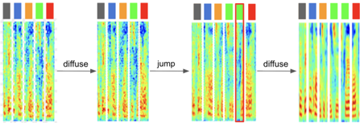
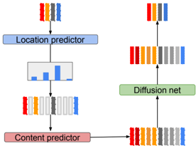

> [!abstract] arXiv · 2026 · Preprint
> **Jiabao Ai et al.** (University of Sheffield) · [→ Paper](https://arxiv.org/abs/2603.14032) · Demo: ✓ · Code: ?
>
> Introduces a jump-diffusion framework that unifies discrete temporal structure modeling and continuous spectral refinement within a single diffusion process for TTS, replacing the fixed-alignment-then-diffuse pipeline of two-stage models.

## Problem

Diffusion and flow-matching TTS systems split into two paradigms, each with a structural weakness. Two-stage models (Grad-TTS, Matcha-TTS, Voicebox) first predict phone durations, upsample to a fixed-length frame sequence, and then diffuse on that fixed alignment. This decouples temporal structure from spectral content: because the duration predictor is trained with regression (MSE), it collapses toward mean durations and cannot represent multi-modal timing patterns such as optional pauses, forcing uniform mechanical stretching when adapting to a target length. Single-stage models (E3 TTS, E2 TTS, F5-TTS, M3-TTS) avoid an explicit duration predictor and instead rely on attention to learn alignment implicitly, which is more flexible but suffers from alignment instability. The paper argues neither paradigm lets temporal structure and spectral content co-evolve within one generative process, and sets out to unify them.

## Method

The proposed framework augments a continuous diffusion SDE with discrete jumps that insert or remove Mel-spectrogram frames, following a trans-dimensional jump-diffusion formulation adapted from prior generative-modeling work outside TTS. A Location Predictor identifies where to insert a new frame, a Content Predictor generates the frame's content, and standard denoising diffusion steps refine the spectral content of the (possibly variable-length) sequence in between jumps.

The forward process couples structural corruption (deleting frames not belonging to a protected set of per-phone first frames, following a linear length schedule down to a minimum length) with spectral corruption (standard variance-preserving Gaussian noising against a phone-level encoder prior). The Content Predictor is a bidirectional Transformer (8 layers, 8 heads) that reconstructs a deleted frame as a residual added to the phone-level prior, trained with an L1 reconstruction loss plus an L2 prior-regularization term. The Location Predictor is a 4-layer Transformer encoder trained with cross-entropy over candidate insertion slots to predict which position a deleted frame originally occupied.

At inference, the reverse process starts from a compressed, frozen-text-encoder phone-level state and iteratively interleaves structural jumps (inserting frames at Location-Predictor-sampled slots, filled by the Content Predictor) with standard reverse-diffusion denoising steps, growing the sequence to the target length. The framework reuses the frozen text encoder and U-Net diffusion backbone from a pretrained Grad-TTS checkpoint, training only the two new jump-predictor networks.

Because the pretrained U-Net backbone expects fixed-dimensional input but the jump process produces variable-length sequences, the paper introduces an Upsample-Diffuse-Downsample (UDD) strategy: at each iteration the variable-length state is expanded to the full target length using the Location and Content predictors, a standard fixed-dimensional reverse-diffusion step is applied, and the sequence is then downsampled back to retain only the frames present before expansion. This lets the framework reuse an off-the-shelf fixed-dimensional diffusion network without retraining it and avoids the training instability the authors report for a naive Trans-Dimensional Diffusion (TDD) baseline that feeds variable-length input directly to the U-Net at every step.

If all jump insertions happen in a single step at the start of inference rather than iteratively, the framework degrades to a "One-shot" variant, in which the classification-based Location Predictor simply substitutes for Grad-TTS's regression-based duration predictor while every other component (text encoder, U-Net, HiFi-GAN vocoder) is held identical. This isolates the effect of classification-based versus regression-based duration modeling from the rest of the iterative jump-diffusion machinery.

## Key Results

On LJSpeech, using the standard Grad-TTS train/test split, waveform synthesis via a pretrained HiFi-GAN vocoder, WER measured with Whisper-medium, and naturalness via UTMOSv2, the One-shot variant achieves 3.37% WER and 4.050 UTMOSv2, improving over the Grad-TTS baseline's 4.38% WER and 4.024 UTMOSv2 while keeping every other component fixed *(§4.2, Table 1)*. The naive TDD baseline performs worst of all variants (6.31-7.66% WER), which the authors attribute to the input dimensionality changing at every diffusion step, which they argue increases task uncertainty and conflicts with the convolutional U-Net's translation-invariant-but-not-scale-invariant inductive bias *(§4.2)*. The iterative UDD variant sits between these: 4.55-4.71% WER, and the best MCD (5.830) among the diffusion-based variants, though it does not beat the One-shot model on WER or UTMOSv2 at matched target length *(§4.2, Table 1)*.

The more distinctive result is an out-of-distribution robustness test at 0.75x target speaking rate. Grad-TTS produces a near-linear duration-stretching alignment path and a silence ratio (6.38%) even below the 7.19% ground-truth ratio at normal speed, i.e. it dilutes pauses rather than preserving them. UDD (Argmax) instead redistributes the added duration disproportionately into silence, reaching a 9.63% silence ratio (exceeding ground truth) with a "staircase" DTW alignment pattern, and achieves lower WER in this setting (4.09% vs. 4.29% for Grad-TTS) *(§4.3, Table 2, Figure 4)*.

All comparisons reuse the identical pretrained Grad-TTS text encoder and U-Net across every variant, and match total target length to Grad-TTS's own duration predictions, which controls for confounds from backbone capacity or target-length choice. The comparison set is limited to Grad-TTS-family baselines evaluated on a single single-speaker dataset (LJSpeech); the single-stage attention-based models discussed as a second paradigm in the introduction (F5-TTS, E2 TTS, M3-TTS) are not run as empirical baselines.

## Novelty Assessment

The core contribution, jump diffusion applied to TTS duration/alignment modeling, is a genuine architectural novelty: trans-dimensional jump-diffusion processes exist in the broader generative-modeling literature but had not previously been adapted to unify discrete temporal alignment with continuous spectral diffusion for speech. The UDD mechanism is the paper's more practically consequential idea: it is an engineering solution that lets a jump process reuse an existing fixed-dimensional pretrained diffusion backbone without retraining, which the ablation against the naive TDD baseline suggests is necessary for training stability rather than a mere convenience.

The empirical gains over Grad-TTS are more modest and single-component than the framing suggests: the reported headline improvement (One-shot's 3.37% vs. Grad-TTS's 4.38% WER) isolates only the classification-versus-regression choice for duration prediction, with the iterative jump-diffusion machinery itself (UDD) not exceeding this simpler ablation on the matched-length benchmark. The paper is transparent about this, framing UDD's contribution as adaptive pause insertion under an out-of-distribution speed-mismatch condition rather than as the strongest matched-length result.

## Field Significance

moderate — This paper demonstrates a working jump-diffusion mechanism for TTS duration and structure modeling that generalizes discrete/continuous alignment as a single co-evolving process, and shows concretely that classification-based duration modeling with adaptive pause allocation outperforms regression-based duration modeling under speaking-rate mismatch. The evaluation is confined to a single single-speaker dataset with a 2021-era diffusion backbone (Grad-TTS), and the paper does not empirically compare against the modern single-stage or flow-matching systems it names as the competing paradigm, so the practical scope of the improvement relative to current state-of-the-art TTS is not established here.

## Claims

- **supports:** Modeling phone durations as a categorical distribution over discrete insertion slots, rather than as a scalar regression target, better captures the multi-modal nature of speech timing and reduces the tendency of duration predictors to collapse toward mean durations.
  > *Evidence:* Swapping only the regression-based Grad-TTS duration predictor for a classification-based Location Predictor (One-shot variant), with every other component held fixed, reduces WER from 4.38% to 3.37% and improves UTMOSv2 from 4.024 to 4.050 on LJSpeech. *(§4.2, Table 1)*
- **supports:** Allowing a TTS model to allocate additional duration adaptively to silent pauses, rather than uniformly stretching all frames, improves intelligibility when synthesizing at a speaking rate outside the training distribution.
  > *Evidence:* At 0.75x target speed, Grad-TTS's uniform stretching yields a silence ratio (6.38%) below ground truth (7.19%) and 4.29% WER, while the jump-based UDD (Argmax) variant reaches a 9.63% silence ratio and 4.09% WER, with a staircase DTW alignment pattern showing discrete pause insertion rather than proportional stretching. *(§4.3, Table 2, Figure 4)*
- **complicates:** Feeding variable-length sequences directly into a pretrained fixed-dimensional diffusion U-Net at every diffusion step, without an upsample/downsample bridge, causes severe training instability and degraded output quality relative to fixed-length alternatives.
  > *Evidence:* The naive Trans-Dimensional Diffusion (TDD) baseline, which applies the U-Net directly to the variable-length jump sequence, produces the worst WER of all variants (6.31-7.66%), attributed to increasing per-step input-dimensionality changes and the convolutional backbone's lack of scale invariance. *(§4.2)*
- **complicates:** The gains from adaptive discrete-jump duration modeling over a matched-length, single-dataset baseline do not automatically compound: an iterative jump-diffusion process is not guaranteed to outperform a single-step ablation of the same classification-based mechanism on standard (non-out-of-distribution) evaluation.
  > *Evidence:* At matched target length, the iterative UDD variants (4.55-4.71% WER) do not beat the simpler One-shot variant (3.37% WER) on WER or UTMOSv2, despite UDD's added iterative machinery. *(§4.2, Table 1)*

## Limitations and Open Questions

> [!warning] Evaluated only on a single single-speaker dataset (LJSpeech) against a single 2021-era diffusion backbone (Grad-TTS); the paper's own introduction frames single-stage attention-based models (F5-TTS, E2 TTS, M3-TTS) as the competing modern paradigm but does not empirically compare against them.

The jump process in this paper operates exclusively on temporal structure; spectral content within each state is still refined only by continuous diffusion, not by discrete jumps. The authors identify extending jumps into the spectral domain as future work. They also note that evaluation on multi-speaker and more spontaneous speech corpora, where prosodic variability is greater, is left for future validation of the jump-based duration modeling's advantage.

## Wiki Connections

- [[diffusion-tts|Diffusion TTS]] — proposes a jump-diffusion variant of score-based diffusion TTS that couples discrete structural jumps with the standard continuous denoising process used by diffusion-based systems like Grad-TTS.
- [[transformer-enc-dec-tts|Transformer Encoder-Decoder TTS]] — implements the Location and Content predictors as Transformer encoders operating over phone-level and frame-level representations produced by a frozen text encoder.
- [[prosody-control|Prosody Control]] — the classification-based Location Predictor and UDD mechanism give the model an explicit, learned way to allocate duration to pauses versus content frames, shown to improve pause placement under speaking-rate mismatch.
- [[evaluation-metrics|Evaluation Metrics]] — reports WER (via Whisper-medium), MCD, Log-F0 RMSE, and UTMOSv2 as a joint intelligibility/spectral-accuracy/naturalness evaluation suite on LJSpeech.
- [[2105.06337|Grad-TTS]] — reuses Grad-TTS's pretrained text encoder and U-Net diffusion backbone unmodified and uses it as the primary duration-modeling baseline throughout.
- [[2010.05646|HiFi-GAN]] — uses a pretrained HiFi-GAN vocoder to synthesize waveforms from the model's predicted Mel-spectrograms.
- [[2025.acl-long.313|F5-TTS]] — cited as an example of the single-stage, attention-based alignment paradigm the paper contrasts with its own hybrid jump-diffusion approach.
- [[2406.18009|E2 TTS]] — cited as an example of a single-stage model that forgoes explicit duration prediction and instead relies on attention, at the cost of alignment stability.
- [[2512.04720|M3-TTS]] — cited as another single-stage, attention-based zero-shot TTS system representing the paradigm the paper positions its jump-diffusion framework against.
