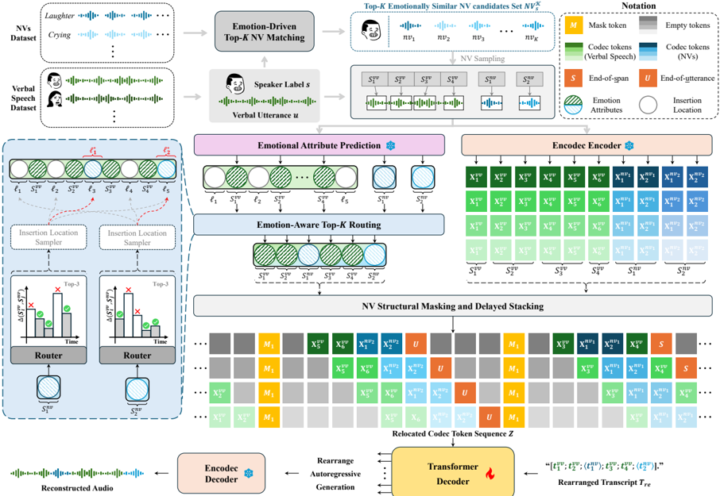

> [!abstract] arXiv · 2026 · Preprint
> **Deok-Hyeon Cho et al.** (Korea University) · [→ Paper](https://arxiv.org/abs/2603.14432) · Demo: ✓ · Code: ✓
>
> Affectron fine-tunes a verbal-only neural codec language model to generate affectively and contextually aligned nonverbal vocalizations (NVs) using a small, decoupled open corpus, without requiring aligned NV annotations or NV detection models.

## Problem

Nonverbal vocalizations such as laughter, sighs, and fillers are central to conveying affect in emotional speech, yet most expressive TTS systems struggle to insert them naturally. Prior approaches fall into two camps, and both have structural weaknesses. Tag-controlled TTS methods insert explicit NV tags at manually specified or detector-predicted locations, but rely on aligned annotations or NV detection models whose biases and errors propagate into temporal inconsistencies. Spontaneous-style TTS methods instead predict NVs from contextual cues, but depend on proprietary datasets and richly annotated corpora that are not publicly available; the public alternatives that do exist skew toward basic NV types (breathing, laughter) and often carry acoustic artifacts. Meanwhile, neural codec language model (NCLM)-based zero-shot TTS systems have advanced voice cloning but have not been extensively adapted to generate human-like NVs with fine-grained prosodic variation. Affectron targets the gap between these lines of work: generating diverse, contextually and affectively appropriate NVs from a small, open, decoupled corpus, without alignment supervision at inference time.

## Method

Affectron fine-tunes VoiceCraft, a 330M-parameter Transformer-based NCLM pre-trained on purely verbal speech, using EnCodec as the speech tokenizer. The backbone's causal-masking and delayed-stacking mechanisms (which relocate masked spans to the sequence end for bidirectional conditioning, and stagger codebook streams for efficient multi-codebook AR modeling) are extended to support NV synthesis. Training uses the EARS corpus, in which verbal speech and 15 types of NVs are recorded separately by the same speakers, so no ground-truth verbal-NV alignment exists to learn from directly.

Two training-time augmentation modules construct NV-augmented samples from this decoupled data. Emotion-driven topK NV matching retrieves the NV candidates belonging to a given speaker, scores them against the target verbal utterance using Emotion2Vec emotion embeddings, and samples up to two NVs from a temperature-scaled softmax over the topK most emotionally similar candidates. Emotion-aware topK routing then selects insertion locations: verbal segments are extracted with the Montreal Forced Aligner, emotional attribute pseudo-labels (from a pre-trained emotional attribute predictor) are mapped to spherical coordinates, and the angular distance between each candidate NV and each candidate insertion point is used to build a softmax distribution over the topK nearest (i.e., most affectively stable) locations, from which the final insertion point is sampled. This routing choice is motivated by an empirical analysis (Appendix A) showing that emotional attributes change gradually over short temporal spans, so locations of minimal affective change are treated as natural insertion anchors.

Given a matched NV and its sampled location, the codec token sequence is rearranged to interleave verbal and NV spans, and an NV structural masking scheme applies the backbone's causal-masking mechanism specifically around NV spans (optionally including adjacent verbal tokens), conditioning generation on both past and future affective context from the surrounding verbal speech. Delayed stacking is then applied across EnCodec codebook streams for AR modeling. The decoder-only Transformer is trained with a standard AR cross-entropy objective over the relocated token sequence, conditioned on a rearranged transcript in which NV tags are placed at their sampled locations. At inference, no matching or routing is performed: the model directly generates speech from an NV-tagged transcript and a single reference utterance that supplies both target speaker identity and emotional condition.

## Key Results

On EARS, ablations isolate each module's contribution (Table 1). Starting from the unmodified VoiceCraft baseline (NV-Acc 10.49 seen / 11.90 unseen, WER 9.05 / 10.50), adding NV-augmented training alone raises NV-Acc to 58.78 / 52.38 and lowers WER to 6.06 / 9.48. Adding emotion-driven matching and emotion-aware routing changes the NV-Acc/EECS trade-off (matching alone drops NV-Acc to 35.83 but raises EECS; routing recovers some of that ground), and the full model with NV structural masking reaches NV-Acc 37.75 / 36.90 with WER 6.59 / 8.31, alongside the best verbal SECS-EECS balance among the ablated variants. An AB preference test (Figure 3) shows the proposed affect-aware augmentation is consistently preferred over three rule-guided randomized NV-insertion strategies adapted from CapSpeech.

On zero-shot NV type and location prediction against text-only LLM baselines (Table 2, evaluated on the NonverbalTTS test set), Affectron-330M attains the highest NV-type Acc@1/3/5 (75.77 / 85.99 / 91.69) versus the best LLM baseline (GPT-oss-20B at 16.98 / 51.19 / 72.68), and the lowest type-distribution divergence (JSD 0.0051, HD 0.0723). For location prediction, GPT-oss-20B attains the highest Acc@1 (26.84 vs. Affectron's 12.59), but Affectron achieves the lowest JSD (0.0523) and HD (0.2414), indicating closer alignment with the empirical positional distribution despite lower topK accuracy. A filler-diversity analysis (Figure 5) further shows that removing any of the three proposed modules progressively narrows the range of distinct filler realizations the model produces for the same filler tag.

## Novelty Assessment

Affectron does not introduce a new backbone architecture; VoiceCraft's causal masking and delayed stacking are reused largely as-is. The genuine novelty is in the training-time data construction and a conditioning-time structural adaptation: emotion-driven topK matching and emotion-aware topK routing turn a decoupled verbal/NV corpus into affectively and contextually aligned training pairs without requiring NV detectors or aligned annotations, and NV structural masking specializes the existing causal-masking mechanism to NV spans specifically. This is best characterized as a training-recipe and light architectural adaptation on top of an existing NCLM, rather than a new model family. The comparison against instruction-following LLM baselines for NV type/location prediction is a useful secondary contribution, showing that discourse-only text models capture coarse NV placement patterns but lag on fine-grained distributional alignment.

## Field Significance

moderate — Affectron addresses a genuinely underexplored problem: generating diverse, affect-aligned NVs from small open corpora without the aligned annotations or NV detectors that prior tag-controlled and spontaneous-style approaches require. Its contribution is a training-time augmentation and masking recipe applicable to any decoupled verbal/NV corpus and any causal-masking-based NCLM, which could lower the data-annotation barrier for NV-aware TTS research more broadly. The scope is narrow (NV synthesis within emotional TTS specifically, evaluated primarily on one small corpus), which keeps this from a higher significance tier.

## Claims

- **supports:** Nonverbal vocalizations can be integrated into a neural codec language model TTS system via training-time data augmentation over a decoupled verbal/NV corpus, without requiring aligned NV annotations or dedicated NV detection models at inference.
  > *Evidence:* Emotion-driven topK NV matching and emotion-aware topK routing construct NV-augmented training samples from the EARS corpus (in which verbal speech and NVs are recorded separately); at inference the model generates directly from an NV-tagged transcript and reference utterance, with no matching or routing step. *(§4.1, §4.2, §4.5)*
- **supports:** Restricting a causal-masking span to fall specifically around inserted nonverbal tokens, rather than applying masking uniformly at random, improves the naturalness and expressiveness of nonverbal vocalization synthesis in an autoregressive codec language model.
  > *Evidence:* The 'w/o NSM' ablation, which reverts to the baseline's unstructured causal masking, underperforms the full model with NV structural masking on NTN-MOS and NEC-MOS naturalness/congruence ratings. *(§6.2, Figure 4, Table 1)*
- **complicates:** Increasing the diversity of nonverbal vocalization types and insertion locations during training-time augmentation can trade off against emotional congruence between the inserted vocalization and its surrounding verbal content.
  > *Evidence:* The 'w/o EDNM' ablation, which pairs NVs with verbal segments at random rather than by emotional similarity, increases NV-Acc and NTN-MOS (greater diversity) but significantly reduces EECS (emotion embedding cosine similarity) relative to the full model. *(§6.2, Table 1)*
- **refines:** Text-only large language models can partially capture discourse-level regularities in nonverbal vocalization placement from context alone, but explicit emotion-aware modeling is needed to align predictions with the empirical distribution of NV types and locations rather than just topK accuracy.
  > *Evidence:* GPT-oss-20B achieves the highest Acc@1 for NV location prediction (26.84) among evaluated LLMs, yet Affectron achieves substantially lower Jensen-Shannon Divergence and Hellinger Distance for both NV type and location prediction across all compared LLMs (Qwen2.5-7B, LLaMA 3.1-8B, Vicuna-7B, GPT-oss-20B). *(§6.4, Table 2)*
- **complicates:** Training on a corpus where verbal speech and nonverbal vocalizations are recorded as separate, non-overlapping events limits a model's ability to represent temporally overlapping verbal and nonverbal speech.
  > *Evidence:* The paper's own limitations note that EARS's decoupled recording setup restricts the model's capacity to represent overlapping verbal/NV segments, an open problem given that human annotators themselves frequently disagree on the precise boundaries of such overlaps. *(§8 Limitations)*

## Limitations and Open Questions

Affectron is fine-tuned and evaluated primarily on EARS, a relatively small (roughly 100 hours verbal, 4 hours NV) open corpus recorded under anechoic conditions from 107 speakers, which the authors note limits direct comparison with models trained on large-scale or proprietary in-the-wild NV corpora. Because EARS records verbal speech and NVs as separate events, the model cannot learn to represent temporally overlapping verbal and nonverbal speech, a known and still-unsolved modeling and annotation challenge. NV-Acc figures for the full model (37.75 seen / 36.90 unseen) remain well below the "Augmented GT" upper bound (85.96 / 89.29), indicating a substantial gap between the model's realized NV classification accuracy and what the training-time augmentation itself achieves when applied to ground-truth audio. The paper's own future work points toward semi-supervised NV inventory expansion and better modeling of verbal/nonverbal overlap.

## Wiki Connections

- [[emotion-synthesis|Emotion Synthesis]] — introduces an affect-aware training and masking scheme specifically for generating nonverbal vocalizations (laughter, sighs, fillers) as part of emotional speech synthesis, addressing NV diversity and contextual placement rather than prosodic emotion intensity alone.
- [[autoregressive-codec-tts|Autoregressive Codec TTS]] — fine-tunes an existing AR neural codec language model (VoiceCraft, built on EnCodec tokens with delayed stacking) rather than proposing a new backbone, adapting its causal-masking mechanism to nonverbal-vocalization spans.
- [[zero-shot-tts|Zero-Shot TTS]] — inherits VoiceCraft's zero-shot voice cloning capability and evaluates generalization to a held-out set of unseen speakers using only a reference utterance at inference.
- [[self-supervised-speech|Self-Supervised Speech]] — uses Emotion2Vec, a self-supervised pre-trained speech emotion representation model, as the core embedding source for emotion-driven NV matching and emotion-aware routing.
- [[subjective-evaluation|Subjective Evaluation]] — validates the proposed NV augmentation and masking scheme with AB preference tests and MOS-style human ratings (NTN-MOS for NV-type naturalness, NEC-MOS for NV-context emotional congruence).
- [[2412.10117|CosyVoice 2]] — cited as an NCLM-based system that synthesizes speech with NVs and supports fine-grained control, but is noted to require extensive high-quality annotated corpora and to lose naturalness when multiple NV types occur concurrently, motivating Affectron's annotation-light alternative.
- [[2508.05385|Scalable pipeline for nonverbal speech generation and understanding]] — represents an alternative, pipeline-based approach to scaling nonverbal vocalization modeling, contrasted with Affectron's training-time augmentation approach on a small decoupled corpus.
