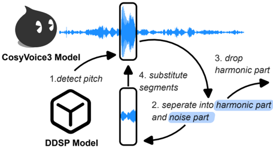

> [!abstract] arXiv · 2026 · Preprint
> **Tianyi Tan et al.** (Nanjing University, Fudan University, ByteDance) · [→ Paper](https://arxiv.org/abs/2603.14853) · Demo: ✓ · Code: ✓
>
> Introduces a curated real-whisper corpus and a DDSP-based pitch-free generative pipeline that turns noisy real whisper recordings into a studio-grade synthetic corpus for training text-to-whisper systems.

## Problem

Whisper generation is bottlenecked by data: whispered speech has low sound-pressure level, is hard to record at high fidelity, and existing acoustic artefacts resist standard speech enhancement because whisper is produced with noise-driven rather than harmonic excitation. Publicly available whisper corpora are small, heterogeneous in quality, and mostly monolingual. General TTS models, despite strong prosody modelling on normal speech, remain severely flawed at zero-shot whisper generation: corpora and vocoders are optimized for modal (harmonic, pitched) phonation, and speaker-embedding extractors trained on such data misread whisper prompts as hoarseness or noise rather than authentic breathy voice. Commercial systems (Doubao, ElevenLabs, MiniMax) can produce natural whisper, but rely on closed, proprietary pipelines, leaving no open-access resource for text-to-whisper research.

## Method

The paper builds two artifacts: a curated real-whisper dataset (WhispReal) and a synthetic corpus (WhispSynth) generated by refining WhispReal through a novel pipeline, then uses WhispSynth to fine-tune a text-to-whisper model (CosyWhisper).

**WhispReal** consolidates six publicly available whisper corpora (wTIMIT, CHAINs, Expresso, EARs, Whisper40, AISHELL6-Whisper) with a newly recorded Mandarin corpus, WhispNJU (85 hours of paired whispered/normal speech from 77 speakers, built following the THCHS-30 partitioning scheme), into a standardized ~118-hour, 479-speaker, English/Chinese collection with unified splits and documented licensing.

**WhispSynth generation pipeline.** The core idea is that TTS models trained on normal speech retain a latent capacity for whisper generation because whispered production and voiceless/devoiced segments in normal speech share similar aerodynamic-articulatory constraints. The pipeline first synthesizes an initial whisper with CosyVoice3, conditioned on a prompt audio, its transcript, and an optional style instruction. A pitch-detection module then locates residual fundamental-frequency (F0) segments in the synthesized output. For each such segment, a Differentiable Digital Signal Processing (DDSP) harmonic-plus-noise decomposition separates the segment into a harmonic component (approximated by a sawtooth excitation shaped with a learned LTV-FIR filter) and a noise component (filtered white noise). The harmonic component is discarded and the noise component, which preserves the whisper's spectral envelope and aperiodic excitation, replaces the original segment via an overlap-add reconstruction, yielding a continuous pitch-free waveform.

**DDSP training.** Off-the-shelf DDSP vocoders, when used as subtractive synthesizers for whisper, produce buzzing artefacts in unvoiced and semi-voiced segments. The paper addresses this with three training strategies applied to a DDSP generator integrated into the BigVGAN framework: (i) adversarial training on normal speech with a multi-resolution and multi-period discriminator under a least-squares GAN loss, to sharpen harmonic modelling and suppress artefacts; (ii) continued training on WhispReal without the adversarial objective, so the model first learns robust pitch-conditioned synthesis before specializing to whisper; and (iii) a semi-supervised dual-focus scheme in which the loss is always computed as a harmonic-plus-noise sum, but the gradient reweights the harmonic and noise terms depending on whether the input is whispered or normal speech, so each data type reinforces the model's competence on the other.

**CosyWhisper.** CosyVoice3's architecture comprises an LLM (text-to-semantic-token), a Conditional Flow Matching (CFM) model (semantic-to-acoustic-feature), and a HiFi-GAN vocoder. Because the difference between whispered and normal speech is primarily acoustic rather than semantic, the paper fine-tunes only the CFM component on WhispSynth, keeping the LLM and vocoder frozen. This required extending the official training script (which only supported LLM fine-tuning) by adding a token-projection layer, replacing the text encoder with a direct embedding lookup, and revising the flow-matching conditioning mechanism.

## Key Results

On corpus-quality benchmarking (Table 3), WhispSynth achieves the lowest intelligibility error rates among all evaluated corpora (CER 31.16%, WER 20.98%, an 11% relative reduction over WhispReal per the paper's own summary) while improving DNSMOS by roughly 3% relative to the noisy real WhispReal source, despite being fully synthetic.

In the text-to-whisper synthesis comparison (Table 4), CosyVoice3 zero-shot on whisper prompts is intelligible and natural but perceptibly non-whisper (W-MOS 3.40 ± 0.51). CosyWhisper, fine-tuned on WhispSynth, reaches W-MOS 4.53 ± 0.20, exceeding even the ground-truth WhispReal test set (W-MOS 4.33 ± 0.33), while its CER/WER (12.76%/29.22%) is close to CosyVoice3's baseline (12.51%/9.81%; the WER regression is notable). Against normal-to-whisper conversion baselines, SeedVC attains the highest speaker similarity and intelligibility among conversion methods but limited whisperness (W-MOS 2.18 ± 0.47); the paper's own DDSP pitch-free model used as a standalone conversion system scores W-MOS 1.30 ± 0.29, below SeedVC.

An ablation (Table 5) fine-tuning CosyWhisper on WhispReal versus WhispSynth shows WhispSynth reduces CER/WER by 46% (28.3/46.5 → 12.8/29.2), lowers pitch distortion (VTR) by 9%, and improves DNSMOS naturalness by 8%, isolating the contribution of the synthetic data curation step itself. A small-scale multilingual extension (Appendix D, Table 6) on manually curated Korean and Japanese ASMR samples shows CosyWhisper improving W-MOS over CosyVoice3 in both languages (Korean: 3.96 vs. 3.35; Japanese: 4.03 vs. 2.88), though sample sizes are small (four speakers per language) and not part of the paper's main training/evaluation pipeline.

## Novelty Assessment

The contribution is primarily a dataset-and-pipeline engineering effort rather than a new model family: WhispSynth reuses CosyVoice3 (an existing TTS system) and DDSP (an existing 2020 signal-decomposition technique) as building blocks. The genuine novelty lies in (1) the specific pitch-free post-processing pipeline that detects and surgically replaces residual-F0 segments in TTS output with noise-only reconstructions, and (2) the three-part DDSP training recipe (adversarial pretraining, continued whisper-domain training, semi-supervised dual-focus reweighting) that adapts a general-purpose DDSP vocoder to whisper without the buzzing artefacts reported in prior singing-vocoder work. The WhispReal consolidation itself is largely curatorial (aggregating six existing corpora plus one new recording), though the resulting standardized, multilingual, license-compliant release fills a real gap given how fragmented and small prior whisper corpora are. The CosyWhisper fine-tuning is a modest architectural modification (isolating and adapting only the CFM component) rather than a new training objective.

## Field Significance

Moderate — this paper addresses a narrow but clearly under-served subtask (text-to-whisper synthesis) by providing an open, multilingual, quality-controlled dataset and a concrete recipe for suppressing residual pitch artefacts in TTS-generated whisper. Its main value to the field is infrastructural: a reusable data engine and an open training recipe where previously only closed commercial systems demonstrated whisper synthesis quality. The findings on subjective-objective metric misalignment for whisper (existing objective TTS metrics correlate poorly with human whisper-likeness judgments) are a useful methodological caution for future whisper evaluation work.

## Claims

- **supports:** A TTS system trained predominantly on normal (phonated) speech can be repurposed to generate a non-modal vocal register when a targeted post-processing step removes the specific acoustic component (fundamental frequency / harmonicity) that distinguishes the two registers.
  > *Evidence:* CosyVoice3, unmodified, already produces intelligible whisper-adjacent output (W-MOS 3.40) that is upgraded to W-MOS 4.53 purely by detecting and replacing residual-F0 segments with DDSP-decomposed noise, without retraining the TTS backbone's semantic or LLM components. *(§3.1, §5.4.1, Table 4)*
- **supports:** Synthetic data produced by a well-designed generative pipeline can outperform noisy real recordings as fine-tuning data for a downstream generation task, even when the pipeline's source material is the same real data.
  > *Evidence:* Fine-tuning CosyWhisper on WhispSynth (synthesized from WhispReal) rather than on WhispReal directly reduces CER/WER by 46% and improves DNSMOS by 8% in a controlled ablation with the same base model and training procedure. *(§5.5, Table 5)*
- **complicates:** Standard objective TTS/vocoder quality metrics do not reliably track the specific perceptual attribute (whisper authenticity) that a specialized synthesis task targets.
  > *Evidence:* Objective naturalness scores (DNSMOS, UTMOS) and intelligibility (CER/WER) do not rank-order the compared systems consistently with human whisper-likeness ratings (W-MOS); e.g. toWhisper scores better than SeedVC on CER/WER but far worse on W-MOS (1.02 vs. 2.18), and the paper concludes existing objective metrics are "poorly aligned with whisper characteristics." *(§5.2)*
- **complicates:** A generative pipeline built around a general-purpose signal-decomposition technique can trade off content fidelity against register-specific quality when adapted to a specialized synthesis task.
  > *Evidence:* Applying the paper's own pitch-free DDSP model as a standalone normal-to-whisper conversion system yields lower CER/WER (21.31/45.18) than the CosyWhisper text-to-whisper pipeline it is embedded in, and lower whisper-likeness (W-MOS 1.30) than the SeedVC voice-conversion baseline (W-MOS 2.18), indicating the DDSP component alone is not sufficient for high-quality whisper generation without the TTS backbone. *(§5.4.1, Table 4)*

## Limitations and Open Questions

> [!warning]
> Multilingual generalization beyond English and Mandarin is only lightly validated: the Korean and Japanese results (Appendix D) use manually curated samples from four speakers per language sourced from YouTube ASMR content, with no standardized training or test split and no comparison against the paper's own main WhispReal/WhispSynth pipeline for those languages.

The paper does not systematically assess the impact of recording-hardware variation (e.g., different microphones) on model performance, noting only that CosyVoice3 is reported elsewhere to be relatively robust to such variation. The released CosyWhisper model will embed a real-time audio watermark for responsible-use tracking, which the authors acknowledge may itself affect the acoustic properties of the synthesized audio and any downstream analysis of it. The standalone DDSP pitch-free model, when used directly for normal-to-whisper conversion rather than as a post-processing step after TTS generation, underperforms both the full CosyWhisper pipeline and an existing zero-shot voice-conversion baseline (SeedVC) on whisper-likeness, indicating the DDSP component's benefit is specifically tied to cleaning up TTS-generated whisper rather than functioning as a general-purpose whisper converter.

## Wiki Connections

- [[multilingual-tts|Multilingual TTS]] — WhispReal and WhispSynth are explicitly built as English/Chinese multilingual corpora, and the paper reports a small-scale extension of CosyWhisper to Korean and Japanese via CosyVoice3's multilingual tokenizer.
- [[zero-shot-tts|Zero-Shot TTS]] — CosyVoice3's zero-shot, prompt-audio-conditioned generation is the entry point of the pipeline, and the paper's core motivation is that current zero-shot TTS systems fail specifically at whisper generation.
- [[voice-conversion|Voice Conversion]] — the paper benchmarks its DDSP pitch-free model and several baselines (toWhisper, Normal2Whisper, SeedVC) as normal-to-whisper voice conversion systems, distinct from its main text-to-whisper synthesis track.
- [[evaluation-metrics|Evaluation Metrics]] — introduces a whisper-specific subjective metric (Whisper-likeness MOS) and an automated web-based listening-test interface, and reports that standard objective TTS metrics correlate poorly with whisper-authenticity judgments.
- [[subjective-evaluation|Subjective Evaluation]] — runs a 20-participant listening test with Latin-square-balanced stimulus sequencing to collect W-MOS ratings, rather than relying solely on automated proxies.
- [[2505.17589|CosyVoice 3]] — CosyVoice3 is the TTS backbone the pipeline generates initial whisper from and the model CosyWhisper is fine-tuned from (only its Conditional Flow Matching component).
- [[2411.09943|SeedVC]] — used as a zero-shot voice-conversion baseline in the normal-to-whisper conversion comparison, outperforming the paper's own standalone DDSP model on whisper-likeness.
- [[2204.02152|UTMOS]] — used as one of the objective naturalness metrics in the corpus-quality and system-comparison tables.

