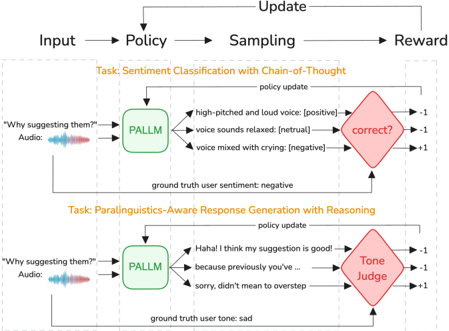

> [!abstract] arXiv · 2026 · Preprint
> **Minseok Kim et al.** (Meta Reality Labs) · [→ Paper](https://arxiv.org/abs/2603.15981) · Demo: ? · Code: ?
>
> Trains a speech LLM to jointly classify a speaker's sentiment from audio and generate an emotionally appropriate text response, using a two-stage supervised fine-tuning plus multi-task reinforcement learning pipeline with chain-of-thought reasoning that explicitly grounds both tasks in acoustic-prosodic evidence.

## Problem

Speech LLMs that consume audio have access to paralinguistic cues (prosody, emotion, non-verbal sounds) beyond the transcript, and these cues often determine what response is actually appropriate: the same words spoken cheerfully versus with disappointment call for celebration versus comfort. Prior work either treats paralinguistic processing as an isolated speech emotion recognition (SER) classification task, or fine-tunes response generation on curated tone-conditioned data without any explicit understanding objective. Both approaches share a failure mode: when text content already hints at sentiment (e.g., "I failed my exam"), supervised fine-tuning (SFT) lets the model minimize loss by exploiting lexical shortcuts rather than attending to acoustic-prosodic signal, so the model can appear correct on text-clear examples while remaining insensitive to cases where lexical content and delivery conflict (e.g., "I'm fine" spoken with distressed prosody). Training data for emotionally-appropriate responses is also scarce, since annotating what counts as an appropriate emotional response is subjective and context-dependent, unlike sentiment labels which can draw on established taxonomies.

## Method

The paper frames paralinguistic awareness as a multi-task problem: given a spoken utterance's audio, the model must (1) classify sentiment into one of three coarse categories (positive, neutral, negative), chosen over fine-grained tone labels because fine-grained taxonomies vary across datasets and semantically adjacent tones (e.g., "happy" vs. "cheerful") are hard to distinguish and can confuse training; and (2) generate a text response whose emotional tone is coherent with the inferred affect.

Training proceeds in two stages on top of a Llama 4 Scout (17Bx16E) backbone with a frozen audio encoder integrated as described in the Llama 3 speech paper. In Stage 1 (SFT), the model is jointly trained on sentiment classification with cross-entropy loss against sentiment labels derived from dataset tone annotations via a rule-based mapping, and on response generation against responses synthesized by prompting an external text LLM with the ASR transcript and ground-truth tone label (since no ground-truth emotionally-appropriate responses exist in the training data). The two SFT losses are summed with equal weighting. Because these synthesized responses cannot capture the full paralinguistic nuance present in audio, and because SFT alone permits lexical-shortcut exploitation, Stage 2 applies multi-task reinforcement learning with explicit chain-of-thought (CoT) reasoning: for classification, the policy generates a reasoning trace followed by a sentiment prediction, verified by a rule-based judge that yields a binary reward; for response generation, the policy generates reasoning about the user's affective state followed by a response, scored by an LLM judge against a rubric that evaluates whether the response's tone matches the inferred emotion (converted to a binary reward). The two RL tasks are optimized jointly via GRPO with group-relative advantage estimation (K=4 generations per batch), using separate prompts and task-specific rewards for the classification and generation objectives, so that both tasks are grounded in the same underlying audio-based reasoning process rather than trained independently.

## Key Results

On Expresso, IEMOCAP, and RAVDESS, the full model (PALLM, CLS + GEN) improves response appropriateness over an SFT (CLS + GEN) baseline from 65.0% to 77.0% on Expresso, 59.0% to 73.0% on IEMOCAP, and 36.0% to 48.0% on RAVDESS, while matching or exceeding SFT sentiment classification accuracy on Expresso (74.0%) and RAVDESS (59.0% vs. 54.0%). An ablation isolating the two RL tasks shows both stages contribute: adding the RL response-generation task alone (PALLM GEN ONLY) raises Expresso response appropriateness from 65.0% to 73.0%, and adding the RL classification task on top (PALLM CLS + GEN) raises it further to 77.0%. PALLM also outperforms strong proprietary speech LLMs on response appropriateness: 77.0% vs. 66.1% for Gemini-2.5 Pro and 67.4% for GPT-4o-Audio on Expresso, and similarly on IEMOCAP and RAVDESS, though these proprietary systems were evaluated zero-shot rather than trained on the target datasets, so the comparison is not fully controlled for training exposure. A human evaluation on 100 Expresso examples corroborates the automatic results: GPT-4o Audio, SFT (CLS + GEN), and PALLM (CLS + GEN) achieve 68%, 62%, and 76% blind-judged appropriateness respectively, and the paper reports 82% agreement between the GPT-4o automatic judge and human annotators on the appropriateness criterion.

## Novelty Assessment

The contribution is primarily a training-recipe innovation rather than a new model architecture: the LLM backbone (Llama 4 Scout), audio encoder integration, and RL optimizer (GRPO) are all adopted from prior work. What is new is the explicit coupling of sentiment classification and paralinguistics-aware response generation into a single multi-task RL objective with CoT reasoning, so that both tasks are forced to ground their outputs in audio-based evidence rather than being trained as separate objectives or trained with generation alone. The paper's own related-work analysis supports this framing: prior systems either optimize SER in isolation or train generation without an explicit understanding objective, and the paper claims no prior work jointly optimizes both through multi-task RL with CoT-structured reasoning for speech LLMs specifically. The evaluation, while comparing against strong proprietary baselines and including human review, is confined to three existing sentiment/emotion benchmarks rather than a new benchmark, and no code or demo release is mentioned.

## Field Significance

moderate — This paper demonstrates that explicitly coupling understanding and generation objectives through multi-task RL with CoT reasoning measurably reduces a speech LLM's reliance on lexical shortcuts and improves emotionally appropriate response generation, validated against both strong proprietary systems and human judgment. It is a well-executed training-recipe contribution within the growing space of paralinguistics-aware spoken dialogue systems, but the evaluation is limited to three existing benchmarks from a single research group, and the underlying architecture and RL machinery are adopted rather than novel.

## Claims

- **supports:** Coupling sentiment/affect understanding and response-generation training in a single multi-task reinforcement learning objective produces measurably more contextually appropriate responses than training generation with supervised fine-tuning alone, and the two RL tasks are mutually reinforcing rather than redundant.
  > *Evidence:* On Expresso, response appropriateness rises from 65.0% (SFT CLS+GEN) to 73.0% when only the RL generation task is added, and further to 77.0% when the RL classification task is added as well, showing incremental gains from each RL component. *(§4.4.1, Table 2)*
- **supports:** Reinforcement learning with chain-of-thought reasoning that requires a speech LLM to ground sentiment predictions in explicit acoustic-prosodic evidence can outperform strong general-purpose proprietary speech LLMs on emotionally appropriate response generation, including on utterances whose affect is only conveyed through prosody and not lexical content.
  > *Evidence:* PALLM (CLS+GEN) reaches 77.0% response appropriateness on Expresso versus 66.1% for Gemini-2.5 Pro and 67.4% for GPT-4o-Audio; qualitative examples show PALLM producing emotionally attuned responses to utterances containing no explicit emotion words (e.g., "I understand. Okay." spoken fearfully). *(§4.4.1, §4.4.3, Table 2, Table 3)*
- **complicates:** Paralinguistic understanding and generation trained on labeled in-domain emotion corpora generalizes only partially to unseen out-of-domain paralinguistic data, leaving a substantial performance gap despite strong in-domain gains.
  > *Evidence:* RAVDESS is held out entirely from training to test out-of-domain generalization, and PALLM's response appropriateness on RAVDESS (48.0%) remains far below its in-domain scores on Expresso (77.0%) and IEMOCAP (73.0%), a gap the authors attribute to domain shift. *(§4.1, §4.4.1, §6, Table 1, Table 2)*
- **complicates:** Using an LLM-as-judge reward signal for training generation quality via reinforcement learning introduces judge-bias and reward-hacking risk that partial human-agreement checks do not fully rule out.
  > *Evidence:* The RL response-generation reward is computed entirely by an LLM judge against a rubric; the paper reports only 82% agreement between this judge and human annotators on a 100-example subset, and explicitly lists judge bias and vulnerability to reward hacking as a limitation of the RL stage. *(§4.3, §6)*

## Limitations and Open Questions

> [!warning] The reported out-of-domain gap is large and unresolved: PALLM's response appropriateness drops from 73-77% on in-domain datasets to 48% on RAVDESS, which was held out entirely from training. The paper flags this domain-shift gap as an open problem rather than something the proposed method addresses.

The method also depends entirely on datasets with categorical emotion/tone labels for both the SFT and RL stages, since both the classification reward and the sentiment-conditioned generation reward require ground-truth affect labels; the authors note this prevents the approach from leveraging unlabeled audio, which could otherwise expand coverage. The RL generation reward relies on an LLM-as-judge with only partial (82%) human agreement, which the authors acknowledge is a bias and reward-hacking risk rather than a fully validated proxy for human preference. Finally, response generation in this paper is text-only: PALLM produces a textual response conditioned on inferred audio affect, not a synthesized spoken response, so the paper does not evaluate end-to-end spoken dialogue output.

## Wiki Connections

- [[spoken-language-model|Spoken Language Model]] — PALLM is a speech LLM that consumes external audio input through a frozen audio encoder feeding an LLM backbone (Llama 4 Scout), extending such systems with an explicit paralinguistic-grounding training objective rather than relying on the backbone's implicit audio understanding.
- [[rlhf-speech|RLHF Speech]] — the core training contribution is a multi-task GRPO-based RL stage with rule-based and LLM-judge rewards applied jointly to sentiment classification and response generation, extending RL-for-speech training beyond single-task reward optimization.
- [[subjective-evaluation|Subjective Evaluation]] — the paper runs a blind human evaluation on 100 Expresso examples comparing GPT-4o Audio, SFT, and PALLM responses, and reports the automatic LLM-judge's agreement rate with these human ratings.
- [[2507.16632|Step-Audio 2 Technical Report]] — the closest prior related work, described as applying "reasoning-centric" RL for expressive audio interaction; PALLM differs by explicitly coupling classification and generation rewards in a single multi-task objective rather than optimizing expressive interaction alone.
- [[2402.03300|DeepSeekMath]] — PALLM's Stage 2 RL is optimized via GRPO, the group-relative policy optimization algorithm introduced in this paper.
- [[2407.21783|The Llama 3 Herd of Models]] — PALLM's audio encoder integration follows the speech extension described in this paper, layered onto a Llama 4 Scout backbone.
- [[2410.21276|GPT-4o System Card]] — GPT-4o-Audio is used as one of the strong proprietary baselines PALLM is benchmarked against on sentiment classification and response appropriateness.
- [[2503.19786|Gemma 3 Technical Report]] — Gemma-3n is used as an open-source speech LLM baseline in the paper's comparison table.
- [[2412.15115|Qwen2.5 Technical Report]] — Qwen-2.5 is used as an open-source baseline in the paper's comparison table.
- [[2312.15185|emotion2vec]] — cited as a self-supervised representation approach for speech emotion recognition that PALLM's related-work section positions its approach against.
