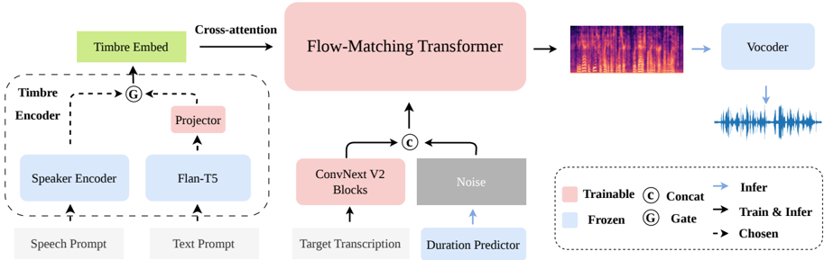

> [!abstract] arXiv · 2026 · Preprint
> **Zihao Zheng et al.** (Shanghai AI Lab / Shanghai Jiao Tong University) · [→ Paper](https://arxiv.org/abs/2603.16280) · Demo: ✓ · Code: ?
>
> Introduces a single cross-attention mechanism that lets one TTS model take either a speech prompt or a text caption to control speaker timbre, replacing the separate architectures typically used for each input type.

## Problem

Zero-shot TTS systems typically control speaker timbre with a short reference speech clip, while a separate line of work controls timbre with natural-language style captions (e.g. Parler-TTS, CapSpeech). Combining both control signals into one model is desirable for flexibility, but prior attempts at unification (e.g. StyleFusion TTS, FleSpeech) require either both inputs simultaneously or architecturally complex solutions: multiple loss functions, masking strategies, and separate encoder branches whose outputs must be reconciled, which increases the risk of training instability. CAST-TTS asks whether a single, simple fusion mechanism can accept either modality without this added complexity.

## Method

CAST-TTS is a non-autoregressive TTS system built around a unified timbre encoder and a Transformer flow-matching backbone. The timbre encoder has two branches feeding a shared embedding space: a speech branch, using a WavLM-based ECAPA-TDNN speaker encoder to extract a timbre embedding sequence from a reference speech prompt, and a text branch, using a frozen Flan-T5 encoder to embed a descriptive caption (gender, accent, pitch, tonal expressiveness, speaking rate) followed by a lightweight linear projector into the same space. The projection direction is deliberate: because speech prompts carry richer, more fine-grained speaker information than text captions, the text branch is trained to align into the speech-derived embedding space rather than the two being learned jointly from scratch.

The synthesis backbone follows the E2-TTS/F5-TTS-style speech-infilling recipe: a target transcription is encoded with ConvNeXt V2 blocks and concatenated with the noisy mel-spectrogram latent, processed through Transformer blocks with self-attention over this concatenated sequence, and a single cross-attention layer per block injects the timbre embedding (from either modality) to control speaker identity. This uniform cross-attention path is the same regardless of whether the conditioning signal came from the speech or text branch, removing the masking strategy that E2-TTS itself uses to combine prompt and target information. A BigVGAN vocoder converts the predicted mel-spectrogram to a waveform.

Training uses a flow-matching objective and proceeds in three stages: (1) pretrain the ConvNeXt V2 and Transformer backbone on speech-prompted data only; (2) freeze those components and train only the text projector on text-prompted data to align it with the established speech-embedding space; (3) jointly fine-tune all trainable components on the combined dataset. At inference, an external duration predictor is required since the model is non-autoregressive: a character-count ratio heuristic (using Whisper-large-v3 transcriptions) for speech prompts, and CapSpeech's pretrained duration predictor for text prompts. Classifier-free guidance is applied during inference to improve generation quality.

## Key Results

On speech-prompted zero-shot synthesis (LibriSpeech-PC test-clean), CAST-TTS reaches the highest speaker similarity (SPK-Sim 78.4) among the compared systems (F5-TTS-v1, MaskGCT, ZipVoice-L), with competitive WER (2.05%) and UTMOS (3.91), though F5-TTS-v1 leads on subjective naturalness and similarity MOS, which the authors attribute to its larger-scale Emilia training data. On text-prompted synthesis (CapTTS test subsets), CAST-TTS outperforms CapSpeech-NAR and Parler-TTS-Large on both WER (3.89% vs. 5.11%/5.53%) and Style-ACC (91.15% vs. 88.93%/82.04%), with a strong UTMOS (4.01) and competitive subjective scores.

Ablations isolate the design choices: replacing mel-spectrogram with a dedicated speaker-verification feature (ECAPA-TDNN) raises SPK-Sim from 32.8 to 72.8 (Sim-E) because mel-spectrogram mixes acoustic and semantic content rather than isolating speaker identity (Table 3). Fusing the speech and text prompt uniformly via cross-attention (CAST-CA) outperforms self-attention-based concatenation fusion (CAST-SA) and a hybrid self-attention/cross-attention design (CAST-SACA) on SPK-Sim (Table 2). The proposed multi-stage training strategy outperforms both an end-to-end baseline and a variant that adds a learnable task vector to distinguish modalities, across essentially all reported metrics (Table 2).

## Novelty Assessment

The generative backbone itself (flow-matching, speech-infilling, ConvNeXt V2 text encoding, BigVGAN vocoding) is directly inherited from the E2-TTS/F5-TTS lineage and is not new. The contribution is narrower and more architectural: showing that a single cross-attention conditioning path, applied uniformly regardless of whether the timbre signal originates from speech or text, can replace the dual-branch or multi-objective designs used in prior speech-plus-text timbre control systems (e.g. FleSpeech's separate autoregressive, flow-matching, and diffusion components). The multi-stage training recipe, which freezes the pretrained backbone to align only the text projector before joint fine-tuning, is the paper's other concrete contribution, and the ablations (Tables 2 and 3) give it real support rather than treating it as an untested design choice. The result is closer to specialized single-modality baselines than to a clear improvement over them, so the contribution is best read as an architectural simplification with comparable performance, not a new capability.

## Field Significance

moderate — CAST-TTS provides a controlled demonstration that unifying speech-prompted and text-prompted timbre control does not require the architectural complexity of prior multimodal timbre-control systems: a single cross-attention mechanism, combined with a staged alignment training strategy, is sufficient to match specialized single-modality models on their own benchmarks. It contributes a design simplification and ablation evidence for what specifically matters (dedicated speaker features over raw mel-spectrograms, staged over end-to-end training) rather than a new generative paradigm.

## Claims

- **supports:** A single cross-attention conditioning path can unify heterogeneous timbre-control signals (a reference speech prompt and a natural-language style caption) within one TTS model, without requiring separate architectures or masking strategies for each modality.
  > *Evidence:* The uniform cross-attention design (CAST-CA) achieves the highest speaker similarity (SPK-Sim 78.4, WER 2.05%) among the compared fusion mechanisms, outperforming both a self-attention/concatenation baseline (CAST-SA, SPK-Sim 43.0) and a hybrid self-attention-plus-cross-attention design (CAST-SACA, SPK-Sim 41.2). *(§4.2.2, Table 2)*
- **supports:** Projecting a coarser conditioning modality into an existing richer conditioning embedding space, rather than jointly learning both modalities from scratch, is an effective strategy for aligning heterogeneous conditioning signals in TTS.
  > *Evidence:* The staged training strategy (pretrain on speech-prompted data, freeze and align only the text projector, then jointly fine-tune) outperforms both an end-to-end baseline (CAST-TTS-BASE) and a task-vector variant (CAST-TTS-TV) across WER, SPK-Sim, Style-ACC, and UTMOS on both speech- and text-prompted evaluation. *(§4.2.3, Table 2)*
- **supports:** Dedicated speaker-verification embeddings carry cleaner, more isolated speaker-identity information than raw acoustic features (mel-spectrograms) when used as a cross-attention timbre-conditioning signal.
  > *Evidence:* Replacing mel-spectrogram with ECAPA-TDNN or TitaNet speaker features raises speaker similarity from Sim-T/Sim-E of 47.9/32.8 to 80.9/64.4 and 80.0/72.8 respectively, attributed to mel-spectrogram mixing acoustic and semantic information rather than isolating speaker-relevant characteristics. *(§4.2.1, Table 3)*
- **refines:** Explicit modality-type conditioning (e.g. a learnable token distinguishing which input modality is being used) is not necessary for a shared cross-attention timbre encoder to handle multiple conditioning modalities well.
  > *Evidence:* CAST-TTS-TV, which prepends a learnable task vector to the timbre embedding to differentiate speech- from text-prompt inputs, shows no improvement over the CAST-TTS-BASE baseline that lacks this distinction, across all reported metrics. *(§4.2.3, Table 2)*
- **complicates:** A unified timbre-control model's controllable attribute set is bounded by the descriptive vocabulary of its text-prompt training data, not by the conditioning architecture itself.
  > *Evidence:* The authors report that CAST-TTS currently lacks control over attributes such as emotion and accent, attributing this directly to limitations in the training dataset rather than to the cross-attention mechanism. *(§5 Conclusion)*

## Limitations and Open Questions

> [!warning] The authors state that, due to dataset limitations, CAST-TTS currently lacks control over speaker attributes such as emotion and accent, both of which are common targets for style- or timbre-controllable TTS systems; this is presented as a data coverage gap rather than an architectural one.

Duration prediction at inference relies on external heuristics rather than a jointly learned component: a character-count ratio estimate (derived from Whisper-large-v3 transcriptions) for speech prompts, and CapSpeech's separately pretrained duration predictor for text prompts, so CAST-TTS's own contribution does not extend to duration modeling. The shared timbre embedding space is bounded by two frozen upstream encoders (a WavLM-based ECAPA-TDNN speaker encoder and a Flan-T5 text encoder), so the quality of the alignment is partly inherited from encoders CAST-TTS does not train. Subjective evaluation is conducted with 10 raters scoring 10 random samples per test set, a comparatively small listening-test scale that may limit the statistical power of the reported MOS differences.

## Wiki Connections

- [[flow-matching|Flow Matching]] — CAST-TTS trains its Transformer backbone with a flow-matching objective in the E2-TTS/F5-TTS lineage, applying the paradigm to a dual-modality timbre-conditioning setting.
- [[zero-shot-tts|Zero-Shot TTS]] — the speech-prompt branch performs zero-shot voice cloning from a short reference utterance, following the speech-infilling procedure used by E2-TTS.
- [[instruction-conditioned-tts|Instruction-Conditioned TTS]] — the text-prompt branch accepts natural-language speaker-attribute captions (age, gender, pitch, expressiveness, speed) as a timbre-conditioning signal, reusing the CapSpeech caption schema.
- [[speaker-adaptation|Speaker Adaptation]] — the unified timbre encoder is designed specifically to control speaker identity from either an audio or a text prompt within a single conditioning pathway.
- [[self-supervised-speech|Self-Supervised Speech]] — the selected speaker encoder is a WavLM-based ECAPA-TDNN model, and the paper's own ablation shows this self-supervised-pretrained feature outperforms mel-spectrogram and TitaNet alternatives for speaker similarity.
- [[subjective-evaluation|Subjective Evaluation]] — naturalness and similarity are validated with human MOS ratings (N-MOS, Sim-MOS) from 10 raters per test set, alongside the objective metrics.
- [[2406.18009|E2 TTS]] — CAST-TTS's speech-prompt branch directly follows E2-TTS-x1's random prompt/target split and speech-infilling procedure, removing its masking strategy in favor of cross-attention.
- [[2025.acl-long.313|F5-TTS]] — used as the strongest speech-prompted baseline in Table 1; F5-TTS-v1 wins on subjective naturalness and similarity, which the authors attribute to its larger-scale Emilia training data.
- [[2409.00750|MaskGCT]] — compared as a speech-prompted zero-shot TTS baseline in Table 1.
- [[2506.13053|ZipVoice]] — compared as a speech-prompted flow-matching zero-shot TTS baseline (ZipVoice-L) in Table 1.
- [[2506.02863|CapSpeech]] — CAST-TTS reuses CapSpeech's CapTTS caption dataset, Transformer backbone configuration, and pretrained duration predictor, and compares against CapSpeech-NAR as the main text-prompted baseline.
- [[2402.01912|Parler-TTS]] — compared as a text-prompted style-caption baseline (Parler-TTS-Large) in Table 1.
- [[2206.04658|BigVGAN]] — used as the vocoder that converts CAST-TTS's predicted mel-spectrogram into a waveform.
- [[2005.07143|ECAPA-TDNN]] — CAST-TTS's ablation selects a WavLM-based ECAPA-TDNN as its speaker encoder after comparing it against mel-spectrogram and TitaNet features.
