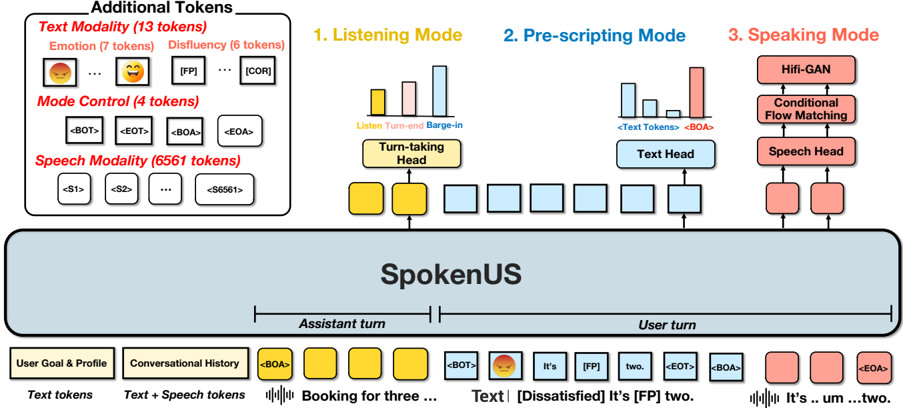

> [!abstract] arXiv · 2026 · Preprint
> **Jonggeun Lee et al.** (Seoul National University, Hanyang University) · [→ Paper](https://arxiv.org/abs/2603.16783) · Demo: ? · Code: ?
>
> Introduces SpokenTOD, a 52,390-dialogue spoken task-oriented dialogue dataset, and SpokenUS, an LLM-based spoken user simulator with a dedicated barge-in mechanism that outperforms much larger end-to-end omni models on naturalness while training on orders of magnitude less audio data.

## Problem

Training and evaluating spoken task-oriented dialogue (TOD) agents requires exposure to realistic spoken user behavior, but existing user simulators operate purely in the text modality and cannot capture spontaneous phenomena such as disfluency, emotional prosody, or real-time interruption. Attaching a TTS module to a text simulator can add prosody, but a sequential ASR-LLM-TTS pipeline cannot simulate real-time barge-in, since the simulator cannot act mid-utterance. End-to-end omni models process and generate speech directly, but they are designed as dialogue assistants, not as user simulators, so they have no architectural provision for proactively interrupting a system utterance, and without grounding in TOD state they struggle to reliably convey a scripted set of slot values and requests. Compounding this, existing spoken TOD datasets are limited in scale and domain coverage, and no prior work provides a systematic pipeline for augmenting text-based TOD corpora with diverse spoken user behaviors, leaving no training data suited to a spoken user simulator that is both TOD-grounded and behaviorally realistic.

## Method

The paper's contribution is two-part: a dataset construction pipeline (SpokenTOD) and a user-simulator architecture (SpokenUS) trained on it.

**SpokenTOD construction.** Rather than collecting spoken dialogues from scratch, the authors augment four existing text-based TOD datasets (ABCD, EmoWOZ, SGD, TaskMaster-2) with four categories of spoken user behavior and then synthesize the result into speech. Cross-turn slots are created by segmenting long alphanumeric values (phone numbers, emails) into chunks disclosed across turns, with a 20% injected correction rate. Barge-ins are inserted into 25% of sampled user turns: an LLM (Qwen3-32B) judges whether a candidate agent turn is a suitable target, then a truncated erroneous agent turn is synthesized followed by a user interruption drawn from one of three types (error recovery, clarification, efficiency) and three response styles (implicit, raw, interpreted). Disfluencies are injected using a length-dependent probability model (Shriberg, 1996), concentrated near slot values across six categories (filled pause, discourse marker, edit, repetition, correction, restart). Emotion labels (seven categories from the EmoWOZ/OCC scheme) are assigned per user turn by the LLM. The augmented dialogues are synthesized into speech with Qwen3-TTS ([[2601.15621|Qwen3-TTS]]), controlling speaking style via emotion-to-keyword instruction prompts and speaker identity via 542 reference speakers sampled from the Speech Accent Archive with population-weighted accent, age, and gender stratification. Authentic human recordings from SpokenWOZ are folded in alongside the synthesized data. The resulting corpus totals 52,390 dialogues, 1,208,554 utterances, and 1,034 hours of speech, with a synthesis-quality WER of 4.69% measured via Whisper-large-v3.

**SpokenUS architecture.** SpokenUS is a single model, initialized from Qwen2.5-3B, that operates in three sequential modes. In *Listening Mode*, a turn-taking head consumes each incoming assistant speech token and predicts one of three classes (listen, barge-in, turn-end) at every step, aggregating predictions with a linear-recency-weighted sum to avoid false alarms; this mode is skipped when the assistant utterance is provided as a single complete file rather than a stream. Once a barge-in or turn-end is detected, the model enters *Pre-scripting Mode*, where a text head autoregressively generates a structured transcript delimited by `<BOT>`/`<EOT>`, beginning with an emotion token and interleaving disfluency tokens with the intended words. In *Speaking Mode*, a speech head autoregressively generates discrete speech tokens conditioned on this transcript, which are decoded to audio via a Conditional Flow Matching (CFM) model and HiFi-GAN vocoder (both initialized from CosyVoice3), conditioned on a reference audio clip drawn from the same 542-speaker pool used to build SpokenTOD, giving SpokenUS zero-shot voice cloning over a diverse set of user voices.

Training is a two-stage recipe: Stage 1 fine-tunes on text-only SpokenTOD for 3 epochs to acquire TOD grounding, and Stage 2 jointly trains all three heads for 12k steps on a combined objective (cross-entropy losses for text, speech, and turn-taking, the latter over listen/barge-in/turn-end with the final 6 tokens of an assistant turn labeled turn-end or barge-in, corresponding to ~240ms at 25Hz). The CFM and HiFi-GAN vocoder are fine-tuned separately, exclusively on user speech from SpokenTOD. Total SpokenUS training uses roughly 1,000 hours of audio, several orders of magnitude less than the ~20M hours used by the largest baseline compared against.

## Key Results

Evaluated on 100 dialogues sampled from the SpokenWOZ test set against five end-to-end omni baselines (Qwen2.5-Omni-3B/7B, GLM-4-Voice-9B, Qwen3-Omni-30B-A3B ([[2509.17765|Qwen3-Omni]]), InteractiveOmni-4B) and human recordings, SpokenUS (3B) reaches a Goal Alignment rate of 0.82, on par with the 7B-scale Qwen2.5-Omni (0.80) and well above comparable-sized baselines (Qwen2.5-Omni-3B: 0.36; InteractiveOmni-4B: 0.59); only the 30B Qwen3-Omni surpasses it (0.93), at roughly 10x the parameters and ~20M training hours (Table 3). On Human MOS (naturalness, conversational flow, spoken-behavior authenticity), SpokenUS scores 4.06 on average, above all baselines including Qwen3-Omni-30B-A3B (3.18) and above the human recordings themselves (3.67), the latter gap attributed partly to SpokenWOZ's 8kHz telephone-channel recording conditions. Intelligibility (WER via Whisper-large-v3) is 11.36%, comparable to Qwen2.5-Omni-7B (10.53%) and substantially lower than the remaining baselines (up to 15.68%). SpokenUS's speaker-similarity scores (0.93 across-turn, 0.92 consecutive-turn) closely track the human-recording range (0.84, 0.88), whereas omni baselines produce more uniform speech with higher similarity scores. In an analysis of slot-disclosure timing, SpokenUS discloses goal slots gradually over the dialogue, matching the human pattern, while omni baselines front-load most slots within the first few turns (Figure 3 in-paper). Turn-taking accuracy is 66.0% for turn-end and 58.6% for barge-in detection (rising to 82.4%/69.6% when collapsed to a binary speak-vs-listen decision), with barge-in the harder case due to the need for proactive intervention on partial context. Under a downstream-agent robustness test, SpokenUS's spoken behaviors degrade a fixed GPT-4.1-mini agent's Final Slot F1 far more than Qwen2.5-Omni-3B's under a cascaded ASR pipeline (-24.3 vs. -3.7 points), indicating the behaviors themselves, not speech quality, are the source of difficulty.

## Novelty Assessment

The core novelty is architectural: a single model with three coordinated heads (turn-taking, text, speech) operating in sequential modes gives an LLM-based user simulator the ability to proactively interrupt system speech mid-turn, something the paper argues no prior spoken dialogue model (omni assistants, cascaded ASR-LLM-TTS pipelines, or generative spoken dialogue models) supports for the user side of a conversation. The turn-taking head's token-level streaming prediction with recency-weighted aggregation is a purpose-built mechanism rather than an adaptation of an existing component. The second contribution, SpokenTOD, is a genuine dataset contribution: a documented, dataset-agnostic augmentation pipeline that layers four categories of spoken user behavior onto existing text TOD corpora at a scale (52K dialogues, 1,034 hours) well beyond prior spoken TOD resources, with quantified augmentation counts and validated synthesis intelligibility. The result that a 3B-parameter model trained on ~1K hours outperforms a 30B model trained on ~20M hours on naturalness is a notable efficiency finding, though it should be read as evidence that domain grounding and behavior modeling compensate for scale on this specific naturalness/goal-coverage evaluation, not as evidence that SpokenUS is a stronger general-purpose speech model. The evaluation itself, while methodologically careful (controlled 100% goal-alignment subset, multi-rater Human MOS, ASR robustness test), is limited to English and to the SpokenWOZ domain set.

## Field Significance

> [!tip]
> high — SpokenUS establishes a new architectural pattern for spoken user simulation (a purpose-built turn-taking head enabling proactive barge-in within an otherwise standard AR-LM-plus-CFM speech generation pipeline) and, through SpokenTOD, provides the first large-scale systematic pipeline for injecting spoken user behaviors into text TOD corpora. Both artifacts directly enable future training and evaluation of spoken dialogue agents beyond what existing omni-model or cascaded approaches support.

## Claims

- **supports:** A dedicated turn-taking prediction mechanism operating on streaming speech tokens can give a speech-generating model the ability to proactively interrupt mid-turn, a capability that omni dialogue models built for system-side generation do not provide.
  > *Evidence:* SpokenUS's turn-taking head, evaluated on 500 turn-end and 500 barge-in cases from the SpokenTOD test set, reaches 66.0%/58.6% exact-window accuracy (82.4%/69.6% for the binary speak-vs-listen decision), a capability the paper argues no baseline omni model supports architecturally. *(§6.1, Table 4)*
- **supports:** Grounding a speech generation system in structured task-oriented dialogue state can substitute for scale, allowing a small model trained on limited audio to match or exceed the perceived naturalness of much larger models trained on orders of magnitude more data.
  > *Evidence:* SpokenUS (3B params, ~1K training hours) reaches Human MOS 4.06, exceeding Qwen3-Omni-30B-A3B (3.18) despite that baseline using ~20x more parameters and ~20,000x more training audio (~20M hours). *(§5, Table 3)*
- **complicates:** Realistic spoken user behavior (disfluency, gradual slot disclosure, cross-turn slots) poses a downstream robustness challenge to dialogue agents that is largely independent of the synthesized speech's intelligibility or perceived quality.
  > *Evidence:* Under a cascaded ASR pipeline, SpokenUS's behaviors caused a 24.3-point drop in a fixed GPT-4.1-mini agent's Final Slot F1, versus a 3.7-point drop for Qwen2.5-Omni-3B, even though SpokenUS achieves lower WER (11.36% vs. up to 15.68%) and higher Human MOS than that baseline. *(§6.3, Table 5)*
- **complicates:** Speaker-embedding similarity metrics can be confounded by degraded speech quality, since acoustically poor synthesis can appear to preserve speaker identity as strongly as natural, high-quality variation does.
  > *Evidence:* Qwen2.5-Omni-3B shows similarity scores (0.90, 0.92) comparable to SpokenUS and close to the human range, despite a substantially lower Human MOS (2.34), indicating the metric does not by itself distinguish genuine speaker consistency from generically uniform low-quality output. *(§5)*

## Limitations and Open Questions

> [!warning]
> The evaluation is constrained to 100 dialogues from a single benchmark (SpokenWOZ) and to English; the paper does not report results on other languages or TOD domains, and goal-alignment/slot metrics are scored by an LLM judge (GPT-4.1-mini) rather than human annotators, though the paper cites a prior reported MCC of 0.77 against human judgments for a comparable protocol.

SpokenTOD's augmentation pipeline covers only four behavior categories (cross-turn slots, barge-in, disfluency, emotion); the authors note that laughter, overlapping speech, and code-switching are not modeled. The dataset is built primarily from TTS-synthesized speech rather than naturally recorded spoken dialogue (mitigated partly by folding in SpokenWOZ's human recordings), and does not model adverse acoustic conditions such as background noise or channel degradation, though the authors argue standard augmentation could be layered on afterward. Barge-in detection accuracy (58.6% exact-window) is markedly weaker than turn-end detection (66.0%), and the paper attributes much of this gap to confusion between the two non-listen classes rather than to detecting the moment to speak itself.

## Wiki Connections

- [[spoken-language-model|Spoken Language Model]] — SpokenUS is an autoregressive LLM extended with dedicated speech-generation and turn-taking heads operating over interleaved text and discrete speech tokens, applied to the user-simulation side of spoken dialogue rather than the assistant side.
- [[flow-matching|Flow Matching]] — the Speaking Mode decodes discrete speech tokens to audio via a Conditional Flow Matching model (initialized from CosyVoice3) paired with a HiFi-GAN vocoder.
- [[gan-vocoder|GAN Vocoder]] — a HiFi-GAN vocoder, fine-tuned on SpokenTOD user speech, forms the final stage of SpokenUS's audio decoding pipeline.
- [[zero-shot-tts|Zero-Shot TTS]] — both SpokenTOD's speech synthesis (via Qwen3-TTS) and SpokenUS's own speech generation clone voices from short reference clips drawn from a 542-speaker accent-stratified pool, without speaker-specific training.
- [[emotion-synthesis|Emotion Synthesis]] — SpokenTOD synthesis and SpokenUS generation both condition on explicit emotion labels (seven OCC-derived categories) realized as prosodic style via instruction-prompt keywords or dedicated emotion tokens.
- [[subjective-evaluation|Subjective Evaluation]] — the paper's central comparison against omni baselines relies on a 10-rater Human MOS protocol scoring naturalness, conversational flow, and spoken-behavior authenticity.
- [[2601.15621|Qwen3-TTS]] — used as the speech synthesizer to generate SpokenTOD's audio, conditioned on emotion-keyword instruction prompts and sampled reference speakers.
- [[2509.17765|Qwen3-Omni Technical Report]] — the strongest baseline compared against; its 30B-A3B variant exceeds SpokenUS only on goal coverage while trailing substantially on Human MOS and speaker-similarity naturalness, despite ~20,000x more training audio.
