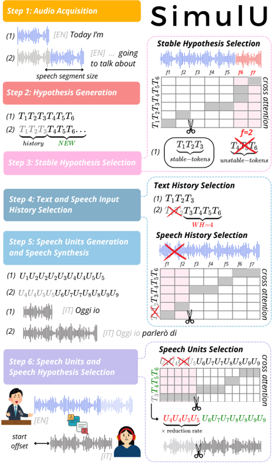

> [!abstract] arXiv · 2026 · Preprint
> **Amirbek Djanibekov et al.** (MBZUAI / FBK) · [→ Paper](https://arxiv.org/abs/2603.16924) · Demo: ? · Code: ?
>
> Introduces the first training-free simultaneous policy for long-form, end-to-end speech-to-speech translation, repurposing the internal cross-attention of a pretrained offline model to manage both input history and output generation.

## Problem

Simultaneous speech-to-speech translation (SimulS2ST) policies are typically learned through resource-intensive training pipelines: multi-objective joint optimization, multi-stage procedures incorporating large language models, or reinforcement-learning refinement, all of which additionally require large-scale, often synthetically aligned speech data. Standard deployments instead fall back on cascaded pipelines (speech-to-text translation followed by TTS), which suffer from compounding errors across separately trained components, loss of non-linguistic information (speaker identity, prosody) through the text bottleneck, and latency penalties from sequential processing. Compounding both issues, most existing SimulS2ST work evaluates on short-form, pre-segmented utterances (up to 30 seconds) inherited from offline benchmarks, which does not reflect realistic long-form, continuous-speech deployment conditions such as meetings or streaming platforms.

## Method

SimulU is a simultaneous decoding policy applied on top of SeamlessM4T-medium-v1, a pretrained offline end-to-end S2ST model composed of a speech-to-text (S2T) module (a w2v-BERT-style Conformer speech encoder feeding an NLLB text decoder, ~1B parameters), a text-to-unit module (a 170M-parameter transformer encoder-decoder producing discrete speech units at 50Hz, derived from XLS-R-1B 35th-layer representations via k-means clustering), and a multilingual HiFi-GAN unit-vocoder. Rather than retraining or adapting this backbone, SimulU repurposes it for simultaneous inference ("onlinization") through a six-step, purely inference-time policy that exploits the model's own cross-attention scores:

1. **Audio Acquisition** — incoming speech is incrementally added to a speech history in fixed-size chunks.
2. **Hypothesis Generation** — the current speech history is passed through the S2T module to produce an intermediate textual hypothesis.
3. **Stable Hypothesis Selection** — speech-text cross-attention scores identify which hypothesis tokens are "stable" (aligned to already-received audio rather than the most recent, still-uncertain frames defined by a cut-off frame hyperparameter *f*), and only stable tokens are emitted for downstream processing.
4. **Text and Speech Input History Selection** — to bound context growth for long-form input, a fixed number of words (word history, *WH*) is retained in the text history, and cross-attention scores are used again to prune the corresponding audio frames from the speech history, keeping text and speech context aligned.
5. **Speech Units Generation and Speech Synthesis** — the stable text hypothesis (with the full retained text history, which the authors find substantially improves synthesis quality) is passed to the text-to-unit module and vocoder to generate output speech units and waveform.
6. **Speech Units and Speech Hypothesis Selection** — text-unit cross-attention aligns the newly generated hypothesis to its corresponding output units, discarding units belonging to older text history; the number of discarded units, multiplied by the model's reduction rate (320), determines how much of the newly synthesized waveform is cut and emitted as the incremental output.

The word-history hyperparameter (*WH*) was tuned via a preliminary sweep on the MuST-C en-de dev set across four cut-off frame settings (Table 1), settling on *WH* = 10 as the best trade-off between quality and context length.

## Key Results

Evaluated on all eight English-source language directions of MuST-C v1.0 (dev and tst-COMMON, average durations 15.7 and 10.8 minutes respectively, fed as continuous streams to simulate long-form input), SimulU achieves the highest ASR-BLEU among all compared systems in six of eight directions (de, fr, it, es, pt, ro), while remaining competitive in the other two (ru, nl), consistently at a latency (start offset) of roughly 1-2 seconds. Both SimulU and the strongest cascade baseline, StreamAtt (a training-free S2TT policy) paired with XTTS-v2, outperform Local-Agreement-based cascades by at least 4-5 ASR-BLEU points at comparable latency, particularly in fr, pt, ro, and nl. Swapping the TTS component of the StreamAtt cascade from XTTS-v2 to SeamlessM4T's own TTS module (Seam.TTS) causes ASR-BLEU to collapse to 5-15, which the authors attribute to Seam.TTS's sensitivity to synthesizing from incomplete sentence fragments, a condition typical of streaming decoding, whereas XTTS-v2 degrades far less under the same partial-input conditions. On end-offset latency (delay between the end of input speech and the final output), SimulU matches the top cascade in de and fr but achieves lower and more stable (lower standard deviation) end-offset latency in the remaining six directions.

## Novelty Assessment

The core contribution is a training-free, inference-time policy rather than a new model architecture: SimulU adds no parameters and performs no additional training on top of the pretrained SeamlessM4T backbone. Its novelty lies in extending prior cross-attention-based simultaneous policies (previously applied to speech-to-text translation) to the harder end-to-end speech-to-speech setting, adding two new mechanisms beyond hypothesis stability detection: joint speech/text history pruning for long-form input, and cross-attention-guided speech-output segmentation for incremental waveform emission. The empirical contribution, comparison against carefully constructed, strong cascade baselines (rather than weak strawmen) across eight language directions on continuous, long-form audio, is a genuine and useful validation, though the approach is demonstrated on a single backbone model (SeamlessM4T-medium-v1) and a single benchmark family (MuST-C).

## Field Significance

moderate — SimulU demonstrates that a pretrained end-to-end S2ST model's own cross-attention can be repurposed, without retraining, to solve both the input-history-management and output-segmentation problems that simultaneous long-form translation requires. It provides a concrete, first-of-its-kind existence proof that training-free onlinization is viable for full speech-to-speech translation (not just speech-to-text), and its cascade-baseline comparisons surface a specific engineering caveat (TTS component sensitivity to partial-sentence input) relevant to anyone building streaming S2S cascades.

## Claims

- **supports:** Training-free policies that repurpose the cross-attention of a pretrained end-to-end model can reach a quality-latency trade-off competitive with, or better than, cascaded pipelines built from strong training-free components, without any additional training.
  > *Evidence:* SimulU achieves the highest ASR-BLEU in six of eight MuST-C directions against StreamAtt+XTTS-v2 and Local-Agreement-based cascades, at a comparable start-offset latency of roughly 1-2 seconds. *(§4, Figure 2)*
- **complicates:** Cascaded speech-to-speech translation pipelines are highly sensitive to which TTS component is used downstream, because streaming decoding forces the TTS module to synthesize from incomplete sentence fragments rather than complete utterances.
  > *Evidence:* Replacing XTTS-v2 with SeamlessM4T's own TTS module (Seam.TTS) in an otherwise identical StreamAtt cascade drops ASR-BLEU from the low-20s to 5-10, which manual inspection attributed to Seam.TTS's degraded synthesis quality when conditioned on partial rather than complete sentences. *(§4, Table 2)*
- **refines:** Cross-attention alignment scores from a pretrained multi-module encoder-decoder S2S system can serve as a unified signal for three distinct simultaneous-decoding decisions: hypothesis stability, context-history pruning, and output-segment boundaries.
  > *Evidence:* SimulU's six-step policy reuses speech-text cross-attention (Steps 3-4) and text-unit cross-attention (Step 6) from the same pretrained SeamlessM4T backbone to make all three decisions, requiring no retraining or adaptation of the model. *(§2)*
- **complicates:** Evaluating simultaneous translation policies on long-form, continuous input rather than short, pre-segmented utterances changes which failure modes and trade-offs are visible.
  > *Evidence:* The authors simulate streaming by feeding entire MuST-C TED talks (averaging 15.7 minutes for dev and 10.8 minutes for tst-COMMON) rather than the short, manually pre-segmented clips (up to 30 seconds) used in prior SimulS2ST evaluation, arguing this better reflects realistic deployment. *(§1, §3.1)*

## Limitations and Open Questions

> [!warning] The policy's applicability is tied to models with an inspectable encoder-decoder cross-attention structure. SimulU's three core decisions (hypothesis stability, history pruning, output segmentation) all depend on extracting meaningful, well-calibrated cross-attention scores from a jointly trained speech-to-text-to-unit backbone. It is unclear whether the approach transfers to end-to-end S2S architectures without this structure, such as decoder-only discrete-token speech language models, which lack an explicit encoder-decoder cross-attention signal to exploit.

The method is demonstrated on a single backbone (SeamlessM4T-medium-v1) and a single benchmark family (MuST-C, English-source only, eight target languages); it is not evaluated against non-English source speech or on domains beyond TED-talk-style spoken content. The baselines are cascades the authors construct themselves from existing components (StreamAtt, Local Agreement, Seam.TTS, XTTS-v2) rather than comparisons against other published training-free or low-resource simultaneous S2ST systems, which limits how the reported gains can be interpreted relative to the broader field. Latency is reported only as start offset and end offset; the paper does not report computational cost or real-time factor, which matters for practical deployment.

## Wiki Connections

- [[speech-to-speech|Speech-to-Speech]] — proposes a training-free simultaneous decoding policy specifically for the direct S2S translation sub-paradigm, addressing long-form, real-time deployment rather than offline batch translation.
- [[streaming-tts|Streaming TTS]] — the six-step policy's history management and incremental output-segment emission directly address the read/write decision problem central to streaming generation.
- [[multilingual-tts|Multilingual TTS]] — evaluates the policy across eight English-source target-language directions on MuST-C, using a backbone that supports around 100 languages.
- [[self-supervised-speech|Self-Supervised Speech]] — the underlying SeamlessM4T backbone's speech encoder is built on the self-supervised w2v-BERT framework, and its discrete speech units are derived from self-supervised XLS-R-1B representations via k-means clustering.
- [[2308.11596|SeamlessM4T]] — SimulU is applied directly on top of this pretrained offline S2ST model without any retraining or adaptation.
- [[2025.acl-long.817|SimulS2S-LLM]] — cited as a representative training-based approach to simultaneous S2S translation that SimulU's training-free policy is positioned against.
- [[2602.11072|Simultaneous S2S translation without aligned data]] — a contemporaneous alternative approach to simultaneous S2S translation, cited alongside SimulU's motivating discussion of costly training pipelines.
- [[2010.05646|HiFi-GAN]] — the multilingual unit-vocoder used within the SeamlessM4T backbone to synthesize the final output waveform from discrete units.
- [[2406.04904|XTTS]] — used as the strongest TTS component in the best-performing cascade baseline (StreamAtt+XTTS-v2), against which SimulU is directly compared.
