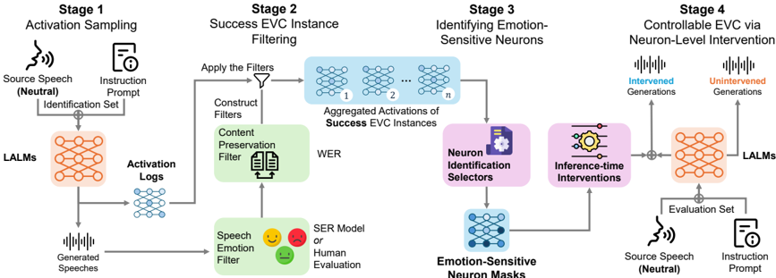

> [!abstract] arXiv · 2026 · Preprint
> **Xiutian Zhao et al.** (Johns Hopkins University / Imperial College London) · [→ Paper](https://arxiv.org/abs/2603.17231) · Demo: ? · Code: ?
>
> Identifies compact "emotion-sensitive neurons" (ESNs) inside the decoder feed-forward layers of speech-generative large audio-language models and shows that manipulating them at inference time, with no weight updates, causally steers emotional voice conversion output.

## Problem

Large audio-language models (LALMs) that jointly process speech and text can generate expressive audio from natural-language instructions, but instruction-following emotional voice conversion (EVC) remains unreliable: target emotions are often missed, and even when the intended affect is realized, the underlying linguistic content can be corrupted by refusals, hallucinations, or unintended paraphrase. Prior emotional speech synthesis and conversion work builds explicit style representations (reference encoders, global style tokens, intensity controls) that require dedicated training or fine-tuning. In parallel, LLM interpretability research has shown that neuron- or activation-level units can be identified and causally manipulated to steer text generation without retraining, but this had not been systematically studied for speech-generative LALMs. The paper asks whether compact, causally actionable neuron subsets responsible for emotional expression exist inside these models, and whether they can be identified and exploited for training-free emotion control while separating genuine emotion effects from generic content degradation.

## Method

The paper instruments the gated MLP blocks of the decoder-side language-model component of a LALM. For SwiGLU-style gated MLPs, it hooks the post-nonlinearity gate activations at every layer and token position during EVC generation, logging per-neuron activation values without any success filtering at this stage.

A four-stage pipeline (Figure 2 in the paper) turns these logged activations into an intervention. Stage 1 samples activations while the LALM performs instruction-following EVC (neutral source speech, natural-language target-emotion instruction). Stage 2 applies a two-axis success filter over the generated outputs: an emotion check via a held-out speech-emotion-recognition (SER) judge (emotion2vec+large, and separately a supplementary LALM-based judge, Qwen3-Omni-30B, prompted for five-way classification) that requires the predicted emotion to match the target, and a content-preservation check that thresholds word error rate (WER ≤ 0.15) between the LALM's own decoded text and the source transcript. Only conversions passing both filters populate a per-emotion success set, capped at a configurable size c. Stage 3 aggregates neuron-wise activation probabilities over each success set and ranks neurons with one of four selection criteria: activation-probability (LAP), activation-probability entropy (LAPE), mean-activation-deviation (MAD), or a contrastive-margin criterion (CAS) that scores a neuron by the gap between its highest and second-highest per-emotion activation probability, keeping it only for the emotion where it is the top match. The top-ranked fraction r of neurons per emotion forms the emotion-sensitive neuron (ESN) mask. Stage 4 intervenes on exactly the masked gate dimensions at inference time, leaving all model weights untouched, via one of four operators: multiplicative gain scaling ("targeted steering", gate values multiplied by 1+α), an additive constant shift, a floor-clamp that lower-bounds the gate value, or deactivation (zeroing the gate). A uniformly sampled random mask of matching sparsity serves as a control.

The method is evaluated on three open speech-generative LALMs (Qwen2.5-Omni-7B, MiniCPM-o 4.5, Kimi-Audio) using the English-speaker subset of the Emotional Speech Database (ESD, 10 speakers, 5 emotions), with a hybrid speaker/utterance-index split into identification, development, test-seen, and test-unseen partitions to prevent both lexical and speaker leakage. Evaluation reports target-emotion match rate (from both SER judges), WER-based content preservation, and UTMOS-based naturalness, and compares self-effect (mask emotion equals target emotion) against cross-effect (mask emotion differs from target emotion) to separate emotion-specific modulation from generic perturbation.

## Key Results

Unintervened baselines are modest and inconsistent across models and objectives: average emotion match rate is 15.62% for Kimi-Audio, 11.93% for Qwen2.5-Omni-7B, and 7.88% for MiniCPM-o 4.5, while WER is far higher for Qwen2.5-Omni-7B (19.00%) than for MiniCPM-o 4.5 (2.95%) or Kimi-Audio (2.82%), showing that stronger emotional shifts do not track with better content preservation at baseline.

Among the four ESN selectors, the contrastive-margin criterion (CAS) and mean-activation-deviation (MAD) produce the strongest self-effects and the largest self-cross separation on Qwen2.5-Omni-7B (CAS: +4.27/+3.60 pp emotion match on the two SER judges, versus +0.34/-0.05 pp cross-effect), while frequency-based (LAP) and entropy-based (LAPE) selectors are weaker and, for LAPE, diffuse enough that off-target effects can rival on-target gains. The same qualitative ranking holds on MiniCPM-o 4.5 and Kimi-Audio, though absolute effect sizes and judge agreement vary by model. Selection rate and success-set size both show non-monotonic sweet spots: r=0.5% and c=50 give clear self/cross separation on Qwen2.5-Omni-7B, while very small values under-select and very large values (r=1.0%) begin to leak cross-emotion effects. Increasing intervention strength α from 0.3–0.5 to 2.0 raises self-effect emotion match from roughly +0.5–2.0 pp to +8.89/+20.67 pp but drives WER from near-baseline to 203.65% (+184.65 pp), while UTMOS naturalness stays comparatively stable throughout, indicating that the dominant failure mode of over-steering is semantic drift rather than acoustic collapse. A 20-participant human listening study under the anchor configuration (CAS, c=50, r=0.5%, steering, α=1.0) preferred the intervened system over baseline in 62% of pairwise trials on average (11% tie, 27% loss), with the strongest preference for happy (69% win) and the weakest for angry (54% win). Repeating the identical pipeline on the downstream speech-synthesis MLPs of Qwen2.5-Omni-7B (rather than the language-model decoder MLPs) eliminates the positive self-cross gap across all four selectors, and localization heatmaps show ESNs concentrating in intermediate-to-late language-model decoder layers (e.g., layers 11-15 for Qwen2.5-Omni-7B, layers 19-22 for Kimi-Audio) rather than early layers.

## Novelty Assessment

The architectural components used (gated-MLP hooking, activation-probability-based neuron ranking, gain-scaling and additive activation steering) are each adapted from existing LLM interpretability and activation-engineering literature rather than newly invented. The genuine contribution is the four-stage, success-filtered identification-and-intervention pipeline purpose-built for the multi-objective structure of EVC (emotion realization and content preservation must both hold before activations are trusted), applied for the first time, to the authors' knowledge, at the neuron level inside speech-generative LALMs rather than text-only LLMs or conventional VC systems. The systematic cross-model, cross-selector, cross-strength comparison, together with the language-model-versus-synthesis-module localization result and human-listening validation, constitutes the paper's main empirical contribution rather than a new model architecture or training objective.

## Field Significance

> [!tip]
> high — establishes, to the authors' knowledge, the first neuron-level causal account of emotion control inside speech-generative LALMs, showing that training-free activation intervention on a compact, identifiable neuron subset produces emotion-specific, human-perceptible changes in generated speech across three independently trained model families.

The paper demonstrates that emotion control in LALM-based EVC can be studied and manipulated as a mechanistic property of the decoder feed-forward layers rather than only through retraining or explicit style-conditioning modules, and it localizes the effect to the language-model side of the architecture rather than the downstream acoustic synthesis stack. It provides a reusable identification-and-intervention protocol (success filtering, selector comparison, strength sweep) that other work on training-free control of paralinguistic attributes in multimodal generative models can adopt or extend.

## Claims

- **supports:** Compact, sparsely selected subsets of neurons inside a speech-generative model's decoder feed-forward layers can be causally responsible for emotional expression, separable from generic output degradation.
  > *Evidence:* Contrastive-margin-selected masks (r=0.5%) produce large positive self-effects with near-zero cross-effects (+4.27/+3.60 pp self vs. +0.34/-0.05 pp cross on Qwen2.5-Omni-7B), and deactivating the same neurons consistently harms rather than helps target-emotion realization, evidencing a causal rather than correlational role. *(§5.2.1, §5.3.1, Table 3, Figure 6)*
- **supports:** The criterion used to rank and select control-relevant neurons materially determines downstream intervention effectiveness; margin-based selection that isolates emotion-exclusive neurons outperforms frequency- or entropy-based selection.
  > *Evidence:* Across all three evaluated LALMs, contrastive-margin (CAS) and mean-activation-deviation (MAD) selectors yield larger self-cross separation than activation-probability (LAP) or entropy-based (LAPE) selectors, with LAPE showing diffuse effects where off-target gains can rival on-target ones. *(§5.2.1, Table 3)*
- **complicates:** Pushing inference-time activation intervention strength to maximize a target behavior trades off sharply against linguistic content preservation once a moderate threshold is exceeded, without a corresponding drop in perceived naturalness.
  > *Evidence:* Raising the steering gain from α=1.0 to α=2.0 on Qwen2.5-Omni-7B increases self-effect emotion match from +4.27/+3.60 pp to +8.89/+20.67 pp but inflates WER from 29.65% to 203.65% (+184.65 pp over baseline), while UTMOS drops only marginally (3.99 to 3.91). *(§5.3.2, Table 4)*
- **refines:** In LALMs that couple a language-model decoder to a downstream speech-synthesis module, the locus of controllable emotion modulation sits in intermediate-to-late language-model layers rather than in the synthesis-side network.
  > *Evidence:* Applying the identical identification-and-intervention pipeline to Qwen2.5-Omni-7B's synthesis-module MLPs (same c, r, α as the language-model experiment) collapses the self-cross gap to near-zero or negative values across every selector, while ESN concentration heatmaps place the effective neurons in layers 11-15 (Qwen2.5-Omni-7B) or 19-22 (Kimi-Audio) of the language-model decoder. *(§5.5, Table 6, Figure 9)*
- **complicates:** Training-free neuron-level emotion control identified from a fixed speaker population does not transfer uniformly to unseen speakers; generalization is emotion-dependent.
  > *Evidence:* Under the CAS steering configuration, angry and surprise gains persist with comparable magnitude on TEST-UNSEEN speakers, whereas happy shows near-zero or slightly negative unseen-speaker effect and sad drops noticeably relative to TEST-SEEN, despite all four emotions being identified from the same protocol. *(§5.6, Figure 10)*

## Limitations and Open Questions

> [!warning]
> The core intervention-strength and intervention-method sweeps (Tables 4, and the method comparison in §5.3.1) are conducted on a single model, Qwen2.5-Omni-7B, so the reported optimal α range and the ranking of steering/additive/clamping/deactivation operators are not independently confirmed on MiniCPM-o 4.5 or Kimi-Audio.

Emotion coverage is restricted to four target emotions (happy, angry, sad, surprise) converted from a neutral source, and the study only tests neutral-to-emotion conversion rather than the full bidirectional emotion-to-emotion space that EVC in principle covers. The human listening study uses 20 participants and a single anchor configuration, so it validates the chosen default setting rather than the full sweep of selectors, sparsities, and strengths reported from automatic judges. Agreement between the two automatic SER judges (emotion2vec+large and the Qwen3-Omni-30B LALM judge) is not always tight, and the paper itself notes that human- versus SER-filtered ESN identification yields only partial neuron-level overlap (Jaccard 0.118 on average) even though layer-wise distributions agree closely, leaving open how sensitive the reported effect sizes are to the specific automatic judge chosen. Codec and synthesis-module implementation details of the evaluated LALMs are not reported in the paper.

## Wiki Connections

- [[emotion-synthesis|Emotion Synthesis]] — proposes a training-free, neuron-level activation-steering technique for controlling emotional expression in speech-generative LALMs, as an alternative to trained style/emotion representations.
- [[voice-conversion|Voice Conversion]] — studies instruction-following emotional voice conversion (EVC) as the task through which the neuron intervention framework is identified and evaluated.
- [[spoken-language-model|Spoken Language Model]] — instruments and intervenes on the decoder feed-forward layers of large audio-language models (Qwen2.5-Omni, MiniCPM-o, Kimi-Audio) that consume external source speech as input.
- [[instruction-conditioned-tts|Instruction-Conditioned TTS]] — the evaluated EVC task is driven entirely by a fixed natural-language instruction specifying the target emotion, with no dedicated style-conditioning module.
- [[subjective-evaluation|Subjective Evaluation]] — corroborates the automatic SER-judge results with a 20-participant pairwise A/B listening study across all four target emotions.
- [[2503.20215|Qwen2.5-Omni Technical Report]] — one of the three evaluated LALMs and the model used for the majority of the selector, sparsity, strength, and localization ablations.
- [[2504.18425|Kimi-Audio Technical Report]] — evaluated as one of the three LALMs, showing the highest unintervened baseline emotion match rate among the three.
- [[2408.01800|MiniCPM-V]] — cited as the technical report underlying MiniCPM-o 4.5, the third LALM evaluated in the study.
- [[2410.00037|Moshi]] — cited as an example of jointly speech-text LALMs whose emergence motivates studying instruction-following emotion control at this model scale.
- [[2308.10248|Steering Language Models with Activation Engineering]] — the gain-scaling targeted-steering intervention adopted as the paper's default operator is drawn from this activation-engineering line of work.
- [[2508.03543|EmoSteer-TTS]] — a directly related prior approach to training-free, activation-steering-based emotion-controllable TTS, discussed as related work.
- [[2509.17765|Qwen3-Omni Technical Report]] — used as a supplementary LALM-based judge for automatic five-way emotion classification alongside the SER model.
