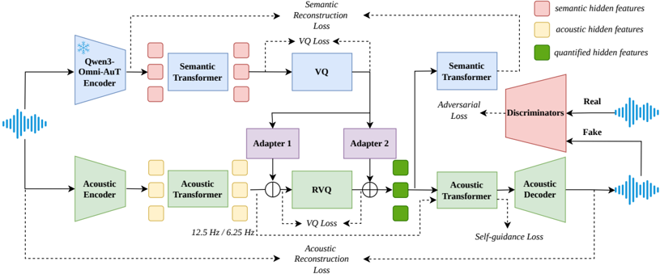

> [!abstract] arXiv · 2026 · Preprint
> **Jingbin Hu et al.** (Northwestern Polytechnical University) · [→ Paper](https://arxiv.org/abs/2603.20638) · Demo: ✓ · Code: ?
>
> Proposes OmniCodec, a low-frame-rate neural audio codec that unifies speech, music, and general-sound reconstruction while decoupling semantic and acoustic information using a supervised (rather than self-supervised) pretrained audio-understanding encoder as its semantic branch.

## Problem

Neural codecs designed for language-model-based audio generation face two competing pressures: they need low frame rates and compact multi-codebook structures compatible with LLM token budgets, and they need semantically informative tokens so that downstream generative models can operate over them effectively. Prior codecs largely specialize in one axis: high-fidelity reconstruction codecs (SoundStream, DAC, EnCodec) use high bitrates and frame rates that are ill-suited to LLM-scale token prediction, while single-codebook designs (BigCodec, SingleCodec, TS3-Codec, FocalCodec) sacrifice representational capacity at low frame rates. Codecs that add semantic supervision typically distill from self-supervised speech models (WavLM in SpeechTokenizer and the Mimi codec), which restricts them to the speech domain and leaves music and general sound under-served. Universal codecs that span domains (WavTokenizer, SemantiCodec, UniCodec, AUV) address domain coverage but do not resolve the tension between reconstruction fidelity and semantic informativeness at low frame rate. The paper targets a codec that is simultaneously low-frame-rate, multi-domain, and semantically structured.

## Method

OmniCodec splits the codec into two parallel branches: an acoustic branch built on a SEANet encoder/decoder with streaming (causal) convolutions and a causal Transformer, and a semantic branch driven by Qwen3-Omni-AuT-Encoder, a pretrained understanding-model encoder trained on 20 million hours of supervised audio spanning speech, music, and general sound. This is a deliberate substitution: rather than distilling from a self-supervised speech model such as WavLM, the semantic branch reuses a supervised encoder's representations directly, on the premise that a model trained on broad supervised audio-understanding data should generalize its semantic modeling beyond speech.

The two branches are discretized separately, semantic features with a single-codebook vector quantizer (VQ) and acoustic features with a residual vector quantizer (RVQ, up to 31 stages), both updated via exponential moving average. A lightweight linear adapter then decouples and recombines the two representations: the quantized semantic hidden features are subtracted from the acoustic hidden features before quantization, and the quantized acoustic residual is added back to the quantized semantic features to reconstruct the final representation. Training combines multi-scale mel reconstruction loss, a semantic reconstruction loss against the Qwen3-Omni-AuT-Encoder target, VQ/RVQ commitment loss, adversarial losses from three discriminators (multi-scale STFT, multi-scale/period/band time-frequency discriminators, and a WavLM-based perceptual discriminator), a feature-matching loss, and a self-guidance loss. The self-guidance loss trains the decoder to produce similar hidden outputs whether it receives quantized tokens or their continuous pre-quantization latents, which the authors intend to make the decoder more robust to quantization error. The model (~134M parameters, 512-dim SEANet backbone, 8-layer/8-head causal Transformer) is trained on ~160,000 hours of audio (95K-hour Emilia plus LibriTTS for speech, ~60K in-house hours for music, and an 800-hour filtered AudioSet subset for general sound) and produces two frame-rate variants, 12.5 Hz and 6.25 Hz, using a purely causal receptive field for streaming inference.

## Key Results

At matched bitrate, OmniCodec-16L (12.5 Hz, 2200 bps, 16 RVQ layers) is compared against Mimi codec-16L at the same configuration on LibriSpeech test-clean (speech), GTZAN (music), and an AudioSet subset (general sound). OmniCodec shows lower Mel distance and MCD than Mimi codec across all three domains and higher Audiobox Aesthetics scores in the music and general-sound domains (Table 1, Table 3), while a 6.25 Hz, 16-layer variant still outperforms the 75 Hz single-codebook UniCodec on STOI, Mel distance, and MCD despite a much lower frame rate. On the semantic side, measured via the perplexity of a small (100M-parameter) Qwen2-based LLM trained to predict codebook tokens, OmniCodec beats Mimi codec on music and general-sound PPL but underperforms it on speech-domain PPL, an asymmetry the authors attribute to WavLM's masked self-supervised pretraining capturing finer-grained phonetic detail than the supervised understanding-model encoder used by OmniCodec (Table 4). Fine-tuning a variant (OmniCodec-8L-FT) on speech-only data narrows the speech PPL gap but worsens PPL in music and general sound, illustrating a data-ratio trade-off rather than a strict improvement. Subjective N-MOS/S-MOS listening tests (31 participants) corroborate the objective reconstruction gains.

## Novelty Assessment

The core novel contribution is architectural: reusing a supervised, cross-domain pretrained understanding-model encoder (rather than a self-supervised speech model) as a codec's semantic-supervision branch, combined with an explicit linear-adapter mechanism that additively decouples and recombines semantic and acoustic quantized representations, and a self-guidance auxiliary loss that trains the decoder against its own continuous pre-quantization latents. Each of these three components is independently validated by ablation (Table 2). The overall system design, however, sits within a densely populated and largely concurrent space of semantic-acoustic decoupled codecs (DualCodec, SAC, XY-Tokenizer, FireRedTTS-2-Tokenizer, MOSS-Audio-Tokenizer, MiMo-Audio) that pursue very similar goals with different encoder choices; OmniCodec's distinguishing claim is the specific choice of a supervised, general-audio-domain encoder as the semantic teacher, not a new decoupling paradigm per se.

## Field Significance

moderate — the paper contributes a concrete, ablation-supported architectural variation (supervised understanding-model encoder as semantic branch, plus an additive decoupling adapter and self-guidance loss) within an active, crowded line of low-frame-rate semantic-acoustic codec research, but it does not resolve the speech-domain semantic gap it identifies relative to self-supervised distillation, and it evaluates against an older baseline set (Mimi codec, WavTokenizer, UniCodec, AUV, X-Codec) rather than the more directly comparable, contemporaneous semantic-acoustic decoupled codecs it cites as related work.

## Claims

- **supports:** A neural audio codec's semantic informativeness can be improved by supervising its semantic branch with a large-scale supervised audio-understanding encoder instead of a self-supervised speech model.
  > *Evidence:* Substituting the supervised Qwen3-Omni-AuT-Encoder (trained on 20M hours of supervised audio) for a self-supervised semantic teacher yields lower downstream-LLM perplexity than DAC across speech, music, and sound, and beats Mimi codec's WavLM-distilled semantic branch in the music and general-sound domains. *(§3.3, Table 4)*
- **complicates:** Supervised-encoder semantic distillation does not uniformly outperform self-supervised semantic distillation across audio domains.
  > *Evidence:* OmniCodec's supervised-encoder semantic branch underperforms the WavLM-distilled Mimi codec on speech-domain perplexity, which the authors attribute to WavLM's masked self-supervised objective capturing finer phonetic detail than the supervised understanding-model encoder. *(§3.3, Table 4)*
- **supports:** Explicitly factoring a codec's semantic and acoustic hidden representations through a learned decoupling adapter improves both reconstruction fidelity and semantic preservation compared to an entangled representation.
  > *Evidence:* Removing the decoupling adapter in the ablation study ("w/o Adapter-1") degrades PESQ-WB from 2.76 to 2.61 and increases first-layer codebook perplexity (PPL0) from 10.02 to 11.13. *(§3.4, Table 2)*
- **supports:** A self-supervised auxiliary loss that trains the decoder to match its own continuous pre-quantization output can raise codebook utilization and reconstruction quality without external supervision.
  > *Evidence:* Including the self-guidance loss raises codebook utilization from 0.974 to 0.982 and improves PESQ-WB from 2.75 to 2.76 relative to the ablation without it. *(§3.4, Table 2)*
- **complicates:** Domain data ratio in multi-domain codec training creates a trade-off rather than a uniform improvement across speech, music, and sound semantic performance.
  > *Evidence:* Fine-tuning the codec on speech-only data (OmniCodec-8L-FT) lowers speech PPL0/PPL mean from 10.02/116.94 to 8.42/97.94 but raises music PPL0/PPL mean from 4.14/48.92 to 4.78/59.23 and sound PPL0/PPL mean from 3.32/37.01 to 3.81/46.56. *(§3.3, Table 4)*

## Limitations and Open Questions

> [!warning] The comparison set omits several of the paper's own closely related, contemporaneous baselines. OmniCodec cites DualCodec, SAC, XY-Tokenizer, FireRedTTS-2-Tokenizer, MOSS-Audio-Tokenizer, and MiMo-Audio as directly relevant semantic-acoustic decoupling work but evaluates only against older codecs (Mimi codec, WavTokenizer, UniCodec, AUV, X-Codec, DAC), leaving open how the proposed supervised-encoder semantic branch compares against these more directly competing designs. At the time of publication the model and code were stated as "to be open-sourced" rather than already released, so the reported results are not yet independently reproducible.

The paper's own conclusion acknowledges that the speech-domain semantic gap relative to WavLM-based distillation is unresolved, and that the trade-off between speech and non-speech performance depends on training data ratio in ways not yet systematically explored. Semantic evaluation relies on a small (100M-parameter) proxy LLM's perplexity rather than an end-to-end downstream generation task, so the link between lower PPL and actual generation quality is not directly demonstrated in this paper.

## Wiki Connections

- [[neural-codec|Neural Audio Codec]] — extends the neural codec design space with a unified low-frame-rate (12.5 Hz / 6.25 Hz), multi-domain (speech, music, general sound) hierarchical multi-codebook design.
- [[disentanglement|Disentanglement]] — introduces an explicit adapter that subtracts and recombines quantized semantic and acoustic hidden features, with ablation evidence showing the adapter improves both reconstruction and semantic informativeness.
- [[autoregressive-codec-tts|Autoregressive Codec TTS]] — positions its codebooks as tokens for downstream LLM-based audio generation, using LLM perplexity over the codebooks as a proxy for downstream generation utility.
- [[evaluation-metrics|Evaluation Metrics]] — reports a broad battery of reconstruction metrics (PESQ, STOI, Mel distance, MCD, Audiobox Aesthetics) plus LLM perplexity as a cross-domain semantic-informativeness proxy.
- [[subjective-evaluation|Subjective Evaluation]] — runs naturalness (N-MOS) and speaker-similarity (S-MOS) listening tests with 31 participants to corroborate the objective reconstruction gains.
- [[2410.00037|Moshi]] — supplies the Mimi codec, the primary baseline throughout; OmniCodec is directly compared against Mimi codec at matched bitrate and frame rate across all three domains.
- [[2505.13000|DualCodec]] — OmniCodec's semantic-acoustic decoupling adapter is explicitly adapted from DualCodec's decoupling strategy.
- [[2510.16841|SAC]] — a contemporaneous semantic-acoustic dual-stream codec cited as related work addressing the same semantic-acoustic conflict, but not included as an evaluated baseline.
- [[2509.17765|Qwen3-Omni Technical Report]] — supplies the pretrained supervised audio-understanding encoder (Qwen3-Omni-AuT-Encoder) that OmniCodec repurposes as its semantic branch.
- [[2308.16692|SpeechTokenizer]] — an earlier semantic-distillation codec cited as part of the lineage of using external models for semantic supervision.
- [[2408.16532|WavTokenizer]] — used as a single-codebook, general-audio-domain baseline in the reconstruction comparison table.
- [[2210.13438|EnCodec]] — cited as representative of earlier high-fidelity but high-bitrate, high-frame-rate codec designs that OmniCodec's low-frame-rate approach departs from.
- [[2412.10117|CosyVoice 2]] — cited among downstream LLM-based speech generation systems motivating the need for compact, semantically informative codec tokens.
