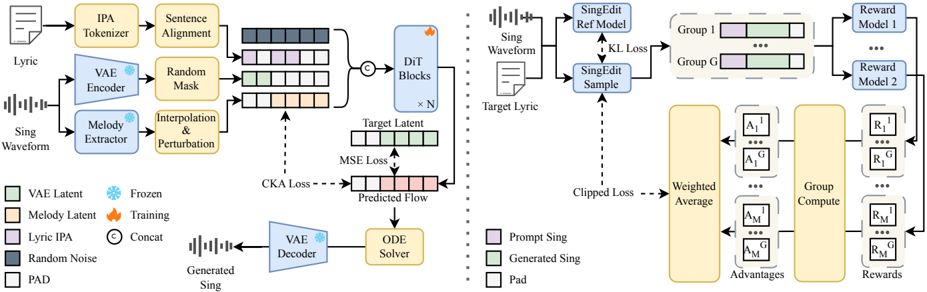

> [!abstract] arXiv · 2026 · Preprint
> **Chunbo Hao et al.** (Northwestern Polytechnical University (ASLP@NPU) / GiantNetwork AI Lab) · [→ Paper](https://arxiv.org/abs/2603.24589) · Demo: ✓ · Code: ✓
>
> Introduces a singing voice editing model that regenerates altered lyrics against a reference melody clip without manual lyric-to-melody alignment, and a matching benchmark for evaluating melody-preserving lyric edits.

## Problem

Singing voice editing, regenerating an existing singing voice with modified lyrics while preserving the original melodic and rhythmic structure, is useful for song adaptation, cover generation, rapid arrangement prototyping, and multilingual song localization, but existing approaches force a choice between two costly compromises. In-context learning approaches mask and regenerate only a local region conditioned on surrounding context, which restricts edits to local segments and gives limited melody control. The alternative, used in commercial tools such as Synthesizer V and ACE Studio, requires users to manually align modified lyrics with MIDI notes and durations before re-synthesis, a labor-intensive process that scales poorly, especially for cross-lingual edits. Recent alignment-free systems narrow this gap without closing it: Vevo2 supports melody-controllable generation but exhibits reduced intelligibility and unstable melody adherence, while SoulX-Singer accepts an existing recording as melody input but still requires manual word-level timestamp alignment.

## Method

YingMusic-Singer-Plus synthesizes 44.1 kHz stereo singing audio from three inputs: an optional timbre reference clip, a separate singing clip that supplies the target melody, and the corresponding modified lyrics, with no manual timestamp alignment required at inference. The system (described by the authors as "fully diffusion-based," though the generative mechanism is conditional flow matching, CFM) is built from four components. A Variational Autoencoder following Stable Audio 2 downsamples the stereo waveform by a factor of 2048 into a continuous latent sequence, replacing the mel-spectrogram representation used by the model's predecessor with a learned latent space that supports full-band stereo audio. A Melody Extractor, built on the encoder of a pretrained MIDI-extraction model (SOME), derives frame-level melody representations that are temporally interpolated to match the VAE latent frame rate. An IPA Tokenizer converts both Chinese and English lyrics into a unified discrete phoneme sequence; following DiffRhythm, each lyric sentence is placed at its corresponding onset frame within a padded frame-level sequence so the model can distinguish prompt from generation regions without user-supplied timestamps. A DiT-based CFM backbone following F5-TTS then takes the concatenation of the interpolated melody representation, the phoneme embedding sequence, and the unmasked (timbre-context) VAE latent as conditioning, and is trained to regress a velocity field toward the difference between the noised and clean latents.

Training follows a curriculum. A TTS Pretraining stage (no melody conditioning) first builds phoneme-level articulatory priors on speech data, mitigating the limited phoneme generalization that would otherwise result from the comparatively small and vocally diverse singing corpus. A Singing Voice Supervised Fine-Tuning (SFT) stage follows in two phases: Phase 1 enables sentence-level lyric alignment on singing data without melody conditioning, adapting the model to the singing domain; Phase 2 activates melody conditioning and adds a Centered Kernel Alignment (CKA) loss between the predicted velocity field and the melody representation, explicitly enforcing melody adherence via Gram-matrix similarity. Because Phase 2 improves melody adherence but degrades phoneme error rate, the authors then apply Group Relative Policy Optimization (GRPO): the deterministic ODE sampling trajectory is converted to a bounded-window stochastic (SDE) process to allow exploration, four equally weighted reward models score each of G=8 candidates per group, and advantages are computed from within-group reward statistics (removing the need for a value network, unlike PPO, and avoiding the distribution-shift problem of offline preference methods such as DPO). The GRPO training set is filtered from the SFT corpus for ASR-verified transcription accuracy, single-speaker diarization, and a DNSMOS quality threshold, yielding a curated set of roughly 20,000 clips balanced across Chinese and English.

The paper also introduces LyricEditBench, built from GTSinger by deduplicating audio, discarding paired-speech content, and using an LLM (DeepSeek-V3.2) to generate modified lyrics under six editing types (partial substitution, full substitution, deletion, insertion, cross-lingual translation, and code-mixing), discarding non-compliant LLM outputs and balancing the resulting 7,200 test instances by singer gender, language, singing technique, and modification type.

## Key Results

Against Vevo2, the token-based autoregressive baseline with disentangled timbre and melody control identified as the most comparable alignment-free alternative, YingMusic-Singer-Plus achieves lower phoneme error rate (PER) and higher F0 Pearson correlation (F0-CORR) and Vocal Score (VS) across all six LyricEditBench modification types, in both Chinese and English, under both a Melody Control setting (separate melody and timbre clips) and a Sing Edit setting (same clip for both). The intelligibility gap between the two systems is largest on the Translation and Code-Mixing tasks, where reconstructing a substantially different phoneme sequence while preserving the original melody is hardest for both systems; the paper notes PER on Code-Mixing may be additionally inflated by ASR transcription hallucinations on code-switched audio. Vevo2 achieves higher speaker similarity (SIM), which the authors attribute to its multi-stage design (a separate autoregressive stage for melody/content and a dedicated CFM stage for timbre reconstruction) versus YingMusic-Singer-Plus's single-stage CFM that jointly models timbre, content, and melody. Subjective evaluation (30 listeners rating 120 samples on Naturalness MOS and Melody MOS) mirrors the objective results: YingMusic-Singer-Plus scores higher on both dimensions in both languages and both settings, with Vevo2 receiving lower and higher-variance ratings alongside listener reports of unfaithful lyric rendering and melodic misalignment.

An ablation study isolates the contribution of each curriculum stage. TTS Pretraining alone gives near-zero F0-CORR (no melody capability) and poor PER when a singing clip is used as an in-context prompt. SFT Phase 1 achieves the lowest PER of any stage by adapting to the singing domain while freely generating melody from context. SFT Phase 2 raises F0-CORR above 0.9 by activating explicit melody conditioning, but PER rises as a direct consequence. GRPO recovers PER close to Phase-1 levels while further raising F0-CORR and VS, with SIM essentially unchanged, resolving the trade-off that supervised training alone could not. A separate ablation removing temporal dropout on the melody latent ("w/o Dist") causes severe PER degradation in both languages (for example, Chinese Melody-Control PER rises from 0.06 to 0.45), which the authors attribute to the undropped melody latent retaining residual semantic (lyric) information that the model exploits to bypass genuine lyric generation.

## Novelty Assessment

The core generative mechanism, DiT-based conditional flow matching following F5-TTS, is inherited rather than new, and the melody-extraction-plus-CKA-alignment idea is carried over from the model's own predecessor (YingMusic-Singer). The genuine contributions here are: (1) a streamlined three-input editing paradigm and IPA-based sentence-level alignment scheme that removes the manual word/timestamp alignment step that both the in-context-learning and commercial-tool baselines require, extended to melody-preserving lyric editing specifically rather than plain melody-conditioned synthesis; (2) replacing the predecessor's mel-spectrogram target with a VAE latent space following Stable Audio 2, moving the pipeline to full-band stereo audio; (3) adapting GRPO with a bounded stochastic sampling window and multiple jointly weighted reward models to resolve a PER/F0-CORR trade-off that curriculum supervised training alone left unresolved, an application of flow-based RL post-training (in the lineage of Flow-GRPO and MixGRPO) to the singing-editing setting specifically; and (4) LyricEditBench, a new benchmark filling a concrete gap, no prior benchmark isolates melody-preserving lyric modification under matched-melody conditions across six edit types. The paper does not ablate the VAE-latent-space change against the predecessor's mel-spectrogram approach in isolation, so how much of the overall improvement over prior YingMusic-Singer-style systems is attributable to the latent representation versus the GRPO stage cannot be determined from the reported ablations, which focus only on the curriculum and dropout components.

## Field Significance

Moderate — this paper combines a real (if incremental) architectural extension, an annotation-free three-input editing paradigm plus GRPO-based resolution of a lyric-fidelity/melody-adherence trade-off, with a new benchmark (LyricEditBench) that gives the singing-voice-editing subfield its first standardized, matched-melody evaluation protocol across six edit types and two languages. Its primary value going forward is as a benchmark and a demonstration that flow-based RL post-training can jointly improve intelligibility and melody metrics that supervised curriculum training alone trades off against each other, rather than as a new generative paradigm.

## Claims

- **supports:** Staging supervised training so that melody conditioning is introduced only after the model has adapted to a target synthesis domain resolves the trade-off between content fidelity and melody adherence better than training both objectives jointly from the outset.
  > *Evidence:* SFT Phase 1 (no melody conditioning) achieves the lowest phoneme error rate of any training stage by adapting to the singing domain; only when SFT Phase 2 activates melody conditioning does phoneme error rate rise as F0 correlation exceeds 0.9, showing the trade-off is introduced by melody conditioning specifically rather than by singing-domain adaptation. *(§4.2, Table 4)*
- **supports:** Reinforcement learning post-training with multiple jointly weighted reward models can recover a metric that a preceding supervised training stage degraded, while simultaneously improving on the metric that stage was optimizing for.
  > *Evidence:* GRPO applied after SFT Phase 2 lowers phoneme error rate back toward SFT-Phase-1 levels while further raising F0-CORR and Vocal Score above their SFT-Phase-2 values, with speaker similarity unchanged, and the resulting gains are corroborated by higher Naturalness and Melody MOS than the baseline in a separate listening test. *(§4.2, Table 4; §4.1, Table 3)*
- **complicates:** A melody representation extracted directly from a reference audio clip can retain enough residual semantic content to let a lyric-editing model reproduce the reference's original words rather than the intended edited lyrics, unless that leakage is explicitly suppressed.
  > *Evidence:* Removing temporal dropout applied to the melody latent (the "w/o Dist" ablation) causes phoneme error rate to increase roughly seven-fold on Chinese Melody Control (0.06 to 0.45), which the authors attribute to the undropped latent retaining residual lyric information that the model exploits instead of generating the modified lyrics. *(§4.2, Table 4)*
- **complicates:** A multi-stage design that separates an autoregressive content-and-melody generator from a dedicated timbre-reconstruction module can achieve higher speaker similarity than a single-stage model that jointly generates content, melody, and timbre, at the cost of intelligibility and melody adherence.
  > *Evidence:* Vevo2's autoregressive-plus-CFM multi-stage architecture attains higher SIM than YingMusic-Singer-Plus's single-stage CFM across all six LyricEditBench modification types and both languages, while trailing on phoneme error rate and F0 correlation on the same comparisons. *(§4.1, Table 2)*
- **complicates:** Benchmarks for melody-preserving lyric editing that rely on automated speech-recognition transcription for their intelligibility metric can have that metric inflated on code-switched or heavily rewritten content, independent of the synthesis system's actual pronunciation quality.
  > *Evidence:* The authors note that phoneme error rate on the Code-Mixing task "may be further inflated by ASR hallucinations on codeswitched utterances," and both evaluated systems show their largest intelligibility gap on the Code-Mixing and Translation tasks. *(§4.1)*

## Limitations and Open Questions

> [!warning]
> The subjective evaluation draws only 120 samples total across six modification types, two languages, and two editing settings (Melody Control and Sing Edit), roughly five samples per fine-grained cell, despite the objective LyricEditBench benchmark containing 7,200 instances. The reported Naturalness and Melody MOS comparisons should be read as a coarse corroboration of the objective results rather than a statistically robust per-condition subjective evaluation.

The paper does not isolate the contribution of its VAE-latent-space change (replacing the predecessor's mel-spectrogram target) from the effect of GRPO post-training, so the source of improvement over prior melody-conditioned singing synthesis cannot be fully attributed from the reported ablations. The GRPO reward models themselves are not detailed beyond their count and weighting scheme, and at least one component (Vocal Score, via VocalVerse2) is itself a learned, automated proxy for human perception rather than a direct human judgment, leaving open how much of the reward signal reflects genuine perceptual quality versus reward-model-specific artifacts, a risk the subjective evaluation only partially addresses given its small per-condition sample size. LyricEditBench's modified lyrics are generated by an LLM (DeepSeek-V3.2) with non-compliant outputs discarded, which could bias the benchmark toward edits the LLM finds easy to produce compliantly, rather than a fully representative sample of real-world lyric-editing requests.

## Wiki Connections

- [[singing|Singing]] — introduces an annotation-free singing voice editing paradigm and LyricEditBench, the first benchmark dedicated to melody-preserving lyric modification evaluation.
- [[flow-matching|Flow Matching]] — uses a DiT-based conditional flow matching backbone following F5-TTS, operating over a continuous VAE latent space rather than a discrete codec.
- [[zero-shot-tts|Zero-Shot TTS]] — conditions on an optional timbre reference clip via masked in-context generation, following the same unmasked-context paradigm used in F5-TTS-style zero-shot voice cloning.
- [[prosody-control|Prosody Control]] — introduces an explicit Melody Extractor and CKA alignment loss to enforce adherence to a reference melody's pitch and rhythmic contour independent of the lyric content being generated.
- [[rlhf-speech|RLHF Speech]] — applies Group Relative Policy Optimization with multiple jointly weighted reward models to resolve a phoneme-fidelity and melody-adherence trade-off left unresolved by supervised curriculum training.
- [[multilingual-tts|Multilingual TTS]] — trains and evaluates a unified IPA-based phoneme tokenizer and single model across Chinese and English, including cross-lingual translation and code-mixing lyric edits.
- [[2508.16332|Vevo2]] — is used as the primary baseline throughout, described as the most comparable alignment-free alternative for melody-controllable singing synthesis.
- [[2602.07803|SoulX-Singer]] — is cited as a recent alignment-free effort that still requires manual word-level timestamp alignment, a limitation this paper's editing paradigm avoids.
- [[2025.acl-long.313|F5-TTS]] — supplies the DiT-based conditional flow matching backbone architecture that this paper's synthesis module follows.
- [[2407.05361|Emilia]] — provides the Chinese and English speech data used for the model's TTS pretraining stage.
