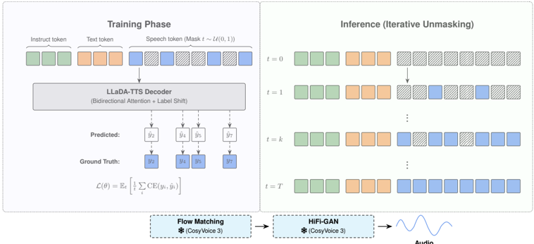

> [!abstract] arXiv · 2026 · Preprint
> **Xiaoyu Fan et al.** (Bairong, Inc.) · [→ Paper](https://arxiv.org/abs/2603.26364) · Demo: ✓ · Code: ?
>
> LLaDA-TTS replaces the autoregressive LLM stage in a pretrained LLM-based TTS pipeline with a masked discrete diffusion model, achieving parallel generation with step-count-independent cost and enabling zero-shot speech editing as a free byproduct of the bidirectional architecture.

## Problem

Autoregressive LLM-based TTS systems (e.g., VALL-E, Seed-TTS, CosyVoice) achieve strong naturalness and speaker fidelity but are fundamentally bottlenecked by sequential decoding: generating N speech tokens requires N forward passes, so latency grows linearly with output length. KV-cache mitigates this partially but does not eliminate the sequential dependency. Meanwhile, speech editing in AR systems requires either specialized training (as in VoiceCraft) or post-hoc stitching, since AR models cannot condition on future context. Prior non-autoregressive TTS approaches (e.g., MaskGCT) used heuristic MaskGIT-style training rather than a principled probabilistic objective, leaving a gap between non-AR methods and AR-quality results.

## Method

LLaDA-TTS modifies the token generation stage of an LLM-based TTS pipeline while leaving the speech tokenizer, prompt format, and flow matching vocoder entirely unchanged. The only structural changes are:

1. **Bidirectional attention.** The causal attention mask is replaced with full bidirectional attention, allowing every token position to attend to all others (only padding is masked).

2. **Label shift.** Following the Dream approach, hidden state i predicts token i+1 via a logit shift (ˆy_i = logits_{i-1}). This preserves the AR output projection convention, enabling direct weight transfer from a pretrained AR checkpoint without re-learning the decoder head.

3. **Masked diffusion objective.** For each training sample, masking rate t is sampled uniformly from U(0,1) and each target speech token is independently masked with probability t. The training loss is 1/t-weighted cross-entropy on masked positions only — the ELBO derivation from LLaDA (Nie et al., 2025), which upweights low-masking-rate steps where bidirectional context matters most.

The backbone is Qwen2-0.5B. All parameters are initialized from a pretrained CosyVoice 3 AR checkpoint, including the Transformer, speech embedding, and output projection; only the [MASK] token embedding is randomly initialized. Fine-tuning uses 6,000 hours of the Emilia multilingual dataset (58% Chinese, 42% English) on 7 x A100 GPUs.

**Inference** proceeds via Algorithm 1: start from a fully masked sequence, run T forward passes, and at each step unmask the top-K most confident positions using a confidence score (top-k margin: p1 - p2). Total cost is exactly T forward passes regardless of output length — for a 250-token utterance this replaces 250 sequential AR passes. Hyperparameters (temperature, top-p, confidence temperature) were tuned via 300 Optuna trials.

**Speech editing** requires no additional training. LLaDA-TTS's attention spontaneously develops monotonic text-to-speech alignment at specific layer-head pairs (L16-H2 and L11-H5). These heads are used to align text edits to speech token regions. The affected region is masked with a small context margin and regenerated via iterative unmasking with surrounding tokens frozen — the frozen prefix and suffix provide bidirectional conditioning throughout, producing coherent boundary transitions.

**Theoretical grounding.** The paper proves (Theorem 1) that under an ε-forward dependence assumption — that acoustic tokens at 25 Hz contain limited mutual information with future tokens given past context, motivated by 50-100 ms articulatory timescales — the optimal AR predictor is within ε KL divergence of the optimal bidirectional predictor at every diffusion step. This explains why AR initialization converges rapidly and why the emergent unmasking order is predominantly left-to-right.

## Key Results

On Seed-TTS-Eval (Table 1), LLaDA-TTS at 64 steps achieves:
- CER (zh): 0.98% vs. CosyVoice 3-0.5B baseline 1.21% — outperforms its own AR base model
- WER (en): 1.96% vs. CosyVoice 3 1.96% — matches baseline; competitive with VoxCPM at 1.85%
- CER (zh-hard): 7.04% vs. baseline 6.71% — near-equivalent on adversarial set
- Speaker similarity (WavLM cosine): 74.6% zh, 71.1% en — slightly below AR baselines (~77-79%)
- 2x LLM-stage speedup over the AR baseline at 64 steps; ~2.6x at 48 steps

Ablations (Table 2) isolate the contributions: training from scratch yields 45.27% CER (zh), AR init without label shift yields 1.45%, and full AR init + label shift yields 0.98%. The gap between scratch and AR-initialized directly validates the theoretical claim. At 96 steps, CER improves further to 0.74%.

The comparison is generally fair: all numbers use the same Seed-TTS-Eval benchmark and leaderboard baselines, though the speaker similarity numbers for LLaDA-TTS trail AR systems, suggesting a quality-speed tradeoff in speaker fidelity.

## Novelty Assessment

The core contribution is applying masked discrete diffusion (from the LLaDA/Dream NLP lineage) to TTS token generation, combined with a theoretically motivated justification for why AR-to-diffusion transfer works for speech specifically. This is primarily an adaptation contribution — the masked diffusion objective and label shift technique are imported from the NLP literature (LLaDA, Dream); the novelty lies in (a) the domain transfer argument, (b) the emergent zero-shot speech editing capability without additional training, and (c) the theoretical proof of ε-bounded AR suboptimality for acoustic tokens.

The zero-shot editing result is practically significant: it is a free byproduct of architecture design rather than a separately trained capability, in contrast to VoiceCraft which requires specialized training for editing. The emergent attention-based alignment (MAE = 1.29 tokens vs. 2.99 for proportional alignment) is an interesting empirical finding with no direct analogue in prior work.

The contribution is not primarily one of scale or data: fine-tuning uses only 6,000 hours (modest by 2025 standards) and the backbone is 0.5B parameters. The speaker similarity gap relative to AR baselines remains unaddressed.

## Field Significance

> [!tip]
> High — LLaDA-TTS demonstrates that the AR bottleneck in LLM-based TTS can be replaced with masked discrete diffusion while preserving generation quality, providing a practical and theoretically grounded transfer pathway. The emergent zero-shot editing capability without additional training is a concrete functional gain that distinguishes this approach from prior non-autoregressive TTS work, and the ε-forward dependence theorem provides a reusable framework for reasoning about AR-to-diffusion transfer in speech generation.

## Claims

- Replacing the causal attention mask with bidirectional masked diffusion in an LLM-based TTS system enables inference cost to be decoupled from output length while maintaining competitive transcription accuracy. *(§4.2, Table 1)*
- Initializing a masked diffusion model from a pretrained autoregressive checkpoint, combined with label shift, dramatically outperforms training from scratch for discrete speech token prediction. *(§4.4, Table 2)*
- The temporal locality of acoustic tokens (limited mutual information between adjacent frames at 25 Hz) provides a formal bound on the suboptimality of AR predictors in bidirectional masked prediction tasks. *(§3.3)*
- Bidirectional attention in a masked diffusion TTS model enables zero-shot speech editing via selective re-masking without additional training, producing coherent transitions that condition on both prefix and suffix context. *(§3.5, §4.6)*
- Non-autoregressive discrete diffusion TTS systems exhibit a speaker similarity gap relative to AR baselines, indicating a residual quality-efficiency tradeoff in fine-grained speaker identity preservation. *(§4.2, Table 1)*

## Limitations and Open Questions

1. **Output length must be specified in advance** using a token-text ratio heuristic. The AR baseline predicts EOS implicitly; LLaDA-TTS lacks this capability.
2. **Non-streaming.** The bidirectional attention prevents the prefix-priority streaming used in CosyVoice 2 and later systems. The authors mention prefix-priority unmasking as future work.
3. **Speaker similarity gap.** LLaDA-TTS trails AR baselines on SPK-SIM (74.6% vs. 77-79%), suggesting bidirectional architecture may be less effective at preserving fine-grained speaker identity.
4. **Speech editing evaluated qualitatively.** The editing section does not include full Table results in the paper.md extract; quantitative editing benchmarks are noted but complete numbers are absent from the main text.
5. **Backbone limited to 0.5B.** Scaling behavior to larger models is unvalidated.
6. **Theoretical assumptions.** The ε-forward dependence assumption, while physically motivated, is not empirically validated against actual token mutual information measurements.

## Wiki Connections

This paper advances [[autoregressive-codec-tts]] by demonstrating that the AR LLM stage can be replaced with masked discrete diffusion while preserving generation quality, and introduces a principled training pathway for this transition. It connects to [[diffusion-tts]] through the masked discrete diffusion objective (absorbing-state ELBO from LLaDA/MDLM), though the architecture is a Transformer rather than a U-Net. The [[neural-codec]] concept is central: the entire approach depends on discrete speech tokens produced by a supervised tokenizer; the codec's temporal locality (25 Hz frame rate, ε-forward dependence) is the physical basis for Theorem 1.

The [[zero-shot-tts]] capability is inherited from the CosyVoice 3 prompt format and preserved through fine-tuning; LLaDA-TTS does not weaken zero-shot performance. The zero-shot speech editing pipeline connects to voice editing work including [[voice-conversion]]. The step-count/quality tradeoff and the potential for [[streaming-tts]] via prefix-priority unmasking are noted as open directions.

In-corpus cited papers: [[2406.02430|Seed-TTS]] (the evaluation benchmark), [[2301.02111|VALL-E]] (the AR TTS foundation), [[2407.05407|CosyVoice]], [[2412.10117|CosyVoice 2]], [[2025.acl-long.313|F5-TTS]] (a flow-matching baseline in Table 1), [[2511.05516|Ming-UniAudio]] (editing comparison).
