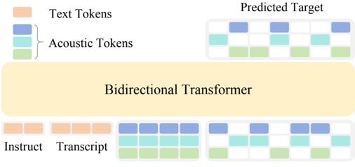

> [!abstract] arXiv · 2026 · Preprint
> **Han Zhu et al.** (Xiaomi Corp.) · [→ Paper](https://arxiv.org/abs/2604.00688) · Demo: ? · Code: ✓
>
> OmniVoice is a single-stage discrete NAR TTS model covering 600+ languages that resolves the intelligibility bottleneck of prior single-stage NAR systems via full-codebook random masking and LLM weight initialization, achieving state-of-the-art speaker similarity and competitive WER against autoregressive systems on English and Chinese benchmarks.

## Problem

Existing zero-shot TTS systems support at most a few dozen languages, leaving hundreds of low-resource languages without coverage. Scaling to 600+ languages requires a TTS architecture robust to highly diverse linguistic patterns and large data imbalances. Prior discrete NAR TTS systems relied on two-stage (text→semantic→acoustic) pipelines that introduce error propagation and information bottlenecks, while single-stage discrete NAR alternatives exhibited poor intelligibility (high WER). Continuous NAR systems (e.g., flow matching) are computationally expensive at scale and have had limited multilingual extension. There was no single open-source model combining zero-shot voice cloning with truly omnilingual coverage.

## Method

OmniVoice is a single-stage discrete non-autoregressive (NAR) TTS model built on a diffusion language model-style architecture. It directly maps text to multi-codebook acoustic tokens using a bidirectional Transformer, bypassing the two-stage pipeline.

**Architecture.** The input is a concatenated sequence of instruction/transcript tokens (Y) and an acoustic token matrix X ∈ R^{T×C} (8 codebooks from the Higgs-audio tokenizer). The prompt segment is prepended as context; the target segment has tokens randomly masked. A bidirectional Transformer with C independent codebook-specific prediction heads predicts masked tokens. Loss is computed only on masked positions.

**Full-codebook random masking.** Prior methods (SoundStorm, MaskGCT) use per-layer masking: one codebook is selected per sample, and loss is computed only for that layer, optimizing a sparse subset of the token matrix. OmniVoice samples a binary mask independently for every entry in the T×C matrix (Bernoulli with p_t ~ U(0,1)), computing loss on approximately 50% of tokens on average — C times denser than single-layer methods. Ablation (Table 5) confirms this gives WER 1.57 vs 2.04–3.00 for single-codebook baselines on LibriSpeech-PC.

**LLM initialization.** The backbone is initialized with Qwen3-0.6B weights. Although the original model uses causal attention, empirically the pre-trained linguistic knowledge transfers well to the bidirectional setting. This resolves the intelligibility issue in single-stage NAR TTS: LLM init achieves WER 1.57 vs 2.52–2.79 for random-init baselines even with extensive learning rate tuning (Table 6).

**Multilingual scaling.** 581K hours of training data is aggregated from 50 open-source datasets spanning 600+ languages. To address data imbalance, a repetition factor based on (D_max/D_i)^(1−β) with β=0.8 upsamples low-resource languages while preserving high-resource quality. Subword tokenization from the LLM is reused, eliminating language-specific g2p pipelines.

**Controllability extensions.** Prompt denoising (trained with augmented noisy prompts + special instruction token) allows clean synthesis from degraded prompts. Speaker attribute-based voice design and phonetic override (Pinyin/CMU pronunciation) are also supported.

**Inference.** 32 iterative unmasking steps using a time-shifted schedule. Classifier-free guidance (scale 2) in log-softmax space. Temperature 5 for position sampling. Layer penalty encourages unmasking lower codebooks first. RTF 0.0319 with 16 steps on H20 GPU.

## Key Results

On LibriSpeech-PC test-clean, OmniVoice-Emilia (100K training hours) surpasses all NAR baselines trained on the same data: SIM-o 0.697 vs F5-TTS 0.655, ZipVoice 0.668, MaskGCT 0.691; WER 1.57 vs MaskGCT 2.26 and F5-TTS 1.89. The full multilingual OmniVoice further improves to SIM-o 0.729, WER 1.30, UTMOS 4.28 — competitive with AR systems trained on much larger proprietary data (Qwen3-TTS: 5M hours, CosyVoice3: 1M hours).

On Seed-TTS: SIM-o 0.741/0.777 (en/zh), WER 1.60/0.84. Subjective CMOS +0.44 (best among compared models, including Qwen3-TTS +0.40), SMOS 3.80.

On MiniMax-Multilingual-24: average WER 2.85 and SIM-o 0.830, outperforming MiniMax-Speech (WER 3.77, SIM-o 0.766) and ElevenLabs Multilingual v2 (WER 10.95, SIM-o 0.655).

On FLEURS-Multilingual-102: average CER 4.00% (vs ground truth 5.11%), SIM-o 0.788. OmniVoice achieves CER ≤5% for 82/102 languages and maintains high intelligibility even for languages with <10 hours of training data.

RTF 0.0319 with 16 steps, outperforming ZipVoice RTF 0.0557 at same step count.

## Novelty Assessment

The key technical novelties are the full-codebook random masking strategy and LLM initialization for NAR TTS. Both are conceptually simple but empirically significant: the former resolves training efficiency at the cost of no additional complexity; the latter resolves the long-standing intelligibility gap in single-stage NAR TTS. The scale (600+ languages, 581K hours of open-source data) is also a major contribution. The architecture family — discrete masked diffusion applied to multi-codebook speech tokens — extends the MDLM/DREAM line of diffusion LMs to speech. The claim of first NAR TTS model to successfully use LLM initialization is well-supported by the ablation. The overall contribution is primarily methodological simplification + scaling.

## Field Significance

> [!tip]
> High — OmniVoice demonstrates that single-stage discrete NAR architectures can match or exceed autoregressive systems in intelligibility and speaker similarity when initialized from a pre-trained LLM, closing a gap that previously favoured two-stage pipelines. Its 581K-hour open-source multilingual corpus and 600+ language coverage set a new scale benchmark for zero-shot TTS, providing a fully reproducible baseline for massively multilingual speech generation research.

## Claims

- Initializing a discrete NAR TTS backbone with pre-trained LLM weights substantially improves speech intelligibility over random initialization, regardless of learning rate tuning. *(§2.1.2, Table 6)*
- Dense loss computation across all codebook layers simultaneously (full-codebook random masking) outperforms per-layer sparse masking strategies in both intelligibility and speaker similarity for multi-codebook NAR TTS. *(§2.1.1, Table 5)*
- A single-stage discrete NAR TTS model trained on sufficient open-source multilingual data can match commercial multilingual systems on intelligibility and speaker similarity across 24 languages, without access to proprietary data. *(§4.2, Table 3)*
- Zero-shot TTS systems can maintain intelligibility (CER below 5%) for languages with fewer than 10 hours of training data, given sufficient multilingual co-training at scale. *(§4.2, Table 4, Figure 4)*
- Prompt denoising training improves naturalness of output speech (UTMOS 4.23 to 4.32) at a modest cost to speaker similarity when prompts are clean (SIM-o 0.697 to 0.668). *(§4.3, Table 7)*

## Limitations and Open Questions

- Inference acceleration: unlike continuous NAR models (where flow distillation can reduce steps), no comparable acceleration exists for discrete NAR — acknowledged as a future work direction.
- ASR tool limitations: Cantonese WER appears inflated due to Whisper ASR quality; re-evaluation with SenseVoice-Small yields WER 2.27% (much lower).
- Annotation quality in the 581K-hour corpus is heterogeneous (many datasets not originally TTS-targeted).
- Instruction-following capabilities are bounded by the diversity of instruction-tuning data available.
- No evaluation on singing or paralinguistic tasks.

## Wiki Connections

- [[2406.02430|Seed-TTS]] and [[2412.10117|CosyVoice 2]] are the primary AR system baselines used for comparison across English and Chinese benchmarks.
- [[2506.21619|IndexTTS2]] and [[2601.15621|Qwen3-TTS]] are additional AR comparisons; OmniVoice achieves competitive results with a fraction of the training data.
- [[2601.03888|IndexTTS 2.5]] is cited among multilingual AR baselines.
- [[2025.acl-long.313|F5-TTS]], [[2506.13053|ZipVoice]], and [[2409.00750|MaskGCT]] are the direct NAR baselines trained on the same Emilia corpus.
- [[2512.14291|GLM-TTS]] represents prior discrete NAR approaches in the two-stage pipeline category that OmniVoice's single-stage design replaces.
- [[2510.12210|DiStar]] and [[2507.09318|ZipVoice-Dialog]] are related outputs from overlapping authors.
- [[2508.05385]] is cited for paralinguistic control via non-verbal speech.
- The full-codebook masking approach contrasts with MaskGCT's per-layer strategy; both relate to the [[diffusion-tts]] concept page.
- The 600+ language coverage extends the frontier described on the [[multilingual-tts]] concept page.
- The Higgs-audio 8-codebook tokenizer is relevant to the [[neural-codec]] concept page.
