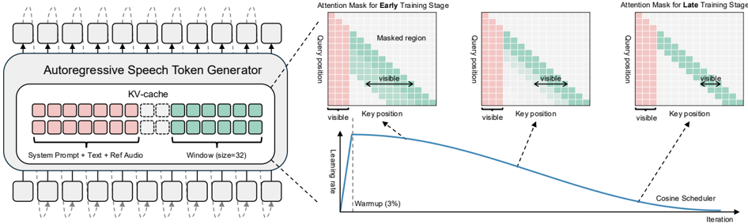

> [!abstract] arXiv · 2026 · Preprint
> **Hanna Lee et al.** (KAIST, Sungkyunkwan University) · [→ Paper](https://arxiv.org/abs/2604.08558) · Demo: ? · Code: ?
>
> Adapts pretrained decoder-only autoregressive TTS models to run with constant, length-independent KV cache and compute by splitting attention into persistent global attention over conditioning tokens and a bounded sliding window over generated acoustic tokens.

## Problem

Decoder-only autoregressive TTS (AR-TTS) models built on LLM backbones produce high-fidelity, zero-shot speech but rely on full self-attention over the entire generated token history. Because the KV cache and compute both grow linearly (and attention cost quadratically) with sequence length, these models cannot sustain constant-latency, bounded-memory inference for long utterances. Prior efficiency work either reduces model depth (leaving the quadratic attention pattern intact), switches to linear-time architectures such as gated linear attention or Mamba (which require training from scratch and often trail AR-TTS quality), or accelerates decoding via speculative decoding (which still performs full self-attention). None of these directly targets the growing KV cache of a pretrained, already-deployed AR-TTS model.

## Method

WAND (Windowed Attention and Knowledge Distillation) starts from the observation that AR-TTS conditioning inputs (system prompt, target text, and a reference audio prompt encoding speaker style) provide most of the semantic and acoustic context needed for generation, while previously generated acoustic tokens mainly need to preserve local temporal consistency. Based on this, WAND splits attention into two components: persistent Global Attention over the fixed conditioning prefix, and Local Sliding-Window Attention that restricts each generated token's receptive field over prior generated tokens to a fixed window size W. This bifurcation bounds the KV cache to a constant size (a fixed global component plus a rolling window), giving O(1) memory and compute per decoding step instead of the O(L) growth of full attention.

Naively truncating attention to a local window during fine-tuning degrades content consistency, so WAND trains with two complementary mechanisms. First, a curriculum schedule progressively narrows the effective window size from a larger starting value down to the target W following a cosine schedule, paired with a temperature-controlled soft mask that gradually hardens the truncation boundary rather than applying it abruptly. Second, a knowledge-distillation objective combines a cross-entropy loss against ground-truth acoustic tokens with a Skew KL-divergence loss that matches the student's (windowed) token distribution to a full-attention teacher's distribution over the same historical context. WAND requires no architectural modification to the base model and no training from scratch: it fine-tunes existing pretrained AR-TTS checkpoints (CosyVoice 2-0.5B, IndexTTS 1.5, SparkTTS-0.5B), using window sizes of W=32 for the two 25 Hz-token-rate models and W=64 for the 50 Hz-token-rate SparkTTS, for a single epoch on 100 hours of English speech (LibriTTS train-clean-100).

## Key Results

Across all three backbones (differing in LLM backbone, codec design, and token rate), WAND reduces KV cache size by up to 66.2% (IndexTTS 1.5: 38.44 MB → 13.01 MB at 10-second generation, fp32) and cumulative GFLOPs by up to 46.9%, yielding 1.51x-1.89x decoding speedups, while per-step latency stays near-constant with sequence length instead of growing as in full attention. Quality is preserved or slightly improved: on Seed-TTS-eval test-en, CosyVoice 2's WER improves from 1.94% to 1.72% and UTMOS from 4.18 to 4.21, while IndexTTS 1.5 and SparkTTS show WER/UTMOS within a few hundredths of baseline. Despite fine-tuning only on English data, cross-lingual quality on test-zh is preserved, with CER degrading by at most 0.1% absolute for CosyVoice 2 and IndexTTS 1.5. Ablations isolate the contributions of the two training mechanisms: removing distillation raises WER from 1.72% to 3.40% for CosyVoice 2, and removing the curriculum (training directly at W=32) raises WER from 1.72% to 1.86% for CosyVoice 2 and from 0.91% to 1.03% for IndexTTS 1.5.

## Novelty Assessment

WAND's individual ingredients (sliding-window attention, attention sinks over a persistent prefix, and cross-entropy plus KL-divergence distillation) are each drawn from prior work in text LLM efficiency. The paper's contribution is combining and adapting these specifically for AR-TTS: identifying that conditioning tokens versus generated acoustic tokens play structurally different roles in AR-TTS decoding, and packaging that observation into a training recipe (curriculum window narrowing plus dual-loss distillation) that lets a pretrained AR-TTS checkpoint be converted into a constant-memory decoder with high data efficiency (100 hours, one epoch) rather than requiring architecture changes or training from scratch. The contribution is best characterized as an adaptation/training-recipe innovation applied to an existing efficiency technique, validated with a genuine cross-architecture study (three backbones spanning different codecs and token rates) rather than a single case study.

## Field Significance

moderate — WAND demonstrates that quadratic-memory AR-TTS decoding can be converted to constant-memory decoding post hoc, via lightweight fine-tuning, without retraining from scratch or modifying model architecture. Its main contribution beyond its own numbers is the empirical finding, replicated across three architecturally distinct AR-TTS systems, that conditioning-prefix attention and a bounded local window jointly capture 85-91% of a full-attention model's attention mass, which grounds the design choice in measured attention behavior rather than assumption alone.

## Claims

- **supports:** Splitting decoder attention into a persistent global component over conditioning tokens and a bounded local sliding window over generated tokens can convert an autoregressive TTS decoder from linear to constant memory and compute scaling without degrading synthesis quality.
  > *Evidence:* Up to 66.2% KV cache reduction (IndexTTS 1.5: 38.44 MB to 13.01 MB) and up to 46.9% GFLOPs reduction across three backbones, with WER either within 0.2% of baseline or improved (CosyVoice 2: 1.94% to 1.72%). *(§4.1, §4.2, Table 1)*
- **supports:** Knowledge distillation from a full-attention teacher recovers content-consistency loss that occurs when a pretrained autoregressive TTS model's attention is abruptly restricted to a local window.
  > *Evidence:* Ablation removing distillation raises WER from 1.72% to 3.40% for CosyVoice 2 and from 0.91% to 3.81% for SparkTTS, with the combined cross-entropy plus KL-divergence loss outperforming either loss alone across all three backbones. *(§4.5, Table 4)*
- **supports:** Progressively narrowing the attention window during fine-tuning (curriculum learning) stabilizes adaptation to a restricted attention pattern better than training directly at the target window size.
  > *Evidence:* Curriculum training (window narrowed from 128 to target W) reduces WER from 1.86% to 1.72% for CosyVoice 2 and from 1.03% to 0.91% for IndexTTS 1.5, relative to direct training at the target window. *(§4.5, Table 5)*
- **complicates:** An autoregressive TTS model's attention restriction learned via fine-tuning on one language can generalize to a language absent from fine-tuning data, since most language-dependent context is carried by the conditioning prefix rather than the local decode window.
  > *Evidence:* Fine-tuning uses only 100 hours of English data (LibriTTS train-clean-100), yet CER on the Mandarin Seed-TTS-eval test-zh set degrades by at most 0.1% absolute for CosyVoice 2 and IndexTTS 1.5. *(§4.3, Table 3)*
- **complicates:** The optimal local attention window size for windowed-attention adaptation depends on the underlying codec's token rate, with higher-frame-rate codecs requiring proportionally wider windows to retain comparable attention coverage.
  > *Evidence:* SparkTTS, whose codec runs at 50 Hz (versus 25 Hz for CosyVoice 2 and IndexTTS 1.5), allocates a larger share of attention to the decode region (52.1% vs. 35.4-41.5%) and requires W=64 rather than W=32 to reach comparable attention coverage. *(§4.4, Table 2)*

## Limitations and Open Questions

> [!warning] The paper's own evaluation is limited to 10-second generations on the Seed-TTS-eval benchmark; the claim that WAND "paves the way for continuous, infinitely long audio generation" is a theoretical extrapolation from the bounded-memory argument, not an empirically measured result on long-form (minutes-scale) synthesis.

WAND is not training-free: it requires access to a full-attention teacher checkpoint of the same base model and an additional fine-tuning pass with distillation, rather than being applied purely at inference time. The target window size W (32 for CosyVoice 2 and IndexTTS 1.5, 64 for SparkTTS) is set per architecture based on measured attention-pattern analysis rather than derived from a general formula, so applying WAND to a new AR-TTS backbone would require repeating this analysis. All three evaluated backbones are 0.5B-parameter models; the paper does not report whether the technique holds at larger model scales.

## Wiki Connections

- [[autoregressive-codec-tts|Autoregressive Codec TTS]] — proposes an attention-restriction and distillation recipe specifically for converting pretrained decoder-only AR-TTS codec models to constant-memory inference.
- [[zero-shot-tts|Zero-Shot TTS]] — preserves the zero-shot voice-cloning capability of its three baseline systems (via reference-audio speaker conditioning) while restricting decoder attention.
- [[neural-codec|Neural Audio Codec]] — validates generality across three different codec designs (FSQ, VQ, BiCodec) and token rates (25 Hz, 50 Hz) as part of its cross-architecture study.
- [[subjective-evaluation|Subjective Evaluation]] — reports Naturalness MOS listening tests with 10 raters and 50 samples per model to corroborate objective quality preservation.
- [[2503.01710|SparkTTS]] — one of three pretrained AR-TTS backbones WAND is fine-tuned onto, using its BiCodec at 50 Hz token rate.
- [[2502.05512|IndexTTS 1.5]] — one of three pretrained AR-TTS backbones WAND is fine-tuned onto, achieving the paper's largest reported KV cache reduction (66.2%).
- [[2412.10117|CosyVoice 2]] — one of three pretrained AR-TTS backbones WAND is fine-tuned onto; used for the paper's headline WER improvement result.
- [[2301.02111|VALL-E]] — cited as foundational evidence that LLM-backbone AR-TTS models achieve strong zero-shot speaker generalization, motivating why their inference efficiency matters.
- [[2406.02430|Seed-TTS]] — source of the Seed-TTS-eval benchmark (test-en, test-zh) used for all of WAND's quality evaluations.
- [[1904.02882|LibriTTS]] — the train-clean-100 subset supplies the 100 hours of fine-tuning data used to adapt all three AR-TTS backbones.
