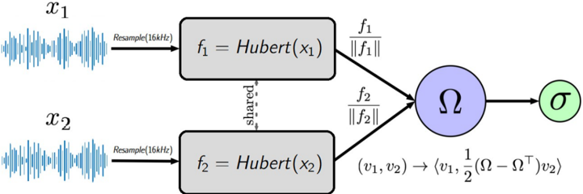
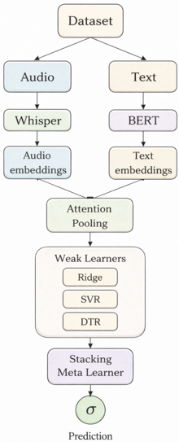

> [!abstract] arXiv · 2026 · Preprint
> **Ilya Trofimenko et al.** · [→ Paper](https://arxiv.org/abs/2604.08562) · Demo: ? · Code: ?
>
> Proposes a suite of neural evaluators for text-to-speech quality, including a pairwise (side-by-side) preference model and several absolute MOS predictors, and reports that naive multimodal fusion and zero-shot LLM evaluators underperform dedicated regression architectures.

## Problem

Human subjective evaluation of TTS quality, via Mean Opinion Score (MOS) panels and side-by-side (SBS) preference tests, remains the gold standard for judging perceived naturalness, but it is slow, expensive, and vulnerable to rater-scale heterogeneity. Classical objective measures (PESQ, STOI, Mel-cepstral distortion) are cheap but correlate only weakly with human perception. Automatic MOS prediction has advanced substantially with SSL-based systems such as UTMOS, but automated pairwise preference prediction for synthesized speech has been largely unexplored, unlike in computer vision where dedicated side-by-side predictors already exist. The paper also probes whether general-purpose multimodal LLMs can substitute for dedicated evaluators in either the absolute or relative setting.

## Method

The paper addresses both relative (SBS) and absolute (MOS) automated TTS evaluation with a suite of purpose-built neural models, using the SOMOS dataset (20,000 clips from 200 synthesis systems, 360,000 raw MOS ratings) as the training and evaluation substrate. To reduce rater-scale bias, ratings are standardized per rater via a collaborative-filtering-style z-score transform and rescaled to [1, 5], producing "Std SOMOS" targets alongside the original SOMOS scores; 90,000 SBS pairs are generated from the 20,000 clips with a 70/30 train/test split that avoids text leakage.

For relative evaluation, NeuralSBS encodes each of two candidate clips with a shared 12-layer HuBERT encoder (pretrained on 960h of English speech), temporally averages the frame embeddings into utterance-level vectors, and combines them through a learnable antisymmetric bilinear layer (s = zᵀaWzb − zᵀbWza, p̂ = σ(s)) that enforces the logical constraint g(xa, xb) = 1 − g(xb, xa) by construction. NeuralSBSBert extends this with BERT text features fused via cross-attention (audio embeddings as queries, text tokens as keys/values).

For absolute evaluation, the paper first re-engineers the classic MOSNet architecture (1D-CNNs + BLSTM) with length-sorted batching to reduce padding, explicit masking of padded frames in the loss, sequence-level rather than frame-level MSE, and added Dropout/BatchNorm regularization. A multimodal variant, MOSNetBert, again adds BERT text features via cross-attention. The best-performing absolute predictor, WhisperBert, is a stacking ensemble: 512-dimensional temporal embeddings from Whisper (base.en) via attention pooling and global [CLS] embeddings from BERT (bert-base-uncased) are concatenated (not cross-attended) and passed to a diverse panel of weak learners (Ridge Regression, Support Vector Regression, Decision Tree Regressor), whose outputs are combined by a 2-layer MLP meta-learner to produce the final MOS score.

The paper additionally reports a negative result: a more elaborate SpeechLM-based architecture (SpeechLMMosTTS) that fuses SpeechLM audio features and BERT text via multi-head attention and a Transformer encoder, classified into five MOS categories through gated residual blocks, collapsed to predicting the dataset-wide mean despite 233 hyperparameter search runs. The paper also evaluates zero-shot LLM evaluators (Qwen2-Audio-7B-Instruct, Gemini 2.5 Flash Preview) as SBS/MOS judges via structured prompting, without any task-specific training.

## Key Results

On SOMOS, NeuralSBS reaches 73.7% SBS accuracy and 0.816 AUC-ROC, versus 72.7% accuracy and 0.804 AUC-ROC for the text-augmented NeuralSBSBert; both metrics drop slightly on the standardized Std SOMOS set (Table 1). For absolute MOS prediction, WhisperBert attains an RMSE of 0.457 on SOMOS and 0.402 on Std SOMOS, improving on the enhanced MOSNet (0.491 / 0.422) and MOSNetBert (0.547 / 0.496), and comfortably below the paper's reported human inter-rater RMSE baseline of 0.62 (Table 2). An ablation of the MOSNet training recipe shows Dropout+BatchNorm reducing RMSE from 0.531 to 0.491 and length-sorted batching to 0.496, while a weighted class sampler degrades RMSE to 0.546 (Table 3). Removing BERT from WhisperBert or swapping the Whisper encoder for larger variants (large, turbo) did not improve any WhisperBert metric (§4.2.2). Against UTMOS as an external reference, WhisperBert achieves a lower MSE (0.161 vs. 0.242) but substantially lower correlation (LCC 0.565 vs. 0.842; SRCC 0.373 vs. 0.809), a complementary profile the paper frames as ranking (UTMOS) versus absolute threshold gating (WhisperBert) (Table 5). On a controlled clean-vs-distorted discrimination subset, the dedicated models reach 99.8% accuracy, while Qwen2-Audio reaches only 31.25% MOS accuracy and 76.00% SBS accuracy, and Gemini 2.5 Flash Preview performs acceptably on SBS but poorly on MOS regression (§4.3).

## Novelty Assessment

The primary architectural contribution is NeuralSBS, which adapts an antisymmetric bilinear preference-scoring layer previously used for image super-resolution evaluation to speech, paired with a HuBERT encoder; this appears to be the first dedicated learned SBS predictor for synthesized speech reported in the paper's own review of the literature. WhisperBert's contribution is more of a training-recipe and integration choice: it is a fairly standard stacking ensemble over pre-trained encoders, but the paper's controlled comparison of cross-attention fusion versus late-stage stacking fusion, run consistently across three separate model pairs (NeuralSBS/NeuralSBSBert, MOSNet/MOSNetBert, and the WhisperBert ablation), is a genuine empirical contribution: cross-attention degraded performance in every comparison, while stacking improved it. The negative results on the SpeechLM-based architecture and on zero-shot LLM evaluators are reported honestly as failures rather than omitted, which is a useful data point even though the underlying methods (prompting off-the-shelf multimodal LLMs) are not novel.

## Field Significance

moderate — This paper contributes a working, purpose-built architecture for automated SBS preference prediction, a task the paper's own literature review identifies as underexplored for speech relative to absolute MOS prediction, and provides a systematic within-paper comparison showing that naive cross-attention fusion of text and audio features consistently underperforms late-stage ensemble stacking across three separate model pairs. It also documents concrete failure modes, a SpeechLM-based deep fusion architecture collapsing to the dataset mean despite extensive hyperparameter search, and zero-shot multimodal LLM evaluators falling well short of dedicated regression models even on an elementary clean-vs-distorted discrimination task.

## Claims

- **supports:** A learned antisymmetric bilinear scoring layer over self-supervised audio embeddings can predict pairwise human preference between synthesized speech clips at an accuracy approaching human inter-rater agreement.
  > *Evidence:* NeuralSBS, built on a 12-layer HuBERT encoder with an antisymmetric bilinear pooling layer, reaches 73.7% accuracy and 0.816 AUC-ROC on SOMOS SBS pairs. *(§3.3, §4.1, Table 1)*
- **complicates:** Naively fusing text features into an audio-based quality predictor via cross-attention can degrade rather than improve prediction accuracy.
  > *Evidence:* Adding BERT text features via cross-attention lowers SBS accuracy from 73.7% to 72.7% (NeuralSBS vs. NeuralSBSBert) and raises MOS RMSE from 0.491 to 0.547 on SOMOS (MOSNet vs. MOSNetBert). *(§4.1, §4.2, Table 1, Table 2)*
- **refines:** Multimodal fusion of text and audio for TTS quality prediction can still help, but only when combined late through an ensemble rather than through direct latent cross-attention.
  > *Evidence:* WhisperBert, which concatenates Whisper audio and BERT text embeddings and combines them via a stacked-learner meta-model rather than cross-attention, achieves a lower RMSE (0.457 on SOMOS) than audio-only or cross-attention variants, and removing its BERT branch degrades all reported metrics. *(§3.4, §4.2.2, Table 2, Table 4)*
- **complicates:** Rater-specific scale bias in MOS labels measurably limits the accuracy attainable by automatic quality predictors, and standardizing per-rater scores before training improves that ceiling.
  > *Evidence:* Rescaling SOMOS ratings via a per-rater z-score standardization (Std SOMOS) consistently reduces MOS RMSE across all evaluated models, e.g. WhisperBert improves from 0.457 to 0.402 RMSE. *(§3.1, §4.2, Table 2)*
- **contradicts:** General-purpose multimodal LLMs used zero-shot are not yet reliable substitutes for dedicated, trained regression architectures on fine-grained TTS quality assessment tasks.
  > *Evidence:* On a controlled clean-vs-distorted discrimination subset where the paper's own dedicated models reach 99.8% accuracy, Qwen2-Audio-7B-Instruct reaches only 31.25% MOS accuracy and 76.00% SBS accuracy, and Gemini 2.5 Flash Preview shows poorly calibrated MOS regression. *(§4.3)*

## Limitations and Open Questions

> [!warning] All experiments are conducted on a single dataset (SOMOS, English-only) with a single family of synthesis systems; the paper explicitly defers cross-lingual evaluation (particularly Russian) to future work, so generalization to other languages or newer TTS system families is untested.

The SpeechLM-based fusion architecture (SpeechLMMosTTS) failed to train productively despite 233 hyperparameter search runs, collapsing to the dataset mean; the paper attributes this to jointly optimizing a deep fusion module over a comparatively small labeled dataset, but does not rule out other causes such as architecture-specific instability. The comparison against UTMOS is limited to a single external baseline and shows WhisperBert trailing substantially on correlation metrics (LCC, SRCC), which the paper reframes as a difference in intended use case (absolute thresholding vs. ranking) rather than resolving directly. Model sizes, training compute, and code/demo availability are not reported in the parsed text.

## Wiki Connections

- [[evaluation-metrics|Evaluation Metrics]] — introduces a dedicated pairwise (SBS) preference predictor and refines absolute MOS predictors, directly extending the automatic-TTS-evaluation toolkit alongside established metrics like UTMOS.
- [[subjective-evaluation|Subjective Evaluation]] — targets human MOS and side-by-side judgments as the ground truth its neural predictors are trained to approximate, and explicitly measures against a human inter-rater RMSE baseline.
- [[self-supervised-speech|Self-Supervised Speech]] — NeuralSBS's core architecture depends on a pretrained HuBERT encoder for utterance embeddings, and WhisperBert relies on Whisper's pretrained audio representations.
