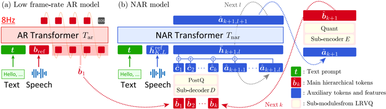

> [!abstract] ICLR · 2025 · Conference
> **Nishimura et al.** (The University of Tokyo / Institute of Science Tokyo) · [→ Paper](https://openreview.net/forum?id=868masI331) · Demo: ✓ · Code: ✓
>
> HALL-E addresses the long-form speech generation bottleneck in autoregressive codec TTS by introducing Multi-Resolution Requantization (MReQ), a post-training framework that reduces the codec frame rate from 48 Hz to 8 Hz via hierarchical distillation, enabling stable single-inference synthesis of up to three minutes of speech.

## Problem

Autoregressive TTS models in the VALL-E family operate by predicting discrete codec tokens at the frame rate of the first RVQ layer. At typical rates of 48-75 Hz, generating even 30 seconds of speech approaches or exceeds practical context window limits, and training instability compounds as target lengths grow. Simply reducing the codec frame rate degrades audio quality and pronunciation severely: the paper's preliminary experiments show that naive Encodec retraining at 8 Hz results in a WER of 100% and PESQ of 1.22, rendering such an approach unusable. Prior work explored grouped code modeling and monotonic alignment as workarounds, but did not provide a general post-training approach to decouple frame rate from codec fidelity.

## Method

MReQ (Multi-Resolution Requantization) replaces the first RVQ layer of a pre-trained codec with a multi-resolution residual vector quantization (MRVQ) module while freezing the encoder and decoder weights. MRVQ is a nested structure of Low Frame-Rate RVQ (LRVQ) blocks arranged in a residual hierarchy: each block downsamples the latent sequence, applies a main quantizer at a lower frame rate, then upsamples back. For Encodec, four LRVQ blocks are stacked, with first-block frame rates of 8, 16, 24, and 48 Hz respectively. Training uses teacher-student distillation: the frozen pre-trained RVQ serves as the teacher, providing target embeddings that the MRVQ student learns to match via a feature-level distillation (FLD) loss and a hidden-state reconstruction (HSR) loss alongside the standard NAC reconstruction objective. This post-training procedure leaves the encoder-decoder architecture unchanged and is model-agnostic with respect to the underlying codec.

HALL-E follows the VALL-E AR+NAR decomposition but replaces vanilla RVQ tokens with the hierarchical MRVQ tokens. The AR model generates 8 Hz token sequences using a delay pattern (borrowed from MusicGen), keeping sequence lengths manageable even for 90-second targets. The NAR model predicts progressively higher frame-rate token sequences by leveraging the frozen MRVQ sub-modules: it decodes from the previous block's main quantizer output, runs a transformer decoder, then re-encodes through the next block's sub-encoder and main quantizer. A key departure from VALL-E's NAR is the use of cross-attention for text conditioning rather than sequence concatenation, which allows the model to handle the full training audio length without explicit text-audio alignment. Both AR and NAR components are post-trained from a VALL-E checkpoint, preserving the knowledge embedded in the pre-trained language model.

The paper also introduces MinutesSpeech, a new dataset of 40k hours of automatically filtered podcast speech covering durations from 3 to 180 seconds, with professionally transcribed test sets at 90-second and 180-second caps. The training set design explicitly balances audio length distribution to enable stable training across short and long utterances simultaneously.

## Key Results

On MinutesSpeech test-90s, HALL-E (trained on train-90s) achieves WER 9.79% compared to VALL-E's 16.14% (train-90s), while matching ground truth WER of 10.3%. DNSMOS for HALL-E (3.91) is comparable to GT (3.79), and subjective naturalness (QMOS 3.35 vs. 2.48) and speaker similarity (SMOS 3.15 vs. 2.36) both improve substantially. VALL-E trained on train-28s fails entirely at long-form synthesis (WER 39.77%). On test-180s, HALL-E achieves WER 10.53% vs. VALL-E's best of 21.71%.

On LibriSpeech test-clean (short speech up to 35 seconds), HALL-E maintains WER below 5% regardless of whether it is trained on 90s or 180s data. VALL-E trained on train-180s collapses on LibriSpeech (WER 95.46%), demonstrating that higher frame-rate AR training becomes unstable when forced to accommodate long sequences. HALL-E generates audio approximately 3.4 times faster than VALL-E at inference, because the 8 Hz AR step handles one-sixth the tokens of a 48 Hz model.

Applying MReQ to SpeechTokenizer rather than Encodec further improves WER to 9.12% and DNSMOS to 3.95 on test-90s, suggesting that linguistically-oriented codecs benefit more from frame-rate reduction. Speaker similarity (SIM) is the one metric where HALL-E consistently trails VALL-E (0.685 vs. 0.712 on test-90s), reflecting the acoustic information trade-off inherent in aggressive frame-rate compression.

Ablation shows that both FLD and HSR losses contribute to MReQ quality, with HSR being more critical for reconstruction metrics and FLD important for naturalness and WD. Removing pre-training from the VALL-E checkpoint collapses HALL-E's WER to 49.8%. The hierarchical (8, 16, 24, 48 Hz) upsampling structure outperforms simpler two-step (8, 48 Hz) upsampling, which also exhibits training divergence.

## Novelty Assessment

The core insight is clean and useful: the frame rate bottleneck in autoregressive codec TTS can be addressed at the codec level rather than the LM level, using post-training distillation that preserves the original encoder-decoder. This avoids the alternative of redesigning the LM architecture or retraining from scratch. The MRVQ module is a genuine architectural novelty, though it draws on established ideas (RVQ hierarchies, teacher-student distillation, sub-encoder/decoder pairs from time-series compression). The HALL-E LM itself is a competent post-training adaptation of VALL-E rather than a fundamentally new architecture: the AR model changes are minor (delayed token format); the NAR cross-attention substitution for text conditioning is the only structural departure, and the paper acknowledges that Small-E pursues this idea more rigorously.

The MinutesSpeech dataset is a genuine contribution: 40k hours of length-balanced, professionally transcribed podcast speech fills a real gap. The absence of comparable long-form TTS benchmarks had previously made it difficult to compare systems at the 90-180 second scale.

The evaluation is generally fair, though comparisons against non-AR baselines are limited to a MaskGCT analysis in the appendix, and no comparison against streaming or chunked-synthesis approaches is provided. The speaker similarity trade-off at 8 Hz is acknowledged but not resolved.

## Field Significance

Moderate — HALL-E introduces a practical and general post-training pathway for adapting any RVQ-based neural codec to a lower frame rate without retraining the codec encoder-decoder, enabling autoregressive TTS models to generate long-form speech within a fixed context window. The simultaneous release of MinutesSpeech provides a benchmark that the field previously lacked for evaluating synthesis beyond 30 seconds, which can serve as a reference point for future long-form TTS research.

## Claims

- **supports:** Reducing the first-layer RVQ frame rate of a neural audio codec through hierarchical multi-resolution distillation enables autoregressive TTS to generate minute-long speech with stable intelligibility.
  > *Evidence:* MReQ-Encodec at 8 Hz achieves WER 9.79% on MinutesSpeech test-90s where standard Encodec at 8 Hz produces 100% WER and naive VALL-E at 48 Hz with long training data yields 16.14%. *(§4, §7.3, Table 3, Table 4)*

- **complicates:** Lowering the codec frame rate in autoregressive TTS improves temporal coherence and intelligibility for long utterances but degrades speaker similarity.
  > *Evidence:* HALL-E consistently lags VALL-E by 0.025-0.042 SIM points on MinutesSpeech tests; the paper attributes this to acoustic information loss when compressing from 48 Hz to 8 Hz in the first RVQ layer. *(§7.3, Table 4, Table 6)*

- **supports:** Post-training from a pre-trained LM checkpoint is essential for hierarchical codec TTS: training from scratch without pre-trained weights collapses quality.
  > *Evidence:* Removing VALL-E pre-training from HALL-E increases WER from 9.79% to 49.8% on MinutesSpeech test-90s, and removing MReQ pre-training similarly degrades codec reconstruction. *(§7.4, Table 10)*

- **refines:** The frame rate at which autoregressive speech token generation becomes unstable is approximately 8 Hz, consistent with average phoneme durations of around 100 ms.
  > *Evidence:* Ablation at 4 Hz first-layer rate raises WER to 20.07%, while 8 Hz yields 9.79%; the paper notes that phoneme duration averaging ~100 ms corresponds to ~10 Hz, making 4 Hz fundamentally insufficient. *(Appendix C.1, Table 18)*

- **supports:** Length-balanced training data covering the target synthesis duration is necessary for autoregressive models to generalize to long-form speech.
  > *Evidence:* VALL-E trained only on segments up to 28 seconds achieves WER 39.77% on test-90s, and training on longer data decreases but does not eliminate the gap; HALL-E's 8 Hz formulation resolves instability that remains even with longer VALL-E training data. *(§7.3, Table 4)*

## Limitations and Open Questions

> [!warning]
> Speaker similarity consistently degrades with frame rate reduction: HALL-E's SIM scores are 0.025-0.042 lower than VALL-E across test conditions. This reflects a fundamental trade-off between temporal compression and acoustic fidelity preservation that the paper does not resolve.

The current NAR model processes audio at full 48 Hz resolution, which limits NAR input length to around 28-54 seconds during training and requires a sliding window at inference. Integrating cross-attention text conditioning addresses alignment but does not eliminate the NAR length bottleneck. The paper also does not compare against streaming or chunked autoregressive synthesis approaches, which represent a practical alternative. MinutesSpeech training data consists entirely of English podcast speech, and generalization to other languages, domains, or reading styles is untested.

## Wiki Connections

- [[autoregressive-codec-tts|Autoregressive Codec TTS]] — HALL-E extends the VALL-E AR+NAR framework to long-form synthesis by introducing a hierarchical codec that operates at 8 Hz in the AR stage.
- [[neural-codec|Neural Audio Codec]] — MReQ contributes a post-training method for adapting any RVQ-based codec to a lower frame rate without retraining the encoder-decoder, demonstrated on Encodec and SpeechTokenizer.
- [[zero-shot-tts|Zero-Shot TTS]] — HALL-E performs zero-shot speaker cloning using a 3-second audio prompt, showing that lower frame-rate AR generation can preserve the core zero-shot capability while extending to minute-long utterances.
- [[spoken-language-model|Spoken Language Model]] — HALL-E is a hierarchical codec language model, and the paper notes that its 8 Hz AR formulation could benefit larger speech LM architectures that require extended context.
- [[evaluation-metrics|Evaluation Metrics]] — the paper employs WER, SIM (WavLM-TDNN), DNSMOS, UTMOS, and Wasserstein distance over duration distributions, using the latter to quantify long-form temporal coherence not captured by standard short-form metrics.
- [[2301.02111]] (VALL-E) — HALL-E post-trains directly from a VALL-E checkpoint and uses the VALL-E AR+NAR architecture as its starting point, extending it to handle hierarchical multi-resolution tokens and cross-attention text conditioning.
- [[2406.02430]] (Seed-TTS) — cited as a reference for zero-shot TTS capabilities and the limitation of zero-shot cloning relative to speaker fine-tuning at long prompts.
