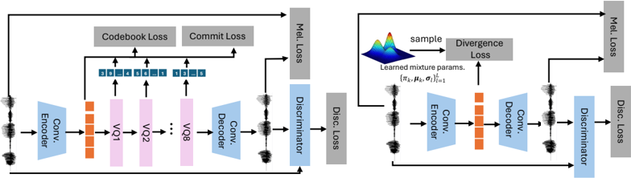

> [!abstract] ICLR · 2025 · Conference
> **Lin et al.** (The Hong Kong Polytechnic University) · [→ Paper](https://openreview.net/forum?id=cuFzE8Jlvb) · Demo: ✓ · Code: ?
>
> A continuous autoregressive TTS model that replaces residual vector quantization with a Gaussian Mixture Model VAE, enabling a simpler single-stage architecture that outperforms VALL-E on intelligibility and naturalness with only 10% of its parameter count.

## Problem

Autoregressive TTS models have relied on residual vector quantization (RVQ) to discretise speech before applying language model training. RVQ introduces several compounding problems: codebooks require prohibitively large sizes to capture fine-grained acoustic detail, quantisation error causes mispronunciations and artefacts, codebook under-utilisation degrades training stability via the straight-through estimator, and handling multiple RVQ codebooks forces either a costly flat sequence expansion or a complex multi-stage AR-plus-NAR architecture (as in VALL-E). The question this paper investigates is whether quantisation is a necessary step at all, or whether a continuous latent space can serve as the basis for autoregressive speech generation without the associated penalties.

## Method

The system has three components: GMM-VAE, GMM-LM, and stochastic monotonic alignment.

GMM-VAE replaces the VQ bottleneck of a standard neural codec with a Gaussian Mixture Model prior. Rather than learning discrete codebook assignments, the encoder maps speech to a deterministic latent vector and regularises it against a learned GMM prior via a KL divergence term. Mel-spectrogram reconstruction loss and GAN-based discriminators are used during training, matching the setup of DAC (Kumar et al., 2024), but with all quantisation layers removed. The GMM-VAE encodes speech at the same temporal resolution and outputs continuous encoder features that the downstream AR model operates on. The full VAE has 76.5M parameters.

GMM-LM is a Conformer encoder-decoder that performs autoregressive generation over continuous latent frames. At each time step, instead of predicting a discrete token via softmax, the decoder outputs the parameters of a Gaussian Mixture (weights, means, diagonal variances) over the next continuous frame, trained with negative log-likelihood. Because there is no discrete vocabulary, no embedding layer or token softmax is needed. A linear classifier predicts the stop token. Four model sizes are explored: 51.5M (Mini), 101M, 170M, and 315M (Large). The text encoder processes phoneme sequences; the acoustic decoder generates the continuous latent sequence conditioned on text and an audio prompt for zero-shot voice cloning.

The stochastic monotonic alignment module forces strictly monotonic attention between text and acoustic frames. Building on standard monotonic attention (Raffel et al., 2017), the soft alignment probability $p_{i,j}$ is replaced during the forward pass with a binary sample drawn from a Bernoulli distribution, ensuring every alignment step is strictly monotonic. Gradients are propagated through a Gumbel-Softmax relaxation (straight-through variant), with temperature annealed toward zero during training. This avoids the bias introduced by pre-sigmoid Gaussian noise used in prior monotonic attention approaches.

At inference, a text prompt generates phoneme features via the encoder; the decoder autoregressively samples from the GMM at each step, producing a continuous latent sequence that the GMM-VAE decoder converts to a waveform.

Training data: LibriLight (60k hours of unlabelled audiobook speech), with transcriptions produced by Whisper V2. A class-balanced speaker sampler was used during GMM-LM training. GMM-VAE was trained on 8 GPUs for 1,000k steps; GMM-LM for 200k steps, both with scheduler-free AdamW.

## Key Results

On LibriSpeech test-clean with a 3-second prompt, GMM-LM-Mini (51.5M params) achieves WER 2.83%, speaker similarity 0.80, S-MOS 3.84, and Q-MOS 4.11. VALL-E scores WER 6.04%, SIM 0.73, S-MOS 3.65, Q-MOS 3.54 under the same conditions. GMM-LM-Mini thus outperforms VALL-E in all four metrics while using roughly one-tenth of the parameters (Table 1, Table 2).

Against non-AR baselines (StyleTTS2 at 142M params, HierSpeech++ at 97M params), GMM-LM-Mini achieves lower WER (2.83% vs. 3.32% and 3.45%) and higher Q-MOS (4.11 vs. 3.82 and 3.71) with the 3-second prompt condition. Speaker similarity is also higher (0.80 vs. 0.70 and 0.71). The Large model (315M) shows an additional gain primarily in speaker-related metrics (SIM 0.85–0.91 vs. Mini's 0.80–0.81) rather than in WER or Q-MOS (Table 2).

A key finding from the scaling ablation (§5.1) is that extending the audio prompt from 3 to 15 seconds consistently improves GMM-LM speaker similarity and S-MOS, while VALL-E's WER worsens with longer prompts (rising to 9.68% at 15 seconds), suggesting its cross-attention alignment degrades on longer context.

GMM-VAE outperforms Encodec on reconstruction quality: Mel Distance 1.13 vs. 1.47, ViSQOL 3.96 vs. 3.41, SI-SDR 8.89 vs. 5.66. With teacher forcing, GMM-LM reconstruction Mel Distance (1.82) substantially beats VALL-E teacher forcing (2.26) (Table 3).

GMM-LM produces significantly more diverse samples than VALL-E, StyleTTS2, and HierSpeech++ as rated by human listeners, with a diversity score of 3.42 (6-mixture diagonal) vs. 1.47 for VALL-E and 0.3–0.6 for the non-AR models (Table 5).

## Novelty Assessment

The core novelty is the substitution of RVQ with a GMM-constrained continuous VAE as the speech representation stage for autoregressive generation. This is a genuine conceptual contribution: the observation that the discreteness assumed by prior AR TTS work is not architecturally necessary — that a continuous multimodal latent space can serve the same role as a codebook-defined categorical distribution — was not demonstrated before this paper in the TTS context. The approach directly parallels GIVT (Tschannen et al., 2024) for images, and the authors acknowledge that connection, so the transfer from vision to speech is part of the contribution.

The stochastic monotonic alignment is an incremental improvement over prior monotonic attention work (Raffel et al., 2017; He et al., 2019). Replacing soft sigmoid probabilities with Bernoulli-sampled binary alignments during the forward pass, with Gumbel-Softmax relaxation for gradients, is technically clean and the ablation in Appendix A.1 and A.6 shows meaningful WER gains, but this is an engineering refinement rather than a paradigm shift.

A limitation of the evaluation design is that VALL-E is the primary AR baseline; more recent and stronger AR models (e.g., VALL-E 2, VoiceCraft) are not included. The non-AR baselines (StyleTTS2, HierSpeech++) are strong but not the current frontier. The comparison thus establishes the viability of continuous AR generation rather than a definitive superiority claim.

## Field Significance

Moderate — this paper provides a proof of concept that autoregressive TTS does not require discrete codebook representations, demonstrating that a continuous GMM latent space can yield competitive or better zero-shot TTS at significantly reduced model size. The finding has implications for simplifying the training pipeline of codec-language-model TTS systems, but the evaluation scope (a single prior AR baseline, audiobook domain, English only) limits how broadly the claims can be extrapolated. The monotonic alignment module addresses a known pain point in autoregressive TTS and can serve as a drop-in improvement for encoder-decoder AR architectures.

## Claims

- supports: Continuous latent representations can replace discrete vector quantization in autoregressive TTS without sacrificing generation quality.
  Evidence: GMM-LM trained on continuous GMM-VAE encoder features outperforms VALL-E (RVQ-based) on WER, speaker similarity, Q-MOS, and S-MOS on LibriSpeech test-clean across all prompt lengths, while using 10.3% of VALL-E's parameter count. *(§5.1, Table 1, Table 2)*

- complicates: Longer audio prompts do not uniformly improve zero-shot speaker cloning across AR architectures.
  Evidence: VALL-E's WER increases monotonically with prompt length (6.04% at 3s, 7.54% at 8s, 9.68% at 15s), suggesting that simple cross-attention cannot leverage extended speaker context in AR decoding; the proposed GMM-LM shows the opposite trend, consistently benefiting from longer prompts. *(§5.1, Table 2)*

- supports: Strict monotonic alignment substantially reduces word error rate in autoregressive TTS compared to standard cross-attention and soft monotonic variants.
  Evidence: Among alignment strategies tested on the same GMM-LM architecture, stochastic monotonic alignment with ST-Gumbel achieves WER 2.72% vs. 6.6% for cross-attention alone; even monotonic attention with Gumbel (without the stochastic binary forward pass) scores 3.34%. *(Appendix A.1, Table 6)*

- supports: Continuous speech representations improve downstream autoregressive model performance relative to discrete counterparts, independent of the alignment mechanism.
  Evidence: A head-to-head ablation comparing GMM-LM (continuous) against discrete AR models (VQ-VAE single codebook and DAC multi-codebook with delayed prediction), all using the proposed monotonic alignment, shows GMM-LM achieves WER 2.72% vs. 5.35% and 5.87% for the discrete variants. *(Appendix A.6, Table 10)*

- complicates: Increasing the number of Gaussian components in continuous AR modeling yields diminishing returns and can reduce quality through overfitting.
  Evidence: GMM-LM with 6 diagonal-covariance Gaussians (WER 2.72%, SIM 0.91) outperforms 3-Gaussian (WER 2.89%, SIM 0.85), but 10-Gaussian degrades to WER 5.21%, SIM 0.71; the 6-mixture GMM-VAE also shows worse evaluation-set reconstruction than the 3-mixture model despite better training-set fit. *(§5.4, Table 4, Table 5, Appendix A.3)*

## Limitations and Open Questions

> [!warning]
> The evaluation compares against VALL-E (2023), a dated AR baseline. Stronger AR systems published by the time of this paper's submission are not included, limiting the strength of the superiority claim for continuous AR over discrete AR in general.

The model is evaluated exclusively on English audiobook speech (LibriLight training, LibriSpeech evaluation). Generalisation to conversational speech, noisy in-the-wild data, or other languages is not demonstrated, though noise robustness experiments (Appendix A.4) show the method degrades gracefully under additive noise in prompts.

The GMM-VAE introduces an additional 76.5M-parameter component, partially offsetting the parameter savings claimed relative to VALL-E's RVQ codec (which uses 16.7M codec-related params). The total system size (GMM-VAE + GMM-LM-Mini) is 76.5M + 51.5M = 128M, larger than the headline 51.5M figure.

The stochastic monotonic alignment requires sequential per-step alignment computation (Algorithm 1), which may limit training throughput compared to fully parallelisable attention. The paper does not report training wall-clock times or throughput comparisons.

Code and pre-trained models are planned for release but were not available at submission time.

## Wiki Connections

- [[autoregressive-codec-tts|Autoregressive Codec TTS]] — this paper proposes an alternative to codec-based AR TTS that operates on continuous GMM latent frames instead of discrete RVQ tokens, challenging the assumption that discretisation is necessary.
- [[zero-shot-tts|Zero-Shot TTS]] — the GMM-LM conditions on an audio prompt at inference time to clone a target speaker in a zero-shot setting, achieving higher speaker similarity than VALL-E with shorter prompts.
- [[neural-codec|Neural Audio Codec]] — the GMM-VAE serves the same role as a neural codec (compress-then-generate pipeline) but replaces the quantisation bottleneck with a GMM KL regulariser and continuous latent space.
- [[speaker-adaptation|Speaker Adaptation]] — zero-shot voice cloning is performed by conditioning the decoder on a speech prompt; experiments show that speaker similarity improves consistently with longer prompts (3s to 15s), unlike VALL-E.
- [[evaluation-metrics|Evaluation Metrics]] — results are reported on WER (wav2vec2-large transcription), speaker similarity (WeSpeaker embeddings), Q-MOS, S-MOS (20 listeners, 40 samples per model), and sample diversity (human rating), providing a multi-dimensional view of system quality.
- [[2301.02111]] (VALL-E) — the primary AR baseline throughout; the paper directly targets VALL-E's architecture and parameter budget, demonstrating that continuous AR outperforms it on all reported metrics.
