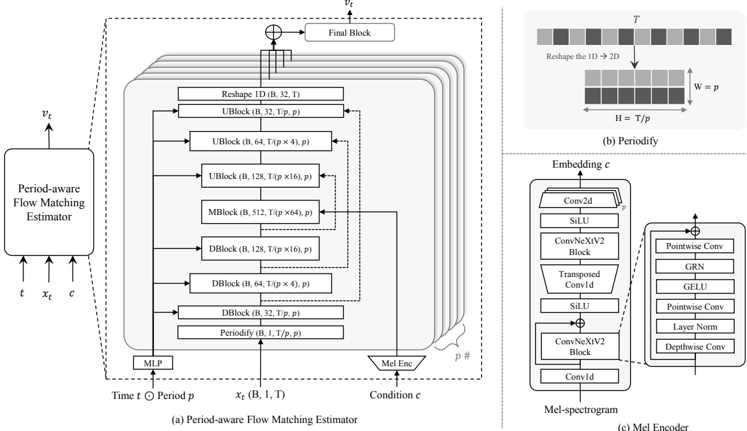

> [!abstract] ICLR · 2025 · Conference
> **Lee et al.** · [→ Paper](https://openreview.net/forum?id=tQ1PmLfPBL) · Demo: ✓ · Code: ✓
>
> PeriodWave introduces the first flow-matching neural vocoder with an explicit multi-period architecture, achieving better pitch accuracy and periodicity than GAN-based vocoders while training in a fraction of the time.

## Problem

Neural vocoders based on GANs generate waveforms in a single step but are vulnerable to train-inference mismatch: when an acoustic model produces slightly noisy or imperfect Mel-spectrograms, GAN vocoders generate metallic or hissing artefacts because they cannot iteratively refine their output. Diffusion-based vocoders offer iterative refinement but are too slow for practical use and struggle to reproduce high-frequency content. A further gap across all existing architectures is that no generator is explicitly designed to capture the periodic structure of waveform signals, leaving pitch accuracy and periodicity metrics as persistent weak points.

## Method

PeriodWave applies conditional flow matching (CFM) with an optimal-transport path directly to raw waveform samples. The core component is a period-aware UNet estimator that processes the waveform by reshaping it into multiple 2D representations at different periods. Specifically, a 1D waveform of length T is reshaped into a 2D tensor of height T/p and width p for each period p in the set [1, 2, 3, 5, 7], chosen as prime numbers to avoid overlapping harmonics. Each period path runs through its own 2D convolution down/upsampling blocks with ResNet layers, and a period embedding conditions the estimator on the specific period being processed. Outputs from all period paths are summed before a final block estimates the vector field.

Mel-spectrogram conditioning is injected at the middle UNet layer of each period path via a ConvNeXt V2 encoder. To boost inference throughput, period-wise batch inference processes all five period paths simultaneously as a batch dimension, reducing latency by approximately 60%. A data-dependent energy-based prior (scaled to 0.5) replaces the standard Gaussian and improves both sample quality and convergence speed.

The multi-band variant (PeriodWave-MB) extends this with discrete wavelet transform (DWT) decomposition into four frequency bands [0-3, 3-6, 6-9, 9-12 kHz], each modelled by a separate flow-matching estimator. Lower bands are generated first and concatenated as conditioning for higher bands. Both variants also incorporate FreeU, which scales down skip-connection features and scales up backbone features in the UNet, reducing the accumulation of high-frequency noise during the early ODE steps (optimal hyperparameters: alpha=0.9, beta=1.1). ODE integration uses the Midpoint method with 16 steps by default; 4 steps achieve comparable performance to 50-step diffusion baselines. Total training time is three days on four A100 GPUs versus three or more weeks for GAN baselines.

## Key Results

On LJSpeech, PeriodWave+FreeU (1M training steps, 29.73M parameters) achieves PESQ 4.293 and UTMOS 4.3578, surpassing BigVGAN (PESQ 4.210, UTMOS 4.2172) which was trained for 5M steps with 112.4M parameters. Pitch error of 15.75 cents versus BigVGAN's 19.02 cents confirms the period-aware design's advantage on pitch-related metrics (Table 1).

On LibriTTS, PeriodWave-MB reaches MOS 3.95 versus BigVGAN's 3.92, while substantially reducing pitch error (16.83 versus 25.65 cents) and periodicity error (0.0704 versus 0.1018) (Table 2). The fast training trajectory is notable: the model trained to only 0.15M steps already matches or exceeds baseline GAN models trained for 1M or more steps (Table 3).

In a zero-shot TTS evaluation using ARDiT-TTS Mel-spectrograms (500 samples), PeriodWave+FreeU achieves MOS 4.07 versus BigVGAN 4.03, directly addressing the train-inference mismatch problem that one-step GAN vocoders suffer in two-stage systems (Table 9).

On out-of-distribution music samples (MUSDB18-HQ), PeriodWave-MB scores SMOS 3.63 average across all instrument tracks, compared to BigVGAN's 3.56, with especially large gains on bass content (Table 6).

For codec decoding from Mimi tokens (Q=8, 12.5 Hz), PeriodWave with 2-step parallel generation reduces CER from 3.07% (Mimi decoder) to 2.5% and improves UTMOS from 3.51 to 3.83 (Table 10). A streaming generation mode using a single-token delay achieves near-identical quality to parallel generation (Table 11).

CFM versus DDPM ablation shows CFM with 6 steps (UTMOS 3.628) outperforms DDPM with 50 steps (UTMOS 3.377) on the same architecture (Table 8).

## Novelty Assessment

The primary novelty is the combination of conditional flow matching with an explicit multi-period generator structure for waveform synthesis. The period-aware UNet that processes reshaped waveforms at multiple prime-number periods is a structural innovation without direct precedent in vocoder design, extending the multi-period discriminator idea from HiFi-GAN's training objective into the generator architecture itself. Applying flow matching to raw waveforms rather than latents is also claimed as a first, and the paper provides careful engineering to make this work (scaled noise, energy-based prior, FreeU adaptation).

The contribution is genuinely architectural rather than a simple application of existing components: the period-wise batch inference mechanism and the DWT-based multi-band decomposition with hierarchical generation are additional practical innovations. That said, each individual element (flow matching, UNet structure, FreeU, DWT) is borrowed from prior work; the novelty lies in their coherent integration into a waveform-domain model. Comparisons are generally fair, using publicly available checkpoints, though the BigVGAN baselines were trained on larger datasets (LJSpeech+VCTK+LibriTTS) versus PeriodWave trained on LJSpeech alone for the LJSpeech evaluation.

## Field Significance

> [!tip]
> High — PeriodWave demonstrates that flow-matching objectives can replace GAN discriminators in neural vocoders without sacrificing single-step generation quality, and with notable advantages in pitch accuracy and resistance to train-inference mismatch. Its period-aware generator structure provides a template for explicitly encoding waveform periodicity into the model architecture. The Mimi codec decoding experiments extend its applicability to speech language model decoding, demonstrating that the same architecture can serve as a high-quality token-to-waveform converter with streaming capability.

## Claims

- supports: Flow matching enables higher-quality waveform generation than diffusion with fewer inference steps.
  Evidence: PeriodWave with CFM and 6 steps achieves UTMOS 3.628 versus PeriodWave with DDPM at 50 steps achieving UTMOS 3.377 on LibriTTS; the CFM model also reaches comparable quality to 50-step DDPM at only 16 steps. *(§4.6, Table 8)*

- supports: Explicit multi-period decomposition in the generator architecture improves pitch accuracy and periodicity over GAN and diffusion vocoders.
  Evidence: PeriodWave achieves pitch error of 15.04 cents and periodicity 0.0744 on LJSpeech, substantially below BigVGAN (19.02 cents, 0.0782) and all diffusion baselines; ablation shows monotonic improvement as more distinct prime-number periods are added. *(§4.2, §4.6, Table 1, Table 7)*

- complicates: Single-step GAN vocoders achieve significantly faster inference than iterative flow-matching vocoders.
  Evidence: PeriodWave at 16 steps runs at 7.48× real-time; HiFi-GAN runs at 166.70× real-time; even PeriodWave at 2 steps (56.36×) is slower than HiFi-GAN, though it already outperforms HiFi-GAN on all quality metrics. *(§E, Table 15, Table 16)*

- supports: Iterative waveform generation reduces train-inference mismatch artefacts in two-stage TTS relative to one-step GAN vocoders.
  Evidence: In zero-shot TTS with ARDiT-TTS acoustic features, PeriodWave+FreeU achieves MOS 4.07 versus BigVGAN's 4.03 and BigVSAN's 3.99; the iterative refinement allows the vocoder to correct imperfections in generated Mel-spectrograms rather than propagating them. *(§4.7, Table 9, §G)*

- supports: Flow-matching vocoders can decode neural codec tokens with streaming generation and minimal quality degradation.
  Evidence: PeriodWave trained for parallel generation from Mimi (Q=8) tokens achieves CER 2.5% versus Mimi decoder's 3.07%; streaming with single-token delay and 2-step sampling maintains comparable quality (CER 2.45%, UTMOS 3.85 versus parallel 3.93). *(§5, Table 10, Table 11)*

## Limitations and Open Questions

> [!warning]
> Synthesis speed is the principal limitation: at 16 steps, PeriodWave runs at 7.48× real-time, substantially slower than one-step GAN vocoders (HiFi-GAN: 166×, BigVGAN: 38×). For latency-sensitive applications, the 2-step variant (56×) is practical but still 3× slower than HiFi-GAN.

High-frequency reproduction remains challenging even with multi-band modeling and FreeU. The single-loss (CFM objective only) training means the model lacks the spectral feedback that GAN discriminators provide, and M-STFT metrics are generally worse than GAN baselines despite better perceptual scores. The authors plan to incorporate short-time Fourier convolution blocks or modified spectral objectives to address this.

The codec streaming mode uses a non-causal architecture with a one-token look-ahead, which introduces a small latency penalty. In-context streaming generation for longer sequences is identified as future work. Evaluation is confined to English speech and music; generalisation to other languages, accents, and audio domains remains untested in this paper.

## Wiki Connections

- [[flow-matching|Flow Matching]] — PeriodWave is the first neural vocoder to apply conditional flow matching with an optimal-transport path directly to raw waveform samples, establishing that the CFM objective can replace GAN discriminators for this task.
- [[gan-vocoder|GAN Vocoder]] — PeriodWave directly compares against HiFi-GAN, BigVGAN, BigVSAN, Vocos, and UnivNet, demonstrating that a flow-matching approach trained with a single loss function matches or exceeds GAN quality while training in one-third the time.
- [[neural-codec|Neural Audio Codec]] — The paper demonstrates PeriodWave as an alternative decoder for Mimi (Moshi's codec), showing that a flow-matching vocoder can substantially improve audio quality when decoding low-bitrate (Q=8) codec tokens.
- [[streaming-tts|Streaming TTS]] — PeriodWave introduces a streaming generation framework using single-token delay and parallel-trained non-autoregressive decoding, enabling real-time waveform synthesis from codec token streams.
- [[spoken-language-model|Spoken Language Model]] — The codec decoding experiments target the waveform synthesis stage of speech language models, showing that PeriodWave can serve as a high-quality audio backend for systems like Moshi.
- [[2301.02111]] (VALL-E, neural codec language models) — cited as a key motivating example of codec-based zero-shot TTS systems that require high-quality token-to-waveform decoding, establishing the application context for PeriodWave's codec experiments.
