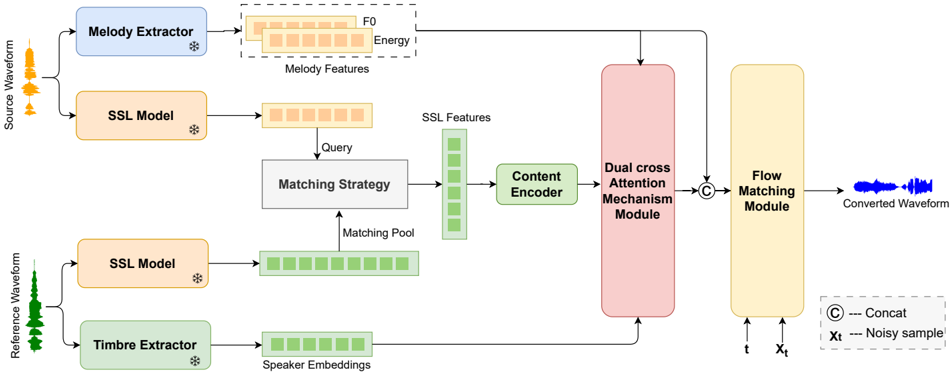
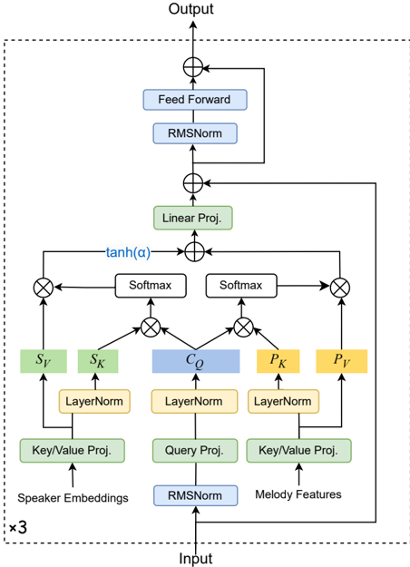

> [!abstract] Interspeech · 2025 · Conference
> **Chen et al.** (Tsinghua University / Huawei Technologies) · [→ Paper](https://www.isca-archive.org/interspeech_2025/chen25d_interspeech.html) · Demo: ✓ · Code: ?
>
> DAFMSVC combines SSL feature matching for timbre leakage prevention with a dual cross-attention module that jointly fuses speaker embeddings, melody, and linguistic content, followed by a conditional flow matching decoder for high-quality one-shot singing voice conversion.

## Problem

Any-to-any singing voice conversion requires transferring a source singer's timbre to an unseen target while preserving melody and lyrics. Two dominant failure modes challenge existing methods: timbre leakage, where residual source speaker characteristics contaminate the converted audio, and inadequate timbre similarity when using sparse SSL feature replacement. NeuCoSVC addressed timbre leakage by replacing source SSL features with the nearest-neighbour features from a target reference pool, but this strategy captures only a sparse subset of the target's timbre information because timbre is distributed across the entire reference utterance. GAN-based decoders further compound the issue with instability and limited audio quality. The result is a gap between timbre leakage prevention and genuine timbre similarity in one-shot settings.

## Method

DAFMSVC operates in three stages. First, a pre-trained WavLM-Large encoder extracts 1024-dimensional SSL features from both source and reference audio. Following NeuCoSVC, a KNN matching strategy (k=4, cosine similarity) replaces each source-audio SSL feature with the nearest neighbour from the reference pool using averaged representations from the last five WavLM layers, while the sixth layer provides the actual replacement features fed to a content encoder built from Feed Forward Transformer blocks. This step prevents timbre leakage while retaining source content structure.

Second, a dual cross-attention mechanism module (DCAM) fuses the matched content features with two complementary conditioning signals: speaker embeddings from a pre-trained CAM++ speaker verification model (which capture global and local timbre details scattered across the reference) and melody features (pitch extracted by median-of-three methods plus A-weighted loudness). The module uses a shared query projection from the content representation and runs two parallel cross-attention operations: one attending to melody features (key/value), and one attending to speaker embeddings (key/value), gated by a learned tanh(alpha) scalar initialised at zero for training stability. This formulation allows the model to progressively inject timbre alongside melody synchronisation across phoneme boundaries.

Third, a conditional flow matching (CFM) module based on a ConvNeXtV2 backbone takes the fused features (concatenated with pitch and loudness) and generates 24kHz singing audio by learning a vector field between Gaussian noise and the target distribution via a rectified-flow objective. Multi-band prediction with overlap loss and STFT loss further stabilise the waveform reconstruction. Inference uses 10 Euler steps.

## Key Results

On the OpenSinger dataset (148 conversion pairs across four unseen target singers), DAFMSVC outperforms three baselines — DDSP-SVC, So-VITS-SVC, and NeuCoSVC — on all objective and subjective metrics (Table 1). The largest gains are in singer similarity (SSIM: 0.754 vs. 0.692 for NeuCoSVC) and loudness RMSE (0.067 vs. 0.114), indicating improved timbre fidelity and prosodic faithfulness. MOS-Naturalness reaches 3.80 (vs. 3.47 for NeuCoSVC and 3.45 for So-VITS-SVC) and MOS-Similarity reaches 3.58 (vs. 3.48 for NeuCoSVC). MCD also improves to 7.220 from 8.227–8.941 across baselines.

Ablation results (Table 2) isolate the contribution of each component. Removing speaker embeddings and the DCAM module reduces SSIM from 0.754 to 0.709; removing only the DCAM while retaining speaker embeddings drops SSIM further to 0.710 and degrades MCD to 8.129, confirming that simple feature concatenation is less effective than the cross-attention fusion.

## Novelty Assessment

The paper's primary novelty sits at the intersection of two existing design ideas: NeuCoSVC's SSL feature matching pool strategy (adopted directly) and cross-attention fusion of conditioning signals (standard in transformer-based TTS). The genuine contribution is the DCAM formulation, which introduces a shared-query dual cross-attention with adaptive gating to jointly model timbre and melody in the singing conversion context — this specific combination has not been applied to SVC before. The flow matching decoder replaces the GAN-based backbone from NeuCoSVC; both the CFM objective and the ConvNeXtV2 backbone are borrowed from RFWave rather than newly designed. Evaluation is limited to one Chinese singing dataset, 20–148 samples, and 15 subjective listeners, which constrains the generality of the results.

## Field Significance

Moderate — DAFMSVC demonstrates that augmenting SSL feature-matching approaches with explicit speaker embedding fusion via cross-attention and replacing GAN decoders with flow matching yields consistent gains in singing voice conversion across both subjective and objective metrics. The contribution refines an established approach (NeuCoSVC) rather than introducing a new paradigm, and the evaluation scope (one Chinese dataset, one-shot setting only) limits generalisability. The dual cross-attention formulation with adaptive gating provides a reusable design pattern for multi-source conditioning in any-to-any conversion tasks.

## Claims

- **supports:** Flow matching decoders produce higher audio quality than GAN-based decoders in singing voice conversion when conditioning signal quality is held constant.
  > *Evidence:* Replacing NeuCoSVC's GAN-based FastSVC decoder with a CFM module improves MCD from 8.634 to 7.220 and MOS-Naturalness from 3.47 to 3.80 on OpenSinger, with the ablation confirming that even without the DCAM module the CFM-equipped model surpasses NeuCoSVC. *(§4.1, §4.2, Table 1, Table 2)*

- **refines:** SSL feature matching prevents timbre leakage in singing voice conversion but is insufficient on its own for high timbre similarity, because target timbre is distributed across the full reference utterance rather than captured by sparse nearest-neighbour retrieval.
  > *Evidence:* The -spk&att ablation (SSL matching only, no speaker embeddings or DCAM) achieves SSIM 0.709 vs. 0.692 for NeuCoSVC (marginal improvement), while adding speaker embeddings with the full DCAM raises SSIM to 0.754 — a larger relative gain than the matching step alone provides. *(§4.2, Table 1, Table 2)*

- **supports:** Cross-attention fusion of speaker embeddings and melody features with shared content queries improves timbre similarity and audio coherence over simple feature concatenation in conditional singing voice conversion.
  > *Evidence:* Removing the DCAM while retaining speaker embeddings (-att ablation) drops SSIM from 0.754 to 0.710 and MCD from 7.220 to 8.129, demonstrating that the attention mechanism adds value beyond the conditioning signals themselves. *(§4.2, Table 2)*

- **complicates:** One-shot singing voice conversion evaluations remain narrow in scope, limiting the generalisability of reported gains.
  > *Evidence:* Experiments use a single Chinese singing dataset (OpenSinger), 20 samples for subjective evaluation with 15 listeners, and four unseen target speakers. Cross-language, multi-domain, or noisy-environment generalisation is explicitly deferred to future work. *(§3.1, §3.4, §5)*

## Limitations and Open Questions

The system is trained and evaluated exclusively on high-quality Chinese singing (OpenSinger, recorded in a professional studio), and the authors acknowledge that performance in noisy environments and cross-language settings is untested. The subjective evaluation is small (20 samples, 15 listeners), raising questions about statistical robustness. The pitch shifting strategy (scaling source pitch by the ratio of target-to-source median pitch) is a global heuristic that may not capture fine-grained vocal range adaptation. Model size, inference latency, and real-time factor are not reported. Whether the DCAM design generalises beyond the Chinese singing domain remains open.

## Wiki Connections

- [[flow-matching|Flow Matching]] — DAFMSVC introduces a conditional flow matching module based on a rectified-flow ODE objective as its audio decoder, replacing the GAN-based decoder used in the prior NeuCoSVC baseline.
- [[voice-conversion|Voice Conversion]] — the paper frames singing voice conversion as a specialised VC task, evaluating singer similarity and naturalness against three dedicated SVC baselines on OpenSinger.
- [[self-supervised-speech|Self-Supervised Speech]] — WavLM-Large is the core SSL model used for both feature extraction and the KNN-based matching pool strategy that prevents timbre leakage.
- [[zero-shot-tts|Zero-Shot TTS]] — DAFMSVC targets one-shot (any-to-any) conversion to unseen target singers at inference time using only a short reference audio clip, analogous to the zero-shot voice cloning paradigm in TTS.
- [[evaluation-metrics|Evaluation Metrics]] — the paper uses F0CORR, Loudness RMSE, SSIM (via CAM++ speaker embeddings), and MCD as objective metrics alongside MOS-Naturalness and MOS-Similarity for singing voice conversion evaluation.
- [[subjective-evaluation|Subjective Evaluation]] — MOS-Naturalness and MOS-Similarity scores are collected from 15 music-knowledgeable listeners on 20 samples (5 per target speaker), illustrating the scale limitations of subjective evaluation in singing conversion research.
