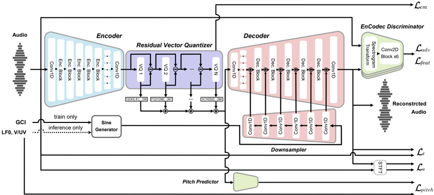

> [!abstract] Interspeech · 2025 · Conference
> **Takagi et al.** (Nagoya Institute of Technology) · [→ Paper](https://www.isca-archive.org/interspeech_2025/takagi25_interspeech.html) · Demo: ? · Code: ?
>
> PeriodCodec extends the GAN-based neural audio codec paradigm by injecting explicit sine-wave periodic signals derived from F0 into each decoder block, enabling direct pitch manipulation during waveform reconstruction and making the codec suitable for singing voice synthesis.

## Problem

Standard neural audio codecs (NACs) based on vector quantization (VQ-VAE) encode pitch information implicitly within discrete tokens, making it difficult to freely manipulate the fundamental frequency (F0) at inference time. This is a fundamental limitation for singing voice synthesis, where pitch must be precisely controlled across wide pitch ranges. Conditioning the decoder on raw F0 values alone (the obvious fix) was found in preliminary experiments to offer only limited pitch manipulation. The field therefore lacks a codec architecture designed from the ground up for pitch-controllable singing synthesis.

## Method

PeriodCodec adopts the GAN-based codec backbone of EnCodec/FunCodec (encoder, residual vector quantizer, GAN decoder) and augments the decoder with explicit periodic signals. At each decoder block, a sine wave generated at the audio sample rate is downsampled to the block's temporal stride and concatenated with the upsampled quantized embedding as an additional input. During training, the sine wave is derived from glottal closure instants (GCIs) extracted from natural audio; during inference, it is generated from the supplied log F0 trajectory, allowing pitch to be shifted independently of the discrete tokens.

To prevent the encoder from continuing to encode pitch information into the quantized embeddings (which would compete with the explicit periodic signal and limit controllability), a pitch predictor with a gradient reversal layer (GRL) is appended to the RVQ output. The GRL encourages the encoder to produce pitch-invariant representations: the pitch predictor is trained to predict log F0 and voiced/unvoiced (V/UV) status from the quantized embeddings, while the GRL negates the gradient flowing back into the encoder, penalising pitch-informative representations. This disentanglement strategy is adapted from NaturalSpeech 3.

The model is trained on approximately 245 hours of speech from LibriTTS (train-clean-100 and train-clean-360, 1,151 speakers) plus optionally 80 hours of singing and 16 hours of speech from GTSinger (20 speakers). Evaluation uses a held-out set of 10 Japanese children's songs recorded by two unseen singers. The training objective combines reconstruction (time domain L1 and multi-scale amplitude/mel-spectrogram losses), adversarial and feature-matching losses from three STFT discriminators, VQ commitment loss, and the pitch prediction loss (weighted at 0.5).

## Key Results

Six model variants are compared on a reconstruction and pitch-shifting task: Base (no F0 conditioning), Period (periodic signals only), and Period-GRL (periodic signals plus GRL disentanglement), each trained with or without the GTSinger singing data.

In objective evaluation (F0-RMSE in semitones, V/UV error rate), simply introducing periodic signals (Period vs. Base) substantially improves F0 tracking. Adding GTSinger data further reduces F0-RMSE at high pitch ranges (log F0 shifted +12 semitones), consistent with GTSinger extending the F0 coverage beyond LibriTTS. Adding the GRL (Period-GRL) shows a modest reduction in V/UV error rate but does not substantially change F0-RMSE.

In subjective MOS evaluation (31 native Japanese listeners, 5-scale), the key finding is that periodic signals markedly improve naturalness relative to the baseline that cannot shift pitch at all (Period MOS 3.28 vs. Base MOS 2.37 at no shift, Table 1). Adding GTSinger data (Period+GT) yields MOS 3.55 at no shift. However, the GRL disentanglement consistently lowers MOS scores: Period-GRL scores 2.44 at no shift, and Period-GRL+GT scores 3.33. The naturalistic ceiling is 4.53 (natural audio). The best MOS across all conditions is Period+GT at no-shift (3.55) and at -6 semitone shift (3.29), suggesting that pitch-shifted output at high ranges still trails natural audio by a substantial margin.

## Novelty Assessment

The core idea of injecting periodic sine signals into a codec decoder is a direct adaptation of techniques from neural vocoders (PeriodNet, Period-HiFi-GAN, PeriodVITS), applied for the first time to the NAC paradigm. The GRL-based pitch disentanglement is adapted from NaturalSpeech 3. The structural novelty is therefore incremental: the contribution lies in combining these two known components within the codec framework and demonstrating their utility for singing voice synthesis specifically. The evaluation is limited to a proprietary Japanese children's song dataset with only two singers, preventing assessment of generality across singing styles or languages. Notably, the GRL disentanglement module did not improve naturalness scores in subjective evaluation, which the authors acknowledge requires further investigation.

## Field Significance

Moderate — PeriodCodec addresses a real gap: existing NACs are not designed for explicit F0 control, which is a prerequisite for codec-based singing voice synthesis pipelines. The technique is a clean extension of the codec paradigm and the periodic-signal approach is mechanistically well-motivated. Its scope is narrow (singing synthesis reconstruction), the evaluation dataset is proprietary and small, and the GRL disentanglement component yields mixed results, limiting the scope of claims about the complete proposed system.

## Claims

- **supports:** Injecting explicit periodic signals into a neural codec decoder enables independent F0 control during waveform reconstruction, decoupling pitch from the discrete token stream.
  > *Evidence:* Period variants achieve substantially lower F0-RMSE than Base (which embeds pitch implicitly in tokens) across all pitch shift conditions, and MOS improves from 2.37 to 3.28 at no shift. *(§4.2, §4.3, Table 1, Figure 2)*

- **supports:** Including singing voice data in codec training improves F0 accuracy at high pitch ranges that speech-only corpora do not cover.
  > *Evidence:* Period+GT reduces F0-RMSE relative to Period when log F0 is shifted upward by 6-12 semitones, corresponding to the extended high-pitch coverage of GTSinger vs. LibriTTS. *(§4.2, Figure 2, Figure 3)*

- **complicates:** Gradient reversal-based pitch disentanglement in neural codecs does not reliably improve perceptual quality and may degrade it.
  > *Evidence:* Period-GRL scores 2.44 MOS vs. Period at 3.28 MOS at no shift; Period-GRL+GT scores 3.33 vs. Period+GT at 3.55. The authors note the effect varies with training data domain, leaving the mechanism unclear. *(§4.3, Table 1)*

- **complicates:** Codec training on data with a wider pitch range can improve quality at high pitches but reduces quality at lower pitches that are underrepresented in the new data.
  > *Evidence:* At -6 semitone shift, Period+GT (3.29 MOS) scores lower than Period (3.42 MOS), attributed to the model allocating capacity to the wider pitch range of GTSinger at the cost of fidelity in the lower range. *(§4.3, Table 1)*

## Limitations and Open Questions

> [!warning]
> All subjective evaluation is conducted on a proprietary Japanese children's song dataset recorded by two singers unseen during training. Results may not generalise to other singing styles, languages, or recording conditions.

The GRL disentanglement module did not improve naturalness in subjective evaluation and in some conditions worsened it; the authors acknowledge this interaction with training data domain requires clarification. The evaluation is a codec reconstruction task only: no downstream discrete-token-based singing synthesis system is presented, so the utility of PeriodCodec in a full SVS pipeline remains undemonstrated. Model size is not reported.

## Wiki Connections

- [[neural-codec|Neural Audio Codec]] — PeriodCodec introduces F0-controllable decoding as an extension of the GAN-based NAC architecture, addressing a gap specific to singing synthesis.
- [[gan-vocoder|GAN Vocoder]] — the periodic-signal injection technique is adapted from GAN vocoders (PeriodNet, Period-HiFi-GAN) that separate periodic and aperiodic components for F0 control.
- [[prosody-control|Prosody Control]] — explicit log F0 conditioning via sine waves at inference time is the paper's primary mechanism for pitch controllability in the codec decoder.
- [[disentanglement|Disentanglement]] — the GRL-based pitch predictor attempts to disentangle pitch from content in the quantized embedding space, with mixed results.
- [[singing|Singing Voice Synthesis]] — the codec is purpose-built for the pitch-control demands of singing voice synthesis, evaluated on a singing-specific proprietary dataset with two singers.
- [[evaluation-metrics|Evaluation Metrics]] — the paper employs F0-RMSE (in semitones) and V/UV error rate as objective measures alongside MOS subjective evaluation, demonstrating both pitch accuracy and perceptual quality of the proposed codec.
- [[2301.02111|VALL-E]] — cited as the initiating work for discrete-token LM-based TTS, motivating the need for codec architectures that support downstream language model pipelines for singing.
