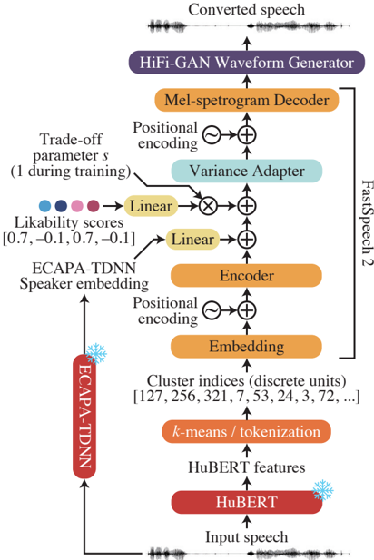

> [!abstract] Interspeech · 2025 · Conference
> **Suda et al.** · [→ Paper](https://www.isca-archive.org/interspeech_2025/suda25_interspeech.html) · Demo: ? · Code: ?
>
> A voice conversion system that controls perceived voice likability — a subjective, multi-factorial speech attribute — by conditioning a FastSpeech 2-based VC model on automatically predicted likability ratings derived from a trained neural predictor.

## Problem

Controlling fine-grained subjective speech attributes such as voice likability presents a scalability problem: obtaining per-utterance subjective ratings from human listeners for large training corpora is costly. Prior work on paralinguistic and non-linguistic feature control (emotion, style, speaker identity) has relied on reference audio, emotion labels, or text prompts, but none directly addresses likability as a continuous controllable target. The subjective and multi-factorial nature of likability (involving fundamental frequency, phoneme durations, speech rate, and other features that vary in importance across listener demographics) means no single acoustic feature suffices as a proxy.

## Method

The system has two interacting components: an automatic likability predictor and a voice conversion model conditioned on its outputs.

The likability predictor accepts a log-Mel spectrogram (80 bins, up to 8 kHz) and passes it through a stack of time-delay neural network (TDNN) layers with a statistics pooling layer, following the x-vector architecture. Rather than predicting a single mean opinion score, the model outputs four listener-group-specific likability ratings (grouped by gender and age: males under 40, males 40+, females under 40, females 40+). It is trained with MSE loss on the CocoNut-Humoresque corpus (1800 samples with crowd-sourced likability ratings). A post-filtering step applies a linear transformation to match the predicted distribution's mean and variance to those of the human-provided ratings without changing correlation coefficients.

The voice conversion model extends a discrete-unit VC approach. SSL features are extracted using HuBERT Large (trained on approximately 60,000 hours of Japanese broadcast audio) and quantised into 1,000 cluster centroids via mini-batch k-means. A FastSpeech 2 model is then trained to synthesise speech conditioned on: (1) these discrete token sequences (consecutive identical tokens collapsed to one), (2) ECAPA-TDNN speaker embeddings, and (3) a target likability rating scalar. A scalar multiplier applied to the likability embedding at inference time controls the trade-off between likability modification and speaker identity preservation; it is fixed at 1 during training and set to 2.5 at evaluation. The vocoder is a universal HiFi-GAN fine-tuned on teacher-forced mel-spectrograms from the training corpora (JVS: 14,997 utterances from 100 speakers; JTES: approximately 18,240 utterances from 100 speakers in four emotional styles).

Likability ratings for the large training corpora are assigned automatically by the predictor rather than through human annotation, bypassing the scalability bottleneck.

## Key Results

The likability predictor achieves a linear correlation coefficient (LCC) of 0.46 and a Spearman rank correlation (SRCC) of 0.49 with human-provided ratings across all listener groups (significant at p < 3e-17). Per-group correlations range from 0.36 to 0.41. As a binary classifier (liked vs. disliked), it achieves 74% accuracy with F1 of 0.70 on the 300-sample test set (§4.2, Table 2).

For likability control, objective evaluation via the predictor shows that the VC model successfully steers synthesised speech likability in the intended direction across all four listener groups (§5.2, Figure 3). Character error rate (CER) remains stable for target likability values in the range -2 to 1 but degrades at the high extreme (target = 2), particularly for female speakers (§5.2, Figure 4). Speaker identity cosine similarity stays above the equal-error-rate threshold (0.48) for target values within the trained range [-1, 1] (§5.2, Figure 5).

In the subjective pairwise preference test (100 participants, 36 comparisons per listener), significant differences in perceived likability were found between targets of -1 and 0, and between -1 and 1, for three of the four speakers. The -1 vs. 1 overall preference was significant. The 0 vs. 1 contrast was not significant, possibly due to naturalness degradation at the high end. Speaker m49 showed an anomalous result where likability unexpectedly decreased as the target increased beyond 0, likely due to failure to preserve speaker identity in that case (§5.3, Figure 6).

## Novelty Assessment

The primary novelty is the pipeline for using an automatically trained likability predictor to annotate large-scale training data for likability-conditioned VC, sidestepping the cost of manual crowd-sourced ratings. Both individual components are extensions of existing approaches: the likability predictor adapts the x-vector TDNN architecture (typically used for speaker verification) to regression on crowd-sourced ratings; the VC model adapts discrete-unit FastSpeech 2 to accept an additional scalar likability conditioning signal. The multi-group rating design (predicting separately for four demographic listener groups) is a genuine refinement over prior single-value likability predictors. The overall system contribution is engineering integration with an incremental architectural extension, though the specific target attribute (likability) is novel in the VC conditioning literature. Evaluation is limited to Japanese, four speakers, and demonstrates only modest control range in practice (predicted likability shifts from -0.51 to -0.23 despite targets from -2 to 2).

## Field Significance

Moderate — this paper introduces a scalable data labelling strategy for subjective speech attribute control that could generalise beyond likability to other crowd-rated perceptual attributes (e.g., warmth, confidence). Its contribution is primarily a proof of concept for the automated-rating pipeline; the likability control gains are real but narrow in range and limited to four Japanese speakers. The work can serve as a reference for future paralinguistic VC systems that need to sidestep costly human annotation at scale.

## Claims

- **supports:** Discrete-unit voice conversion can be extended to control subjective perceptual attributes beyond speaker identity by adding a scalar conditioning signal to the synthesis model.
  > *Evidence:* A FastSpeech 2 model conditioned on HuBERT-based discrete units, ECAPA-TDNN speaker embeddings, and a target likability scalar successfully steered perceived likability for 3 of 4 speakers in pairwise preference tests. *(§3, §5.3, Figure 6)*

- **supports:** Automatic likability predictors based on TDNN regression on crowd-sourced ratings can provide sufficient proxy labels to train large-scale perceptual attribute control systems.
  > *Evidence:* The predictor achieved LCC 0.46 and SRCC 0.49 with human ratings (p < 3e-17) and 74% binary classification accuracy; its outputs were used to automatically annotate the JVS and JTES corpora for VC training. *(§4.2, Table 2)*

- **complicates:** Strong likability control and speaker identity preservation are in tension in discrete-unit VC systems, particularly at extreme target values.
  > *Evidence:* At target likability = 2 (outside the training range), CER increased substantially for female speakers and speaker m49 showed degraded speaker similarity and unexpected subjective likability drop; the inference-time scalar multiplier partially mitigates but does not eliminate this trade-off. *(§5.2, §5.3, Figures 4–6)*

- **complicates:** Voice likability control demonstrates effective behaviour for majority speaker groups but can fail for individual speakers due to identity-likability interaction effects.
  > *Evidence:* Three of four speakers showed significant preference differences between target -1 and 1; speaker m49 exhibited the opposite trend, attributed to failure to preserve speaker identity, indicating that per-speaker variation is a real limitation. *(§5.3, Figure 6)*

- **refines:** Perceived voice likability is a multi-factorial attribute requiring demographic-stratified modelling, not a single group-level score.
  > *Evidence:* The predictor uses four separate listener-group outputs (by gender and age); per-group LCC ranges from 0.36 to 0.41 while the aggregate LCC is 0.46, confirming systematic variation across listener demographics. *(§2, §4.2, Table 2)*

## Limitations and Open Questions

> [!warning]
> The evaluation is limited to four speakers (two female, two male) and one language (Japanese), with training on Japanese speech corpora. Cross-lingual and multi-lingual generalisability is entirely untested.

The practical control range of the system is narrow: despite targeting values from -2 to 2, predicted likability shifts only from approximately -0.51 to -0.23, suggesting the model substantially operates within each speaker's inherent likability range rather than achieving wide stylistic transfer. This is acknowledged by the authors but not resolved.

The likability predictor's correlation with human ratings is statistically significant but moderate (LCC 0.46), meaning a substantial portion of subjective likability variance is not captured. Since this predictor is the primary source of training supervision, any systematic biases in its predictions will propagate to the VC model.

The scalar multiplier (s = 2.5 at inference vs. 1 at training) is manually tuned and distribution-shifted, which may limit out-of-distribution robustness. Future work noted by the authors includes extending to natural language specification of desired voice characteristics.

## Wiki Connections

- [[voice-conversion|Voice Conversion]] — this paper extends discrete-unit VC to control a continuous perceptual attribute (likability), adding demographic-stratified scalar conditioning to the standard speaker-identity conversion pipeline.
- [[prosody-control|Prosody Control]] — likability is partially mediated by prosodic features (fundamental frequency, speech rate), and the system implicitly adjusts these through likability conditioning rather than directly targeting prosody parameters.
- [[self-supervised-speech|Self-Supervised Speech]] — the VC model depends on HuBERT Large features for discrete speech unit extraction, making SSL representation quality a direct factor in conversion fidelity.
- [[evaluation-metrics|Evaluation Metrics]] — the paper introduces a TDNN-based likability predictor as an automated evaluation proxy, reporting its correlation with human crowd-sourced ratings as a validation of the metric itself.
- [[subjective-evaluation|Subjective Evaluation]] — a pairwise preference listening test with 100 paid participants directly assesses perceived likability under controlled target values, validating the automated predictor's utility.
- [[disentanglement|Disentanglement]] — the system explicitly targets disentanglement of likability from speaker identity and linguistic content, using separate conditioning signals for each attribute during synthesis.
