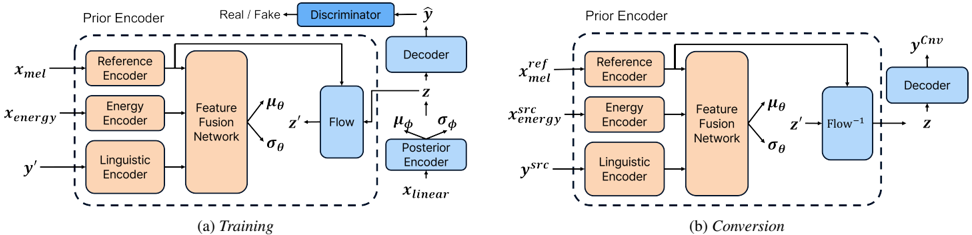

> [!abstract] Interspeech · 2025 · Conference
> **Kang et al.** (NC AI Co., Ltd) · [→ Paper](https://www.isca-archive.org/interspeech_2025/kang25b_interspeech.html) · Demo: ✓ · Code: ?
>
> A CVAE-based voice conversion system adapted for human-to-non-human (H2NH-VC) voice transformation, with a tailored preprocessing pipeline and architectural modifications enabling 44.1 kHz conversion across diverse animal and sound-designed timbres.

## Problem

Standard voice conversion methods are designed around human speech: they assume stationary spectral characteristics over 40-80 ms frames, model a limited frequency range (up to 11.025 kHz at 16 or 22.05 kHz sampling rates), and incorporate inductive biases such as source-filter models that do not generalise to non-human vocalizations. The one prior H2NH-VC study was restricted to dog-sound conversion, relied on human-speech preprocessing, and required explicit style IDs during training, making it impractical for diverse or ambiguously categorized non-human sounds. The broader gap is that production workflows in games and film still rely on complex, time-intensive manual DSP tooling to produce non-human character vocalizations.

## Method

The system extends the Conditional Variational Autoencoder with Adversarial Learning (CVAE) framework of FreeVC, which in turn is built on VITS, retaining its end-to-end waveform generation without a separate vocoder. Two key adaptations address the demands of non-human audio.

The preprocessing pipeline is redesigned for high-fidelity, broadband audio: a 44.1 kHz sampling rate is adopted, STFT analysis uses a 5 ms hop length (compared to the 10-20 ms typical in human speech systems), and mel-filters spanning 0-22.05 kHz capture the full audible range including the high-frequency components characteristic of birdsong and similar sounds. Linguistic content is extracted using the 12th-layer hidden representations of XLS-R, a multilingual Wav2Vec 2.0 variant, with timbre perturbation parameters expanded to accommodate the wider frequency variation of non-human sounds (formant shift and pitch shift ranges enlarged to 1.8 and 3.0, respectively). Frame-level energy from the linear spectrogram serves as a prosodic feature; pitch (F0) extraction is omitted because existing estimators fail on sounds without a clear harmonic structure.

The model architecture isolates the style vector to the prior encoder and flow module exclusively, removing it from the posterior encoder and decoder. This prevents style leakage into the posterior path, which was observed to reduce style similarity when style and acoustic features overlap redundantly. The Frequency Domain Reconstruction Loss (FDRL) replaces fixed-hop mel-STFT reconstruction loss, applying multiple hop lengths to recover abrupt transients typical of growls and designed sounds. A cosine KL annealing schedule is introduced to prevent posterior collapse (KL-vanishing) during early training, gradually increasing the KL weight from near zero to one over 50,000 steps.

## Key Results

On an internally held-out test set evaluated by nine participants, the proposed model achieves MOS-Q 3.16, MOS-N 3.16, and MOS-S 3.78, surpassing all three baselines (DDDM-VC, Diff-HierVC, FreeVC) on quality and similarity (Table 1). FreeVC achieves a slightly higher MOS-N (3.22 vs. 3.16), likely because its lower overall conversion fidelity retains more source expressiveness, making the audio sound more natural to listeners even when the timbre transformation is weaker.

Objective results reinforce the subjective advantage: the proposed model attains PCC-E 0.99 and RMSE-E 0.033 on energy contour similarity, compared to 0.81 and 0.044 for FreeVC. CER drops to 15.48% and WER to 24.02%, substantially below all baselines (the next-best is FreeVC at 30.97% CER). Inference speed is 0.12 seconds per 6-second sample on an A100 GPU, matching or bettering all baselines.

Ablation confirms the importance of both the proposed preprocessing (replacing it with a conventional speech-focused pipeline degrades MOS-S from 3.78 to 3.53 and WER from 24.02% to 62.29%) and KL annealing (removal increases CER from 15.48% to 28.89% while having minimal effect on MOS).

## Novelty Assessment

The paper's contribution is a combination of architectural-novelty and engineering adaptation. The CVAE backbone is not novel: it is explicitly derived from VITS and FreeVC, and the style-isolation design (excluding style from the posterior path) is a relatively targeted modification rather than a fundamentally new architecture. The more substantive novelty is the domain transfer: adapting human-speech VC machinery to non-human sounds requires the new preprocessing pipeline, expanded perturbation parameters, FDRL loss integration, and KL annealing, all of which are validated by ablations. The FDRL loss is borrowed from the DAC paper rather than introduced here. The result is an engineering integration with meaningful system-level contributions, packaged for a genuinely underexplored problem.

The dataset is internal and cannot be released, which limits reproducibility. The evaluation panel is small (9 participants) and the test set size is not specified. Comparisons against baselines are fair in the sense that all baselines were trained using conventional speech-focused pipelines (not adapted for non-human sounds), which is the appropriate point of comparison but may understate the difficulty of the task relative to a properly adapted baseline.

## Field Significance

Moderate - This paper introduces a practical system for human-to-non-human voice conversion at 44.1 kHz, broadening VC beyond the well-studied human-to-human domain into animal and designed sound categories relevant to game audio and film production. The architectural changes relative to FreeVC are incremental, but the preprocessing and training adaptations needed to handle non-human acoustics demonstrate that standard human-speech VC pipelines fail substantially on this task, providing useful evidence for the scope limits of existing VC methods.

## Claims

- **supports:** Voice conversion architectures designed for human speech require non-trivial adaptation to generalise to non-human vocalizations with broad frequency ranges and transient-rich characteristics.
  > *Evidence:* Replacing the proposed preprocessing pipeline with a conventional speech-focused one degraded WER from 24.02% to 62.29% and MOS-S from 3.78 to 3.53, indicating that human-speech assumptions about frame resolution and frequency range materially impair non-human sound conversion. *(§4.2.2, Table 1)*

- **supports:** Isolating style conditioning to the prior network and normalizing flow, and excluding it from the posterior encoder and decoder, reduces style leakage and improves speaker similarity in CVAE-based voice conversion.
  > *Evidence:* Adding the style embedding to the audio encoder and decoder (w/ SEED ablation) reduced MOS-S from 3.78 to 3.61, attributed to style overlap between the reference encoder output and latent acoustic tokens. *(§4.2.3, Table 1)*

- **supports:** KL annealing mitigates posterior collapse in VAE-based voice conversion and improves linguistic content preservation, particularly for complex non-human vocalizations.
  > *Evidence:* Removing KL annealing increased CER from 15.48% to 28.89% and WER from 24.02% to 44.69%, while MOS scores changed minimally, indicating that linguistic clarity is the primary casualty of over-regularization in early training. *(§4.2.3, Table 1)*

- **complicates:** Existing fundamental frequency (F0) estimation methods are not reliable for sounds lacking a well-defined harmonic structure, constraining prosodic feature extraction in non-human voice conversion systems.
  > *Evidence:* The authors tested frame-level F0 from non-human sounds but found existing estimators (Praat, CREPE, SPICE, PESTO) exhibited limitations due to absent harmonic structure; the system falls back to energy-only prosodic features, leaving robust F0 extraction as an open problem. *(§3.1)*

## Limitations and Open Questions

> [!warning]
> The dataset is entirely internal and the evaluation uses only 9 human raters on an unspecified number of test samples, limiting reproducibility and the statistical reliability of MOS scores.

No publicly available data or code is confirmed, making direct comparison and reproduction difficult. The evaluation benchmarks non-human VC against baselines that were not adapted for non-human sounds, which is the correct setup for the paper's argument but means absolute MOS values are not comparable to human-speech VC literature.

F0 estimation for non-human sounds remains unsolved: the system uses energy-only prosodic features and omits pitch conditioning, which may limit prosodic expressiveness for vocalizations where pitch contour is perceptually salient (e.g., melodic birdsong). The evaluation scope is restricted to a set of internally defined sound categories (exclamations, designed voices, animal sounds from a commercial library), and generalisation to out-of-distribution non-human sounds is not tested.

## Wiki Connections

- [[voice-conversion|Voice Conversion]] - this paper extends voice conversion methodology from the human-to-human domain to human-to-animal and human-to-designed-sound conversion, identifying new preprocessing and training requirements for the task.
- [[self-supervised-speech|Self-Supervised Speech]] - the system's linguistic encoder uses XLS-R (a multilingual Wav2Vec 2.0 variant) as a core component for extracting timbre-agnostic linguistic representations from both human and non-human vocalizations.
- [[disentanglement|Disentanglement]] - the architectural modification of isolating the style vector to the prior network and flow module (excluding it from posterior encoder and decoder) is an explicit form of disentanglement designed to reduce style leakage into linguistic representations.
- [[prosody-control|Prosody Control]] - the paper introduces frame-level energy as an explicit prosodic conditioning signal and finds that F0 extraction fails for non-human sounds, offering an empirical data point on the limits of standard prosodic control in out-of-domain audio.
- [[evaluation-metrics|Evaluation Metrics]] - the paper uses MOS-Q, MOS-N, and MOS-S alongside energy-based objective metrics (PCC-E, RMSE-E) and ASR-based CER/WER, demonstrating an adapted evaluation protocol for a non-human VC task where standard speaker similarity metrics may not apply directly.
- [[subjective-evaluation|Subjective Evaluation]] - nine human raters scored MOS-Q, MOS-N, and MOS-S on held-out samples, the paper's primary quality signal for a task domain where objective speech metrics are of limited validity.
