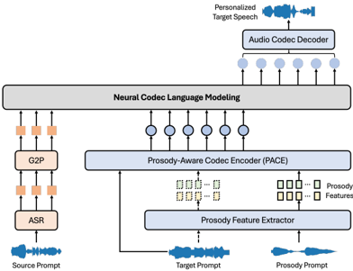

> [!abstract] Interspeech · 2025 · Conference
> **Zhao et al.** (National University of Singapore) · [→ Paper](https://www.isca-archive.org/interspeech_2025/zhao25d_interspeech.html) · Demo: ? · Code: ?
>
> A zero-shot voice conversion system that grafts a prosody-disentangling codec encoder (PACE) onto the VALL-E X in-context learning backbone, enabling independent control of speaker timbre and prosody at inference time.

## Problem

Zero-shot voice conversion requires adapting to unseen target speakers without fine-tuning, but most approaches either rely on speaker embeddings that demand large, diverse speaker datasets or treat prosody as an entangled component of speaker identity. When prosody and timbre are not explicitly separated, controlling one attribute precisely without corrupting the other is difficult. Prior work on prosody-timbre disentanglement for VC, such as ProsoVC, used bottleneck features that hurt naturalness, while in-context learning systems like VALL-E X lacked mechanisms to control prosody independently from the target prompt's overall style.

## Method

The system is built on top of VALL-E X, a neural codec language model that performs in-context learning via autoregressive prediction of audio codes conditioned on a phoneme sequence and a speech prompt. To adapt it for voice conversion, the source speech is transcribed with Whisper Medium (ASR) and converted to a phoneme sequence via grapheme-to-phoneme processing. The target speaker's timbre is captured through the standard ICL mechanism, while prosody is handled by a new module introduced in this work.

The Prosody-Aware Codec Encoder (PACE) replaces the standard EnCodec encoder in the VALL-E X pipeline. PACE splits the SoundStream encoder into two stages: the first three convolutional blocks extract a speech embedding at 40 Hz, while a mutual information (MI) minimisation objective (CLUB estimator) actively removes prosodic content from that embedding. The disentangled prosody-invariant embedding is then recombined with explicit prosody embeddings derived from fundamental frequency (f0) and unvoiced/voiced (UV) indicators extracted by the pyworld harvest function. A scale layer (Conv1D followed by average pooling) aligns the PACE-generated codec embeddings to the target distribution expected by the VALL-E X residual vector quantizer, and the full pipeline uses 8 RVQ codebooks at 24 kHz.

Training proceeds in three stages: first, PACE is trained without prosody conditioning to learn codec reconstruction; second, the MI disentanglement loss is added while keeping the stage-one codec parameters; third, the encoder and decoder are jointly fine-tuned with the full loss combining MI loss, MSE reconstruction loss on the codec embedding, adversarial loss, feature loss, and multi-scale spectral reconstruction loss. The model is trained on 54 hours of LibriTTS-clean-100.

At inference, three separate inputs are possible: a source speech prompt (content), a target speech prompt (timbre via ICL), and an optional prosody prompt (prosody via PACE). This three-way factored conditioning enables flexible prosody transplantation from any speaker onto any target voice.

## Key Results

On LibriTTS test-clean with 20 zero-shot speakers (10 male, 10 female), the proposed system outperforms three baselines (VALL-E X, TriAAN-VC, ProsoVC) on most metrics (Table 2). Speaker similarity (ASV-score via WavLM) reaches 0.9078, versus 0.8429 for VALL-E X. WER drops to 0.1010, the best across all systems. MOS is 4.36 and SMOS is 3.94, both highest among all systems including VALL-E X. MOSNET is 3.57, slightly below VALL-E X (3.61) but above the other baselines.

On prosody matching (Table 3, normalised F0 distance, lower is better), the proposed system leads in both test modes: 2.82 when prosody comes from the source and 2.70 when prosody comes from a separate prompt, compared to 3.10 for VALL-E X in the prompt-only scenario and 3.30--3.40 for the systems that only support source-prosody conversion.

Ablation studies confirm that each component contributes. Removing the reconstruction loss (L_rec) causes the sharpest degradation across all metrics. Removing the scale layer hurts both quality and prosody alignment substantially. Removing the MI loss has a modest effect on quality metrics but a larger effect on prosody control, particularly in the source-prosody scenario.

A codec-level comparison (Table 1) shows that PACE slightly underperforms the baseline EnCodec on speaker similarity and naturalness but improves WER (0.110 vs. 0.124), suggesting that prosody disentanglement marginally reduces absolute codec fidelity while improving intelligibility.

## Novelty Assessment

The central contribution is the PACE module: a modified SoundStream encoder that actively disentangles prosody from timbre using MI minimisation, then recombines them in a controlled way. The MI-based disentanglement technique (CLUB estimator) is established in the representation learning literature and has appeared in prior VC work; its application here to codec-level embeddings within a neural codec language model framework is the novel combination. The VALL-E X backbone and SoundStream codec are both existing systems. The scale layer addressing embedding distribution mismatch is a practical engineering contribution.

The three-input inference scheme (source, timbre prompt, prosody prompt) provides a meaningful capability not present in VALL-E X alone, and the ablation study rigorously validates each component. However, evaluation is limited to LibriTTS, which is relatively clean, and the 54-hour training set is modest. No cross-lingual or noisy-environment experiments are reported. The absence of code or a demo page makes the work difficult to reproduce.

## Field Significance

Moderate — The paper contributes a viable approach to explicit prosody-timbre disentanglement at the codec-embedding level within the codec language model paradigm, extending the ICL-based VC idea toward finer-grained controllability. The technique is incremental rather than paradigm-shifting, and the evaluation scope is narrow, but the three-way factored conditioning (content, timbre, prosody) provides a concrete design pattern for controllable zero-shot VC.

## Claims

- **supports:** Explicit mutual information minimisation at the codec-embedding level provides effective prosody-timbre disentanglement for voice conversion.
  > *Evidence:* Removing the MI loss (L_MI) from the full system leads to a notably higher normalised F0 distance in the prosody-from-source scenario (3.28 vs. 2.82), while quality and timbre metrics change only modestly, isolating prosody control as the primary benefit of the MI objective. *(§3.5, Table 3)*

- **supports:** In-context learning codec LMs can serve as controllable VC backbones when augmented with prosody-disentangling encoder modules.
  > *Evidence:* The proposed system builds on VALL-E X's ICL mechanism and outperforms VALL-E X in speaker similarity (ASV 0.91 vs. 0.84), intelligibility (WER 0.101 vs. 0.115), naturalness (MOS 4.36 vs. 4.19), and prosody alignment (F0 distance 2.70 vs. 3.10) in the prompt-based scenario. *(§3.4, §3.5, Table 2, Table 3)*

- **complicates:** Prosody disentanglement at the codec level introduces a small trade-off in absolute codec reconstruction fidelity compared to the unmodified encoder.
  > *Evidence:* PACE's ASV score (0.662) and NISQA score (3.98) are lower than the baseline EnCodec encoder (0.681, 4.17), though the gap does not substantially affect system-level VC performance. *(§3.3, Table 1)*

- **refines:** Prosody-from-source and prosody-from-prompt are distinct capability axes in voice conversion; systems strong at one do not automatically handle the other.
  > *Evidence:* VALL-E X supports only prosody-from-prompt and is excluded from the source-prosody evaluation; TriAAN-VC and ProsoVC support only source-prosody and are excluded from the prompt-prosody evaluation. Only the proposed system is evaluated in both modes. *(§3.5, Table 3)*

## Limitations and Open Questions

> [!warning]
> All evaluation is conducted on LibriTTS-clean-100 and test-clean, a relatively clean single-domain corpus with 247 speakers. Generalisation to noisy environments, expressive or emotional speech, or cross-lingual settings is not tested.

The 54-hour training dataset is modest for a codec language model approach; it is unclear whether the disentanglement quality degrades with longer or more expressive source utterances. No code or demo is reported, limiting reproducibility. The paper does not ablate the number of RVQ codebooks or the sensitivity of the MI-minimisation trade-off weight (lambda_MI), leaving the robustness of the disentanglement objective undercharacterised. Prosody is operationalised solely through f0 and UV binary flags; richer prosodic dimensions such as energy, speaking rate, and phrase-level structure are not captured.

## Wiki Connections

- [[zero-shot-tts|Zero-Shot TTS]] — this paper exploits the ICL capabilities of VALL-E X to perform zero-shot voice conversion without a pre-trained speaker encoder.
- [[voice-conversion|Voice Conversion]] — the paper directly addresses zero-shot VC with explicit prosody and timbre disentanglement as its primary goal.
- [[neural-codec|Neural Audio Codec]] — PACE modifies the SoundStream codec encoder architecture to inject prosody conditioning at the embedding level before residual vector quantisation.
- [[prosody-control|Prosody Control]] — the paper introduces an explicit mechanism to control f0 and unvoiced/voiced indicators independently of speaker timbre in the VC pipeline.
- [[disentanglement|Disentanglement]] — the PACE training objective uses mutual information minimisation (CLUB estimator) to explicitly separate prosody from speaker identity in codec-level representations.
- [[autoregressive-codec-tts|Autoregressive Codec TTS]] — the VC backbone is the VALL-E X autoregressive neural codec language model, adapted here for voice conversion rather than TTS.
- [[evaluation-metrics|Evaluation Metrics]] — the paper reports ASV-score (WavLM-based speaker similarity), WER, F0 distance, and MOSNET alongside human ratings, comparing against three baselines on LibriTTS test-clean.
- [[subjective-evaluation|Subjective Evaluation]] — MOS and SMOS (naturalness and similarity mean opinion score) are reported as the paper's primary perceptual quality metrics, with the proposed system scoring highest among all compared systems.
