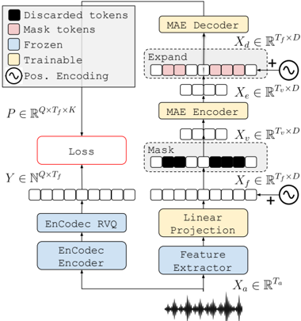

> [!abstract] Interspeech · 2025 · Conference
> **Pepino et al.** (Instituto de Investigación en Ciencias de la Computación, CONICET-UBA / UBA) · [→ Paper](https://www.isca-archive.org/interspeech_2025/pepino25_interspeech.html) · Demo: ✗ · Code: ✓
>
> EnCodecMAE proposes using neural audio codec tokens (EnCodec RVQ) as discrete prediction targets for a masked autoencoder, producing a universal audio representation model that outperforms prior state-of-the-art on the HEAREval benchmark across speech, music, and environmental sound tasks.

## Problem

Universal audio representation models must handle diverse audio domains — speech, music, and environmental sounds — with a single pretrained backbone. Prior masked autoencoder approaches for audio borrowed directly from computer vision, using rectangular time-frequency patches as both input and prediction targets. This patch-based framing introduces a mismatch with audio processing: patches span multiple temporal frames and frequency bands simultaneously, trading temporal resolution for spatial coverage. As a result, patch-based MAEs underperform frame-level models on speech tasks, and existing SSL methods with strong speech representations (HuBERT, wav2vec 2.0) tend to degrade on non-speech tasks because they optimise targets (MFCC clusters, raw waveform features) that are tuned for phoneme-level speech content.

## Method

EnCodecMAE is a masked autoencoder (MAE) in which the prediction targets during pretraining come from the residual vector quantization (RVQ) layer of a frozen EnCodec model. The input audio is processed at 75 Hz — either as melspectrograms or as the output of the EnCodec CNN encoder — and projected to a shared embedding dimension. During training, a proportion of embeddings (50%) is sampled as masked positions and discarded before being passed to the encoder, as in the original MAE formulation rather than the masked-token approach of BERT. The encoder is a stack of transformer layers (5/10/20 for small/base/large) producing visible embeddings, which are then expanded back to the full sequence length by inserting learnable mask tokens. A lightweight two-layer transformer decoder predicts a discrete target for each masked position across 8 of EnCodec's 32 RVQ codebooks, using a weighted cross-entropy loss that can be tuned to emphasise masked or unmasked positions. Positional encodings are applied before masking so that decoder can recover the absolute positions of masked regions.

After 500k pretraining steps, a self-training stage is introduced: k-means clustering (k=1024) is applied to the encoder's last-layer activations over 10k random samples, and the model is trained for an additional 150k steps to predict these internally derived discrete targets — analogous to HuBERT's second-stage refinement. For downstream evaluation, the upstream model is frozen and frame-level embeddings are averaged to produce instance-level representations fed to lightweight MLPs (HEAREval protocol) or a BiLSTM for ASR (SUPERB protocol). The model is pretrained on a mixture of Audioset (~4500h), Free Music Archive (~800h), and Libri-Light 6000h. The large model (261.6M parameters) was trained in 5 days on 2 RTX 3090 GPUs.

## Key Results

On the HEAREval benchmark spanning pitch prediction (NSynth), music genre classification (GTZAN), speech command recognition, emotion recognition (CREMA-D), and environmental sound classification (FSD50K, ESC-50), the large EnCodecMAE model with self-training and the full dataset mixture achieves a global score of 97.1, compared to 96.0 for BEATs (Iter 3) and 94.4 for BEATs (Iter 1). The self-training variant trained on Audioset alone reaches a global score of 99.2, the highest in the comparison (Table 1). For frame-level vs. patch-level input: melspectrograms outperform EnCodec encoder features overall (global 95.9 vs. 83.4 for the base model), but EnCodec input outperforms melspectrograms specifically on the NSynth pitch prediction task, illustrating that the optimal input depends on the downstream task type.

Dataset diversity ablations show predictable patterns: speech-only pretraining (Libri-Light) degrades music and environmental performance; music-only pretraining degrades speech; Audioset alone provides balanced performance across all three domains. On ASR (SUPERB protocol, LibriSpeech 100h fine-tune, Table 2), the large model with self-training achieves 12.44% WER without a language model and 8.59% with an LM, lagging behind HuBERT Large (3.62/2.94%) and wav2vec 2.0 Large (3.75/3.10%) but comparable to DeCOAR 2.0 (13.02/9.07%) and better than original wav2vec (15.86/11.00%).

## Novelty Assessment

The core novelty is substituting EnCodec RVQ tokens for the ad hoc targets used in earlier universal audio MAEs (random quantizers in BEATs, spectrogram patches in AudioMAE). The framing — use a general-purpose neural audio codec, which was already shown to capture perceptually relevant information across speech and music, as an off-the-shelf token provider for SSL — is a clean conceptual move that avoids task-specific target engineering. The secondary contribution is applying the MAE architecture at the frame level (1D time axis) rather than at rectangular 2D patches, which the paper demonstrates is better for speech while remaining competitive on environmental tasks.

The evaluation is thorough and fair: the HEAREval protocol is used consistently, baselines are run with official weights where available, and bootstrapped confidence intervals are reported. The ASR gap relative to HuBERT is acknowledged honestly rather than minimised. The self-training stage is an adaptation of existing ideas (HuBERT's iterative refinement) rather than a new contribution. Overall, the paper's contribution is primarily an effective combination of a codec-derived target with an existing MAE architecture rather than a structural innovation in either component.

## Field Significance

Moderate — EnCodecMAE demonstrates that the discrete token space of a general audio codec, originally designed for compression, contains enough semantic structure to serve as useful pretraining targets for a universal representation model. The result is evidence that codec-derived tokens can generalise beyond speech generation tasks into representation learning — a direction of growing relevance given the proliferation of neural codec components in the speech and audio stack. The ASR gap relative to dedicated speech SSL models suggests that codec tokens alone are not sufficient for phoneme-level tasks, pointing to a clear open problem in universal audio representation.

## Claims

- **supports:** Neural codec token spaces capture semantically useful information beyond audio reconstruction, enabling effective use as pretraining targets for general audio representation models.
  > *Evidence:* EnCodecMAE, which predicts frozen EnCodec RVQ tokens, outperforms BEATs (which uses random quantizer targets) and AudioMAE on global HEAREval score, with large+ST models reaching 99.2 on Audioset-only pretraining versus 96.0 for BEATs Iter 3. *(§4, Table 1)*

- **supports:** Frame-level temporal representations outperform patch-based representations for speech tasks in universal audio models, while both approaches perform comparably on environmental sound classification.
  > *Evidence:* EnCodecMAE (frame-level) achieves 96.3% speech command accuracy and 75.5% emotion recognition versus patch-based BEATs Iter 1's 91.0% and 68.7%, while matching or being slightly behind on ESC-50 (79.8 vs. 82.3). *(§4, Table 1)*

- **complicates:** Self-supervised universal audio representations do not close the gap with dedicated speech SSL models on phoneme-level tasks such as ASR.
  > *Evidence:* EnCodecMAE Large+ST achieves 8.59% WER on LibriSpeech with a language model, versus 2.94% for HuBERT Large trained solely on speech data. The paper attributes this to differences in target definition (MFCC clusters correlating with phonemes) and input representation (raw waveform). *(§4, Table 2)*

- **refines:** The optimal input representation for self-supervised audio models is task-dependent rather than universally preferable across audio domains.
  > *Evidence:* Melspectrograms yield higher global HEAREval scores than EnCodec encoder outputs (95.9 vs. 83.4 base model), but EnCodec input outperforms melspectrograms on pitch prediction (NSynth), where codec features capture finer harmonic structure. *(§4, Table 1)*

- **supports:** Pretraining data diversity is essential for universal audio representation; models pretrained on a single domain generalise poorly outside that domain.
  > *Evidence:* Speech-only pretraining (LL6K only) gives a global score of 75.3, music-only (FMA only) gives 89.1, while the full mixture (AS+FMA+LL6K) reaches 97.1 global, with gains concentrated in the non-primary domain for each restricted setting. *(§4, Table 1)*

## Limitations and Open Questions

> [!warning]
> The ASR evaluation uses the SUPERB protocol (frozen encoder, BiLSTM probe, 100h fine-tune), which is designed to measure representation quality, not end-to-end ASR. The resulting WERs cannot be directly compared against fine-tuned ASR systems trained end-to-end and should be treated as a proxy for phoneme-level representation quality only.

Evaluation on HEAREval uses instance-level embeddings derived by averaging frame-level features, which discards temporal structure useful for tasks requiring sequence-level reasoning. The self-training stage cluster targets (k-means over 10k samples with k=1024) may be too coarse for high-resolution phonetic discrimination, which the authors identify as a direction for future work alongside exploring alternative training targets to improve ASR without sacrificing music and environmental performance. All models are evaluated with a frozen upstream encoder; fine-tuning experiments are not reported, leaving open whether the representations would improve further under task-specific adaptation.

## Wiki Connections

- [[neural-codec|Neural Audio Codec]] — EnCodecMAE uses frozen EnCodec RVQ tokens as discrete prediction targets, demonstrating a new role for neural codecs beyond audio compression or TTS vocoding.
- [[self-supervised-speech|Self-Supervised Speech]] — EnCodecMAE adapts masked autoencoding, following principles from HuBERT and wav2vec 2.0, to a universal audio domain using codec-derived rather than MFCC-derived targets.
- [[evaluation-metrics|Evaluation Metrics]] — the paper reports results under the HEAREval benchmark (global normalised score across 6 tasks) and the SUPERB ASR protocol, providing a reproducible multi-domain evaluation framework.
