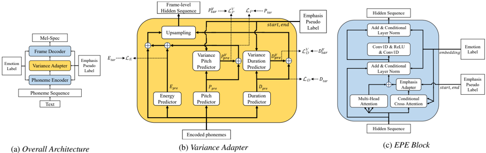

> [!abstract] Interspeech · 2025 · Conference
> **Haoxun Li et al.** (Hangzhou Institute for Advanced Study, University of Chinese Academy of Sciences) · [→ Paper](https://www.isca-archive.org/interspeech_2025/li25i_interspeech.html) · Demo: ✓ · Code: ?
>
> EME-TTS jointly models emphasis and emotion in a FastSpeech2-style TTS system, introducing variance-based emphasis features with weakly supervised pseudo-labels and an Emphasis Perception Enhancement (EPE) block that prevents emotional prosody from suppressing or distorting word-level emphasis.

## Problem

Emotional TTS and emphasis-controllable TTS have each advanced independently, but their interaction is largely unexplored. Existing emotional TTS systems produce speech where strong emotional prosody can inadvertently suppress or distort intended emphasis positions, and emphasis clarity degrades especially in expressive emotions like surprise. No prior work systematically addresses how emphasis and emotion jointly shape speech synthesis quality.

## Method

EME-TTS builds on EmoSpeech (a FastSpeech 2 variant with emotion embeddings) as the acoustic model backbone. Key additions:

**Weakly supervised emphasis labeling**: The EmphaClass recognizer (an SSL model fine-tuned for frame-level emphasis detection) is applied to the English portion of the Emotional Speech Database (ESD, 10 speakers, 5 emotions, ~1.2 hours/speaker) to generate pseudo-labels marking emphasized word boundaries.

**Variance-based emphasis features**: Rather than injecting emphasis as a binary switch, EME-TTS models pitch variance and duration variance — the deviation of emphasized regions from sentence-level averages. These variance features are computed and supervised alongside the main prosody predictors in the variance adapter, with separate MSE losses for each.

**Emphasis Perception Enhancement (EPE) block**: This replaces the standard feed-forward transformer blocks in both encoder and decoder. Each EPE block combines:
- Multi-Head Attention for context
- Conditional Cross Attention (CCA) that re-weights self-attention using the emotion embedding
- An Emphasis Adapter (EA) that adds a masked bias to attention weights at the designated emphasis positions, scaled by a learned `strength` parameter (set to 0.2)
- Conditional Layer Normalization integrating the emotion embedding

During inference, emphasis positions are predicted by GPT-4 given the emotion label and input text, eliminating the need for manual annotation.

Training uses 2 A100 + 8 RTX 4090 GPUs, batch size 64, 100k steps, iSTFTNet vocoder.

## Key Results

Evaluated with 11 listeners across four subjective tasks:

- **Emphasis Recognition Accuracy (EAT)**: EME-TTS achieves mean 0.78 vs. 0.73 for EME-TTS w/o EPE. The EPE especially helps for "surprise" emotion (0.64 vs. 0.55), where pitch rise at sentence end otherwise creates false emphasis percepts.
- **Emotion Accuracy (subjective)**: EME-TTS achieves mean 0.67 vs. 0.58 for EmoSpeech and 0.48 for CosyVoice2. Gains are largest for angry (0.75) and sad (0.82).
- **Emotional Expressiveness Preference (EEPT)**: EME-TTS receives the highest expressiveness rankings, especially in contextualized passages where linguistic context strengthens emphasis semantics.
- **MOS**: EME-TTS scores 4.22 vs. EmoSpeech 4.14, recovering quality lost when emphasis control alone introduces artifacts.

Objective emotion accuracy (Emotion2vec-plus-large classifier) shows EME-TTS matches EmoSpeech on most emotions, with notable improvement on sad (0.61 vs. 0.54).

## Novelty Assessment

The joint modeling of emphasis and emotion in a single TTS framework is claimed as the first such systematic investigation, and the EPE block's attention-modulation approach to emphasis protection is architecturally novel. The use of EmphaClass pseudo-labels for annotation avoids costly manual labeling. The practical setup — GPT-4 predicts emphasis at inference from emotion label + text — is pragmatic but introduces a dependency on a closed-source LLM. The improvement over EmoSpeech is incremental in absolute numbers but meaningful for perceptual clarity in difficult emotions.

## Field Significance

Moderate — EME-TTS introduces a targeted architectural mechanism (the EPE block) for preserving emphasis clarity under expressive emotional conditions, addressing an interaction that prior emotional TTS work left unmodeled. The contribution is architecturally concrete but scoped to a small single-language dataset, limiting its immediate generalisability. It provides useful evidence that joint emotion-emphasis modeling requires explicit attention-level intervention rather than relying on global prosody conditioning alone.

## Claims

- Expressive emotional prosody can suppress or distort intended word-level emphasis without explicit attention-level intervention, degrading perceptual emphasis clarity particularly in high-arousal emotions. *(§1, §2.4)*
- Variance-based pitch and duration features derived from emphasis pseudo-labels provide effective local prosody modulation signals for jointly supervised emphasis and emotion control in TTS. *(§2.3)*
- An attention-bias mechanism targeting predefined emphasis positions improves listener emphasis recognition accuracy across emotion categories compared to a system without such a mechanism. *(§3.2.1, Table 1)*
- LLM-predicted emphasis positions can substitute for manual annotation at inference time in emphasis-controllable emotional TTS, enabling controllable emphasis without per-utterance human labeling. *(§1, §3.1)*
- Joint emphasis-emotion modeling improves subjective emotion recognition accuracy for difficult emotions (angry, sad) while leaving high-arousal emotions (happy, surprise) less changed. *(§3.2.2, Table 3)*

## Limitations and Open Questions

- Dataset is small (ESD, ~1.2 hours/speaker, 5 emotions) and single-language (English); broader emotional diversity and multilingual transfer are untested.
- EPE `strength` is a fixed hyperparameter (0.2); adaptive or learned strength per emotion is not explored.
- Inference-time reliance on GPT-4 for emphasis prediction adds latency and cost; a lightweight alternative would be needed for deployment.
- Happy emotion shows limited improvement, suggesting the emotion-emphasis interaction is not uniform.

## Wiki Connections

- [[emotion-synthesis]] — EME-TTS contributes an explicit mechanism for emphasis-emotion co-control, showing that attention-level intervention improves emotional expressiveness
- [[prosody-control]] — variance-based emphasis features (pitch variance, duration variance) serve as effective local prosody modulators for emphasis prominence
- [[2412.10117|CosyVoice 2]] — used as a zero-shot TTS baseline in subjective emotion accuracy comparisons (Tables 2 and 3)
