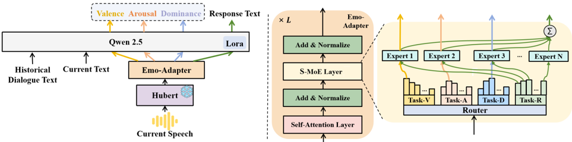

> [!abstract] Interspeech · 2025 · Conference
> **Chao et al.** (Nanyang Technological University) · [→ Paper](https://www.isca-archive.org/interspeech_2025/chao25_interspeech.html) · Demo: ? · Code: ?
>
> A-SMiLE introduces a sparse Mixture-of-Experts speech adapter for spoken dialogue, jointly training VAD (Valence-Arousal-Dominance) emotion prediction and dialogue response generation to produce emotionally coherent, contextually appropriate responses.

## Problem

Spoken dialogue systems built on large language models typically process speech through automatic transcription or a fixed speech encoder, discarding the paralinguistic signals (emotion, speaking style, affective tone) that shape conversational meaning. Existing speech adapters are optimised primarily for lexical alignment, leading to responses that are semantically plausible but emotionally misaligned with the speaker's state. The challenge is compounded by the complexity of human emotion: predefined categorical labels and standard emotion corpora fail to capture subtle shifts, sarcasm, or states such as depression that do not map cleanly onto discrete emotion classes.

## Method

A-SMiLE connects a HuBERT Large speech encoder to a Qwen2.5 LLM (0.5B or 7B) via a Cognitive-Inspired Affective Sparse Mixture-of-Experts (S-MoE) adapter. Training proceeds in two stages. In Stage 1, only the speech adapter is optimised (LLM frozen) using cross-entropy loss to align speech embeddings with the LLM's input space, using a 10,000-hour corpus of GigaSpeech, CommonVoice, and LibriSpeech. Stage 2 introduces the Emotionally Adaptive Multi-Task Learning (EAML) framework: both the S-MoE adapter and LoRA parameters within the LLM are fine-tuned jointly on DailyTalk using a combined loss that balances MSE-based VAD prediction and cross-entropy response generation.

The S-MoE adapter architecture consists of L repeated Transformer blocks, each containing a self-attention layer and a sparse MoE layer. A task-specific gating function routes input representations to different expert subsets depending on the active task: top-1 expert activation per dimension for Valence, Arousal, and Dominance prediction, and top-4 expert aggregation for response generation. This routing strategy is motivated by neuroscientific findings on functional specialisation in affective brain regions: distinct circuits regulate valence (amygdala/prefrontal cortex), arousal (vmPFC/limbic structures), and dominance (anterior insula). Dialogue history is retained over a 4-turn context window, and LoRA (rank 8) is applied exclusively to the LLM components.

## Key Results

On the DailyTalk test set with the 7B backbone, A-SMiLE achieves CCC scores of 0.63 (Valence), 0.53 (Arousal), and 0.49 (Dominance), compared to 0.46/0.37/0.31 for the text-only baseline and 0.41/0.32/0.30 for the cascaded approach. Response generation quality also improves: METEOR reaches 9.7 vs. 8.5 (text-only), ROUGE-L reaches 11.8 vs. 10.2, and GPT-4o empathy scores reach 7.1 vs. 6.0 (Table 2). On the hard-case emotional dataset (covering depression and sarcasm), A-SMiLE with Qwen2.5-7B achieves CCC V=0.48, CCC A=0.39, CCC D=0.43, outperforming Qwen-Audio (0.42/0.34/0.28) and SpeechGPT (0.33/0.30/0.21) (Table 1).

Ablation results (Table 4) show that both S-MoE and EAML contribute independently and that their combination achieves the highest scores. Using only the 6-layer Transformer adapter without either component yields METEOR 7.6 / ROUGE-L 9.7 / GPT-4o 6.1; adding S-MoE alone raises METEOR to 8.7; adding EAML alone raises it to 9.1; combining both reaches 9.7.

Qualitative analysis (Table 3) shows that competing systems (SpeechGPT, USDM, cascaded baseline) generate affirmative, encouraging responses to a speaker with a worried, hesitant tone, while A-SMiLE generates a response that acknowledges the hesitation and avoids pressure.

## Novelty Assessment

The primary contribution is the design of a speech adapter that explicitly structures its routing function around three affective dimensions drawn from Russell's circumplex model. Using sparse MoE routing for affective specialisation in a speech-LLM interface is a new combination: prior speech adapters (conv-based, Q-Former, standard Transformer) treat the adaptation as a single unified mapping. The multi-task integration of VAD regression and response generation within a joint training framework is also a new application of EAML to this architecture type.

The contribution is, however, bounded. The LLM backbone (Qwen2.5), speech encoder (HuBERT), and core LoRA and MoE mechanisms are all off-the-shelf components. The novelty lies in their configuration and the cognitively motivated routing design, rather than in any new model component. The evaluation datasets are relatively small (DailyTalk: 20 hours; hard-case set: 0.8 hours), and the absence of subjective human listening evaluations means the GPT-4o empathy scores serve as a proxy rather than a direct measure of perceived emotional appropriateness. Comparisons against established spoken dialogue systems (SpeechGPT, Qwen-Audio, USDM) are fair and on the same test set.

## Field Significance

Moderate — A-SMiLE demonstrates that structuring a speech adapter's MoE routing around neuroscientifically motivated affective dimensions yields measurable gains over flat adapters in spoken dialogue, both on standard and hard-case emotional benchmarks. The approach provides a concrete architecture template for affective-aware speech-LLM integration, but the evaluation scale and the absence of human perceptual ratings limit how broadly these gains can be claimed.

## Claims

- **supports:** Structuring speech adapter routing around distinct affective dimensions improves emotion prediction and response quality in spoken dialogue systems compared to single-path adapters.
  > *Evidence:* A-SMiLE's task-aware top-1/top-4 expert routing for VAD vs. response generation outperforms conv-based, Q-Former, and standard Transformer adapters across METEOR, ROUGE-L, and GPT-4o empathy scores on DailyTalk. *(§3.8, Table 4)*

- **supports:** Multi-task joint training of emotion regression and response generation improves both emotional alignment and text quality over response-only training in spoken dialogue.
  > *Evidence:* EAML fine-tuning (Stage 2) consistently raises CCC scores and METEOR/ROUGE-L for both 0.5B and 7B backbones over text-only and cascaded baselines that receive VAD labels as auxiliary text rather than learned representations. *(§3.6, Table 2)*

- **complicates:** Discrete categorical emotion labels are insufficient for capturing fine-grained paralinguistic states such as sarcasm and depression in spoken dialogue.
  > *Evidence:* The hard-case benchmark (sourced from IEMOCAP and MUStARD) specifically targets emotionally complex states where existing systems trained on categorical emotion corpora fail to capture nuance; A-SMiLE's CCC-based VAD modeling shows substantial gains on exactly these cases. *(§3.1, §3.5, Table 1)*

- **complicates:** Automatic text-overlap metrics (METEOR, ROUGE-L) and LLM-based empathy scoring may not fully reflect human perceptual judgments of emotional appropriateness in dialogue responses.
  > *Evidence:* The paper evaluates response quality exclusively with METEOR, ROUGE-L, and GPT-4o-1120 empathy scores; no human listening evaluation is reported, leaving open the question of whether score gains translate to perceived empathy. *(§3.2)*

## Limitations and Open Questions

The evaluation relies entirely on reference-text metrics (METEOR, ROUGE-L) and GPT-4o-based empathy scores, with no human perceptual study. The DailyTalk corpus is 20 hours of scripted dialogue between two fixed speakers and may not represent the diversity of real-world conversations. The hard-case evaluation set is small (0.8 hours). The system generates text responses rather than speech, leaving the downstream TTS step and its interaction with emotional conditioning unaddressed. Whether the cognitive specialisation motivation (routing to distinct brain-analogue experts) genuinely produces disentangled representations or is primarily a useful inductive bias remains untested analytically.

## Wiki Connections

- [[spoken-language-model|Spoken Language Model]] — A-SMiLE augments an LLM-based spoken dialogue system with structured affective perception, demonstrating how speech encoders can be connected to LLMs with task-aware routing rather than flat adapters.
- [[emotion-synthesis|Emotion Synthesis]] — the paper introduces VAD-based continuous emotion modeling as a joint training objective alongside response generation, enabling fine-grained affective conditioning beyond categorical labels.
- [[self-supervised-speech|Self-Supervised Speech]] — HuBERT Large is used as the core speech encoder whose representations are transformed by the S-MoE adapter; the paper's pipeline depends directly on self-supervised pre-training for speech feature extraction.
- [[evaluation-metrics|Evaluation Metrics]] — the paper employs CCC scores for VAD prediction, METEOR and ROUGE-L for response text, and GPT-4o empathy scoring as an automated proxy; no human listening evaluation is reported, a noted limitation relevant to how these metrics should be weighed.
- [[2305.11000|SpeechGPT]] — used as a baseline in the hard-case emotional evaluation; A-SMiLE substantially outperforms it on VAD CCC and GPT-4o empathy scores.
- [[2311.07919|Qwen-Audio]] — compared directly on the hard-case dataset; A-SMiLE surpasses it on all three VAD dimensions and response generation metrics.
- [[2508.07273|Incorporating Contextual Paralinguistic Understanding]] — related work addressing paralinguistic integration in speech-language models; shares the goal of capturing beyond-lexical cues in LLM-based dialogue.
- [[2507.18119|GOAT-SLM]] — related spoken language model work with paralinguistic and speaker characteristics; provides complementary architecture context for LLM-based spoken dialogue with affective awareness.
