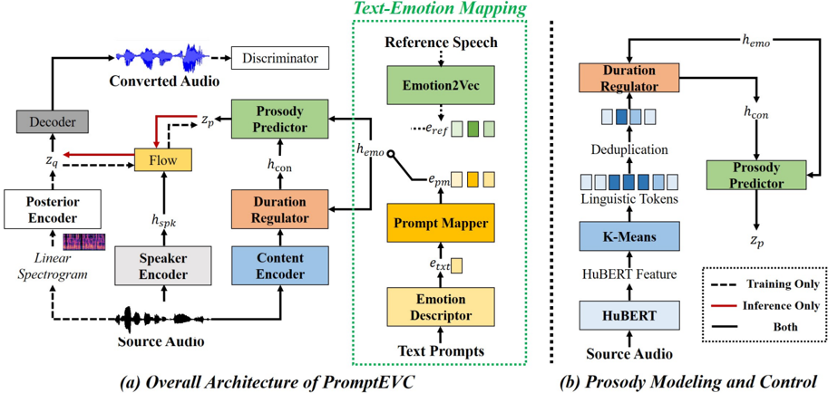

> [!abstract] Interspeech · 2025 · Conference
> **Tianhua Qi et al.** (Southeast University) · [→ Paper](https://www.isca-archive.org/interspeech_2025/qi25_interspeech.html) · Demo: ✓ · Code: ?
>
> PromptEVC enables fine-grained controllable emotional voice conversion via natural language prompts, replacing predefined labels and numeric intensity values with a diffusion-based prompt mapper trained jointly with reference emotion embeddings.

## Problem

Prior controllable emotional voice conversion (EVC) systems relied on one of three input modalities: predefined categorical labels, reference audio clips, or numeric attribute values. All three share a common failure mode: they impose a fixed control interface that does not accommodate the inherent subjectivity of emotion perception. Users who want to express gradations ("a touch of surprise," "a slightly faster and louder happy tone") cannot do so with label selectors or scalar sliders. Reference audio selection is operationally cumbersome. The field lacked a natural-language interface for EVC that could simultaneously handle emotion category, intensity, mixed emotions, pitch, speed, and volume within a single controllable system.

## Method

PromptEVC is built on a conditional variational autoencoder (CVAE) base following the VITS architecture, extended with four specialised components: a text-emotion mapping module, a prosody modeling and control pipeline, a speaker encoder with F0 constraint, and a GAN decoder for waveform reconstruction.

The text-emotion mapping module consists of two stages. An emotion descriptor uses a pre-trained RoBERTa model followed by a linear projection to convert a natural-language description into a coarse emotion embedding. This embedding is then refined by a prompt mapper — a score-based diffusion model implemented as stacked Transformer encoder layers — that is trained to predict the fine-grained emotion representation from the coarser text embedding, conditioned on reference embeddings extracted by the Emotion2Vec model (a large-scale SSL model for speech emotion). At inference, only the prompt mapper path is used; the reference speech is not required.

For prosody, the system first extracts HuBERT hidden representations and quantises them into discrete linguistic tokens via K-means (dictionary size 100). A duration regulator (six 1-D CNN layers) takes the deduplicated token sequence and predicts phoneme-level durations, capturing rhythm as a function of both linguistic content and emotion. A prosody predictor then jointly models the duration-aware content representation and the emotion embedding to synthesise pitch, duration, and energy trajectories. Speaker identity is preserved by an augmented speaker verification model trained with an F0 regression constraint (log-F0 L2 loss), discouraging identity drift when pitch is manipulated.

The model is pre-trained for 500 epochs on neutral speech from TextrolSpeech, then fine-tuned for 200 epochs on the emotional subset. Training prompts are derived from TextrolSpeech's original text descriptions, rewritten by GPT-4 to remove gender cues and add grammatical variation, covering five factors: emotional category, intensity, pitch, speed, and volume.

## Key Results

On TextrolSpeech, PromptEVC achieves MOS 4.22 (naturalness) and 81.3% emotion similarity, compared to the strongest prior baseline (Emovox) at MOS 3.95 and 76.5% similarity. Objective metrics follow the same pattern: MCD 4.70, CER 4.09%, and log-F0 RMSE 42.58, all best among the five systems tested (Table 1). The CER reduction of approximately 1 percentage point over baselines indicates fewer mispronunciations during emotional transitions.

Controllability is evaluated separately across five attributes using a pre-trained classifier (Table 2) and five human annotators (Table 3). Classification accuracy for intensity (E_in 77.6%), pitch (86.4%), speed (89.7%), and volume (91.5%) is close to ground-truth human performance (78.1%, 88.9%, 90.6%, 92.5%). Mixed-emotion accuracy (E_mx 61.3%) is lower, reflecting the inherent difficulty of synthesising compound affective states.

Ablation study confirms that all three novel components contribute: removing the prompt mapper degrades F0 RMSE by 1.29 and naturalness MOS by 0.39; removing the prosody predictor increases CER by 0.44% and MOS by 0.20; removing the speaker encoder raises F0 RMSE substantially (49.36 vs. 42.58), confirming the importance of the F0-constrained identity loss.

## Novelty Assessment

The core novelty is the diffusion-based prompt mapper that bridges a text language model embedding (RoBERTa) and a speech emotion model embedding (Emotion2Vec), trained jointly so that the text path approximates the distribution of reference audio embeddings. This joint training strategy is a meaningful architectural choice that goes beyond simply concatenating two pre-trained representations. The prosody pipeline — discrete HuBERT tokens, duration regulator, and prosody predictor — draws on established components (VITS, HuBERT units, CNN duration models) but assembles them with attention to the unique demands of emotion-conditioned rhythm control. The speaker F0 constraint is practical engineering rather than principled novelty. Overall, the paper's contribution sits at the boundary of architectural novelty and engineering integration: the individual components are largely known, but the prompt mapper training scheme and the full pipeline combination are genuinely new for EVC.

## Field Significance

Moderate — PromptEVC is the first system to apply a diffusion-based prompt mapper to emotional voice conversion, extending the natural-language control paradigm that had appeared in TTS (PromptTTS, PromptTTS 2) and style VC (PromptVC) into the emotion conversion setting. The evaluation is reasonably thorough and the controllability analysis across multiple attributes is more fine-grained than most EVC papers. The primary significance is demonstrating that text-prompt interfaces are viable and effective for emotion control in VC, a result that is likely to inform future work on unified style-and-emotion control systems.

## Claims

- Natural language prompts enable more flexible and subjectively accurate emotion control in voice conversion than numeric intensity values or reference audio selection.
- A diffusion-based mapping from text embeddings to speech emotion embeddings is sufficient to replace reference audio at inference time without significant quality loss.
- Joint training of a text-to-emotion mapper with reference emotion embeddings improves prosody naturalness over direct prediction from text alone.
- Preserving speaker identity during emotional pitch manipulation requires an explicit F0 constraint in the speaker encoder; adversarial training alone is insufficient.
- Mixed-emotion synthesis remains harder to control than single-category emotion intensity across both subjective and objective metrics.

## Limitations and Open Questions

> [!warning]
> Training and evaluation are conducted entirely on TextrolSpeech, a single corpus with a limited speaker set. Generalisation to out-of-domain speakers, languages, or acoustic conditions is untested, and all reported numbers should be interpreted within that constraint.

The evaluation uses only 25 listeners for subjective MOS across 132 utterances — a borderline sample size that may limit statistical reliability. The mixed-emotion accuracy (61.3%) is notably lower than single-attribute control, and the system's handling of complex emotional blends (e.g., contempt with happiness) is not analysed in depth. The discrete HuBERT token approach for linguistic content may introduce quantisation artefacts not reported in the paper. Future real-time or streaming deployment, mentioned in the conclusion as a direction, is not addressed in the current architecture.

## Wiki Connections

This paper advances [[voice-conversion]] with a natural-language control interface, extending the text-prompt paradigm from TTS into emotional VC. The [[emotion-synthesis]] concept directly applies, particularly regarding multi-attribute control (intensity, mixed emotions). The diffusion-based prompt mapper relates to [[diffusion-tts]] techniques applied to latent space bridging rather than waveform generation. The use of HuBERT discrete units connects to [[self-supervised-speech]] representations. Speaker identity preservation under pitch manipulation is a recurring challenge in [[disentanglement]]. The natural language prompt interface connects this work to [[instruction-conditioned-tts]] and [[prosody-control]] research.
