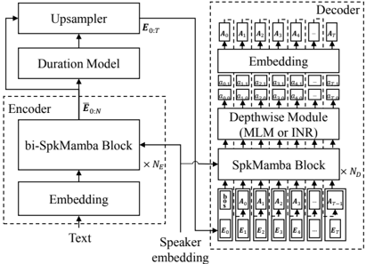
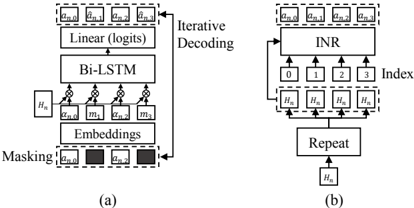

> [!abstract] Interspeech · 2025 · Conference
> **Lee et al.** (Samsung Research, Samsung Electronics) · [→ Paper](https://www.isca-archive.org/interspeech_2025/lee25h_interspeech.html) · Demo: ✓ · Code: ?
>
> A Mamba-based streaming acoustic model with two novel depthwise RVQ decoding strategies (MLM and INR) that achieves comparable or better quality than baselines 10-14x larger while supporting real-time CPU streaming with sub-70ms first-token latency.

## Problem

Neural codec TTS systems have made impressive quality gains, but their large model sizes and heavy computational requirements prevent deployment in on-device, CPU-constrained environments. Existing token-based approaches (such as VALL-E, Lee et al. 2024) require generating entire utterances before playback can begin, resulting in latencies exceeding 14 seconds. Prior Mamba-based TTS work (Small-E) applied similar architectural ideas but did not specifically address the depthwise prediction of RVQ tokens at streaming inference time. The open challenge is to close the quality gap of small, streaming-compatible models relative to large non-streaming systems while maintaining intelligibility and speaker similarity in a zero-shot setting.

## Method

The proposed system, SMAM (Streaming Mamba Acoustic Model), follows a standard TTS pipeline with an encoder-decoder structure, both built around Mamba state-space model blocks augmented with speaker conditioning (SpkMamba). The encoder processes the full phoneme sequence bidirectionally, estimates duration via a duration predictor trained with monotonic alignment search, and uses Gaussian upsampling to align the encoded representation with the acoustic token frame rate. The decoder operates autoregressively, generating one acoustic frame at a time by concatenating the previous frame's RVQ token embeddings with the current upsampled encoder state, then applying a depthwise decoding module.

Speaker conditioning uses an ECAPA-TDNN-based speaker encoder modified to accept acoustic tokens (rather than mel spectrograms), trained jointly with the acoustic model. This enables zero-shot speaker adaptation for unseen speakers at inference time.

The core contribution is two depthwise decoding strategies for predicting the multiple RVQ depth levels at each frame, where prior systems used delayed decoding (introducing latency) or sequential prediction.

The **MLM decoding** strategy (SMAM+MLM) applies masking along the depth axis of RVQ tokens during training, encouraging the model to learn inter-level dependencies. At inference, all depth tokens are initially masked and iteratively refined over three passes with top-k sampling (k=5). This improves quality but increases per-frame computation.

The **INR decoding** strategy (SMAM+INR) treats the depth indices as continuous coordinates and feeds them into a modified SegINR MLP alongside the hidden Mamba state. This predicts all quantization levels in a single forward pass, eliminating iterative refinement and yielding lower latency at a small quality cost.

The codec is HiFiCodec (grouped-RVQ, 4 codebooks in 2 groups, 24kHz, downsampled by factor 320). The full model has 25-26M parameters and was trained for 600k iterations on a single A100 GPU.

## Key Results

On LibriTTS test-clean (zero-shot, 500 utterances objective / 30 utterances subjective via AMT, 150 raters):

SMAM+MLM achieves MOS 4.02 vs. baselines ranging from 3.57 (VITS) to 4.00 (Lee et al. 2024, 263M params), with CER of 2.73% (best among all systems including ground truth at 2.33%). SMAM+INR scores MOS 3.97 and CER 3.51%. Both proposed systems outperform VALLE-X (371M, MOS 3.66, CER 6.5%) and Small-E (63M, MOS 3.59, CER 19.65%) despite being 10-14x smaller than the strongest baseline.

On efficiency, SMAM+MLM achieves RTF 0.701 and first-token latency 0.065s on a single-threaded CPU (AMD EPYC 7413). SMAM+INR further reduces RTF to 0.568 and latency to 0.061s. Non-streaming baselines range from RTF 2.4 (Small-E) to 7.7 (VALLE-X) with first-token latencies of 14-41 seconds, since they must generate full utterances before producing any output.

The ablation (SMAM+noMLM) confirms that depthwise iterative refinement is critical: removing MLM degrades all quality metrics significantly while barely affecting RTF and latency (Table 1, §4.7).

SECS scores show a divergence from SMOS: SMAM+MLM scores SECS 0.816 (below Lee et al. at 0.863) but SMOS 3.36 (above Lee et al. at 3.27), suggesting that embedding-space cosine distance does not fully capture human-perceived speaker similarity (§4.6).

## Novelty Assessment

The primary contribution is genuinely architectural: applying Mamba-based state-space sequence modeling as a streaming decoder for codec TTS, combined with two novel depthwise RVQ decoding strategies that had not previously been applied in this context. The MLM depthwise masking is a meaningful adaptation of BERT-style iterative refinement restricted to the depth axis, enabling streaming compatibility that time-axis masking approaches cannot achieve. The INR-based parallel depth prediction is a creative transfer of continuous coordinate-based representation from alignment modeling (SegINR) to quantization-level prediction.

The engineering ambition is clear: achieving on-device CPU deployment at sub-70ms latency while matching quality of non-streaming models 10x larger. However, the evaluation is limited to a single dataset (LibriTTS) and the compared baselines include one Mamba-based model (Small-E) whose architecture is closely related. The baseline comparisons are fair on quality metrics, but RTF figures are not directly comparable across systems because the baselines do not support streaming and generate entire utterances in batch mode. No code is released, which limits reproducibility.

## Field Significance

Moderate — This paper provides a concrete demonstration that Mamba-based architectures can match large Transformer/LM-based codec TTS systems in speech quality while supporting real-time CPU streaming at 25-26M parameter scale. The two depthwise decoding strategies introduce a practical design space (quality vs. speed trade-off) for RVQ-based streaming TTS, which is underexplored relative to the dominant focus on server-side generation quality. The results are relevant for on-device TTS deployment but the contribution is primarily an engineering integration of Mamba, RVQ decoding, and streaming design, rather than a paradigm shift.

## Claims

- **supports:** Mamba-based sequence models can match or exceed the quality of larger Transformer-based TTS systems while enabling real-time streaming inference on CPU hardware.
  > *Evidence:* SMAM+MLM (26M params) achieves MOS 4.02 and CER 2.73%, matching Lee et al. (2024) at 263M params (MOS 4.00, CER 4.01%) while reducing first-token latency from 26.5s to 0.065s on a single-threaded CPU. *(§4.5, §4.6, Table 1)*

- **supports:** Iterative depthwise refinement of RVQ tokens substantially improves codec TTS quality over single-pass parallel depth prediction.
  > *Evidence:* Replacing MLM depthwise decoding with a single-pass no-masking baseline (SMAM+noMLM) causes a significant drop in all quality metrics (MOS from 4.02 to 3.89, CER from 2.73% to 4.12%, UTMOS from 4.13 to 3.83) with negligible change in RTF and latency. *(§4.7, Table 1)*

- **complicates:** Objective speaker similarity metrics based on embedding cosine distance do not reliably predict subjective speaker similarity as judged by human listeners.
  > *Evidence:* SMAM+MLM scores SECS 0.816 (below Lee et al.'s 0.863) but achieves higher SMOS of 3.36 vs. 3.27, indicating a divergence between embedding-space distance and perceptual similarity that has practical implications for zero-shot TTS evaluation. *(§4.6, Table 1)*

- **supports:** Depthwise decoding strategies for RVQ present an explicit quality-speed trade-off that system designers can exploit based on deployment constraints.
  > *Evidence:* SMAM+MLM (iterative, 3 passes) achieves MOS 4.02 and RTF 0.701, while SMAM+INR (single forward pass) achieves MOS 3.97 and RTF 0.568, demonstrating a consistent quality-speed trade-off across both objective and subjective evaluations. *(§3.3, §4.5, §4.6, Table 1)*

## Limitations and Open Questions

Evaluation is limited to LibriTTS test-clean (English, read speech), leaving performance on spontaneous speech, noisy environments, and non-English languages uncharacterized. The SECS speaker similarity scores for the proposed models fall below the strongest baseline (Lee et al. 2024), indicating room for improvement in speaker faithfulness despite strong subjective SMOS scores. The paper does not release code, limiting reproducibility and adoption. RTF comparisons are not fully apples-to-apples since baselines generate complete utterances in batch mode while SMAM operates incrementally. Future directions mentioned include a fully streaming pipeline covering codec processing and applying depthwise decoding strategies to decoder-only speech language models.

## Wiki Connections

- [[autoregressive-codec-tts|Autoregressive Codec TTS]] — this paper proposes a Mamba-based autoregressive decoder that generates RVQ codec tokens frame-by-frame, with novel depthwise strategies for multi-level token prediction.
- [[streaming-tts|Streaming TTS]] — the core deployment motivation is real-time CPU streaming with sub-70ms first-token latency, directly advancing the streaming TTS design space.
- [[neural-codec|Neural Audio Codec]] — the system uses HiFiCodec with grouped-RVQ as its intermediate representation; the depthwise decoding strategies are specifically designed around the multi-level structure of RVQ codebooks.
- [[zero-shot-tts|Zero-Shot TTS]] — speaker conditioning via a jointly-trained ECAPA-TDNN encoder enables zero-shot voice cloning for unseen speakers evaluated on LibriTTS test-clean.
- [[evaluation-metrics|Evaluation Metrics]] — the paper reports CER, SECS, UTMOS, RTF, latency, MOS, and SMOS, and explicitly surfaces a divergence between SECS and SMOS as a measurement caveat.
- [[subjective-evaluation|Subjective Evaluation]] — human MOS and SMOS ratings were collected via Amazon MTurk (150 raters, 30 utterances) and are used to compare the system against stronger but larger baselines.
- [[2301.02111|VALL-E]] — used as a non-streaming baseline (371M params, MOS 3.66, CER 6.5%), demonstrating that SMAM+MLM surpasses it in quality and intelligibility at 14x lower parameter count.
