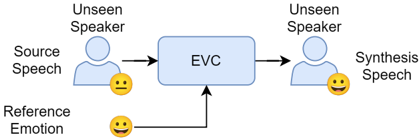

> [!abstract] Interspeech · 2025 · Conference
> **Chou et al.** · [→ Paper](https://www.isca-archive.org/interspeech_2025/chou25_interspeech.html) · Demo: ✓ · Code: ?
>
> A diffusion-based framework for zero-shot emotional voice conversion that combines mutual-information disentanglement of speaker and emotion representations with a classifier-free-style expressive guidance method at inference, enabling emotion transfer to entirely unseen speakers without speaker-specific fine-tuning.

## Problem

Most emotional voice conversion (EVC) work assumes the target speaker is known at training time — models are trained or fine-tuned on that speaker's emotional speech samples. This seen-speaker constraint severely limits real-world applicability. Prior diffusion-based approaches (e.g., EMOCONV-DIFF) achieve strong quality but weak emotion controllability, while autoencoder methods that disentangle emotion more accurately tend to produce distorted, low-naturalness outputs. The zero-shot scenario — where both source and reference speaker are entirely absent from training — remains largely unexplored in the EVC literature.

## Method

ZSDEVC builds on a diffusion-based voice conversion backbone (adapted from DiffVC) operating on mel spectrograms with HiFi-GAN as the final vocoder. The system extracts three independent representations via pre-trained encoders: a phoneme-level "average-voice" mel representation (from a transformer-based average-voice encoder) strips speaker and emotion identity from linguistic content; a speaker embedding (256-dim, from a speaker verification model) captures identity; and an emotion embedding (1024-dim, from a Wav2Vec2-Large fine-tuned for speech emotion recognition on MSP-Podcast) encodes affective state. Linear projection heads produce disentangled speaker and emotion representations.

Disentanglement is enforced during training via mutual information (MI) minimisation between the speaker and emotion projections, using the vCLUB contrastive upper-bound estimator. Two auxiliary supervised heads — one predicting speaker identity from the speaker projection, one predicting categorical emotion labels and continuous arousal/valence attributes from the emotion projection — ensure that information is not lost after disentanglement. The combined training objective is L_diff + λ_MI · L_MI + λ_style · L_style + λ_rec · L_rec.

At inference, an "expressive guidance" method modifies the score estimator in the reverse diffusion process, analogous to classifier-free guidance. A positive condition uses source linguistic content, source speaker identity, and reference emotion; a negative condition swaps out speaker (EG_spk), emotion (EG_emo), or both (EG_spk,emo). The guidance scale λ_EG = 1.25 pushes generation away from the negative direction and toward the positive target. The model is trained on 48,389 utterances from 1,381 speakers in MSP-Podcast (in-the-wild podcast recordings at 16 kHz), and evaluated on entirely held-out speakers from both MSP-Podcast and the acted ESD dataset.

## Key Results

On ESD (Table 1), ZSDEVC achieves MOS 4.342 and nMOS 3.752 against EMOCONV-DIFF's MOS 4.709 / nMOS 4.291 — lower naturalness scores overall, but ZSDEVC operates in the zero-shot scenario while the EMOCONV-DIFF result in Table 1 is under a seen-speaker setup (note the asymmetric comparison). On the subjective emotion classification accuracy (ECA), ZSDEVC reaches 0.53 vs. 0.256 for EMOCONV-DIFF, a significant advantage in actual emotion controllability. Speaker similarity (SECS 0.768 for ZSDEVC vs. 0.884 for StarGAN-EVC) is lower than seen-speaker GAN methods but acceptable for zero-shot.

Ablations in Table 2 show the disentanglement mechanism alone raises ECA by 16.8% on MSP-Podcast and 21.1% on ESD over the backbone. Adding EG_emo guidance further boosts ECA by 40.0% on MSP-Podcast and 37.4% on ESD relative to the backbone, with a slight cost in naturalness (UTMOS drops from 2.427 to 2.353 on MSP-Podcast). EG_spk,emo offers a balanced trade-off — +34.4% ECA on MSP-Podcast with moderate naturalness retention.

> [!note]
> The primary cross-system comparison in Table 1 mixes seen-speaker baselines (StarGAN-EVC, Seq2Seq-EVC, Emovox, Prosody2Vec) with unseen-speaker systems (EMOCONV-DIFF, ZSDEVC). Direct MOS comparisons across these groups should be treated with caution, as the seen-speaker baselines have access to target speaker data.

## Novelty Assessment

The architectural novelty is real but moderate. Diffusion-based VC with representation disentanglement is established, and expressive guidance is a straightforward adaptation of classifier-free guidance to the EVC setting. The specific combination — vCLUB MI minimisation, dual auxiliary supervised heads, and inference-time guidance for emotion steering — is the contribution, along with the shift to a zero-shot evaluation protocol on in-the-wild data (MSP-Podcast). The zero-shot framing and training on a large naturalistic corpus is arguably the most distinctive aspect; the components individually draw from prior work (DiffVC, EMOCONV-DIFF, Wav2Vec2-based SER). The ablation study is well-structured and directly validates each design choice.

## Field Significance

Moderate — ZSDEVC addresses a genuine gap: zero-shot generalisation in emotional VC, which most prior work sidesteps by assuming seen speakers. The result demonstrates that combining disentanglement and inference-time guidance within a diffusion backbone substantially improves emotion controllability without speaker-specific training, a useful direction for practical EVC deployment. The improvement in ECA at the cost of some naturalness relative to seen-speaker diffusion methods reflects a recurring trade-off in EVC that the field has not fully resolved.

## Claims

- Diffusion-based voice conversion systems can achieve strong emotion controllability in zero-shot settings when combined with mutual-information disentanglement and inference-time guidance.
- Disentangling speaker identity and emotion via mutual information minimisation improves emotion controllability in voice conversion without requiring parallel or speaker-specific training data.
- In emotional voice conversion, autoencoder-based methods tend to achieve higher emotion accuracy than GAN-based methods, but at the cost of substantially lower naturalness and higher speech distortion.
- Classifier-free-style guidance applied to emotion representations at inference time provides a direct lever for trading naturalness against emotion controllability in diffusion-based EVC.
- Training on large-scale in-the-wild emotional corpora enables zero-shot generalisation to speakers absent from training, even when evaluation is conducted on acted-speech datasets with different recording conditions.

## Limitations and Open Questions

> [!warning]
> The comparison between ZSDEVC and EMOCONV-DIFF in Table 1 is not fully fair: EMOCONV-DIFF is evaluated in a seen-speaker scenario while ZSDEVC operates zero-shot. The naturalness gap may reflect this experimental asymmetry rather than a fundamental quality deficit.

The model does not address intensity control within a target emotion category — prior work (Emovox) provides per-dimension arousal/valence control that ZSDEVC does not directly expose during inference. Evaluation covers only five emotion categories (angry, happy, sad, neutral, surprise) and excludes neutral-to-emotional conversion. Real-time or streaming use cases are not addressed. Results on out-of-domain acted speech (ESD) and in-the-wild speech (MSP-Podcast) show consistent trends, but the system's behaviour on highly expressive or non-English speech is untested.

## Wiki Connections

Relevant concept pages: [[voice-conversion]], [[emotion-synthesis]], [[diffusion-tts]], [[disentanglement]], [[zero-shot-tts]], [[self-supervised-speech]].
