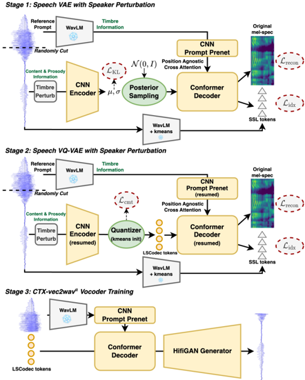

> [!abstract] Interspeech · 2025 · Conference
> **Guo et al.** · [→ Paper](https://www.isca-archive.org/interspeech_2025/guo25_interspeech.html) · Demo: ✓ · Code: ?
>
> LSCodec proposes a three-stage unsupervised training pipeline (speech VAE, VQ-VAE, token vocoder) with speaker perturbation to produce single-codebook discrete speech tokens at bitrates as low as 0.25 kbps with explicit speaker disentanglement, outperforming all single-codebook acoustic codec baselines in intelligibility and audio quality while enabling any-to-any voice conversion.

## Problem

Acoustic speech codecs such as EnCodec and DAC achieve high reconstruction quality, but typically require multiple VQ codebooks and operate at bitrates above 1 kbps. These properties force downstream speech language models to adopt complex architectural strategies (coarse-to-fine generation, delay patterns, nested prediction) and to model speaker timbre as a time-varying signal even though timbre is a global, near-constant property. Semantic tokens from self-supervised learning reduce the codebook count but discard prosody, making them unsuitable for expressive speech generation. No prior single-codebook codec had explicitly combined ultra-low bitrate with supervised-free speaker disentanglement.

## Method

LSCodec learns compact, speaker-decoupled discrete speech tokens through a three-stage pipeline, with speaker perturbation applied consistently across the first two stages.

**Speaker perturbation.** Before tokenization, each utterance is speed-shifted by a factor sampled from [0.8, 1.2] to alter its pitch and formant positions, then time-stretched back to the original duration using the WSOLA algorithm. This changes global timbre while preserving content and pitch contour, so the encoder cannot rely on timbre to minimise reconstruction loss.

**Stage 1: Speech VAE.** A CNN encoder compresses a perturbed content segment into isotropic Gaussian posteriors. A Conformer decoder reconstructs from sampled posteriors, but is also given rich timbre information via position-agnostic cross-attention over WavLM-Large embeddings extracted from a separate, un-perturbed reference prompt. The decoder predicts two targets jointly: mel-spectrogram (to capture prosody) and WavLM k-means tokens (to retain content). Because timbre is fully available in the decoder from the reference path, the information bottleneck at the posterior naturally excludes it. The loss combines KL divergence, mel reconstruction (L1), and SSL token cross-entropy.

**Stage 2: Speech VQ-VAE.** A VQ layer is inserted after the encoder, initialized from k-means centroids of the stage-1 Gaussian means. Encoder and decoder weights are resumed from stage 1 and fine-tuned with a commitment loss replacing the KL term, producing a discrete codebook of size V. Speaker perturbation continues during this stage, further restricting timbre from entering the quantized space.

**Stage 3: CTX-vec2wav alpha vocoder.** A specialized HiFiGAN-based vocoder is trained from scratch on LSCodec tokens, conditioned on WavLM reference embeddings for timbre reconstruction. This decouples waveform synthesis quality from token design and allows any-to-any voice conversion at inference by providing a different reference prompt.

Two configurations are released: LSCodec-50Hz (V=300, bitrate 0.45 kbps) and LSCodec-25Hz (V=1024, bitrate 0.25 kbps), both trained on 360 hours of LibriTTS at 24 kHz.

## Key Results

In reconstruction experiments on LibriTTS test-clean (Table 1), LSCodec-50Hz achieves WER 3.33%, MOS 4.49, and SECS 0.954 at 0.45 kbps, outperforming all single-codebook 24 kHz acoustic baselines despite having a lower bitrate: WavTokenizer-small (0.48 kbps) scores WER 7.86, MOS 4.14; TiCodec 1VQ (0.75 kbps) scores WER 10.44, MOS 3.56. GPE is slightly higher than TiCodec (2.42% vs 2.24%), but the paper argues a 1% GPE difference is inaudible while WER differences in downstream tasks are material. LSCodec-25Hz (0.25 kbps) retains competitive WER 5.46% and SECS 0.945 at bitrates 45% of the 50Hz version.

In any-to-any voice conversion experiments (Table 2), LSCodec-50Hz achieves SECS 0.852 with pitch correlation P.Corr 0.697, exceeding FACodec (supervised speaker-factorized codec at 1.60-4.80 kbps: SECS 0.774-0.822) and substantially outperforming TiCodec (SECS 0.642-0.714), which fails at speaker conversion despite implicit bottleneck design.

Speaker probing experiments confirm that LSCodec yields the lowest speaker classification accuracy among all acoustic codec baselines, validating that the quantized space encodes minimal timbre information.

Ablation results (Table 3) confirm the contribution of each design element: removing the SSL token prediction loss degrades WER from 4.96% to 11.22% in the VAE stage; skipping stage 1 training degrades both WER and SECS in the VQ-VAE stage; removing or reducing perturbation consistently reduces SECS.

## Novelty Assessment

The components individually are well-established: VAE and VQ-VAE training with information bottlenecks, position-agnostic cross-attention for timbre conditioning (from CTX-vec2wav), WavLM embeddings as timbre features, and HiFiGAN-based vocoders. The contribution is architectural integration: LSCodec is the first single-codebook codec to combine (1) explicit unsupervised speaker perturbation, (2) SSL token prediction as a content preservation auxiliary task, and (3) multi-stage VAE initialization for VQ stability. This combination produces speaker disentanglement that prior implicit-bottleneck single-codebook codecs (TiCodec, SingleCodec) fail to achieve. The claim of being "unsupervised" holds because no speaker labels are used; the SSL model itself was pre-trained externally but requires no labeling of the LSCodec training data.

## Field Significance

Moderate — LSCodec provides concrete evidence that unsupervised speaker disentanglement and ultra-low bitrate coding are complementary rather than conflicting objectives in single-codebook codec design. The system's ability to reduce bitrate below 0.5 kbps while outperforming baselines on intelligibility offers a practical codec option for downstream speech language models that would benefit from separating speaker-invariant content tokens from speaker identity, allowing simpler autoregressive objectives.

## Claims

- **supports:** Explicit speaker perturbation during codec training is more effective for speaker disentanglement than relying on implicit information bottleneck alone.
  > *Evidence:* LSCodec achieves higher target-speaker SECS (0.852 at 50Hz) and lower speaker probing accuracy than TiCodec 1VQ (SECS 0.714), which uses an implicit VQ bottleneck without any perturbation, even though LSCodec operates at lower bitrate (0.45 kbps vs 0.75 kbps). *(§3.3, Table 2; §3.4)*

- **supports:** Single-codebook discrete speech codecs can match or exceed multi-codebook acoustic codec reconstruction quality at ultra-low bitrates when content and speaker information are explicitly decoupled.
  > *Evidence:* LSCodec-50Hz (V=300, 0.45 kbps) achieves WER 3.33% and MOS 4.49 on LibriTTS test-clean, outperforming all single-codebook baselines including WavTokenizer-small (WER 7.86, MOS 4.14 at 0.48 kbps) and multi-codebook SemantiCodec (WER 4.16 at 0.63 kbps). *(§3.2, Table 1)*

- **complicates:** Reducing codec frame rate through temporal downsampling degrades content intelligibility without proportional improvement in speaker disentanglement.
  > *Evidence:* Halving the frame rate from 50Hz to 25Hz reduces bitrate from 0.45 to 0.25 kbps but increases reconstruction WER from 3.33% to 5.46% and VC WER from 4.04% to 6.32%, while reconstruction SECS changes only marginally (0.954 to 0.945). *(§3.2, Table 1; §3.3, Table 2)*

- **refines:** An auxiliary SSL token prediction objective is necessary for maintaining content intelligibility when an information bottleneck is used to remove speaker timbre.
  > *Evidence:* Ablating the SSL token prediction loss increases VAE-stage WER from 4.96% to 11.22% while SECS remains essentially unchanged (0.811 to 0.811), confirming that the SSL prediction task guides content encoding independently of the speaker removal objective. *(§3.5, Table 3)*

- **supports:** Multi-stage codec training, establishing a continuous disentangled space before quantization, improves both content preservation and speaker disentanglement compared to direct VQ training.
  > *Evidence:* Skipping stage 1 (VAE pre-training) and training VQ-VAE directly degrades WER from 3.39% to 3.84% and SECS from 0.817 to 0.800 in the VQ-VAE stage, confirming that continuous-space initialization benefits discrete representation quality. *(§3.5, Table 3)*

## Limitations and Open Questions

The model is evaluated exclusively on English LibriTTS data, leaving multilingual and cross-lingual generalization untested. The vocoder (CTX-vec2wav alpha) is trained on a fixed 24 kHz corpus, so quality at other sampling rates or in noisy conditions is unclear. Speaker probing uses a single X-vector classifier on LibriTTS speakers, which may not detect all forms of residual speaker information. The paper notes that stronger perturbation methods, better content preservation at 25Hz, and scaling to larger data are open directions. No code or pre-trained models are released.

## Wiki Connections

- [[neural-codec|Neural Audio Codec]] — LSCodec advances the state of single-codebook codec design by achieving sub-0.5 kbps bitrates with explicit speaker disentanglement, offering a practical building block for speech language models.
- [[disentanglement|Disentanglement]] — the paper's core contribution is an unsupervised training framework that factorizes speaker timbre from content and prosody using speaker perturbation and information bottleneck in the codec space.
- [[voice-conversion|Voice Conversion]] — LSCodec doubles as an any-to-any VC system by conditioning the vocoder on a target reference prompt, outperforming VC-specialized codecs such as FACodec on speaker similarity.
- [[self-supervised-speech|Self-Supervised Speech]] — WavLM-Large is a core architectural component providing both timbre conditioning (cross-attention on WavLM embeddings) and SSL token prediction targets that guide content encoding during training.
