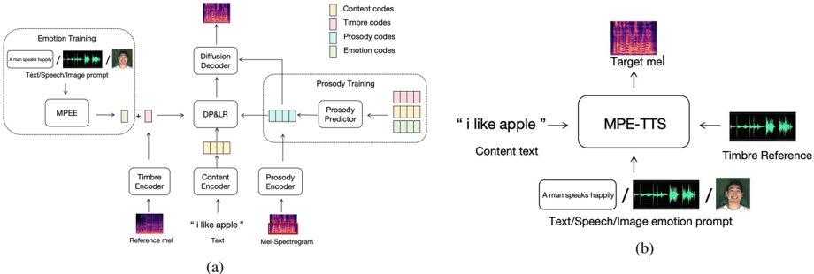

> [!abstract] Interspeech · 2025 · Conference
> **Wu et al.** · [→ Paper](https://www.isca-archive.org/interspeech_2025/wu25g_interspeech.html) · Demo: ✓ · Code: ?
>
> MPE-TTS is a zero-shot TTS system that accepts emotion prompts from any of three modalities (text description, facial image, or speech clip), enabling fine-grained emotion control independently of speaker timbre through hierarchical speech attribute disentanglement.

## Problem

Zero-shot TTS systems typically accept a single prompt modality to control speaker style, which entangles timbre, emotion, and prosody into one representation and limits fine-grained customisation. Systems that do support text or speech prompts independently still struggle to allow users to specify emotion separately from speaker identity. The only prior multi-modal ZS-TTS system (MM-TTS, AAAI 2024) showed limited emotion-specific generation capability, partly because it unified all style attributes into a single latent space without explicitly isolating emotion, making it harder to preserve emotion information through the acoustic model.

## Method

MPE-TTS structures speech into four attributes at two granularity levels. Coarse-grained features (timbre and emotion) are modeled as global vectors because they are relatively stable within a speech segment. Fine-grained features (content and prosody) are modeled at the frame level to capture their temporal variation. Timbre is extracted from a random utterance of the target speaker via an ECAPA-TDNN-style speaker encoder. Content is modeled with a 5-layer conformer encoder (512-dimensional). Prosody is captured via a VQ-based encoder operating on the lower 20 mel-spectrogram bins, which carry prosodic variation while containing significantly less timbre and content information than the full band. Emotion is extracted from an input prompt by the Multi-Modal Prompt Emotion Encoder (MPEE).

The MPEE provides a unified emotion representation regardless of prompt modality. For speech prompts, a pretrained Emotion2Vec+ Large model extracts emotion embeddings directly. For text and image prompts, CLIP encoders are followed by learnable adapter layers, and an MSE loss trains these adapters to match the Emotion2Vec speech embedding of the corresponding labeled emotion. This alignment objective brings text and image emotion representations into the same space as speech-derived ones, so any modality can be selected at inference.

An autoregressive prosody predictor (8 Transformer decoder layers, 8 attention heads, 768-dimensional) generates VQ prosody codes conditioned on content, timbre, and emotion, using teacher-forcing cross-entropy loss. An Emotion Consistency Loss (ECL) adds an auxiliary emotion classifier over the predicted prosody codes, training the predictor to maintain the emotion signal in the resulting prosody sequence. At inference, prosody is predicted from content and the chosen emotion embedding rather than extracted from a reference utterance. The acoustic model uses a U-Net diffusion decoder to generate mel-spectrograms from content, timbre, and prosody representations; a pretrained HiFi-GAN converts spectrograms to waveform.

Training proceeds in three sequential stages: MPEE training on MEAD-TTS (100 epochs), acoustic model pretraining on LibriTTS (500k steps) followed by fine-tuning on MEAD-TTS (50 epochs), then prosody predictor training on MEAD-TTS (50 epochs).

## Key Results

On the MEAD-TTS test set (6 held-out speakers), MPE-TTS achieves MOS 3.73, ESMOS (emotion similarity MOS) 4.05, SSMOS (speaker similarity MOS) 3.73, WER 23.4%, and emotion accuracy 48% in the speech-prompt condition (Table 1). This compares favourably to MM-TTS (MOS 3.55, ESMOS 3.75, WER 31.2%, ACC 41%) and GenerSpeech (MOS 3.53, ESMOS 3.63, ACC 38%). Ground-truth mel-spectrograms achieve MOS 4.05 and ACC 54%, indicating a meaningful quality gap remains. For text and image prompts (Tables 2 and 3), MPE-TTS similarly outperforms MM-TTS across all metrics, with ESMOS 3.85 vs. 3.63 (text) and 3.90 vs. 3.53 (image).

Ablations confirm the contribution of each component. Removing the MPEE module drops MOS from 3.73 to 3.20 and emotion accuracy from 48% to 35% in speech-prompt mode. Removing ECL reduces ESMOS from 4.05 to 3.83 and ACC from 48% to 45%. The ECL effect is more pronounced in text and image conditions, where the direct emotion signal is weaker and the prosody predictor has more freedom to drift from the intended emotion.

The MM-TTS comparison is based on a reproduction rather than an official release, which limits the reliability of the numerical gaps.

## Novelty Assessment

The MPEE's approach of aligning text and image emotion embeddings to Emotion2Vec speech embeddings via MSE loss is a clean and practical design that has not appeared in prior TTS work. The ECL is a simple but well-motivated auxiliary objective that explicitly targets the emotion-prosody alignment problem. The hierarchical disentanglement strategy is more carefully specified than MM-TTS's unified latent space, with separate bottlenecks and input designs for each attribute type.

The paper is nonetheless incremental relative to MM-TTS, which introduced the multi-modal zero-shot TTS concept. Each individual component (conformer encoder, ECAPA-TDNN speaker encoder, diffusion decoder, AR prosody predictor, Emotion2Vec, CLIP) is adopted from prior work. The training pipeline and VQ prosody encoding also draw on established techniques. The primary contribution is the design of the emotion encoder and ECL rather than a new architectural paradigm. The evaluation is confined to MEAD-TTS (36 hours, English), and the absent MM-TTS open-source code makes replication difficult.

## Field Significance

Moderate — MPE-TTS advances the nascent area of multi-modal emotion-prompted zero-shot TTS, demonstrating that explicit emotion disentanglement from timbre and content, paired with an emotion consistency training objective for prosody prediction, produces measurable gains in emotion fidelity. The ECL provides a concrete mechanism for preserving emotion through an autoregressive prosody prediction step, a challenge that prior work had not directly addressed. The contribution is bounded by the limited scale of available emotional speech data and the single multi-modal baseline.

## Claims

- **supports:** Unified multi-modal emotion encoders that align different prompt modalities to a shared emotion representation space enable flexible emotion control in zero-shot TTS without sacrificing speaker similarity.
  > *Evidence:* MPEE ablation shows removing the multi-modal encoder drops MOS from 3.73 to 3.20 and emotion accuracy from 48% to 35% in speech-prompt mode; SSMOS (3.73) is maintained even when emotion and timbre are drawn from different speakers. *(§2.2, §3.4, Table 1)*

- **supports:** Auxiliary emotion consistency losses applied to autoregressive prosody prediction improve emotion alignment in generated speech.
  > *Evidence:* ECL ablation reduces ESMOS from 4.05 to 3.83 and ACC from 48% to 45% in speech-prompt mode; the gain is larger for text and image prompts (ESMOS drops from 3.85 to 3.73 and from 3.90 to 3.75 respectively), where the emotion signal is less direct. *(§2.3, §3.4, Tables 1–3)*

- **complicates:** Emotion accuracy in expressive zero-shot TTS remains substantially below ground truth even with explicit emotion conditioning and auxiliary training objectives.
  > *Evidence:* Best system ACC is 48% vs 54% for ground-truth mel-spectrograms; the 6-point gap persists despite MPEE and ECL, indicating that fine-grained emotion control is not yet solved at this data scale. *(§3.4, Tables 1–3)*

- **complicates:** Evaluating multi-modal TTS systems against prior work is complicated by the absence of official open-source implementations for key baselines.
  > *Evidence:* MM-TTS has no official open-source release; all comparisons in this paper are against a reproduction based on the original paper's settings, which the authors acknowledge as a limitation of the experimental evaluation. *(§3.4)*

- **supports:** Hierarchical disentanglement of speech attributes at different granularity levels enables fine-grained independent control over timbre and emotion in zero-shot TTS.
  > *Evidence:* The disentangling strategy separates coarse-grained features (timbre, emotion as global vectors) from fine-grained features (content, prosody at frame level), using distinct bottleneck designs; SSMOS remains stable (3.73–3.76) across all three prompt modalities despite using different emotion sources from the timbre reference. *(§2.1, §3.4, Tables 1–3)*

## Limitations and Open Questions

> [!warning]
> The primary baseline comparison (MM-TTS) is based on the authors' own reproduction rather than an official implementation, as MM-TTS has no public open-source release. Observed performance differences cannot be independently verified without access to the original system.

Scalability is explicitly flagged as a limitation: MPE-TTS is fine-tuned on 36 hours of MEAD-TTS (48 actors, 8 emotions), and the authors note that larger emotional corpora and increased model scale would be needed to improve generalisation. The system evaluates only English speech, and multilingual emotional expressiveness is unexplored. At inference, only one emotion modality can be provided (no multi-modal fusion); exploring how to combine cues from multiple modalities simultaneously remains an open direction. WER performance is noticeably worse than ground-truth reconstructed mel (23.4% vs. 18.8%), suggesting the emotion-conditioning mechanism introduces some degradation in intelligibility.

## Wiki Connections

- [[zero-shot-tts|Zero-Shot TTS]] — MPE-TTS extends the zero-shot paradigm to support unseen speakers via reference speech for timbre while allowing emotion to be controlled independently through a separate multi-modal prompt.
- [[emotion-synthesis|Emotion Synthesis]] — the paper's primary contribution is the MPEE and ECL, which together improve emotion fidelity in synthesised speech relative to single-modal and multi-modal baselines.
- [[diffusion-tts|Diffusion TTS]] — the acoustic model uses a U-Net diffusion decoder to generate target mel-spectrograms from disentangled speech representations.
- [[disentanglement|Disentanglement]] — the hierarchical disentanglement strategy is the paper's structural foundation, separating content, timbre, emotion, and prosody into independent representations using distinct encoders and information bottlenecks.
- [[subjective-evaluation|Subjective Evaluation]] — human listener evaluations include MOS for naturalness, ESMOS for emotion similarity, and SSMOS for speaker similarity, all at the 5-point scale with 95% confidence intervals.
- [[evaluation-metrics|Evaluation Metrics]] — WER (Whisper-Large), emotion accuracy (wav2vec 2.0-based SER classifier), ESMOS, and SSMOS collectively assess multiple axes of synthesis quality.
- [[2301.02111|VALL-E]] — cited as a foundational zero-shot TTS approach using neural codec language models; provides context for the zero-shot generation setting that MPE-TTS extends toward multi-modal emotion control.
