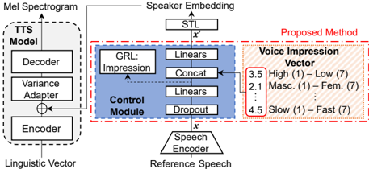

> [!abstract] Interspeech · 2025 · Conference
> **Fujita et al.** (NTT) · [→ Paper](https://www.isca-archive.org/interspeech_2025/fujita25_interspeech.html) · Demo: ✓ · Code: ?
>
> Proposes a zero-shot TTS method that controls perceived voice impressions via an 11-dimensional antonym-pair vector, using adversarial disentanglement to separate impression information from speaker identity, with optional LLM-based mapping from natural language style descriptions.

## Problem

Zero-shot TTS systems generate natural speech conditioned on a reference audio clip but have little ability to adjust the perceived character of the voice beyond what the reference already conveys. Speaker embeddings extracted from reference speech entangle pitch, rhythm, speaking style, and impression-related attributes, making it difficult to modify any single characteristic without disturbing the rest. Existing controllability approaches fall into two camps: disentanglement methods that separate only basic prosodic features (content, pitch, duration), and emotion-based methods that cover only a narrow subset of voice impressions. Text-based conditioning methods aim for broader stylistic diversity but tend to control speaker identity and style simultaneously rather than enabling fine-grained impression adjustment for a given target speaker.

## Method

The proposed system builds on a FastSpeech2 backbone encoder-decoder TTS model. A HuBERT BASE model (pre-trained on ReazonSpeech, a large Japanese corpus) extracts frame-level speech representations from the reference audio, which are aggregated into a 384-dimensional speaker embedding via a bidirectional LSTM, an attention mechanism, and a Style Token Layer (STL). Waveform synthesis uses HiFi-GAN (V1).

The core contribution is a control module inserted between the speaker encoder and the TTS model. The module pursues two goals. First, it removes impression-correlated information from the speaker embedding using a gradient reversal layer (GRL) trained adversarially against an impression classifier, combined with a high dropout rate of 0.8 to further discourage the embedding from carrying impression-specific signal. Second, it reintroduces impression information via an 11-dimensional voice impression vector: each dimension represents the degree of an antonym pair, covering ten perceptual quality dimensions (High-Low pitched, Masculine-Feminine, Clear-Hoarse, Calm-Restless, Powerful-Weak, Youthful-Elderly, Thick-Thin, Tense-Relaxed, Dark-Bright, Cold-Warm) plus one acoustic dimension (Slow-Fast speaking rate). Both the speaker embedding and impression vector are projected to 32 dimensions before concatenation.

Training proceeds in three stages: backbone pre-training (200k steps, Adam/Noam), GAN-based quality fine-tuning (200k steps, fixed learning rate 0.001), and control module training (50k steps with all other modules frozen, adversarial GAN loss applied alongside GRL).

The impression vectors used as training targets were obtained via crowdsourced subjective evaluation of 1,154 speakers (10-participant average per utterance on a 7-point Likert scale), with a HuBERT-based estimator used to propagate labels to the remaining 19,116 speakers in the 1,800-hour dataset.

An LLM-based pathway (ChatGPT-4o) enables impression vectors to be generated automatically from free-form natural language descriptions. The LLM receives a structured prompt defining each dimension and its current pre-modulation values, then outputs target scores; users can optionally refine the resulting vector manually.

## Key Results

**Objective impression control (§4.1, Figure 3):** Modulating each of the 11 impression dimensions individually (range -3 to +3 relative to the reference) produces consistent monotonic changes in the estimated impression for both a female (Speaker 1) and a male (Speaker 2) held-out speaker, confirming that vector changes map to perceptual changes.

**Speaker similarity (§4.1, Figure 5):** Cosine similarity to the target speaker (Resemblyzer) decreases with modulation magnitude but remains above the distribution of different speakers of the same gender even at ±3, the maximum tested level. Some outliers arise from extreme pitch modulation (Masculine-Feminine dimension).

**Subjective impression scores (§4.2, Table 2):** Listeners' 7-point impression ratings shift in the expected direction and increase with modulation width. The Youthful-Elderly dimension shows the strongest shift (3.35 at -3 to 5.70 at +3 for Speaker 1), while other dimensions show more moderate but consistent movement.

**Naturalness (§4.2, Table 3):** MOS at zero modulation is 3.72 (Speaker 1) and 3.61 (Speaker 2). Extreme modulation levels cause degradation, with MOS reaching as low as 2.71 (Speaker 1, Dark-Bright at -3) and 2.78 (Speaker 2, Dark-Bright at +3). The authors attribute this to the unnaturalness of strongly incongruent voice combinations such as "feminine male."

**LLM-based generation (§4.3, Table 4):** In AB preference tests with 436 crowdsourced participants, LLM-generated impressions are preferred over unmodulated speech 94.6% vs. 5.4% for "sleepy" and 74.6% vs. 25.4% for "urgent, attention-grabbing."

## Novelty Assessment

The core novelty is the control module architecture: using a GRL to adversarially remove impression information from the speaker embedding, then injecting a separate low-dimensional impression vector, is a structurally novel approach to voice impression control in zero-shot TTS. Prior work used voice impressions in HMM-based TTS (Tachibana et al., 2006) via parameter adaptation, which does not transfer to neural zero-shot settings. Emotion-based zero-shot TTS methods cover a narrower perceptual space than the 11-dimension impression design here.

The system-level architecture (FastSpeech2 + HuBERT encoder + Style Token Layer + HiFi-GAN) is entirely composed of established components. The LLM integration for impression vector generation is engineering adaptation of the LLM-grounded image generation paradigm.

The evaluation has significant limitations: all data is proprietary (in-house Japanese corpus), the test set covers only two speakers, and there are no comparisons to any neural baseline with controllability. The 11 impression dimensions show substantial intercorrelation (Table 1), with some pairs reaching 0.8; this is documented but not addressed.

## Field Significance

Moderate -- This paper addresses a real gap in zero-shot TTS controllability: the ability to adjust perceived voice characteristics beyond what a reference clip provides, at a finer granularity than emotion labels. The GRL-based impression disentanglement approach can serve as a component design pattern for future controllability work. Its contribution is constrained by proprietary Japanese-only data, a two-speaker evaluation, and the absence of neural baselines with comparable controllability, making it difficult to benchmark the method's true utility against alternatives.

## Claims

- **supports:** Adversarial disentanglement via a gradient reversal layer can separate voice impression information from speaker identity in a zero-shot TTS speaker encoder, enabling independent modulation of perceived voice characteristics.
  > *Evidence:* The control module applies GRL + 0.8 dropout to the speaker embedding to remove impression signal, then reintroduces it via an 11-dim impression vector; cosine similarity to the target speaker remains above the inter-speaker distribution at all tested modulation levels. *(§2.2, §4.1, Figure 5)*

- **supports:** LLMs can generate low-dimensional speech style parameter vectors from free-form natural language descriptions, providing a usable zero-shot interface for voice characteristic control.
  > *Evidence:* ChatGPT-4o prompted with dimension definitions and pre-modulation values produces impression vectors preferred over unmodulated speech in 94.6% of "sleepy" trials and 74.6% of "urgent, attention-grabbing" trials (n=436, crowdsourced). *(§2.3, §4.3, Table 4)*

- **complicates:** Fine-grained impression control in TTS involves a trade-off: stronger modulation produces more perceptually distinct impressions but degrades naturalness, particularly when the target impression is socially incongruent with the source speaker.
  > *Evidence:* MOS naturalness at maximum modulation (±3) falls to 2.71-2.88 for the Powerful-Weak and Dark-Bright dimensions, compared to 3.61-3.72 at zero modulation; low-scoring samples correspond to combinations such as "feminine male" or "strongly dark/bright." *(§4.2, Table 3)*

- **complicates:** Automatic annotation of high-dimensional perceptual voice attributes at training scale requires indirect labeling pipelines that introduce estimation error, limiting the precision of supervision.
  > *Evidence:* Crowdsourced subjective ratings were collected for only 1,154 of 20,270 speakers; an HuBERT-based estimator extrapolated labels to the remaining data with an RMSE of 0.338 on held-out utterances. *(§3.2)*

## Limitations and Open Questions

> [!warning]
> All training and evaluation data is a proprietary in-house Japanese corpus; no public datasets are used, and the evaluation spans only two held-out speakers. The results are not directly reproducible, and generalization to other languages, speaking domains, or TTS architectures is untested.

Eleven impression dimensions exhibit substantial inter-correlation (Table 1 reports correlations up to 0.8, e.g., Thick-Thin vs. High-Low Pitched), which means independent perceptual dimensions are not fully captured by the vector design. The paper demonstrates stable simultaneous two-dimension modulation but does not test combinations across weakly correlated dimensions at extreme values.

No ablation is reported for the GRL component alone versus the dropout component; the relative contribution of each disentanglement mechanism to impression controllability is unclear. The evaluation uses the impression estimator (trained on the same data pipeline) as the primary objective metric, creating circularity between the data labeling and the evaluation.

Future directions noted by the authors include applying voice impression constraints to neural audio codecs, following the factorized-codec approach of NaturalSpeech 3.

## Wiki Connections

- [[zero-shot-tts|Zero-Shot TTS]] -- this paper extends the zero-shot TTS paradigm by adding impression controllability on top of speaker identity cloning from a reference clip.
- [[disentanglement|Disentanglement]] -- the control module explicitly separates impression attributes from speaker identity using a gradient reversal layer and high-ratio dropout as the disentanglement mechanism.
- [[prosody-control|Prosody Control]] -- the 11-dimensional impression vector encompasses pitch-related (High-Low, Masculine-Feminine) and rate-related (Slow-Fast) attributes, providing explicit control over these properties independent of content.
- [[emotion-synthesis|Emotion Synthesis]] -- the paper positions voice impression control as a superset of emotion-based TTS conditioning, covering perceptual attributes not captured by discrete emotion labels.
- [[instruction-conditioned-tts|Instruction-Conditioned TTS]] -- LLM-based mapping from natural language style descriptions to impression vectors provides a natural language interface for voice characteristic control without requiring expert vector tuning.
