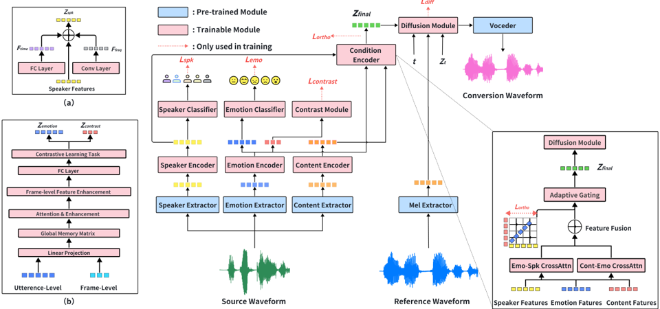

> [!abstract] Interspeech · 2025 · Conference
> **Su et al.** · [→ Paper](https://www.isca-archive.org/interspeech_2025/su25c_interspeech.html) · Demo: ✓ · Code: ?
>
> DiffEmotionVC proposes a diffusion-based any-to-any emotional voice conversion framework that combines a dual-granularity emotion encoder (utterance-level and frame-level) with an orthogonality-constrained condition encoder to disentangle emotion, speaker, and content representations.

## Problem

Emotional voice conversion requires modifying the emotional state in speech while preserving the speaker's identity and linguistic content, but emotion features are deeply entangled with both. Prior GAN-based approaches (CycleGAN-EVC, StarGAN-EVC) established basic cross-emotion conversion but lacked robustness for unseen speakers. More recent diffusion-based any-to-any methods adopted mutual information (MI) disentanglement losses, which are unstable during training. Conventional emotion feature extraction relying on filter banks or MFCCs lacks content-aware representations, while general-purpose self-supervised speech models are not optimised for emotion tasks. Single-scale emotion representations capture either global prosodic trends or local phoneme-level detail, but not both simultaneously.

## Method

DiffEmotionVC takes source speech (carrying source speaker identity and emotion) and a reference utterance (carrying the target emotion) and converts the source to output speech with the source speaker identity and the target emotion. The framework has three specialised feature extraction and encoding pathways.

The **speaker encoder** takes 256-dimensional embeddings from a pre-trained Resemblyzer model and processes them through parallel time-domain (FC layer) and frequency-domain (convolutional layer) paths, combining them into a 384-dimensional speaker representation with a residual shortcut.

The **content encoder** uses pre-trained ContentVec to extract 256-dimensional features (which already separate content from speaker) and projects them to 384 dimensions via a single fully connected layer.

The **dual-granularity emotion encoder** extracts both utterance-level and frame-level features from pre-trained emotion2vec. These are projected to a unified dimension and combined with a learned, normalised global memory matrix via attention weighting, then passed through a Transformer. The attention over global memory enhances frame-level features with global context. During pre-training on Emilia (2.2k hours, no emotion labels), the encoder learns via contrastive learning; on ESD with emotion labels, it trains with classification and contrastive objectives jointly.

The **condition encoder** fuses all three representations using two cross-attention operations: Content-Emotion attention (content as query, emotion as key/value) and Emotion-Speaker attention (emotion as query, speaker as key/value). An adaptive gating mechanism combines the emotion-enhanced features and other modalities using learned sigmoid weights. To prevent feature entanglement, an orthogonality loss measured via the Frobenius norm penalises correlation between the content-emotion and emotion-speaker feature pairs.

The final fused representation conditions a DDPM-based diffusion model for conditional Mel-spectrogram generation, with a pre-trained HiFi-GAN vocoder reconstructing the waveform. The multi-objective training loss combines the diffusion L2 reconstruction loss, speaker classification cross-entropy, emotion classification cross-entropy, contrastive loss, and orthogonality constraint loss.

## Key Results

Results are evaluated on the ESD dataset with 50 human participants rating 50 speech pairs on 5-point Likert scales for quality (MOS), naturalness (nMOS), and emotional similarity (sMOS). Objective metrics include UTMOS, DNSMOS, speaker embedding cosine similarity (SECS), WER (Whisper), and Emotion Classification Accuracy (ECA) with Pearson correlation (Corr) via emotion2vec.

On the primary emotion conversion metrics, DiffEmotionVC achieves 80% ECA and 0.78 Corr, outperforming all baselines with reported ECA (Any-to-Any-EVC at 33%, Prosody2Vec at 89% ECA but 0.65 Corr). On UTMOS, the system scores 4.04, matching ground truth at 3.72 and marginally below StableVC at 4.06. For subjective quality, MOS is 3.95 (±0.01), slightly below Any-to-Any-EVC (4.02) and above StarGAN-EVC (3.88) and StableVC (3.88). On sMOS (emotional similarity), the system achieves 4.10 (±0.05), outperforming all baselines including StableVC (4.04). SECS of 0.73 reflects good speaker preservation, comparable to ground truth (0.74) and better than StableVC (0.64). WER of 2.00 demonstrates strong intelligibility preservation.

Ablation results confirm that each component contributes: removing the emotion encoder drops Corr from 0.78 to 0.38; removing the speaker encoder reduces SECS from 0.73 to 0.32; replacing cross-attention fusion with additive fusion degrades UTMOS from 4.04 to 3.26. For content feature extraction, continuous ContentVec strongly outperforms discretised variants: VQ-ContentVec (UTMOS 2.54, Corr 0.50) and SpeechTokenizer RVQ1 (UTMOS 1.79) both suffer from content-emotion leakage.

## Novelty Assessment

The dual-granularity emotion encoder is genuinely novel in its application to EVC, specifically the combination of utterance-level and frame-level emotion2vec features with a global memory matrix and attention weighting. The orthogonal loss for feature disentanglement is an established technique in representation learning, applied here in a principled way to the three-attribute (emotion/speaker/content) decomposition problem. The multi-objective training combining five loss terms is a practical engineering choice rather than a conceptual advance.

The strongest competitors in the comparison are StableVC and Any-to-Any-EVC. Results are mixed: DiffEmotionVC achieves substantially better ECA (80% vs. 33% for Any-to-Any-EVC) and better sMOS (4.10 vs. 3.16), but UTMOS and MOS are comparable or slightly below. The ablation study uses only the ESD Chinese angry subset, limiting the generalisability of component-level conclusions to other languages and emotion categories.

## Field Significance

Moderate — DiffEmotionVC provides a principled architecture for any-to-any emotional voice conversion by separating emotion representation into dual granularities and enforcing orthogonal feature independence. The orthogonality-constrained framework demonstrates that explicit geometric constraints on feature spaces are more stable than mutual information-based disentanglement during training. The result is a practically competitive EVC system, though the overall paradigm (diffusion backbone with SSL-derived feature extractors and cross-attention fusion) builds on established components rather than introducing a new generative direction.

## Claims

- **supports:** Dual-granularity emotion feature extraction (combining utterance-level and frame-level representations) improves emotion discriminability in voice conversion compared to single-scale approaches.
  > *Evidence:* DiffEmotionVC's dual-granularity emotion encoder achieves 80% ECA and 0.78 Pearson Corr on the ESD dataset; ablation confirms removing the emotion encoder is the most damaging intervention, dropping Corr to 0.38. *(§2.1.3, §3.3.3, Table 3)*

- **supports:** Orthogonality constraints on emotion, speaker, and content feature spaces provide a stable and effective disentanglement mechanism for emotional voice conversion.
  > *Evidence:* Removing orthogonal loss reduces SECS from 0.73 to 0.70 and Corr from 0.78 to 0.72; the paper explicitly motivates orthogonal loss as a remedy for the training instability of the mutual information loss used in prior work. *(§2.2.2, §3.3.3, Table 3)*

- **complicates:** Diffusion-based EVC systems achieve strong overall emotion accuracy but struggle to discriminate between high-arousal emotions sharing similar arousal-valence profiles.
  > *Evidence:* DiffEmotionVC reaches 80% ECA overall but the paper notes difficulty distinguishing happy, surprised, and angry, attributing this to insufficient emotional diversity in the ESD training data rather than a fundamental model limitation. *(§3.3.1)*

- **complicates:** Discretisation of continuous speech representations degrades emotion voice conversion by introducing content-emotion feature leakage.
  > *Evidence:* Replacing continuous ContentVec with VQ-ContentVec drops UTMOS from 4.04 to 2.54 and Corr from 0.78 to 0.50; SpeechTokenizer RVQ1 discrete features produce the worst performance (UTMOS 1.79), demonstrating that discrete tokens cause timbre and emotion entanglement. *(§3.3.2, Table 2)*

- **supports:** Cross-attention fusion outperforms additive fusion for integrating heterogeneous speech features in voice conversion systems.
  > *Evidence:* Ablation replacing gated cross-attention with simple additive fusion reduces UTMOS from 4.04 to 3.26, a 19% degradation in predicted audio quality. *(§3.3.3, Table 3)*

## Limitations and Open Questions

Evaluation is limited to the ESD dataset (five emotions, primarily Mandarin Chinese; the ablation table specifically targets the zh-Angry subset), restricting generalisability to other languages and broader emotion categories. The model size is unreported, making deployment trade-off analysis impossible. Distinguishing between high-arousal emotions (happy, surprised, angry) remains unresolved; the paper identifies more naturalistic emotional data as the likely remedy but leaves this to future work. No code is released, and there is no cross-lingual evaluation.

## Wiki Connections

- [[voice-conversion|Voice Conversion]] — DiffEmotionVC extends voice conversion to the emotional dimension using any-to-any conversion with diffusion, addressing the speaker-emotion-content entanglement problem.
- [[emotion-synthesis|Emotion Synthesis]] — The dual-granularity emotion encoder and orthogonality constraints represent a dedicated architectural solution for accurate emotion representation and transfer in speech.
- [[diffusion-tts|Diffusion TTS]] — DiffEmotionVC uses a DDPM-based diffusion model conditioned on disentangled feature representations for conditional Mel-spectrogram generation.
- [[disentanglement|Disentanglement]] — Orthogonal feature constraints via Frobenius norm loss explicitly separate emotion, speaker, and content into independent representation spaces, which is the paper's primary architectural contribution.
- [[self-supervised-speech|Self-Supervised Speech]] — ContentVec (for content) and emotion2vec (for emotion) are SSL-derived pre-trained models used as core feature extractors throughout the system.
- [[subjective-evaluation|Subjective Evaluation]] — Fifty human listeners evaluated 50 speech pairs on MOS, nMOS, and sMOS with 95% confidence intervals, providing human-validated quality and emotion similarity scores.
- [[2412.10117|CosyVoice 2]] — Cited as a related speech synthesis system demonstrating the broader connection between emotional voice features and large-scale speech generation.
