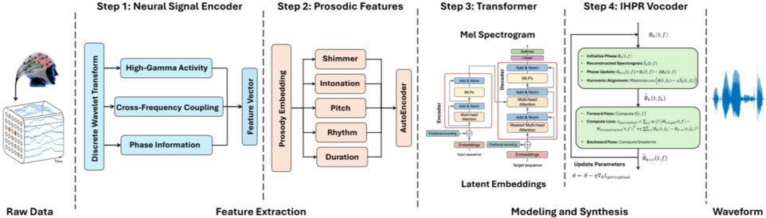

> [!abstract] Interspeech · 2025 · Conference
> **Al-Radhi et al.** (Budapest University of Technology and Economics) · [→ Paper](https://www.isca-archive.org/interspeech_2025/alradhi25_interspeech.html) · Demo: ? · Code: ?
>
> MiSTR synthesizes speech from intracranial EEG signals by combining wavelet-based neural feature extraction, a Transformer decoder for prosody-aware Mel spectrogram prediction, and a novel Iterative Harmonic Phase Reconstruction (IHPR) vocoder that enforces harmonic consistency during phase recovery.

## Problem

Decoding intelligible and natural speech from intracranial EEG (iEEG) recordings for brain-computer interface (BCI) applications faces three interrelated bottlenecks. First, prior feature extraction methods either rely on handcrafted acoustic descriptors or a single neural frequency band (typically high-gamma power), failing to capture the cross-frequency dynamics that underlie speech production. Second, most existing decoders emphasize spectral envelope prediction while neglecting prosodic features such as rhythm, intonation, and duration, resulting in flat and robotic synthesized speech. Third, conventional phase reconstruction approaches including iterative Griffin-Lim variants introduce harmonic inconsistencies and audible artifacts, and adaptation of modern neural vocoders (WaveGlow, BigVGAN) to the iEEG decoding context remains limited.

## Method

MiSTR is a three-stage pipeline operating on iEEG signals recorded from intracranial depth electrodes. In the first stage, a wavelet-based neural encoder applies the Discrete Wavelet Transform (Daubechies-4) to decompose the iEEG signal across multiple frequency bands, extracting energy at each wavelet scale to capture both high-gamma activity (linked to phoneme articulation) and low-frequency theta band activity (linked to prosodic modulation). Cross-Frequency Coupling analysis uses Phase-Amplitude Coupling to quantify interactions between theta-phase and gamma-amplitude, providing features that reflect brain-speech coordination. A Prosodic Feature Encoder extracts F0 (estimated via the Harvest algorithm as a neural proxy), energy (RMS), shimmer, duration, and phase variability at 50 ms windows with 10 ms frameshift, which are concatenated with the wavelet features and z-score normalized.

The second stage uses a fully connected Autoencoder to compress the high-dimensional multi-modal neural feature vector into a compact latent space, reducing noise and redundancy. A Transformer decoder then maps the latent embeddings to Mel spectrograms via self-attention over neural feature sequences, capturing long-range temporal dependencies without the sequential limitations of RNNs. Both components are trained with MSE loss and Adam optimizer (lr=0.001) using 10-fold cross-validation on 90/10 train/validation splits.

The third stage replaces conventional vocoders with the proposed IHPR (Iterative Harmonic Phase Reconstruction) approach. Phase initialization is constrained to be harmonically consistent by minimizing phase discontinuities at harmonic frequencies, and each subsequent iteration refines phase estimates by weighting updates toward stronger harmonics. An adaptive spectral correction term prevents phase discontinuities. Convergence is governed by a perceptual loss that combines frequency-weighted magnitude reconstruction error with a phase stability term.

## Key Results

On the publicly available iEEG dataset (10 Dutch-speaking participants with epilepsy, 1024 Hz recording rate), MiSTR outperforms six baselines across most metrics. The strongest gains are in STOI (0.73 vs. 0.64 for the best baseline, encoder-decoder) and HNR (12.7 dB vs. 11.1 dB), indicating improved intelligibility and harmonic fidelity. Pearson correlation between reconstructed and ground-truth Mel spectrograms reaches 0.91 (vs. 0.87 for encoder-decoder). MCD is 3.92, which is slightly higher than the 3.90 achieved by the Seq2Seq baseline, meaning MiSTR does not achieve the minimum spectral distortion among all systems, though it outperforms Seq2Seq on every other metric. The automated perceptual quality proxy MOSA-Net scores MiSTR at 3.38 (vs. 3.21 for Seq2Seq). No human listener study is reported; all perceptual quality comparisons rely on MOSA-Net.

## Novelty Assessment

MiSTR's primary novelty is the IHPR vocoder, a harmonic-phase-constrained iterative reconstruction algorithm that is new to the iEEG-to-speech literature. The wavelet-based multi-scale encoding and cross-frequency coupling features represent a meaningful improvement over single-band high-gamma power, and their combination with prosodic features via a multi-modal front-end is a coherent methodological advance. The Transformer decoder for spectrogram prediction is an established technique in TTS applied here to the neural-decoding context for the first time, which is engineering integration rather than architectural novelty. The IHPR itself, however, proposes a new iterative phase refinement objective with harmonic constraints, justifying the architectural-novelty classification.

Important caveats: the dataset is small (10 participants, single language, Dutch epilepsy patients with depth electrodes), and the evaluation is entirely automatic with no human listener validation. The paper's task is brain-to-speech synthesis from implanted neural recordings, which is substantially different from standard text-to-speech. The input modality (iEEG signals) is not text or reference audio, and the corpus's concept vocabulary (text-conditioned, speaker-conditioned, zero-shot, etc.) does not map to this system's conditioning; the system is evaluated only on held-out recordings from the same implanted participants, with no generalization to unseen subjects tested.

## Field Significance

Moderate — MiSTR advances the BCI speech synthesis sub-domain by demonstrating that harmonic-phase-constrained vocoding (IHPR) and prosody-aware multi-modal neural encoding improve over RNN- and CNN-based iEEG decoders on intelligibility and spectral fidelity metrics. Its contribution to the core TTS/VC corpus is limited by the specialized input modality and single-dataset evaluation, but the IHPR phase reconstruction framework and the prosodic feature design from neural signals can serve as methodological references for future neural speech prosthetics work.

## Claims

- **supports:** Multi-scale neural feature extraction that captures cross-frequency coupling improves iEEG-to-speech intelligibility over single-band or handcrafted acoustic feature approaches.
  > *Evidence:* MiSTR's wavelet encoder (DWT with Daubechies-4) combined with Phase-Amplitude Coupling features achieves Pearson correlation 0.91 and STOI 0.73, compared to 0.72 and 0.61 for a regression baseline relying on simpler acoustic features from the same dataset. *(§2.1.1, §2.1.2, Table 1)*

- **supports:** Transformer-based sequence decoders outperform RNN and CNN architectures for Mel spectrogram reconstruction from neural signals.
  > *Evidence:* MiSTR Transformer decoder achieves STOI 0.73 against 0.48 (bLSTM), 0.52 (CNN), 0.56 (3D-CNN), 0.59 (Seq2Seq), and 0.64 (encoder-decoder) on the same iEEG dataset under identical evaluation conditions. *(§2.2.2, §3.3, Table 1)*

- **supports:** Harmonic-phase-constrained iterative phase reconstruction reduces spectral artifacts in neural speech synthesis compared to unconstrained vocoding.
  > *Evidence:* IHPR achieves HNR 12.7 dB, over 1.6 dB above the best baseline (encoder-decoder: 11.1 dB), and MiSTR's spectrograms preserve harmonic structures in high-frequency regions where baselines exhibit blurring and artifact distortions. *(§2.3, §4, Table 1, Figure 2)*

- **complicates:** Automated perceptual quality estimators used as proxies for human listening tests may not provide sufficient validation for clinical or neuroprosthetics applications of neural speech synthesis.
  > *Evidence:* MiSTR reports perceptual quality solely through MOSA-Net (MOSA-Net score 3.38), explicitly framing it as an alternative to "time-consuming listening tests." No human listener evaluation is conducted, leaving the perceptual validity of the improvements in intelligibility and naturalness unverified. *(§3.3, §4)*

## Limitations and Open Questions

> [!warning]
> The evaluation is conducted on a single dataset of 10 participants with pharmacoresistant epilepsy implanted with depth electrodes (Dutch, iEEG). All perceptual quality comparisons rely on MOSA-Net rather than human listener tests. No cross-subject generalization to unseen individuals is assessed.

The dataset's clinical and linguistic specificity (Dutch epilepsy patients with implanted electrodes) limits how broadly the results generalize. iEEG-based speech synthesis requires invasive electrode placement, making large-scale data collection and multi-subject generalization substantially more difficult than standard TTS. The paper uses an F0 proxy derived from the neural signal rather than actual acoustic F0, which may limit the fidelity of the prosodic features. Future directions proposed by the authors include end-to-end decoding without intermediate representations and integration of diffusion-based waveform generation.

## Wiki Connections

- [[prosody-control|Prosody Control]] — MiSTR introduces an explicit prosodic front-end that extracts F0 proxy, energy, shimmer, duration, and phase variability from iEEG signals to condition spectrogram prediction, extending prosody-aware modeling to the neural-decoding domain.
- [[evaluation-metrics|Evaluation Metrics]] — the paper reports and compares Pearson Correlation, MCD, STOI, HNR, and MOSA-Net across seven systems on a shared dataset, illustrating how metric rankings can diverge (MCD favors Seq2Seq while STOI and HNR favor MiSTR).
- [[transformer-enc-dec-tts|Transformer Encoder-Decoder TTS]] — MiSTR applies the Transformer encoder-decoder architecture to spectrogram prediction from latent neural embeddings, extending this paradigm beyond text input to intracranial neural signals.
