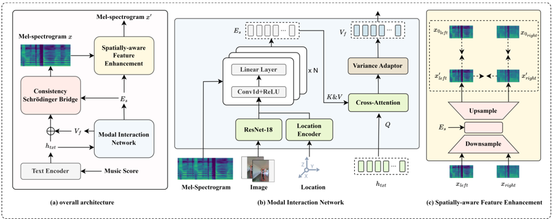

> [!abstract] Interspeech · 2025 · Conference
> **Zhao et al.** · [→ Paper](https://www.isca-archive.org/interspeech_2025/zhao25g_interspeech.html) · Demo: ✓ · Code: ✗
>
> VS-Singer is the first unified framework to jointly perform visual acoustic matching and stereo singing voice synthesis, generating binaural singing audio that spatially matches a scene image using a novel Consistency Schrödinger Bridge decoder that achieves one-step inference without requiring a pre-trained teacher model.

## Problem

Singing voice synthesis has converged on diffusion-based mel-spectrogram generation that produces high-quality mono audio, but cannot account for the spatial properties of a listening environment. Emerging AR/VR applications require immersive stereo audio that accurately reflects room reverberation and left-right channel asymmetry as a function of the listener's scene perspective. Prior work has addressed visual acoustic matching and mono-to-stereo conversion as separate tasks, each requiring its own model; cascading them introduces accumulated distortion and high inference latency. At the same time, consistency models that enable one-step inference from score-based models typically require a pre-trained teacher, adding substantial training cost. VS-Singer addresses both gaps simultaneously.

## Method

VS-Singer takes a music score (notes, pitch, lyrics), a scene image, and a 3D listener position as input and generates a stereo binaural mel-spectrogram pair that reflects both the vocal content and the acoustic environment. The system comprises three modules trained end-to-end.

The Modal Interaction Network (MIN) encodes spatial acoustic properties from the scene image. ResNet-18 (pre-trained on ImageNet) extracts dual-view visual features by masking the left and right thirds of the image to simulate left and right eye perspectives. These are combined with a 3D location encoding (Euclidean distance and azimuth angle to the target speaker) and a frame-level energy vector from the binaural audio signal. A convolution stack fuses these into a spatial embedding, which is then integrated with the text hidden sequence from the music score encoder via cross-modal attention, producing a spatially-conditioned linguistic representation.

The Consistency Schrödinger Bridge (CSB) decoder generates the stereo mel-spectrogram pair in a single step without a teacher model. The key insight is to establish the diffusion bridge between the spatially-conditioned linguistic representation and the binaural audio (rather than Gaussian noise and audio), making the marginal density calculation tractable. Consistency training (using EMA parameter updates and LPIPS loss) then maps any point on the resulting probability-flow ODE trajectory to the same initial data point, enabling one-step generation. This avoids the two-stage distillation pipeline of prior methods such as CoMoSpeech.

The Spatially-aware Feature Enhancement (SFE) module refines the generated stereo pair. A U-Net combines the dual-view spatial embeddings with the CSB output, applying an enhancement loss that simultaneously minimises left-channel and right-channel reconstruction error while maximising inter-channel difference, encouraging the model to learn realistic stereo separation.

Training uses the Opencpop dataset (100 Chinese pop songs, one female singer) with room impulse responses extracted from the NVAS-SoundSpace binaural audiovisual corpus applied via convolution reverberation to generate binaural training targets. Audio is resampled to 22,050 Hz; the model is trained for 800k steps on a single NVIDIA 4090.

## Key Results

Results are reported on Opencpop test-seen and test-unseen splits (Table 1), comparing against cascaded baselines that pipeline a singing synthesis model, a visual acoustic matching model (LeMARA), and a mono-to-stereo converter (SepStereo). Objective metrics include Real-Time Factor (RTF), Mel Cepstral Distortion (MCD), Left-Right Energy Ratio Error (LRE), and RT60 Error (RTE). MOS was collected from 30 native Chinese speakers.

At NFE=4, VS-Singer achieves MOS 3.81 (test-seen) and 3.74 (test-unseen), outperforming CoMoSpeech at NFE=4 (MOS 3.76/3.70) while also surpassing it on spatial metrics (LRE 0.889 vs. 0.948; RTE 0.058 vs. 0.068 on test-seen). Compared to DiffSinger, which requires 50 function evaluations, VS-Singer at NFE=1 achieves RTF 0.021 vs. 0.208 on test-seen. At NFE=1, VS-Singer (RTF 0.024/0.021) is approximately 2x faster than CoMoSpeech (RTF 0.052/0.055) while matching or exceeding its spatial quality.

Single-step inference carries a noticeable quality cost: MOS drops from 3.74 to 3.48 on test-unseen when reducing NFE from 4 to 1, with MCD rising from 7.71 to 8.55. Ground truth (voc.) scores MOS 4.23/4.19, leaving a gap of approximately 0.4-0.5 MOS relative to the vocoder ceiling.

Ablation (Table 2) confirms each module's contribution. Removing MIN raises LRE from 0.889 to 1.257 and RTE from 0.058 to 0.084 (test-seen), indicating it is the primary driver of spatial accuracy. Removing the Schrödinger bridge while retaining consistency training drops MOS to 3.50 and raises MCD to 8.63, confirming that the SB component compensates for the quality degradation inherent in teacher-free consistency training. Removing SFE causes smaller but consistent degradation in both MOS (3.72) and spatial metrics.

## Novelty Assessment

The primary novelty is the combination of two previously separate research threads (singing voice synthesis and visual acoustic matching) into a single trainable pipeline. This unification is a genuine first, not merely a task-level application of an existing model. The Consistency Schrödinger Bridge is also a methodological contribution: prior consistency models for speech (CoMoSpeech) require a pre-trained diffusion teacher, while CSB avoids this by using the score-based Schrödinger bridge formulation to improve the tractability of consistency training directly. The gain over teacher-dependent CoMoSpeech is modest (MOS +0.05 at NFE=4) but real, and the ablation isolates the SB's contribution clearly.

The evaluation scope is narrow: a single female singer, Chinese pop songs, and a controlled room impulse response pipeline. The comparisons use cascaded baselines because no competing unified stereo singing system exists, which is both the paper's main motivation and a limitation in assessing how much of the gain comes from end-to-end training vs. architectural novelty. The spatial audio metrics (LRE, RTE) are domain-specific and not widely established in TTS evaluation.

## Field Significance

Moderate — VS-Singer introduces a unified architecture for spatially-aware stereo singing voice synthesis, a direction that could become relevant as immersive audio applications grow. Its methodological contribution (teacher-free Consistency Schrödinger Bridge) provides a training-cost reduction that complements work on one-step inference for diffusion-based generative models more broadly. The domain remains narrow in the current evaluation, and broader impact will depend on demonstration across multiple singers, languages, and scene types.

## Claims

- **supports:** Integrating Schrödinger bridge into consistency training can improve one-step generative model quality for audio synthesis without a pre-trained teacher model.
  > *Evidence:* VS-Singer's CSB decoder achieves MOS 3.74 at NFE=4 on test-unseen, outperforming CoMoSpeech (3.70) which uses consistency distillation with a teacher; ablation removing only the Schrödinger bridge drops MOS from 3.81 to 3.50 and raises MCD from 7.65 to 8.63 on test-seen. *(§2.2, §3.4, Table 2)*

- **supports:** Cross-modal visual attention over scene images can encode spatial acoustic properties into a singing synthesis pipeline, enabling reverberation-aware binaural audio generation.
  > *Evidence:* The Modal Interaction Network integrates dual-view visual features, 3D location encoding, and energy vectors with text hidden sequences via cross-attention; removing MIN degrades LRE from 0.889 to 1.257 and RTE from 0.058 to 0.084 in the ablation on test-seen. *(§2.1, §3.4, Table 2)*

- **complicates:** One-step consistency model inference incurs a substantial quality penalty compared to multi-step inference in diffusion-based singing synthesis.
  > *Evidence:* VS-Singer at NFE=1 achieves MOS 3.48 vs. 3.74 at NFE=4 on test-unseen, with MCD degrading from 7.71 to 8.55; CoMoSpeech shows the same pattern (MOS 3.46 at NFE=1 vs. 3.70 at NFE=4), suggesting this trade-off is intrinsic to consistency models rather than model-specific. *(§3.3, Table 1)*

- **supports:** Unified end-to-end architectures for spatial audio generation outperform cascaded specialised model pipelines in both inference speed and spatial accuracy.
  > *Evidence:* VS-Singer (NFE=1) achieves RTF 0.024 on test-unseen vs. RTF 0.203 for DiffSinger in the cascaded baseline, while achieving better LRE and RTE than all cascaded combinations at NFE=4. *(§3.3, Table 1)*

## Limitations and Open Questions

> [!warning]
> The full system is evaluated on a single female Chinese pop singer (Opencpop). Generalisability to other vocal timbres, singing styles, and languages is entirely unexamined.

No code is released, and the binaural training data is generated synthetically via convolution of room impulse responses rather than natural binaural recordings, which may limit real-world spatial realism. The paper claims first-of-kind status, meaning all baselines are cascaded systems rather than competing unified approaches; it is therefore unclear whether the gains come from end-to-end training, the specific architectural choices, or both. Perceptual evaluation uses only naturalness MOS and does not include spatial audio perceptual tests (e.g. externalisation, localisation accuracy, envelopment) that specialists in binaural audio would expect. Performance in test-unseen scenes is consistently lower than test-seen, indicating limited spatial generalisation to novel environments.

## Wiki Connections

- [[singing|Singing Voice Synthesis]] — VS-Singer targets stereo singing voice synthesis conditioned on lyrics and a co-located video, extending singing synthesis to spatial/binaural audio generation.
- [[diffusion-tts|Diffusion TTS]] — VS-Singer's decoder is built on score-based diffusion SDEs with a Schrödinger bridge formulation, applying consistency training to achieve one-step inference without a teacher model.
- [[evaluation-metrics|Evaluation Metrics]] — the paper introduces domain-specific spatial audio metrics (Left-Right Energy Ratio Error and RT60 Error) for evaluating binaural audio quality in singing synthesis.
- [[subjective-evaluation|Subjective Evaluation]] — MOS ratings from 30 native Chinese speakers provide the primary quality signal; the evaluation is limited to naturalness and does not cover spatial audio perception.
