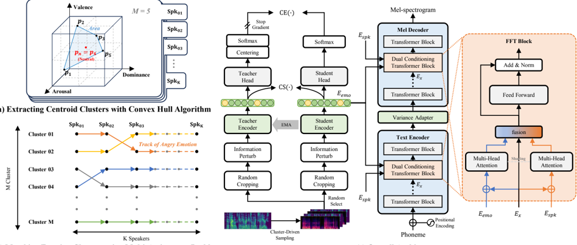

> [!abstract] Interspeech · 2025 · Conference
> **Cho et al.** · [→ Paper](https://www.isca-archive.org/interspeech_2025/cho25b_interspeech.html) · Demo: ✓ · Code: ?
>
> DiEmo-TTS adapts the DINO self-supervised distillation framework with emotion-specific cluster-driven sampling and formant-based perturbation to learn speaker-independent emotion embeddings for cross-speaker emotion transfer in TTS.

## Problem

Cross-speaker emotion transfer requires emotion embeddings that capture expressive content without retaining the source speaker's timbre. Existing disentanglement strategies fall short in different ways: gradient reversal layer (GRL) methods introduce a tension between feature separation and synthesis quality that is difficult to balance via hyperparameter tuning; vector quantisation (VQ) approaches cause unintended information loss that degrades expressiveness; and orthogonal-loss methods compound these issues by relying on multiple, competing loss terms. The shared failure mode is that all three approaches rely on explicit speaker labels during training, yet prosodic features are inherently entangled with speaker identity, making perfect disentanglement through label-based supervision fundamentally limited.

## Method

DiEmo-TTS builds on FastSpeech 2 as its acoustic backbone, extending it with three interacting components: a self-supervised emotion encoder, an emotion clustering and matching procedure, and a dual conditioning transformer (DCT) block.

The emotion encoder is trained using a DINO teacher-student distillation scheme (self-distillation with no labels), but adapted for emotion rather than speaker identity. Three modifications drive the emotion-focused disentanglement. First, cluster-driven sampling groups utterances by emotion cluster before drawing training crops, so the encoder sees emotionally coherent mini-batches and is pushed to encode emotional content rather than speaker traits. Second, information perturbation (IP) distorts speaker identity by perturbing speech formants (exploiting the correlation between timbre and formant structure) while leaving the emotional contour intact. Third, a cosine similarity loss is added to the DINO cross-entropy objective, encouraging the student and teacher embeddings to align in a compact space suitable for subsequent clustering.

The emotion clustering and matching step addresses the absence of cross-speaker emotion labels. Speaker embeddings cluster naturally by emotional state within each speaker's embedding space. The system predicts emotional attributes (valence/arousal dimensions from a WavLM-based predictor fine-tuned on MSP-Podcast) and applies a spherical coordinate transformation centred on the neutral cluster to obtain azimuth and elevation angles for each cluster. A multi-assignment Hungarian method then aligns clusters across speakers to the same emotion category, producing pseudo-labels for unlabelled data.

The DCT block replaces simple concatenation conditioning in three of FastSpeech 2's FFT blocks. It applies weight-sharing multi-head attention for each style input (speaker embedding and emotion embedding separately) and fuses the outputs through a shared MLP, allowing the two conditioning signals to interact without one dominating the other. At inference, the target speaker embedding and the emotion embedding extracted from a reference mel-spectrogram via the student encoder are fed to the acoustic model, and BigVGAN is used as the vocoder.

## Key Results

Compared against three cross-speaker emotion transfer baselines (Trans-GRL, Trans-VQ, Trans-Ort) sharing the same FastSpeech 2 + DCT backbone and ESD training data, DiEmo-TTS achieves the best emotion similarity MOS (eMOS) across all four evaluated emotions (Angry, Happy, Sad, Surprise) in Table 1. The full system obtains nMOS 4.23, sMOS 3.96, eMOS 4.07, WER 16.16%, and SECS 0.8505 on the ESD cross-speaker evaluation set (Table 2). Subjective evaluation involved 20 participants rating two samples per emotion per speaker.

The ablation study in Table 2 isolates each component's contribution. Removing the DCT block drops eMOS from 4.07 to 3.89 while slightly improving sMOS (3.96 to 4.02), suggesting that the conditioning mechanism governs the balance between emotion fidelity and speaker identity preservation. Removing cluster-driven sampling (CDS) and cosine similarity loss degrades SECS and EECS, confirming that these two mechanisms drive the disentanglement itself. Replacing formant-based information perturbation with MUSAN/RIR noise augmentation increases WER and reduces SECS, showing that formant perturbation is a more targeted speaker-identity distorter than generic noise.

## Novelty Assessment

The core novelty is the adaptation of DINO for emotion disentanglement in TTS, a repurposing of a well-established self-supervised vision/speech technique to a new inductive goal. The three modifications (cluster-driven sampling, formant perturbation, cosine similarity loss) are individually incremental but their combination as a coherent emotion-focused distillation scheme is not previously established. The emotion clustering and matching via spherical coordinates and multi-assignment Hungarian matching is a creative bridge between emotional attribute prediction and pseudo-label generation for unlabelled speakers.

The acoustic backbone is FastSpeech 2 (2020), a mature architecture, and the vocoder is BigVGAN. The evaluation is limited to 2 target speakers from 10 available in ESD, trained exclusively on neutral utterances, which is a constrained setting. WER values around 16% are relatively high, suggesting some intelligibility trade-off that is not fully discussed. Comparisons are fair in that all methods share the same backbone and dataset configuration.

## Field Significance

Moderate — DiEmo-TTS demonstrates that self-supervised distillation objectives adapted for emotion can outperform label-driven disentanglement strategies in cross-speaker TTS, providing concrete evidence that DINO-style training is useful beyond speaker verification and visual representation learning. The contribution is primarily a training-recipe novelty: the backbone and vocoder are existing components, but the disentanglement mechanism and conditioning module represent genuine extensions of prior method families.

## Claims

- **supports:** Self-supervised distillation with emotion-specific inductive biases can learn speaker-independent emotion embeddings more effectively than GRL-based or VQ-based disentanglement.
  > *Evidence:* DiEmo-TTS surpasses Trans-GRL, Trans-VQ, and Trans-Ort on eMOS across all four emotion categories in subjective evaluation, without requiring explicit speaker labels during emotion encoder training. *(§3.4, Table 1)*

- **supports:** Formant-based speaker perturbation is more effective for disentangling speaker identity from emotion than non-targeted noise augmentation in cross-speaker emotion transfer.
  > *Evidence:* Replacing formant perturbation with MUSAN/RIR noise augmentation in the ablation increases WER and degrades SECS, whereas formant perturbation exploits the timbre-formant correlation to distort identity while preserving emotional expression. *(§3.6, Table 2)*

- **supports:** Multi-factor conditioning via shared attention mechanisms produces better balance between speaker fidelity and emotional expressiveness than concatenation conditioning in transformer-based TTS.
  > *Evidence:* Adding the DCT block improves eMOS from 3.89 to 4.07 while keeping sMOS comparable in the ablation; the block applies weight-sharing multi-head attention per style signal and fuses outputs via MLP. *(§3.6, Table 2)*

- **complicates:** Achieving speaker-independent emotion representations via self-supervised methods still depends on labeled auxiliary data for emotion space definition.
  > *Evidence:* The emotion clustering step requires a WavLM-based emotional attribute predictor fine-tuned on the MSP-Podcast labeled corpus; the authors identify dependence on this predictor as a limitation for generalising to unseen speakers. *(§4, §3.2)*

## Limitations and Open Questions

> [!warning]
> Evaluation uses only 2 target speakers (one male, one female from ESD), both trained exclusively on neutral utterances. Generalisation to speakers trained on mixed emotional data or to out-of-domain voices is not assessed.

WER of 16.16% indicates non-trivial intelligibility degradation compared to clean TTS; the source of this degradation (emotion conditioning, model architecture, or dataset characteristics) is not explicitly discussed. The emotional attribute predictor is fine-tuned on MSP-Podcast, a separate labeled corpus, introducing a labeled-data dependency that the authors acknowledge as a target for future unsupervised replacement. Scalability to languages beyond English and to larger multi-emotion multi-speaker datasets remains undemonstrated.

## Wiki Connections

- [[emotion-synthesis|Emotion Synthesis]] — DiEmo-TTS directly addresses cross-speaker emotion transfer, extending the emotion synthesis problem to settings where the target speaker has no emotional training data.
- [[disentanglement|Disentanglement]] — the paper's training objective explicitly separates emotional content from speaker identity via DINO-based distillation with cluster-driven sampling and formant perturbation, rather than standard reconstruction objectives.
- [[self-supervised-speech|Self-Supervised Speech]] — WavLM is used as a core component for emotional attribute prediction, and the DINO teacher-student framework drives the emotion encoder training without manual emotion labels.
- [[evaluation-metrics|Evaluation Metrics]] — the paper reports nMOS, sMOS, eMOS (human), WER, CER (Whisper), SECS (WavLM cosine similarity), and EECS (Emotion2Vec cosine similarity), combining subjective and objective emotion evaluation.
- [[subjective-evaluation|Subjective Evaluation]] — 20 human listeners rated naturalness, speaker similarity, and emotion similarity on a five-point MOS scale across four emotion categories and two target speakers.
- [[transformer-enc-dec-tts|Transformer Encoder-Decoder TTS]] — the acoustic model retains the FastSpeech 2 architecture, modifying only the conditioning pathway and adding the DCT block; the dual conditioning transformer extends the standard FFT block design.
