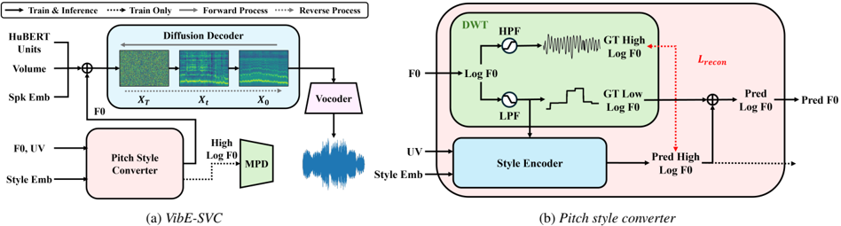

> [!abstract] Interspeech · 2025 · Conference
> **Choi et al.** (Korea University) · [→ Paper](https://www.isca-archive.org/interspeech_2025/choi25e_interspeech.html) · Demo: ✓ · Code: ?
>
> VibE-SVC uses discrete wavelet transform to decompose the F0 contour into low- and high-frequency components, enabling explicit vibrato style extraction and controllable transfer in singing voice conversion.

## Problem

Singing voice conversion must handle the expressive pitch characteristics unique to singing, particularly vibrato, whose dynamic oscillation makes it difficult to control precisely. Prior SVC approaches either ignore style entirely or model it implicitly through style embeddings appended to a decoder, offering little control over vibrato onset, extent, or direction. Methods focused on pitch modeling accuracy (multi-scale F0 extraction, cycle pitch shifting) address pitch range and voicedness but do not target singing style as a separable signal attribute. Without an explicit representation of vibrato, style transfer between straight and vibrato singing relies on the model learning implicit correlations that are hard to interpret or adjust at inference time.

## Method

VibE-SVC comprises two separately trained components: an SVC backbone and a pitch style converter. The SVC backbone is a WaveNet-based diffusion decoder with 20 residual layers and 512-channel convolutions, conditioned on HuBERT discrete units (interpolated to align with the F0 grid), a speaker embedding, F0 contour, and audio volume. It is trained with a standard diffusion loss and uses DPM-Solver++ for fast denoising at inference. BigVGAN serves as the vocoder.

The pitch style converter performs the core vibrato disentanglement via discrete wavelet transform (DWT) applied to the log-scaled F0 contour. Using the Daubechies1 (db1) wavelet at decomposition level 4, DWT produces an approximation coefficient and detail coefficients that are reconstructed via inverse DWT into two additive F0 signals: a low-frequency contour capturing base pitch and melodic shape, and a high-frequency contour capturing vibrato oscillation (typically 5-8 Hz). The style encoder takes the low-frequency F0, a voiced flag vector, and a style embedding from a learned lookup table as inputs, and predicts the target high-frequency F0 contour through 4 feed-forward transformer (FFT) blocks followed by a multi-layer perceptron. A multi-period discriminator (MPD) applied to the predicted high-frequency contour enforces realistic periodic structure and is trained with adversarial and feature-matching losses alongside a reconstruction loss.

At inference, a target style embedding is substituted to predict the style-transferred high-frequency F0 component; the full F0 is reconstructed by adding the predicted high-frequency and the unchanged low-frequency contours. A mean-F0 scaling step normalizes the pitch range to the target speaker before the SVC backbone generates the mel-spectrogram. Vibrato extent can be continuously adjusted by multiplying the high-frequency component by a scalar at inference (values from 0.1 to 2.0), and frame-level control is also possible via index-specific scaling.

## Key Results

On VocalSet (straight and vibrato styles, 20 singers, 160 test samples), VibE-SVC achieves 0.700 style accuracy in style-only conversion, compared to 0.213-0.525 for SoVITS-based baselines using implicit style embeddings. Speaker similarity (SECS 0.814) matches or exceeds all baselines in both experiments. Naturalness (MOS 4.124) is comparable to baselines. In joint timbre and style conversion, style accuracy is 0.694, with MOS 4.125 and SECS 0.774.

Ablation shows that removing the MPD reduces style accuracy from 0.700 to 0.625, and replacing DWT-based high-frequency prediction with direct source F0 prediction reduces it to 0.475, confirming the importance of both components. DWT decomposition level 4 is optimal: level 3 lacks vibrato information (0.163 style accuracy) while level 5 captures irrelevant high-frequency content. Vibrato scaling experiments confirm monotonic control, with style accuracy ranging from 0.066 at scale factor 0.1 to 0.928 at factor 2.0 (Table 2). An inverse trade-off between naturalness and style accuracy is visible across all models (Figure 3), with VibE-SVC offering the best style accuracy at a small naturalness cost relative to the highest-MOS baseline.

## Novelty Assessment

The primary novelty is using DWT to explicitly decompose the F0 contour into a low-frequency melodic component and a high-frequency vibrato component, treating vibrato as a distinct and manipulable signal. This is a genuine methodological contribution within the singing VC sub-field: prior SVC methods that address style do so via implicit embeddings or external vibrato-extent features derived from power spectrograms, neither of which enables the direct post-hoc scaling demonstrated here. The use of DWT as a pass filter for F0 style disentanglement is novel relative to the SVC literature, even though DWT itself is an established signal-processing tool.

The surrounding system is primarily engineering integration: the WaveNet diffusion SVC backbone, HuBERT content features, FFT-block style encoder, and BigVGAN vocoder are all borrowed from prior work, and the MPD is a standard discriminator from the speech synthesis literature. Evaluation is limited to two styles (straight and vibrato) on a single dataset (VocalSet, 20 singers), which constrains how broadly the style-transfer claims generalize. The human evaluation (Amazon MTurk, at least 20 raters per model) is on the small side for resolving the narrow MOS differences observed.

## Field Significance

Moderate — VibE-SVC introduces a clean, signal-processing-grounded mechanism for vibrato disentanglement that improves on implicit style-embedding baselines in a measurable and interpretable way. The contribution is specific to singing VC vibrato control and does not directly transfer to general speech or other singing styles, but it demonstrates a principle (frequency-domain F0 decomposition as a style representation) that can inform broader work on expressive singing control.

## Claims

- **supports:** Explicit frequency-domain decomposition of the F0 contour enables more accurate and controllable singing style transfer than implicit style-embedding approaches.
  > *Evidence:* VibE-SVC achieves 0.700 style accuracy in style-only conversion versus 0.213-0.525 for SoVITS baselines using direct style embeddings, on the VocalSet straight/vibrato benchmark. *(§4.1.1, Table 1)*

- **supports:** Adversarial training on the target frequency band of the F0 contour improves singing style accuracy without degrading naturalness.
  > *Evidence:* Removing the multi-period discriminator reduces style accuracy from 0.700 to 0.625 and MOS from 4.124 to 4.016 in the style-only conversion experiment. *(§4.3, Table 1)*

- **complicates:** Increasing style transfer accuracy in singing voice conversion trades off against naturalness, and explicit disentanglement does not fully eliminate this tension.
  > *Evidence:* Figure 3 shows a consistent inverse correlation between MOS and style accuracy across all baselines and VibE-SVC; the highest-accuracy model (VibE-SVC) has lower naturalness than the highest-naturalness baseline (SoVITS with style embedding, 0.213 style accuracy). *(§4.1.2, Figure 3)*

- **refines:** The effective granularity of F0-based singing style disentanglement via DWT is sensitive to decomposition level, with an optimal level that captures vibrato without including unrelated high-frequency content.
  > *Evidence:* Style accuracy is 0.163 at DWT level 3 (vibrato information absent), 0.694 at level 4 (optimal), and drops slightly at level 5 due to inclusion of irrelevant high-frequency components. *(§4.3, Table 3)*

- **supports:** Vibrato extent in singing voice conversion can be controlled continuously at inference time by scalar multiplication of the isolated high-frequency F0 component, without retraining.
  > *Evidence:* Scaling the high-frequency F0 contour from 0.1 to 2.0 produces style accuracy ranging from 0.066 to 0.928; frame-level control is also demonstrated by applying scaling at specific target frame indices. *(§4.2, Table 2, Figure 5)*

## Limitations and Open Questions

The model is restricted to two singing styles (straight and vibrato) derived from VocalSet, and does not address other common techniques such as falsetto, breathy voice, belt, or melisma. Generalization to other datasets and languages is untested. The DWT wavelet type (db1) and decomposition level (4) are dataset-specific hyperparameters that may need re-tuning for other corpora or style targets. Human evaluation uses at minimum 20 Amazon MTurk raters per model, which is on the low end for resolving the small MOS differences reported. The speaker similarity scores in the timbre and style conversion setting (SMOS 3.196) are noticeably lower than ground truth (3.549), suggesting that joint timbre and style conversion remains a meaningful challenge.

## Wiki Connections

- [[singing|Singing Voice Synthesis]] — VibE-SVC introduces an explicit DWT-based vibrato disentanglement mechanism for the SVC task, advancing controllable singing style transfer.
- [[voice-conversion|Voice Conversion]] — Singing voice conversion is the core task; the paper extends SVC methods with an explicit vibrato style component rather than relying on implicit speaker-style joint modeling.
- [[disentanglement|Disentanglement]] — The paper's central contribution is separating the F0 contour into low-frequency (melody) and high-frequency (vibrato style) components via DWT, enabling independent manipulation of each attribute.
- [[diffusion-tts|Diffusion TTS]] — The SVC backbone uses a WaveNet-based diffusion decoder with DPM-Solver++ for denoising, following established diffusion-based speech generation practices.
- [[self-supervised-speech|Self-Supervised Speech]] — HuBERT discrete units serve as the content conditioning signal for the SVC backbone, a standard SSL-based content representation in voice conversion.
- [[subjective-evaluation|Subjective Evaluation]] — MOS and SMOS tests are conducted via Amazon MTurk with at least 20 human raters per model, evaluating naturalness and speaker similarity.
