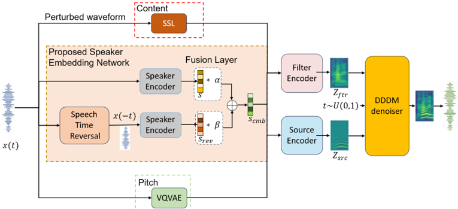

> [!abstract] Interspeech · 2025 · Conference
> **Biyani et al.** · [→ Paper](https://www.isca-archive.org/interspeech_2025/biyani25_interspeech.html) · Demo: ✓ · Code: ?
>
> Proposes full-utterance speech time reversal as a training augmentation strategy to strengthen speaker embeddings in diffusion-based voice conversion, exploiting the observation that reversed speech destroys phonemic intelligibility while retaining the tonal and rhythmic patterns that carry speaker identity.

## Problem

Speaker encoders in voice conversion are prone to linguistic interference: the embeddings they produce entangle speaker-specific acoustic traits with language-dependent phonetic patterns, making it difficult to purely represent a target speaker's identity. Existing disentanglement approaches rely on adversarial training, mutual information minimization, or auxiliary speaker classification objectives, all of which add architectural complexity. A simpler signal-level mechanism for suppressing linguistic content from speaker embeddings has not been explored.

## Method

The system builds on DDDM-VC (decoupled denoising diffusion models for voice conversion) as the backbone. DDDM-VC decomposes speech through a source-filter architecture: content is represented via XLS-R features (a multilingual self-supervised model based on wav2vec 2.0 at 0.3B parameters), pitch via a VQ-VAE operating on fundamental frequency, and speaker identity via a mel-spectrogram-level speaker encoder. The paper's contribution is a novel training augmentation applied to the speaker branch: the same speaker encoder is also run on a fully time-reversed version of the target utterance, producing a "reverse speaker embedding." The two embeddings (original and reversed) are fused through a weighted fusion layer to form a combined speaker representation used to condition both the source and filter diffusion decoders.

The key principle: complete time reversal destroys phoneme and syllable structure entirely (word error rate reaches 100%), yet a perceptual study with 25 listeners correctly identified the speaker from time-reversed clips 80.3% of the time. Spectrographic analysis confirms that harmonic patterns encoding timbre and pitch contours survive the reversal process (§3.1, Table 1). The reverse embedding therefore captures speaker-discriminative features with minimal linguistic content, complementing the conventional embedding and improving overall speaker-language disentanglement.

The combined speaker representation is defined as S_cmb = α·S + β·S_rev, where the weights α and β are learned; ablation experiments find equal weighting (α = β = 0.5) to be optimal. Cross-attention is used to further refine the fusion. Waveform synthesis uses HiFi-GAN V1 with multi-scale STFT discriminators borrowed from EnCodec replacing the standard HiFi-GAN discriminators. The speaking style encoder uses two multi-head attention layers and produces 256-dimensional embeddings. Training on LibriTTS (1,100 speakers, 10 held out) runs on two NVIDIA L40 GPUs for 1,000 epochs.

## Key Results

Evaluated across three diffusion-based VC systems (DiffVC, DiffHierVC, DDDM-VC) and compared against five additional SOTA baselines (LM-VC, SEF-VC, StyleVC, StableVC, VALLE-VC) on LibriTTS and VCTK.

The proposed augmentation improves speaker similarity in diffusion-based systems on average by 4.16% in objective score and 2.67% in MUSHRA-based subjective similarity. For DDDM-VC, the strongest backbone, objective speaker similarity rises from 0.70 to 0.79 and subjective similarity from 77.46 to 78.61 (Table 2). DiffHierVC objective similarity rises from 0.76 to 0.80. Speech quality is maintained or improved: for DDDM-VC, WV-MOS rises from 3.84 to 3.91 and UTMOS from 3.21 to 3.55.

However, gains are uneven across backbones. DiffVC shows a subjective similarity improvement (50.12 to 53.42) but an objective similarity decrease (0.75 to 0.71), suggesting the augmentation behaves differently depending on the backbone's existing speaker modeling. DiffHierVC's subjective similarity is essentially unchanged (75.76 to 75.72) while objective similarity improves. The strongest baseline overall is DDDM-VC, and the system with augmentation surpasses all evaluated baselines on objective speaker similarity.

## Novelty Assessment

The contribution is a novel training augmentation insight: full-utterance time reversal as a targeted signal-level disentanglement tool for speaker representation learning. This is genuinely original. Prior work on speech reversal (short-segment reversal for ASR robustness) did not target speaker encoding, and no prior VC paper has explicitly leveraged the perceptual property that tonal speaker cues survive full reversal while phonemic structure does not.

The architectural change is deliberately minimal: a weighted fusion layer combining two runs of the same speaker encoder. This simplicity is partly the point. The augmentation is model-agnostic in principle, demonstrated here on three backbone variants. The evaluation is thorough for an Interspeech paper (25-listener MUSHRA study, multiple objective metrics, seven comparison systems) though it is limited to English speech and to diffusion-based backbones. Whether the approach transfers to flow-matching or codec-based VC systems is an open question the paper does not address.

## Field Significance

Moderate — The paper introduces a psychoacoustically motivated data augmentation technique that is architecturally simple but rests on a well-validated observation about speech reversal and speaker perception. It provides a concrete mechanism for reducing linguistic interference in speaker embeddings without adversarial training or additional architectural modules, which can serve as a lightweight complement to existing VC disentanglement approaches. The evaluation is credible but limited to diffusion backbones on English data, narrowing the scope of the demonstrated benefit.

## Claims

- **supports:** Full-utterance time reversal can serve as an effective signal-level data augmentation for speaker representation learning in voice conversion, as it suppresses phonemic content while retaining speaker-discriminative tonal features.
  > *Evidence:* A perceptual study shows 80.3% speaker identification accuracy from time-reversed speech; Table 1 confirms complete reversal achieves 100% WER (full linguistic removal) alongside the highest cosine speaker similarity score (0.96), higher than any short-time reversal window. *(§3.1, Table 1)*

- **supports:** Fusing speaker embeddings from augmented training signals with conventional embeddings improves speaker similarity in zero-shot diffusion-based voice conversion.
  > *Evidence:* Adding reversed-speech speaker embeddings via a weighted fusion layer (α = β = 0.5) improves objective speaker similarity by 4.16% on average across DiffHierVC and DDDM-VC; DDDM-VC objective SPK-SIM rises from 0.70 to 0.79 and subjective MUSHRA from 77.46 to 78.61. *(§4.3, Table 2)*

- **complicates:** The effectiveness of speaker embedding augmentation in voice conversion varies substantially across backbone architectures, complicating claims of generalisability.
  > *Evidence:* For DiffVC, the augmentation improves subjective speaker similarity (50.12 to 53.42) but reduces objective similarity (0.75 to 0.71), while DiffHierVC shows objective improvement but negligible subjective change; only DDDM-VC shows consistent gains on both metrics. *(§4.3, Table 2)*

- **supports:** Improving speaker disentanglement through augmentation does not necessarily trade off against generated speech quality in diffusion-based voice conversion.
  > *Evidence:* DDDM-VC+Ours improves both WV-MOS (3.84 to 3.91) and UTMOS (3.21 to 3.55) alongside speaker similarity gains, indicating that stronger speaker conditioning from the STR augmentation does not degrade synthesis quality. *(§4.3, Table 2)*

## Limitations and Open Questions

> [!warning]
> Objective and subjective speaker similarity disagree for DiffVC: the augmentation reduces objective similarity (0.75 to 0.71) while improving subjective similarity (50.12 to 53.42). This discrepancy limits confidence in the metric-level generalisation claim across all diffusion backbones. *(§4.3, Table 2)*

The perceptual study supporting the STR principle is small: 25 participants and 6 speakers, all in English. Whether the tonal-pattern preservation property holds equally for tonal languages (Mandarin, Thai) or heavily inflected languages is untested. The approach has been evaluated only on diffusion-based VC systems; compatibility with flow-matching and codec-based VC architectures remains unexplored. No code is publicly released, limiting reproducibility. The weighted fusion coefficients (α and β) are set empirically to 0.5; the paper does not explore learned dynamic weighting conditioned on the input utterance.

## Wiki Connections

- [[voice-conversion|Voice Conversion]] — this paper proposes STR augmentation specifically to improve speaker-language disentanglement in zero-shot VC, directly advancing the speaker similarity dimension of voice conversion.
- [[diffusion-tts|Diffusion TTS]] — the paper evaluates its augmentation on three diffusion-based VC systems (DiffVC, DiffHierVC, DDDM-VC) and uses DDDM-VC as the primary backbone.
- [[disentanglement|Disentanglement]] — the STR augmentation strategy is explicitly motivated by the need to separate speaker identity from linguistic content, producing embeddings with reduced phonemic interference.
- [[speaker-adaptation|Speaker Adaptation]] — the paper targets zero-shot speaker adaptation quality, using time-reversal augmentation to produce more robust speaker representations for unseen target speakers.
- [[self-supervised-speech|Self-Supervised Speech]] — the backbone DDDM-VC uses XLS-R (wav2vec 2.0 based) as its content feature extractor, a core architectural component of the system presented in this paper.
- [[subjective-evaluation|Subjective Evaluation]] — a MUSHRA-based listening study with 25 human listeners evaluates subjective speaker similarity, complementing objective cosine-similarity metrics and automated MOS predictors.
- [[2301.02111|VALL-E]] — used as a zero-shot VC comparison baseline (VALLE-VC) in the evaluation; achieves lower speaker similarity and quality scores than the proposed DDDM-VC+Ours system.
