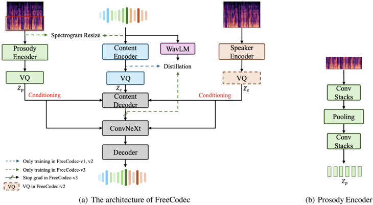

> [!abstract] Interspeech · 2025 · Conference
> **Zheng et al.** · [→ Paper](https://www.isca-archive.org/interspeech_2025/zheng25b_interspeech.html) · Demo: ? · Code: ?
>
> FreeCodec achieves high-quality speech reconstruction and disentanglement at 0.45 kbps using only 57 tokens per second, by factorising speech into separate encoder streams for content, speaker, and prosody — outperforming prior codecs that use 2–5× the bitrate.

## Problem

Most neural speech codecs treat speech as a monolithic latent, relying on residual vector quantisation to capture all information through a single encoder. This coupling leads to rapid quality degradation as the number of codebooks (and bitrate) decreases. Disentangled approaches such as FACodec require supervised labels (phoneme, F0, speaker) and still operate at higher bitrates. Unsupervised alternatives like TiCodec and SingleCodec separate only global (time-invariant) from frame-level information, leaving finer decompositions such as prosody unaddressed. The field lacks a self-supervised codec that cleanly separates speaker, prosody, and content at ultra-low bitrate while remaining flexible for both reconstruction and voice conversion.

## Method

FreeCodec decomposes speech using three dedicated frame-level encoders. A pre-trained ECAPA-TDNN speaker encoder produces a single global timbre vector from a mel-spectrogram. A content encoder (adapted from SuperCodec with strides 2-4-5-8, outputting 256-dimensional features at 50 Hz) is guided during training by the last-layer representations of WavLM-Large via cosine-similarity loss, pushing it toward semantic content. A prosody encoder takes only the lowest 20 mel bins (containing prosodic but not speaker or content detail), applies two convolution stacks and max-pooling with stride 8, yielding 7 Hz frame-rate embeddings that capture pitch and rhythm while suppressing speaker identity.

Each stream is quantised independently: content and prosody each use a single plain VQ codebook of size 256; speaker is either kept continuous (FreeCodec-v1 and -v3, for zero-shot TTS and VC) or compressed with group VQ of 8 groups × 1024 codes (FreeCodec-v2, for full speech coding at 0.45 kbps / 57 tokens/s). The total token rate of 57 tokens/s comes from 50 content + 7 prosody tokens; the speaker stream adds no frame-level tokens in FreeCodec-v1/-v3 because it is kept continuous.

The decoder is not a simple upsampling mirror. Content tokens first pass through a 4-layer Transformer encoder for semantic enhancement, then a ConvNeXt backbone integrates prosody and speaker conditioning, and finally a mirrored upsampler (strides 8-5-4-2) reconstructs waveform. Training uses adversarial losses (MS-STFT discriminator), reconstruction loss, VQ commitment loss, feature matching loss, and the WavLM cosine similarity content loss (λ=10). FreeCodec-v3 moves the WavLM supervision to the decoder branch to prevent speaker leakage into the content encoder, enabling cleaner voice conversion.

## Key Results

On VCTK reconstruction, FreeCodec-v1 at 0.45 kbps reaches UTMOS 4.034, STOI 0.918, and speaker cosine similarity 0.919 — matching or exceeding SpeechTokenizer at 3 kbps and FACodec at 2.4 kbps on most metrics. On LibriSpeech test-clean it reaches UTMOS 4.085 (equal to the target reference), STOI 0.892, and SECS 0.944.

In subjective MUSHRA testing, FreeCodec-v2 (fully discrete, 0.45 kbps) scores 87.44 ± 0.88, beating DAC at 1 kbps (85.5 ± 1.19), TiCodec at 1 kbps (83.0 ± 1.10), FACodec at 2.4 kbps (80.44 ± 1.29), and SpeechTokenizer at 3 kbps (82.0 ± 1.44). This places FreeCodec-v2 ahead of all compared systems despite operating at 2–7× lower bitrate.

On any-to-any voice conversion (LibriSpeech → VCTK unseen speakers), FreeCodec-v3 achieves WER 8.37, CER 6.14, F0-PCC 0.702, and SECS 0.847, substantially outperforming TiCodec at 0.5 kbps (WER 35.74, SECS 0.656) and surpassing FACodec at 2.4 kbps in speaker similarity (SECS 0.847 vs. 0.553) despite 5× lower bitrate.

An ablation confirms the content loss is necessary: removing it drops UTMOS by 0.23 on VCTK and 0.45 on test-clean.

## Novelty Assessment

The core novelty is the three-way self-supervised decomposition: prior unsupervised codecs separate at most global-vs-frame-level information, while FreeCodec independently encodes content (WavLM-guided), speaker (ECAPA-TDNN), and prosody (low-mel-bin encoder). This finer factorisation is the mechanism behind improved compression efficiency. The prosody encoder design — using only the lowest 20 mel bins with max-pooling to strip speaker identity — is a simple but targeted architectural choice that has not appeared in prior codec work.

The training strategy variants (v1/v2/v3 sharing the same architecture but differing in quantisation and WavLM supervision placement) are a practical contribution that allows a single model family to target reconstruction, coding, and VC without separate systems. This flexibility is valuable but not deeply novel: switching supervision paths to control information routing is a known technique in the disentanglement literature.

The gains are real and the comparisons are fair (same training data, same evaluation sets for re-trained baselines). The one limitation is that open-source checkpoints are compared under potentially different training conditions for FACodec and SpeechTokenizer, which the authors acknowledge with the ♣ symbol.

## Field Significance

Moderate — FreeCodec advances the state of self-supervised disentangled neural codecs by demonstrating that content-speaker-prosody factorisation can achieve strong reconstruction quality at ultra-low bitrate (0.45 kbps, 57 tokens/s), without supervised labels. The result that a self-supervised codec at 0.45 kbps can match or exceed supervised codecs at 2–3 kbps is practically significant for downstream LLM-based speech generation, where token economy directly affects sequence length and generation cost. The contribution is architectural rather than paradigm-shifting — it builds on established disentanglement techniques applied with a tighter factorisation.

## Claims

- Self-supervised disentanglement of speech into content, speaker, and prosody streams can match or exceed supervised codec quality at significantly lower bitrate. *(§4.1, Table 1, Table 2)*
- Codec coding efficiency is more sensitive to information factorisation than to raw model capacity or bitrate allocation. *(§4.1, Table 1)*
- Routing WavLM supervision to the decoder rather than the encoder during training improves speaker-content disentanglement for voice conversion. *(§2.5, §4.2)*
- Ultra-low-bitrate codecs (below 0.5 kbps) can achieve MUSHRA scores competitive with codecs operating at 2–3 kbps when disentanglement is applied to reduce frame-level redundancy. *(§4.1, Table 2)*

## Limitations and Open Questions

> [!warning]
> The demo and code availability are not confirmed in the paper or metadata. Reproducibility relies on external checkpoints for baselines — FACodec and SpeechTokenizer results are inferred from official checkpoints under potentially different conditions than the re-trained TiCodec and DAC baselines.

Evaluation is restricted to English (LibriSpeech and VCTK). Generalisation to other languages, accents, or spontaneous-speech domains is untested. The prosody encoder's low-mel-bin design is validated empirically via t-SNE visualisation but without a formal mutual information analysis. It is unclear how much prosody actually remains once the speaker and content encoders are also active during decoding — partial speaker clustering in Fig. 2 suggests the separation is not complete.

## Wiki Connections

FreeCodec builds on [[neural-codec]] by extending the VQ-VAE paradigm with explicit [[disentanglement]] of speech attributes. The self-supervised guidance from WavLM links to [[self-supervised-speech]] representations as training targets. The voice conversion capability enabled by the speaker-content separation is directly relevant to [[voice-conversion]]. The continuous speaker stream in v1/v3 targets [[zero-shot-tts]] pipelines where low token count reduces autoregressive generation cost (as in [[2301.02111|VALL-E]]). The prosody encoder design touches [[prosody-control]] and the speaker encoder approach relates to [[speaker-adaptation]].
