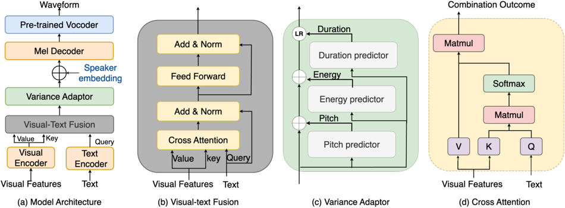

> [!abstract] Interspeech · 2025 · Conference
> **Que and Ragni** · [→ Paper](https://www.isca-archive.org/interspeech_2025/que25_interspeech.html) · Demo: ✓ · Code: ?
>
> VisualSpeech augments FastSpeech2 with a visual encoder and a cross-attention visual-text fusion module to condition prosody prediction on video features, demonstrating that visual context carries complementary prosodic information beyond what text features alone provide.

## Problem

Text-to-speech systems face the one-to-many mapping problem: identical text can be delivered with many different prosodic patterns, yet the model must commit to one. Prior approaches address this by incorporating reference speech features (pitch, energy, duration extracted from ground-truth audio) or latent style tokens, but these solutions require speech-side conditioning signals. Many real deployment contexts, such as video game characters or scripted video production, have visual context readily available and naturally correlated with the required prosody, yet this signal has been left unused in TTS prosody modeling.

## Method

VisualSpeech builds on FastSpeech2 by adding two new components: a visual encoder and a visual-text fusion module. The visual encoder shares the same Transformer architecture as the FastSpeech2 text encoder and maps a sequence of per-frame visual features (extracted from video using either the Omnivore model or ResNet50) to a visual hidden sequence. Because the visual sequence length differs from the phoneme sequence length, simple pooling or concatenation cannot directly combine the two; instead, the visual-text fusion module uses cross-attention with text encoder outputs as queries attending over visual features as keys and values. This allows the model to learn which visual cues are most relevant to each textual element. The output of the fusion module, aligned with the phoneme sequence, is used to augment the variance adaptor's pitch, energy, and duration (PED) predictions. A pre-trained vocoder converts the resulting mel-spectrogram to waveform.

Training and evaluation use CMD2, a cleaned subset of the Condensed Movies Dataset comprising approximately 44,665 training clips (~33 hours) across diverse genres and contexts. Data preparation involved vocal extraction via MVSEP, speech denoising and enhancement via Resemble-Enhance, and filtering to remove singing samples and pitch outliers above 500 Hz.

## Key Results

Two preliminary studies verify that visual features carry prosodic signal before the full TTS evaluation. First, a feedforward network trained purely on visual features predicts pitch and energy with substantially lower MSE loss than a mean-predictor baseline (Table 2), confirming that video encodes prosodic information. Second, adding visual features to a text-based PED predictor improves pitch MSE (Text+VF-Omnivore: 0.39 vs. Text-only: 0.43) and duration MSE (3% relative gain), though energy prediction degrades slightly (Table 3).

In the full TTS experiments (Table 4), both VisualSpeech variants substantially outperform FastSpeech2 on all three prosody metrics: the Omnivore-based model achieves approximately 33%, 5%, and 49% relative improvement in pitch, energy, and duration MSE respectively. On mel-spectrogram quality (Table 5), MCD improves from 7.64 (FastSpeech2) to 7.38 (Omnivore) and 7.34 (ResNet50), and Log F0 RMSE improves from 0.46 to 0.44. The same trends hold when ground-truth PED is substituted, suggesting visual features influence mel-spectrogram prediction beyond the prosody predictor pathway. No human listening study or MOS evaluation is conducted; all reported gains are on objective metrics only.

## Novelty Assessment

The paper is the first to explicitly integrate video-derived visual features into a TTS pipeline specifically for prosody modeling, which is a genuine and narrow contribution. The architectural design, a cross-attention visual-text fusion module over an existing FastSpeech2 backbone, is straightforward but purposeful: it avoids the sequence-length mismatch problem that simple pooling or concatenation would introduce. The components (FastSpeech2, Omnivore, ResNet50, cross-attention, variance adaptor) are all established; novelty lies in their combination for this specific purpose. The CMD2 dataset derived from Condensed Movies is a new resource for multi-speaker expressive TTS, though it is not released as a standalone benchmark contribution. The absence of human evaluation is a significant gap: objective prosody metrics confirm that the model predicts prosodic features more accurately, but it remains unverified whether this translates to perceptually superior speech.

## Field Significance

Moderate — VisualSpeech introduces a visually-conditioned prosody modeling paradigm for TTS, opening a direction where environmental and situational context from video can guide expressive speech synthesis. The contribution is primarily an existence proof: visual features carry prosodic information and can be integrated into a standard TTS pipeline. The scope is narrow (single-language, movie domain, no human evaluation), and the base model (FastSpeech2) is not a frontier system, so the work functions as a proof of concept rather than a production-ready advance.

## Claims

- **supports:** Visual features extracted from video carry prosodic information that complements text-derived features for pitch and duration prediction in TTS.
  > *Evidence:* A feedforward network trained solely on Omnivore visual features achieves substantially lower pitch and energy MSE than a mean-predictor baseline on CMD2, and combining visual features with text reduces pitch MSE from 0.43 to 0.39 and duration MSE by 3% relative over text-only PED prediction. *(§3.2, Table 2; §3.3, Table 3)*

- **complicates:** Visual context conditioning does not uniformly improve all acoustic dimensions in prosody prediction.
  > *Evidence:* Adding visual features to the text-based PED predictor degrades energy MSE from 0.50 (text-only) to 0.59 (Text+VF-Omnivore), and energy improvements in the full TTS system are the smallest of the three prosody dimensions (5% relative vs. 33% for pitch and 49% for duration). *(§3.3, Table 3; §3.4, Table 4)*

- **complicates:** Objective prosody metrics are insufficient to verify perceptual quality gains in visually-conditioned TTS systems.
  > *Evidence:* VisualSpeech is evaluated entirely on MCD, Log F0 RMSE, pitch/energy/duration MSE, and STOI/PESQ; no human listening test or MOS study is reported, leaving the perceptual significance of the measured improvements unconfirmed. *(§3.4, Table 5)*

- **supports:** Cross-attention fusion between visual and text encoder representations enables modality integration in sequence-to-sequence prosody prediction without requiring equal-length sequences.
  > *Evidence:* The visual-text fusion module addresses the length mismatch between the phoneme sequence and the variable-length visual feature sequence by using text queries attending to visual key-value pairs, with output aligned to the phoneme level for per-phone PED prediction. *(§2.3)*

## Limitations and Open Questions

> [!warning]
> No human evaluation is conducted. All improvements are measured on objective metrics (MCD, Log F0 RMSE, prosody MSE), and it is unknown whether the observed gains translate to perceptibly more natural or contextually appropriate speech for listeners.

The CMD2 dataset is derived from movie audio which contains residual noise, music, and variable recording conditions despite preprocessing; the paper acknowledges this directly as a limitation of the current study. The approach is tested only on English speech from a movie domain, and generalisability to other languages, read speech, or clean studio recordings is untested. The visual features used (Omnivore, ResNet50) are general-purpose video and image recognition models, not speech-specific; whether domain-adapted visual encoders would yield larger prosody gains is an open question. The paper does not address how VisualSpeech would operate when video is unavailable at inference time, which limits its applicability to scenarios where visual input is always present.

## Wiki Connections

- [[prosody-control|Prosody Control]] — VisualSpeech introduces visual context as a new conditioning signal for prosody prediction, complementing existing text-based and reference-speech-based prosody control mechanisms.
- [[transformer-enc-dec-tts|Transformer Encoder-Decoder TTS]] — VisualSpeech is built directly on FastSpeech2, extending the standard transformer encoder-decoder TTS architecture with visual conditioning modules.
- [[evaluation-metrics|Evaluation Metrics]] — the paper evaluates prosody improvement using MCD, Log F0 RMSE, and pitch/energy/duration MSE, illustrating the limits of objective-only evaluation when human perceptual verification is absent.
