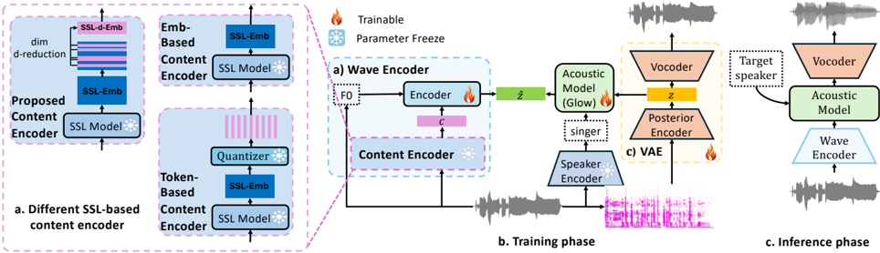

> [!abstract] Interspeech · 2025 · Conference
> **Zhou et al.** (Kyoto University / Tsinghua University / NTU Singapore / Institute of Science Tokyo) · [→ Paper](https://www.isca-archive.org/interspeech_2025/zhou25e_interspeech.html) · Demo: ✓ · Code: ?
>
> A content encoder for any-to-any singing voice conversion that reduces timbre leakage by randomly selecting and fixing a subset of dimensions from pre-trained SSL embeddings, achieving better singer similarity than full continuous embeddings while preserving content reconstruction quality across languages.

## Problem

Any-to-any singing voice conversion (SVC) requires disentangling singer timbre from vocal content so that, at inference, the timbre can be swapped to a target singer without altering melody, pitch, or pronunciation. Existing content representations face a fundamental trade-off: discrete token-based methods (k-means quantization of SSL embeddings) effectively strip timbre but compress phonetic information so aggressively that they fail to reconstruct accurate pronunciation for languages or accents outside the training distribution. Continuous SSL embedding-based methods avoid that compression but retain enough timbre in the embedding space to cause the model to rely on content features for timbre rather than the singer conditioning, leading to timbre leakage at inference.

## Method

The system builds on So-VITS-SVC, a well-established SVC architecture comprising three components: a wave encoder that combines pitch (Log-F0 from RMVPE) with content embeddings via cross-attention to produce a prior distribution; a Glow-based normalizing flow acoustic model that maps between posterior and prior distributions conditioned on singer embeddings; and a VAE decoder using a HiFiGAN vocoder with neural source-filter (NSF) that reconstructs waveform from the latent variable. Singer embeddings are extracted by a pretrained ResNet34 speaker verification model.

The proposed content encoder replaces the standard SSL embedding with a dimensionality-reduced variant. From HuBERT's 768-dimensional embeddings, a random subset of d dimensions is selected at the start of training and held fixed throughout both SVC training and inference. The intuition is geometric: assuming timbre and content information are distributed roughly uniformly across the embedding space, proportional dimension reduction reduces timbre information while retaining more content signal than discrete token quantization can achieve in an equivalently sized representation space. The selection is random but fixed, requiring no learned projection or additional parameters.

The method is validated across three embedding types: full SSL embeddings (HuBERT), SSL-Soft embeddings, and ContentVec, with d values of 128 and 256 compared against their respective full-dimensional baselines and against token-based SVC. Training used 200 hours of Chinese singing from 10,000 non-professional singers on 8 A100 GPUs for 100,000 steps. Evaluation used 16 out-of-domain target singers and 40 source songs (20 Chinese, 20 in other languages including English, Korean, Vietnamese, Japanese, and Cantonese).

## Key Results

Across both Chinese and cross-lingual test conditions, dimension reduction consistently improves singer similarity over full-dimensional embeddings at the cost of minimal content quality degradation.

On the Chinese test set (Table 1), SSL-128-Emb achieves SMOS 3.920 versus SSL-Emb's 2.750, approaching the token-based system's SMOS 4.122, while maintaining CMOS (content MOS) at 4.244 versus SSL-Emb's 4.366. The gap is small: content quality is near-preserved while timbre control improves substantially.

The key advantage appears on the cross-lingual test set (Table 2). SSL-Token drops from CMOS 4.086 (Chinese) to 3.210 (other languages), confirming that discrete quantization fails to generalize to unseen phonetic inventories. SSL-128-Emb maintains CMOS 4.220 on other languages, essentially matching its Chinese performance of 4.244. Applied to ContentVec (ContentVEC-256-Emb), dimension reduction achieves SSIM (WeSpeaker) of 0.835 and CMOS 4.256 on other languages, matching token-based singer similarity while significantly outperforming it on content reconstruction. The paper calls this the Mono2PolySVC model.

Generalization across embedding types is robust: dimension reduction improves every baseline when applied to SSL-Emb, SSL-Soft-Emb, and ContentVec independently.

## Novelty Assessment

The contribution is a simple and explicit engineering insight: randomly selecting and fixing a subset of embedding dimensions from a pre-trained SSL model reduces the amount of timbre information in the content representation in direct proportion to the dimensionality reduction, without requiring any new training objective, learned projection, or architectural modification. This is a principled but minimal intervention, and the geometric motivation (uniform distribution of timbre and content across dimensions) is an assumption rather than a demonstrated fact.

The evaluation methodology is a genuine contribution: training on a single language and testing on multiple others to stress-test content generalization is a cleaner protocol than prior SVC evaluations that use in-domain test conditions only. The Mono2PolySVC model is proposed as a practical result of applying the method to ContentVec.

Compared to ContentVec, which uses supervised speaker disentanglement during SSL pre-training, the proposed approach achieves competitive singer similarity with no additional training burden. However, the comparison baseline (So-VITS-SVC) is not a recent state-of-the-art SVC system, and the training data is proprietary, limiting reproducibility.

## Field Significance

Moderate — This paper demonstrates that a trivially simple technique (random channel selection and fixing during training) can break the token-vs-embedding trade-off that has constrained SVC content representation design. The result is practically valuable for multilingual SVC, where token-based content encoders fail. The contribution is primarily a new perspective on SSL embedding structure rather than a new architecture, and its generalization limits (single language training, informal singers, proprietary data) constrain how broadly the findings transfer.

## Claims

- **supports:** In singing voice conversion, reducing the dimensionality of SSL embeddings through random channel selection proportionally reduces timbre leakage while preserving sufficient phonetic content for accurate reconstruction.
  > *Evidence:* SSL-128-Emb (128 of 768 HuBERT dimensions) achieves SMOS 3.920 vs. SSL-Emb's 2.750 on the Chinese test set, while maintaining CMOS 4.244 vs. 4.366 for full embeddings. The pattern holds for SSL-Soft and ContentVec variants. *(§4. Results, Table 1)*

- **complicates:** Discrete token-based content representations for voice conversion cannot generalize to phonetic inventories outside the training distribution.
  > *Evidence:* SSL-Token CMOS drops from 4.086 on Chinese to 3.210 on other languages (English, Korean, Vietnamese, Japanese, Cantonese), demonstrating that k-means quantization of HuBERT with up to 10,000 clusters still loses phonetic detail that is language-specific. Continuous dimension-reduced embeddings maintain CMOS above 4.17 across both conditions. *(§4. Results, Table 2)*

- **supports:** Self-supervised speech embedding dimensions contain roughly proportional timbre and content signal, such that uniform random subsampling functions as an effective form of timbre disentanglement.
  > *Evidence:* The uniform-distribution assumption underlying random dimension selection is empirically supported by consistent improvements across three distinct SSL embedding types (HuBERT, SSL-Soft, ContentVec), each responding to dimension reduction in the same direction. *(§2.2 Proposed Content Encoder, §4. Results)*

- **refines:** Supervised disentanglement methods for SSL content encoders in voice conversion can be matched or exceeded by unsupervised dimensionality reduction at equivalent embedding sizes.
  > *Evidence:* SSL-256-Emb surpasses SSL-Soft-Emb (which uses supervised soft target training) at the same 256-dimensional size on both SSIM and SMOS metrics in Chinese. ContentVEC-256-Emb matches token-based singer similarity while outperforming token-based CMOS on cross-lingual evaluation. *(§4. Results, Table 1, Table 2)*

## Limitations and Open Questions

> [!warning]
> All training data is proprietary (200h internal Chinese singing corpus). No public benchmark or standard SVC evaluation set is used, making direct comparison to other published SVC systems infeasible.

The geometric assumption that timbre and content are uniformly distributed across SSL embedding dimensions is intuitive but unverified; the actual structure of HuBERT's representation space may be far from uniform, and it is unclear whether the technique generalises beyond informal Chinese singing. The optimal dimension count d is determined by grid search over 128 and 256 with no principled selection criterion. As d approaches zero, content reconstruction quality must eventually degrade, but the paper does not characterise this failure regime. The multilingual test set covers a limited set of languages, and the cross-lingual results do not control for dataset recording conditions.

## Wiki Connections

- [[singing|Singing Voice Synthesis]] — Targets singing voice conversion specifically, evaluating the content encoder on singing datasets where timbre-content entanglement is more pronounced than in speech.
- [[voice-conversion|Voice Conversion]] — Proposes a new content encoder to break the timbre-leakage vs. content-reconstruction trade-off in any-to-any singing voice conversion.
- [[self-supervised-speech|Self-Supervised Speech]] — Uses HuBERT (pre-trained SSL model) as the base content encoder, with the core innovation applied directly to its embedding dimensions.
- [[disentanglement|Disentanglement]] — The method explicitly targets reduction of timbre information in content representations by proportional dimensionality reduction, framing timbre-content separation as a geometric problem.
- [[evaluation-metrics|Evaluation Metrics]] — Introduces a cross-lingual CMOS evaluation protocol (train on single language, test on multilingual set) to stress-test content encoder generalization.
- [[subjective-evaluation|Subjective Evaluation]] — Employs 25 human listeners to rate content MOS (CMOS) and singer similarity MOS (SMOS) across 20 samples per content encoder variant.
- [[zero-shot-tts|Zero-Shot TTS]] — Targets any-to-any (zero-shot) SVC where target singer identity is provided at inference without speaker-specific fine-tuning.
