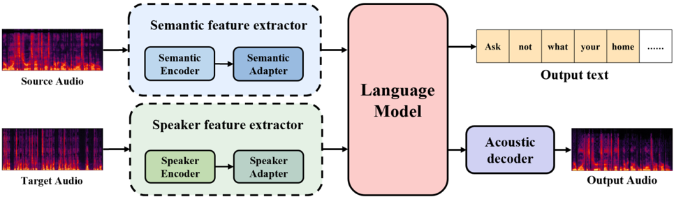

> [!abstract] Interspeech · 2025 · Conference
> **Li et al.** · [→ Paper](https://www.isca-archive.org/interspeech_2025/li25r_interspeech.html) · Demo: ✓ · Code: ?
>
> StarVC introduces an autoregressive voice conversion framework that generates text transcription tokens before Mimi codec acoustic tokens, using explicit text conditioning to disentangle speaker identity from linguistic content and achieving the lowest WER and CER among compared VC systems.

## Problem

Voice conversion requires modifying speaker identity while leaving linguistic content intact, but speaker characteristics and linguistic content are strongly entangled in the speech signal. Traditional methods that extract and transform speaker features directly from audio often suffer from timbre leakage, degraded intelligibility, or unnatural prosody. Prior work that incorporated semantic representations into VC typically used latent text-based features rather than explicit text output, resulting in weak linguistic constraints and only limited improvements. The core challenge is obtaining a structured semantic anchor that actively guides acoustic synthesis rather than simply informing it as a soft conditioning signal.

## Method

StarVC is an autoregressive VC system with four components: a Semantic Feature Extractor, a Speaker Feature Extractor, an autoregressive Language Model, and an Acoustic Decoder.

The Semantic Feature Extractor applies Whisper-small's encoder to the source speech mel-spectrogram, followed by a learned semantic adapter, producing a sequence of high-level semantic embeddings. The Speaker Feature Extractor applies ERes2Net-large to FBank features from target speech, followed by a speaker adapter, producing a single compact speaker embedding. Both feature streams are concatenated and fed into the Language Model as conditioning input.

The Language Model follows the Qwen2.5-0.5B architecture (24 transformer layers, embedding dim 896, 14 attention heads, intermediate size 4,864). It is trained to autoregressively generate text tokens first, followed by Mimi codec acoustic tokens. A delay strategy borrowed from MusicGen is used so that all text tokens are emitted one step ahead of the first acoustic token, ensuring acoustic generation is explicitly conditioned on the completed transcription. Teacher forcing and RoPE positional encoding are applied throughout.

The Acoustic Decoder is Mimi, operating with 8 codebook layers. The first layer is distilled from WavLM to retain semantic content; the remaining seven encode fine-grained acoustic detail.

Training uses three sequential stages executed on 8 NVIDIA H100 80G GPUs. Stage 1 is ASR Pretraining (30 GPU-hours), where only the semantic adapter and LM are updated, training the model to generate text tokens from speech. Stage 2 is VC Training (50 GPU-hours), where both adapters and the LM are jointly optimized with a weighted combination of text cross-entropy and per-layer acoustic cross-entropy losses; data augmentation using OpenVoice V2-synthesized speech with diverse speakers is applied at a 50/50 real-to-synthetic ratio. Stage 3 is Joint ASR-VC Training (100 GPU-hours), alternating 80% VC batches with 20% ASR batches to reinforce content-speaker disentanglement.

## Key Results

On 400 LibriTTS test-clean utterances (200 source, 200 target), evaluated against CosyVoice (VC variant), OpenVoice V2, and TriAAN-VC:

**Linguistic fidelity.** StarVC achieves WER of 6.27% and CER of 4.09%, clearly outperforming CosyVoice (8.24% / 4.27%), OpenVoice V2 (8.17% / 4.15%), and TriAAN-VC (19.67% / 12.18%). Its internal text generation also achieves WER-Text of 4.95% and CER-Text of 1.51%, providing an explicit transcript alongside the converted audio.

**Speaker similarity.** On the Resemblyzer-based SECS metric (SECS-Res), StarVC scores 0.835 versus CosyVoice's 0.839, a marginal gap. On the WavLM-based metric (SECS-WavLM), StarVC reaches 0.472 versus CosyVoice's 0.478. TriAAN-VC scores substantially lower (0.756 / 0.241) on both metrics.

**Subjective evaluation (20 listeners, 20 source-target pairs).** StarVC achieves SMOS of 3.98 and NMOS of 4.17, both the highest among compared systems. CosyVoice and OpenVoice V2 are close (SMOS 3.94/3.97; NMOS 4.15/4.09), while TriAAN-VC lags significantly (SMOS 3.25, NMOS 3.06).

**Ablations.** Removing multi-stage training raises WER to 7.24% and lowers SECS-Res to 0.812. Removing text token generation raises WER to 7.30% and SECS-WavLM drops to 0.382. A smaller 12-layer LM degrades all metrics further, indicating that sufficient model capacity is needed for both acoustic and textual generation.

## Novelty Assessment

The primary novelty is the joint text-and-speech autoregressive decoding strategy applied to voice conversion: explicitly generating a full text transcription before acoustic tokens provides a structured semantic anchor that is stronger than the latent text-based conditioning used in prior VC work. The insight bridges the spoken LM literature (Moshi, LM-VC) and conventional VC by importing the text-before-speech decoding pattern into the conversion task.

The components themselves are not novel: Whisper, ERes2Net, a Qwen2.5-0.5B-style transformer, and Mimi are all pre-existing models. The multi-stage training protocol (ASR pretraining, VC fine-tuning, joint optimization) is also a known pattern in speech. The contribution is the validated combination with an architectural motivation and supporting ablations that confirm each stage's individual contribution.

## Field Significance

Moderate. StarVC provides evidence that the autoregressive text-before-speech generation pattern, developed in spoken LM research, transfers to voice conversion and yields measurable gains in linguistic fidelity over diffusion-based and LM-based baselines on the same test set. The evaluation is limited in scope: one language (English), one test set (LibriTTS test-clean), and a small subjective study (20 listeners, 20 pairs). The approach requires three sequential training stages and substantial GPU compute, which may limit adoption relative to simpler single-stage VC methods.

## Claims

- **supports:** Conditioning acoustic generation on explicitly predicted text tokens reduces intelligibility errors in autoregressive voice conversion relative to purely acoustic-domain approaches.
  > *Evidence:* Removing text token generation from StarVC raises WER from 6.27% to 7.30% and SECS-WavLM drops from 0.472 to 0.382; StarVC achieves the lowest WER and CER among all compared systems including diffusion-based CosyVoice (8.24%/4.27%). *(§3.3.3, Table 1)*

- **supports:** Multi-stage training that initializes voice conversion with ASR pretraining improves both content preservation and speaker similarity relative to single-stage training.
  > *Evidence:* Removing multi-stage training degrades SECS-Res from 0.835 to 0.812 and raises WER from 6.27% to 7.24%; multi-stage training is the single largest contributor in the ablation study. *(§3.3.3, Table 1)*

- **complicates:** Objective speaker embedding metrics and perceptual speaker similarity ratings can diverge for codec-based voice conversion systems trained with strong linguistic objectives.
  > *Evidence:* StarVC scores marginally below CosyVoice on SECS-Res (0.835 vs. 0.839) and SECS-WavLM (0.472 vs. 0.478), yet exceeds CosyVoice on subjective SMOS (3.98 vs. 3.94), suggesting embedding-based metrics underestimate perceived similarity for this system class. *(§3.3.1, §3.3.2, Tables 1-2)*

- **refines:** Autoregressive voice conversion systems can produce explicit transcription output alongside converted audio at negligible additional cost, enabling inline content verification without separate ASR inference.
  > *Evidence:* StarVC generates text tokens with WER-Text of 4.95% and CER-Text of 1.51% as a byproduct of the VC decoding process, providing word-level content verification as part of the conversion pipeline. *(§3.3.1, Table 1)*

## Limitations and Open Questions

> [!warning]
> Subjective MOS evaluation involves only 20 listeners and 20 source-target pairs, making the reported SMOS and NMOS advantages over CosyVoice and OpenVoice V2 (all within overlapping confidence intervals) difficult to interpret as significant.

The evaluation covers English only on a single clean corpus (LibriTTS test-clean). Generalization to cross-lingual conversion, noisy conditions, or longer conversational utterances is untested. The three-stage training pipeline requires 180 GPU-hours on 8 H100s, representing a substantial compute cost that may limit practical adoption. Data augmentation relies on OpenVoice V2-synthesized speech, which could propagate artifacts from that system into StarVC's training distribution. Whether the text-before-speech decoding constraint generalizes to expressive or emotional speech conversion, where prosody is not captured by a pure transcription, remains an open question.

## Wiki Connections

- [[voice-conversion|Voice Conversion]] — proposes StarVC as a new VC architecture that uses explicit text transcription generation as a linguistic constraint to disentangle speaker identity from content
- [[autoregressive-codec-tts|Autoregressive Codec TTS]] — applies the autoregressive speech token generation paradigm to voice conversion, generating Mimi codec tokens conditioned on predicted text sequences
- [[neural-codec|Neural Audio Codec]] — uses Mimi's 8-layer codec structure (with WavLM-distilled first layer) as the acoustic decoder, with codec design choices directly influencing conversion quality
- [[spoken-language-model|Spoken Language Model]] — adapts a Qwen2.5-0.5B-style LM to jointly emit discrete text and acoustic tokens, extending the spoken LM paradigm to the VC task
- [[disentanglement|Disentanglement]] — explicitly separates content (Whisper semantic encoder) and speaker (ERes2Net speaker encoder) into distinct representation streams, reinforced by joint ASR-VC training objectives
- [[speaker-adaptation|Speaker Adaptation]] — conditions conversion on a target speaker embedding extracted from an arbitrary reference utterance via ERes2Net, enabling any-to-any VC
- [[2407.05407|CosyVoice]] — serves as the primary competitive baseline; StarVC exceeds it on linguistic fidelity metrics while closely approaching its speaker similarity scores
- [[2412.10117|CosyVoice 2]] — cited as a related diffusion-based speech synthesis approach used to contextualize the CosyVoice baseline comparison
