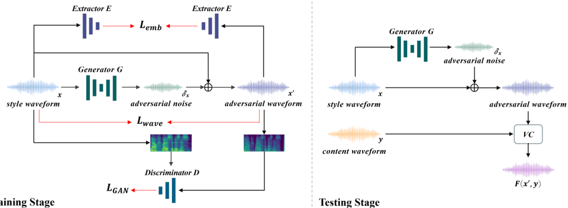

> [!abstract] Interspeech · 2025 · Conference
> **Yu et al.** (Kookmin University) · [→ Paper](https://www.isca-archive.org/interspeech_2025/yu25c_interspeech.html) · Demo: ✓ · Code: ✓
>
> Mimic Blocker adds imperceptible adversarial noise to a speaker's waveform, using self-supervised feature extractors (WavLM, HuBERT) to disrupt voice conversion models without requiring target speaker data, achieving substantially better audio quality than prior active defenses.

## Problem

Voice conversion misuse poses rising security risks: one-shot VC models can replicate a speaker's vocal characteristics from a single sample, enabling identity theft and audio deepfakes. Prior work addressed this either reactively (deepfake detection, audio forensics) or through active defenses that relied on access to specific VC model architectures during training, limiting generalization to unseen models. Methods that incorporated VC speaker encoders as attack targets were tied to those encoders and typically required paired source-and-target speaker speech, increasing data demands. Additionally, approaches operating in the Mel-spectrogram domain followed by vocoder reconstruction suffered from compounding distortions that degraded both audio quality and attack effectiveness.

## Method

Mimic Blocker frames VC defense as an adversarial perturbation problem, training a generator to add noise to the style waveform fed to a VC model. The system has three components: a generator (1D-convolutional with transposed convolution layers, tanh output bounded to [-1, 1]) that produces additive noise; a discriminator (convolutional + fully connected, operating in the Mel-spectrogram domain) that distinguishes clean from perturbed waveforms; and publicly available pretrained feature extractors (WavLM, HuBERT) that compute the attack loss.

Training uses three objectives combined as a weighted sum. The GAN loss trains the generator to fool the discriminator into classifying perturbed waveforms as natural. The wave loss (MSE between original and perturbed waveform) penalizes noise magnitude, keeping perturbations imperceptible. The embedding loss maximizes the L2 distance between the SSL feature extractor's embeddings of the original and perturbed waveforms, disrupting the speaker-identity signal that VC models rely on. The hyperparameters were set to weight wave loss at 0.8 and embedding loss at 0.2.

Training is self-supervised: no target speaker data is required. The generator learns from the original speaker's own speech by driving the SSL embeddings apart, rather than pulling them toward a designated target. This design decouples the defense from any specific VC architecture since the attack targets generic SSL speaker representations rather than a VC model's encoder.

During inference, the trained generator adds its learned noise to the style waveform before it is passed to the VC model, causing the VC output to lose accurate speaker identity while the style waveform itself retains perceptual naturalness.

## Key Results

Results are reported on CSTR VCTK (110 speakers, 20% test split) using FreeVC and TriAAN-VC as the target VC models. Defense effectiveness is measured by attack success rate (ASR: fraction of converted outputs where speaker verification fails) and preservation success rate (PSR: fraction of perturbed waveforms that still pass speaker verification as the original speaker). Audio quality is measured by PESQ and STOI. Baselines are Defending Your Voice (DYV) and RW-VoiceShield (RW).

On FreeVC (Table 1), the proposed method with WavLM (white-box) achieves ASR 0.883, PSR 1.000, PESQ 3.633, STOI 0.942. The black-box variant with HuBERT achieves comparable scores (ASR 0.880, PSR 1.000, PESQ 3.633, STOI 0.942). The audio quality gap is substantial: prior baselines score PESQ between 1.610 (DYV) and 1.990 (RW-MSE) and STOI between 0.770 and 0.840, compared to 3.633 and 0.942 for the proposed method. The only baseline with higher ASR in the white-box scenario is RW-CS-w (0.940), which achieves PSR of only 0.820 and PESQ of 1.790.

On TriAAN-VC (Table 2), the method generalizes well: WavLM variant achieves ASR 0.992 and HuBERT achieves ASR 0.990, both with PSR 1.000 and PESQ 3.632, demonstrating cross-model robustness with no retraining.

In the subjective test (21 speakers, 6 evaluators, 50 evaluation sets), 99.7% of participants in the white-box scenario and 99.3% in the black-box scenario judged the adversarial waveform as sounding like the same speaker as the original (confirming noise imperceptibility). When comparing the style waveform against the VC output from the adversarial input, 91.3% confidently identified the two as different speakers, confirming that the VC defense succeeds audibly.

## Novelty Assessment

The core novelty is using publicly available self-supervised speech representations as model-agnostic attack targets for VC defense, combined with direct waveform-domain noise injection. Prior active defenses either required VC-specific speaker encoders during training (tying them to a fixed VC architecture) or operated in the spectrogram domain where vocoder reconstruction degraded quality. Mimic Blocker's use of WavLM/HuBERT embeddings as the attack loss sidesteps both problems.

The GAN architecture is standard (1D-convolutional generator, Mel-spectrogram discriminator), and all SSL components are pretrained off-the-shelf. The genuine contribution is the formulation: separating the embedding of the original from the perturbed waveform via L2 maximization as a self-supervised training signal. The audio quality improvement over baselines is large enough (PESQ 3.63 vs 1.61-1.99) to suggest the waveform-domain approach has practical significance beyond marginal gains.

Limitations constrain confidence in the results: evaluation covers only two VC models (FreeVC, TriAAN-VC) and one dataset (VCTK), the subjective test panel is small (6 evaluators), and training takes 25 hours on an RTX 4090, which may be non-trivial for per-speaker deployment.

## Field Significance

Moderate — Mimic Blocker demonstrates that self-supervised speech representations provide a practical basis for model-agnostic VC defense, substantially improving audio quality over spectrogram-domain adversarial methods. The paper's contribution is primarily architectural (a self-supervised adversarial training framework that eliminates the need for target speaker data), and it addresses a real security concern, though the limited evaluation scope (two VC models, one corpus, six evaluators) means the findings should be treated as promising rather than definitive evidence of robustness.

## Claims

- **supports:** Active adversarial defense mechanisms can prevent voice conversion models from extracting speaker characteristics without sacrificing perceptual audio quality.
  > *Evidence:* Mimic Blocker achieves PESQ 3.633 and STOI 0.942 on VCTK while maintaining ASR above 0.88 in both white-box and black-box conditions, compared to PESQ 1.61-1.99 for prior baselines at equivalent or lower ASR levels. *(§3.2, Table 1)*

- **supports:** Pretrained self-supervised speech representations can serve as model-agnostic attack targets for VC defense, enabling consistent protection across different VC architectures without retraining.
  > *Evidence:* Training with WavLM (white-box) and HuBERT (black-box) as feature extractors, Mimic Blocker achieves ASR of 0.88 on FreeVC and 0.99 on TriAAN-VC with the same trained model, demonstrating cross-architecture transfer. *(§3.1, §3.2, Table 1, Table 2)*

- **supports:** Waveform-domain adversarial perturbation preserves speech naturalness better than spectrogram-domain approaches in voice conversion defense.
  > *Evidence:* Prior defenses applying attacks in the Mel-spectrogram domain with vocoder reconstruction achieve PESQ 1.61-1.99; Mimic Blocker's direct waveform noise injection achieves PESQ 3.633, and 99.7% of evaluators judge the perturbed waveform as perceptually identical to the original speaker. *(§2.2, §3.2, §3.3, Table 1)*

- **refines:** Active VC defense training does not require target speaker data, relaxing a key dependency of earlier adversarial protection methods.
  > *Evidence:* Unlike DYV and RW-VoiceShield, which require style-and-target speech pairs during training, Mimic Blocker uses only the original speaker's own speech by maximizing the L2 distance between SSL embeddings of original and perturbed waveforms via a self-supervised loss. *(§2.3, §1)*

## Limitations and Open Questions

> [!warning]
> The subjective evaluation involves only 6 evaluators assessing 50 speech pairs from VCTK. This panel size is small by standard listening-test norms and may not capture evaluator diversity or yield statistically robust naturalness estimates.

Evaluation is limited to two VC models (FreeVC, TriAAN-VC) on a single English dataset; performance against other VC architectures and non-English speakers is unknown. Training requires approximately 25 hours on an NVIDIA RTX 4090, which could be a practical barrier if per-speaker models are needed at scale. The white-box and black-box definitions are modified from prior work to accommodate the model-agnostic design, making direct numerical comparison with all earlier methods imprecise. It remains unclear how robust the defense is against adaptive attacks specifically designed to counter WavLM/HuBERT-based perturbations.

## Wiki Connections

- [[voice-conversion|Voice Conversion]] — Mimic Blocker directly targets one-shot voice conversion misuse, proposing a defense that disrupts speaker-identity extraction at the style input stage while preserving audio naturalness.
- [[self-supervised-speech|Self-Supervised Speech]] — WavLM and HuBERT serve as the core attack-target feature extractors in the training objective, enabling model-agnostic VC protection without reliance on VC-specific speaker encoders.
- [[subjective-evaluation|Subjective Evaluation]] — A listening test with 6 evaluators confirms that the adversarial waveform is perceptually indistinguishable from the original speaker, providing human validation that the noise remains imperceptible while disrupting VC output identity.
