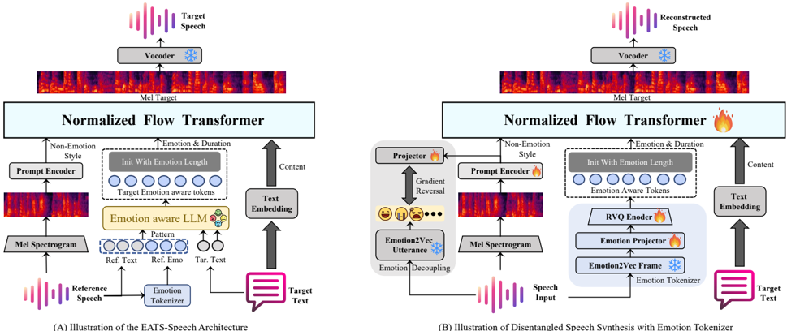

> [!abstract] Interspeech · 2025 · Conference
> **Xing et al.** (South China University of Technology) · [→ Paper](https://www.isca-archive.org/interspeech_2025/xing25_interspeech.html) · Demo: ✓ · Code: ?
>
> EATS-Speech decomposes reference speech into three parallel streams (emotion, non-emotion style, content) and uses an LLM-based converter to adapt reference emotions to match the semantic content of the target text, addressing the core failure mode where zero-shot TTS systems transfer emotionally mismatched expressiveness from reference to generated speech.

## Problem

Zero-shot TTS models condition on reference speech to capture speaker identity and style, but emotion is typically encoded as part of a unified global style representation. This conflation has two consequences. First, emotion is perceptually salient but gets overshadowed by other style attributes (timbre, speaking habits) when modeled jointly, resulting in insufficient emotional expressiveness in synthesized speech. Second, emotion is tightly coupled to semantic content: directly transplanting the reference emotion onto target text that has different emotional valence produces outputs that are emotionally inconsistent with what the words mean. Prior zero-shot TTS systems (YourTTS, VALL-E, CosyVoice) do not address this second problem at all, simply transferring whatever emotion the reference clip carries.

## Method

EATS-Speech builds on a normalized flow transformer backbone (derived from YourTTS/VITS-style synthesis) and restructures the conditioning pipeline into three parallel branches. The content branch processes target text through a text embedding layer aligned to the emotion branch via a Multi-reference Timbre Encoder. The non-emotion style branch encodes the reference mel spectrogram into a 512-dimensional style condition, with a gradient reversal loss applied against utterance-level emotion classification to actively remove emotional content from this branch. The emotion branch is the novel focus: an Emotion Tokenizer extracts frame-level features from a pre-trained emotion2vec module (50 Hz, 768-dim), projects them to 512 dimensions, then encodes them with a 3-bit RVQ quantizer (codebook size 1024). Speech duration is assigned to the emotion branch to capture the intrinsic link between speaking rate and emotional expression.

The second architectural component is the Emotion-Aware LLM, a retrained GPT-2 decoder trained in two stages. In stage one, the model learns to map from text to emotion token sequences (text-to-emotion prediction). In stage two, it learns emotion transformation: given reference emotion tokens plus reference text, it generates target emotion tokens conditioned on the target text, enabling semantic-aware emotion adaptation. At inference time, the transformed emotion tokens, non-emotion style features, and content embeddings are combined in the flow transformer to produce the final speech.

Training uses the full LibriTTS corpus (approximately 585 hours, 2300+ speakers). The Emotion Tokenizer is trained for 300k steps, the emotion-aware LLM for 500k steps, and the flow transformer is fine-tuned for 20k steps, each stage with the prior modules frozen.

## Key Results

On LibriTTS test, EATS-Speech achieves EMOS 3.96 and SMOS 3.88 from 20 human evaluators, compared to the strongest baseline CosyVoice at EMOS 3.78 / SMOS 3.82. More substantially, EATS-Speech achieves an Emotion Discrepancy (ED) of 0.571 versus CosyVoice's 1.023 and VALL-E's 1.399, indicating markedly better alignment between synthesized and reference emotional content. WER is 0.192, lower than most baselines (CosyVoice 0.238, VALL-E 0.276). UTMOS (3.882) is competitive with CosyVoice (3.734) and above VALL-E (3.220).

All comparison models were retrained on the same LibriTTS data, which makes the comparisons fair but limits generalization claims, since CosyVoice and VALL-E are typically trained on much larger corpora in their original forms.

Ablations confirm that both components contribute: removing emotion decoupling drops EMOS from 3.96 to 3.45 and raises ED from 0.571 to 0.939; removing the emotion-aware LLM drops EMOS to 3.73 and raises ED to 1.056. The decoupling component has greater impact on speaker similarity (SMOS drops from 3.96 to 3.45 without it), while the LLM conversion has greater impact on emotion adaptation (lower ED improvement when absent).

## Novelty Assessment

The core contribution is architectural: isolating emotion as a dedicated synthesis branch with gradient reversal-enforced disentanglement, and introducing an LLM-based emotion converter that performs content-aware emotion transformation. Both ideas draw on existing components (emotion2vec for representation, GPT-2 for the LLM, VITS-style flow synthesis for the backbone), but the specific framing of emotion as a "priority" branch with LLM-mediated adaptation is not standard in prior zero-shot TTS work.

The evaluation is conducted responsibly, with all baselines retrained on the same data. However, the study is limited to a single corpus (LibriTTS), which has limited emotional range despite its size. LibriTTS is audiobook speech and is not naturally emotive; the paper does not specify how emotion labels or reference samples are selected for testing, which makes it unclear how challenging the emotional transfer task actually is. The Emotion Discrepancy metric is novel but based on utterance-level emotion2vec embeddings, and it is evaluated by the same model used internally in training, which introduces circularity.

## Field Significance

Moderate — EATS-Speech contributes a specific and well-motivated architecture for emotion-aware zero-shot TTS, addressing a genuine gap where global style conditioning fails to preserve emotional consistency across texts. The two-stage LLM approach for semantic-aware emotion transformation is a useful technique. The work is constrained by its single-corpus evaluation and lacks the scale of concurrent zero-shot TTS efforts, but provides a concrete starting point for disentangled emotion control in zero-shot settings.

## Claims

- **supports:** Treating emotion as a disentangled parallel synthesis branch improves emotional expressiveness over global style conditioning in zero-shot TTS.
  > *Evidence:* Ablation removing emotion decoupling reduces EMOS from 3.96 to 3.45 on LibriTTS test, with Emotion Discrepancy rising from 0.571 to 0.939, confirming that explicit emotion isolation drives the expressiveness gains. *(§3.6, Table 2)*

- **supports:** LLM-based emotion transformation conditioned on target text semantics reduces emotion-content mismatch in zero-shot speech synthesis.
  > *Evidence:* Removing the emotion-aware LLM raises ED from 0.571 to 1.056 and drops EMOS from 3.96 to 3.73 on LibriTTS test, with both components contributing independently to emotional consistency. *(§3.6, Table 2)*

- **complicates:** Direct reference emotion transfer in zero-shot TTS produces emotionally inconsistent speech when the reference and target texts differ in emotional valence.
  > *Evidence:* All five comparison zero-shot TTS baselines (YourTTS, TransferTTS, VALL-E, E2-TTS, CosyVoice) show Emotion Discrepancy scores of 0.802 to 1.399 versus EATS-Speech at 0.571, suggesting that without explicit emotion adaptation, standard conditioning mechanisms misalign emotion to content. *(§3.3, §3.5, Table 1)*

- **complicates:** Evaluation of emotion expressiveness with metrics derived from the same model used in training introduces circularity that limits the reliability of reported Emotion Discrepancy scores.
  > *Evidence:* ED is computed using utterance-level emotion2vec embeddings, the same pre-trained model whose frame-level features the Emotion Tokenizer builds on; this means the metric and the system share the same representational basis, potentially inflating reported gains. *(§2.1, §3.5)*

## Limitations and Open Questions

> [!warning]
> The Emotion Discrepancy metric is computed using emotion2vec embeddings, the same model used as the feature extractor inside EATS-Speech's Emotion Tokenizer. This circularity means the objective metric may overstate the system's emotion alignment advantage relative to baselines that do not use emotion2vec internally.

Evaluation is limited to LibriTTS, an audiobook corpus with naturally constrained emotional variability. How well the framework transfers to genuinely expressive speech (acted emotion corpora, spontaneous speech) is not assessed. The paper does not report how reference and target samples are matched for emotional contrast in the test set, making it difficult to assess task difficulty.

The model size is not reported; the system combines a flow transformer, an emotion tokenizer, and a GPT-2-based LLM across three sequential training stages, suggesting non-trivial resource requirements that are not characterized. Only English is evaluated; extension to multilingual settings with different prosodic and emotional conventions is left open.

## Wiki Connections

- [[zero-shot-tts|Zero-Shot TTS]] — EATS-Speech is explicitly a zero-shot TTS system conditioning on reference speech for speaker transfer; it extends the standard zero-shot paradigm with a dedicated emotion handling pipeline.
- [[emotion-synthesis|Emotion Synthesis]] — the paper's primary contribution is improving emotional expressiveness and content-aligned emotion adaptation in zero-shot synthesis through disentanglement and LLM conversion.
- [[disentanglement|Disentanglement]] — the system explicitly separates speech into emotion, non-emotion style, and content branches with gradient reversal enforcement, making disentanglement a core architectural commitment.
- [[speaker-adaptation|Speaker Adaptation]] — speaker identity is captured in the non-emotion style branch; the framework preserves speaker similarity (SMOS 3.88) while adapting emotion independently.
- [[subjective-evaluation|Subjective Evaluation]] — EMOS and SMOS are collected from 20 human evaluators; the paper also introduces Emotion Discrepancy as a complementary objective metric for emotion alignment.
- [[2301.02111|VALL-E]] — used as a comparison baseline, retrained on LibriTTS; EATS-Speech outperforms it substantially on emotion metrics (EMOS 3.96 vs 3.38, ED 0.571 vs 1.399 on test).
- [[2407.05407|CosyVoice]] — used as the strongest comparison baseline; EATS-Speech shows better emotional expressiveness and consistency (EMOS +0.18, ED nearly half), while maintaining competitive naturalness.
