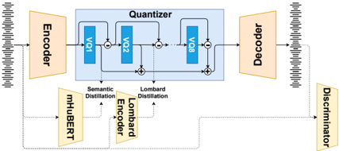

> [!abstract] Interspeech · 2025 · Conference
> **Jacquelin et al.** (GIPSA-lab, Univ. Grenoble Alpes) · [→ Paper](https://www.isca-archive.org/interspeech_2025/jacquelin25_interspeech.html) · Demo: ✓ · Code: ?
>
> LombardTokenizer extends the SpeechTokenizer RVQ codec to disentangle vocal effort from semantic content by conditioning the second RVQ layer with Lombard-specific neural encoders, enabling zero-shot conversion between neutral and Lombard speech while preserving synthesis quality.

## Problem

Residual vector quantisation (RVQ) codecs partition speech information hierarchically across quantisation layers, but prior disentanglement work (notably SpeechTokenizer) focuses exclusively on separating semantic content from general acoustic residual. The acoustic residual is a composite of many dimensions including speaker identity, recording conditions, and speaking style, with no mechanism to isolate specific attributes like vocal effort. Lombard speech (produced in response to background noise) and other high-effort speaking styles involve systematic changes in fundamental frequency, spectral slope, and formant frequencies that existing voice conversion systems struggle to transfer faithfully in zero-shot conditions.

## Method

LombardTokenizer builds on SpeechTokenizer's convolutional encoder-decoder with a two-layer BiLSTM and eight-layer RVQ module. Two targeted extensions modify the distillation strategy during training.

First, the semantic guidance in RVQ layer 1 is upgraded from HuBERT to the multilingual mHuBERT (mHuBERT-147), broadening the model's capacity for cross-lingual generalisation. Second, two Lombard speech encoders are trained on the AVID dataset (50 speakers, four intensity levels, 8 hours) to capture vocal effort representations and are used to guide the second RVQ layer via a cosine similarity distillation loss. Encoder E1 is a d-vector model pre-trained on LibriSpeech and VoxCeleb and fine-tuned on AVID with intensity level concatenated to the mel-spectrogram input. Encoder E2 is a custom CNN-LSTM intensity predictor trained on AVID to estimate speaker-normalised vocal intensity; an intermediate 32-dimensional representation is used rather than the final output. The two encoder variants yield two model versions: LT1 and LT2.

Training follows a two-phase procedure: pretraining on LibriSpeech 360h (clean), then fine-tuning on 6h from 40 AVID speakers using 2 A100 GPUs. The total loss combines reconstruction, discriminative (GAN), RVQ commitment, and the dual distillation losses from mHuBERT and the Lombard encoder.

At inference, vocal effort conversion is performed by replacing the second RVQ layer output of a source signal with the corresponding output from a target signal, while all other layers remain unchanged. This allows both intra-speaker and inter-speaker vocal effort transfer without retraining.

The evaluation uses two datasets: AVID (English, controlled intensity levels) for in-domain testing, and FLombard, a newly introduced French Lombard speech corpus of 40 speakers under four noise levels (8 hours total), for zero-shot evaluation.

## Key Results

**Synthesis quality (Table 1):** On LibriSpeech, LombardTokenizer (PESQ 3.07, STOI 0.93) matches SpeechTokenizer (PESQ 3.01, STOI 0.93) and comes close to EnCodec (PESQ 3.32, STOI 0.94). The quality gap to EnCodec narrows on the FLombard zero-shot set (LombardTokenizer 2.81 vs. EnCodec 2.94), suggesting the targeted regularisation helps on expressive and out-of-distribution speech.

**Vocal effort conversion (Table 2):** Both LT1 and LT2 substantially outperform all FreeVC variants. On AVID, LT1 achieves WER 10.97% and EER 6.67%, compared to FVC_spk at WER 20.35% and EER 16.67%. The Lombard-encoder variant of FreeVC (FVClmb) does not improve over the standard speaker-encoder variant and even degrades in some metrics, indicating that the VC architecture cannot leverage the Lombard encoder without dedicated codec integration. On the zero-shot FLombard set, LT2 achieves the best WER (15.77%) and LT1 the best EER (16.88%); all LombardTokenizer variants remain well ahead of FreeVC (24.04–32.63% WER, 22.50–33.13% EER).

**Perceptual evaluation:** Listening tests with 80 native speakers (40 English for AVID, 40 French for FLombard) confirm that perceived vocal effort distributions under LombardTokenizer conversion closely match the distributions of natural target speech across all four intensity levels. FreeVC in both variants fails to produce statistically distinguishable effort levels. Inter-speaker conversion shows slightly wider perceptual distributions than intra-speaker but the difference is non-significant.

## Novelty Assessment

The core mechanism — guiding specific RVQ layers with targeted encoders via distillation — comes directly from SpeechTokenizer. The contribution is in applying this framework to vocal effort rather than semantic content, choosing and adapting appropriate encoders (d-vector and intensity predictor), and demonstrating that a second distillation target can coexist with the existing semantic one without degrading synthesis quality. Replacing HuBERT with mHuBERT is a straightforward substitution that pays off in zero-shot multilingual transfer. The finding that injecting the same Lombard encoder into FreeVC's conditioning is ineffective (while it succeeds via RVQ distillation) is the most substantive insight, making an architectural case for codec-level disentanglement over post-hoc style conditioning in VC systems. FLombard is a genuinely new resource for Lombard speech research. Overall, this is a well-executed specialised extension of an established framework to a previously unaddressed speech attribute.

## Field Significance

Moderate — LombardTokenizer demonstrates that RVQ layer-wise distillation can capture fine-grained speaking style dimensions beyond semantic content, providing a proof of concept for effort-aware codec design. The finding that dedicated codec integration outperforms surface-level style encoder injection in VC systems is practically relevant for researchers building expressive speech conversion pipelines. The FLombard dataset and zero-shot evaluation protocol add reusable resources for Lombard speech research.

## Claims

- **supports:** Targeted distillation into specific RVQ layers can isolate fine-grained speaking style attributes (such as vocal effort) independently of semantic content in neural speech codecs.
  > *Evidence:* LombardTokenizer conditions the second RVQ layer via cosine distillation from Lombard speech encoders while keeping RVQ layer 1 semantically focused via mHuBERT; the resulting system achieves WER 10.97% and EER 6.67% on vocal effort conversion on AVID, substantially outperforming FreeVC (WER 20.35%, EER 16.67%) while retaining comparable synthesis quality (PESQ 3.07 vs. SpeechTokenizer 3.01). *(§2.3, §3.1, Table 2)*

- **complicates:** Disentanglement constraints in neural codecs reduce unconstrained reconstruction quality relative to codecs without regularisation.
  > *Evidence:* EnCodec (no disentanglement) achieves PESQ 3.32 and STOI 0.94 on LibriSpeech, while LombardTokenizer's dual distillation (semantic and Lombard) yields PESQ 3.07 and STOI 0.93, consistent with SpeechTokenizer's 3.01; the quality gap widens on in-distribution neutral speech but narrows on expressive zero-shot data. *(§3.1, Table 1)*

- **complicates:** Providing a specialized style encoder to a voice conversion model architecture does not guarantee that the encoder's information will be effectively exploited for style control.
  > *Evidence:* FreeVC modified with the same Lombard encoder (FVClmb) fails to produce statistically distinguishable vocal effort levels in perceptual evaluation, and degrades WER on FLombard (32.63%) relative to the standard speaker-encoder variant (24.04%), while LT1 using the same encoder via RVQ distillation achieves WER 17.74% and accurate perceptual effort transfer. *(§3.2, Table 2, Figure 2)*

- **supports:** Zero-shot generalization of speaking style transfer across languages is achievable when codec disentanglement is guided by multilingual self-supervised representations.
  > *Evidence:* LombardTokenizer trained on English AVID achieves WER 15.77% on the unseen French FLombard dataset (zero-shot), compared to FreeVC's 24.04–32.63%; the paper attributes part of this advantage to replacing HuBERT with multilingual mHuBERT in the semantic RVQ layer. *(§2.1, §3.2, Table 2)*

- **supports:** Codec-level disentanglement enables robust cross-speaker style transfer with low speaker identity leakage under both intra-speaker and inter-speaker conditions.
  > *Evidence:* LombardTokenizer inter-speaker vocal effort conversion produces perceptual distributions not significantly different from intra-speaker conversion (Dunn's test), with EER remaining below 8% on AVID for both LT1 (6.67%) and LT2 (7.83%), indicating preserved speaker identity. *(§3.2, Table 2, Figure 2)*

## Limitations and Open Questions

> [!warning]
> The zero-shot evaluation is from English training to French test data, and both languages are Indo-European — the claim of cross-lingual generalisation has not been tested on typologically distant languages.

The model is evaluated on controlled intensity datasets (AVID, FLombard) and trained on studio-quality recordings; performance in real-world noisy conditions or spontaneous Lombard speech is unknown. The AVID dataset uses instructed intensity levels rather than naturally elicited Lombard speech, which may reduce ecological validity. Synthesis quality is measured with PESQ and STOI, which emphasise intelligibility and signal fidelity but may not capture naturalness of expressive speech styles. The study does not address how many simultaneous disentanglement targets an RVQ structure can support before quality degrades substantially.

## Wiki Connections

- [[neural-codec|Neural Audio Codec]] — LombardTokenizer proposes a disentanglement extension to the RVQ codec framework, demonstrating that codec training objectives can be modified to isolate specific speaking styles in designated quantisation layers.
- [[disentanglement|Disentanglement]] — the paper's primary methodological contribution is using dual distillation losses to separate vocal effort from semantic content across RVQ layers, providing a concrete implementation of style disentanglement at the codec level.
- [[self-supervised-speech|Self-Supervised Speech]] — mHuBERT (a multilingual self-supervised model) is used as the core guidance signal for the first RVQ layer, and the paper credits this substitution for enabling cross-lingual zero-shot generalisation.
- [[voice-conversion|Voice Conversion]] — LombardTokenizer addresses vocal effort conversion as a style transfer task, comparing directly against FreeVC and demonstrating that codec-level integration outperforms surface style conditioning in VC systems.
- [[subjective-evaluation|Subjective Evaluation]] — the paper conducts listening tests with 80 native speakers (40 English for AVID, 40 French for FLombard) using comparative vocal effort ratings, providing human-validated evidence of conversion effectiveness.
