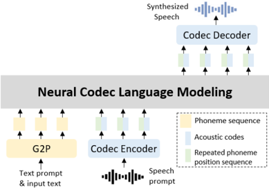

> [!abstract] Interspeech · 2025 · Conference
> **Lu et al.** (Samsung) · [→ Paper](https://www.isca-archive.org/interspeech_2025/lu25e_interspeech.html) · Demo: ✓ · Code: ?
>
> Synchronous prediction of acoustic codes and their corresponding phoneme position indices during autoregressive decoding eliminates all three categories of alignment error — skipping, repetition, and one-to-many mappings — achieving a 52.7% relative CER reduction over VALL-E on Mandarin zero-shot TTS.

## Problem

Autoregressive codec language models for TTS, in the style of VALL-E, learn text–speech alignment implicitly through self-attention. This indirect alignment is fragile: the model can skip phonemes entirely, repeat them, or attend to multiple phonemes simultaneously. Hard cases — sentences containing tongue-twisters, repeated characters, or difficult homophone clusters — expose these failures disproportionately. Prior attempts at a fix (VALL-E R's phoneme identity prediction with monotonic decoding, RALL-E's duration chain-of-thought) either introduce inference-time constraints or additional prediction stages. The question this paper addresses is whether alignment can be made explicit without changing the inference procedure or adding a duration prediction step.

## Method

The model builds on the standard VALL-E two-stage framework: an autoregressive (AR) transformer generates first-quantizer tokens, and a non-autoregressive (NAR) transformer predicts the remaining quantizer layers. The proposed change is confined to the AR stage. Alongside each acoustic code token, the model predicts the index of the phoneme in the input sequence to which that code corresponds — a scalar position drawn from the range [1, L] where L is the phoneme sequence length. Both predictions share the same transformer backbone but use separate output heads; at each time step the predicted code embedding and the predicted position embedding are summed before being fed to the next step as context.

The position sequence is constructed during training from character-level duration annotations: phoneme i at position i is repeated d_i times to produce a monotonically non-decreasing sequence of length T (the total number of acoustic frames). The model is trained by teacher forcing to maximise the joint probability of code and position sequences. Monotonicity is not enforced by a hard constraint during decoding — instead greedy decoding is used for positions, while nucleus sampling (top-p = 0.98) is used for acoustic codes. The monotonic structure emerges from the training objective alone.

Zero-shot speaker adaptation follows VALL-E's prompting approach, with one modification: the enrollment speech prompt must also supply a phoneme duration sequence, used to construct the position prompt fed to the AR model. Experiments use WenetSpeech4TTS Standard (3,453 hours of Mandarin after speaker diarization filtering) with the UniAudio codec (16 kHz, 20 ms hop, three quantizers). Both AR and NAR transformers use 12 layers, 16 heads, and a 1024-dimensional embedding. Model size is not reported.

## Key Results

On the Seed-TTS test-zh benchmark, the proposed system reduces CER from 6.69% (VALL-E) to 3.16% across all 2,020 meta cases — a 52.7% relative reduction. The improvement is more pronounced on the 400 hard cases, where CER falls from 13.78% to 4.52% (67.2% reduction). An alignment analysis on the hard set confirms that VALL-E makes 1,656 phoneme-skipping errors and 813 repetition errors; the proposed method eliminates all three error categories entirely (zero occurrences of skipping, repetition, and one-to-many alignment errors in Table 4).

VALL-E R, the closest prior baseline, reduces deletion errors well (8.37% hard CER) but its greedy decoding variant degrades severely (19.33%), showing that phoneme identity prediction alone does not solve the fundamental alignment ambiguity in repeated-character contexts. The ablation VALL-E BOTH (joint identity + position prediction) achieves 6.07% hard CER but introduces more substitution errors than position-only prediction, suggesting that conflicting phoneme identity and position signals interfere with pronunciation accuracy.

Speaker similarity (SECS) is preserved across all methods at comparable levels (0.921–0.926), within 1% of ground truth (0.931). Subjective CMOS of +0.14 over VALL-E and SMOS of 4.38 vs. 4.28 confirm that the robustness gain does not trade off naturalness or speaker similarity.

> [!note]
> Subjective evaluations use only 15 native Mandarin listeners rating 30 samples per system — a small panel. CMOS differences at this scale should be interpreted with caution.

## Novelty Assessment

The core idea — predicting the phoneme index alongside the acoustic code — is simple and well-motivated. Position prediction as an auxiliary task is not a new concept in sequence modelling, but its application here to the alignment failure modes of codec LMs is a clear and direct contribution. The distinction from VALL-E R is meaningful: predicting *where* in the phoneme sequence a code belongs (position) rather than *what* phoneme it corresponds to (identity) is a better-posed sub-task for repeated-character sentences, because identical phonemes have distinct positions but identical identities.

The contribution is architectural at the module level: a single additional output head and a position-embedding modification to the AR transformer input. Training and inference costs are essentially unchanged. The evaluation is on Mandarin only, and the hard test cases are drawn from a specific Seed-TTS benchmark that is publicly available, so the comparison is reproducible. The model size is not reported, which limits direct reproducibility.

## Field Significance

Moderate — This paper addresses a well-known failure mode of autoregressive codec TTS models and provides a clean, low-overhead fix that outperforms prior robustness strategies including duration prediction and phoneme identity co-prediction. The scope is narrow (Mandarin, single corpus), but the mechanism is language-agnostic by design, and the zero-error alignment result on hard cases is a strong empirical signal. It is primarily valuable as evidence that explicit position supervision, rather than monotonic decoding constraints, is sufficient to resolve alignment ambiguity in codec LMs.

## Claims

- Explicit phoneme position supervision during autoregressive codec training eliminates alignment errors more effectively than phoneme identity prediction or monotonic decoding constraints. *(§4.2.1, Table 2; §4.3, Table 4)*
- Alignment failures in codec language model TTS — including phoneme skipping, repetition, and one-to-many correspondence — are fundamentally a training-objective problem rather than an inference-time problem. *(§4.2.1, §4.3, Table 4)*
- Jointly predicting phoneme identity and position introduces conflicting signals that degrade pronunciation accuracy compared to position-only prediction. *(§4.2.1, Table 2)*
- Robustness improvements in autoregressive codec TTS can be achieved without changes to inference-time decoding strategy or additional duration prediction stages. *(§3.3, §4.2.1, Table 1)*

## Limitations and Open Questions

> [!warning]
> The model is trained and evaluated exclusively on Mandarin using a proprietary G2P toolkit and character-level duration annotations from the WenetSpeech4TTS dataset. Generalisation to languages without character-aligned duration labels, or to datasets where forced-alignment quality is lower, is untested.

The approach requires phoneme duration annotations at training time to construct the position sequence, which constrains its applicability to datasets with reliable forced alignments. At inference, the enrollment speech prompt must include a duration estimate — the paper does not discuss what happens when this estimate is imprecise.

The subjective evaluation is limited (15 listeners, 30 samples per system, Mandarin only), so the CMOS and SMOS figures should not be treated as strong evidence of naturalness gains beyond what the objective CER improvements already imply. Model size is not reported, making direct reproducibility assessment difficult.

## Wiki Connections

Concept pages most relevant to this paper: [[autoregressive-codec-tts]], [[zero-shot-tts]], [[neural-codec]], [[spoken-language-model]].

In-corpus papers: [[2301.02111|VALL-E]] (the direct foundation this work modifies), [[2406.02430|Seed-TTS]] (the test benchmark used for evaluation).
