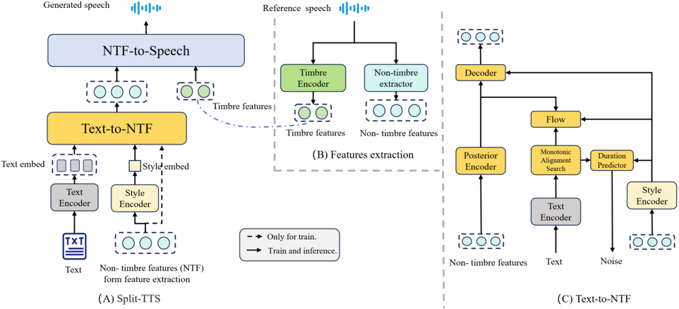

> [!abstract] Interspeech · 2025 · Conference
> **Li et al.** · [→ Paper](https://www.isca-archive.org/interspeech_2025/li25t_interspeech.html) · Demo: ✓ · Code: ?
>
> SA-RAS addresses style-mismatch in retrieval-augmented zero-shot TTS by proposing Split-TTS (a two-stage model that disentangles style from timbre) and Zero-shot CLAP (a speaker-aware retrieval model that incorporates speaker identity into text-style matching).

## Problem

RAG-based zero-shot TTS systems that select the best reference speech from a candidate pool face two compounding problems. First, CLAP-based retrieval is dominated by semantic features: embeddings that bring semantically similar text and audio together do not reliably match speaking style, so retrieved references can sound natural but stylistically incompatible with the target text. Second, the same text can be delivered in different styles by different speakers, meaning a deterministic text-to-style mapping cannot represent the speaker-specific character of unseen voices. Prior work (CA-CLAP) did not address either issue.

## Method

SA-RAS comprises two mutually dependent components: Split-TTS for speech generation and Zero-shot CLAP for retrieval.

**Split-TTS** operates in two stages. Before training, Seed-VC (a pretrained diffusion-transformer voice conversion system) is used to process all training utterances with a fixed timbre reference, yielding non-timbre features (NTF) that are stripped of speaker-specific timbre. Stage 1 trains a VITS-based CVAE on the text-to-NTF task, with a Global Style Token (GST) encoder attached to extract a style embedding from the NTF. The GST embedding is injected into the duration predictor, normalizing flow, posterior encoder, and decoder. Stage 2 fine-tunes Seed-VC's diffusion transformer to reconstruct speech from the NTF and a timbre feature extracted from the reference speech, recovering full speaker identity in the final output.

**Zero-shot CLAP** trains a multimodal retrieval model over the style space learned by Split-TTS. Three encoders operate in parallel: the GST-based style encoder from Split-TTS (frozen), a pretrained speaker encoder (H/ASP), and RoBERTa as the text encoder. The speaker embedding is averaged over all available utterances for a given speaker, then concatenated with the text embedding before an MLP projection. Contrastive learning with a cosine similarity matrix trains only the text encoder and MLP, leaving the style and speaker spaces intact.

At inference, all candidate reference speeches are indexed as style embeddings and timbre features. Given a text input, the text encoder fuses with the speaker embedding to produce a query; the top-matching style embedding is retrieved, and Split-TTS synthesises speech using that style and the corresponding timbre features.

## Key Results

On LibriTTS unseen speakers, SA-RAS outperforms CA-CLAP on all subjective measures: naturalness MOS 3.827 versus 3.408, style-similarity MOS 3.556 versus 3.117, and style-text-compatibility MOS 3.653 versus 3.189 (Table 1). On objective measures, SA-RAS improves F0 distortion (21.559 versus 22.688) and energy distortion (7.494 versus 7.935) relative to CA-CLAP, though MCD is slightly higher (6.86 versus 6.678). The ablation confirms the value of speaker conditioning: removing the speaker encoder drops S-SMOS from 3.556 to 3.168.

The oracle "Self" condition (ground-truth text-matched reference) achieves NMOS 4.046 and S-SMOS 3.980, defining a performance ceiling that SA-RAS does not reach. t-SNE visualisation on ESD shows that Zero-shot CLAP embeddings separate emotion categories better than CA-CLAP, which produces a roughly uniform distribution across emotions.

The evaluation is small-scale: 15 listeners rated 15 samples selected from three unseen speakers.

## Novelty Assessment

The genuinely new element is the combination of speaker-conditioned CLAP retrieval with a style-timbre disentangled TTS model. The insight that speaker identity should inform the retrieval query (rather than only the text) is clean and the ablation supports it directly. However, each component relies heavily on prior work: Split-TTS reuses VITS and Seed-VC with standard GST conditioning, and Zero-shot CLAP is a straightforward extension of CA-CLAP. The use of Seed-VC as a timbre-stripping preprocessing step is clever but largely engineering. The evaluation scale (15 listeners, single GPU training, 12 unseen test speakers for the objective part) leaves substantial generalization questions open, and the paper does not test against zero-shot TTS systems beyond the retrieval method comparison.

## Field Significance

Moderate — SA-RAS demonstrates that speaker-aware retrieval resolves the style-mismatch problem in RAG-based zero-shot TTS more effectively than semantic retrieval, contributing a useful design principle for multi-reference TTS scenarios. The contribution is primarily at the retrieval-model level rather than the synthesis architecture level, and the modest evaluation scale limits the strength of the empirical claims.

## Claims

- **supports:** Incorporating speaker identity into the retrieval query improves style compatibility in RAG-based zero-shot TTS.
  > *Evidence:* Ablation removing the speaker encoder from Zero-shot CLAP drops S-SMOS from 3.556 to 3.168, while the full model outperforms CA-CLAP (3.117) on the same metric, confirming that speaker conditioning directs retrieval toward each speaker's stylistic range. *(§3.5, Table 1)*

- **supports:** Style-timbre disentanglement enables retrieval in a style-specific embedding space that better captures expressive variation than entangled audio representations.
  > *Evidence:* Split-TTS uses Seed-VC to generate timbre-free NTF features for training, yielding a GST encoder whose embeddings cluster by emotion in t-SNE; this style encoder, used in Zero-shot CLAP retrieval, outperforms the CA-CLAP audio encoder on style-similarity MOS (3.556 vs 3.117). *(§2.1, §3.3, §3.4)*

- **complicates:** Optimizing for style-compatible reference retrieval in zero-shot TTS can trade off against acoustic fidelity metrics.
  > *Evidence:* SA-RAS achieves better S-SMOS and ST-MOS than CA-CLAP but slightly higher MCD (6.86 vs 6.678), suggesting that the reference best matched for style is not always the one that minimises acoustic distortion. *(§3.3, Table 1)*

- **complicates:** Retrieval-augmented zero-shot TTS consistently falls short of oracle (text-matched) reference selection by a substantial margin across both naturalness and style metrics.
  > *Evidence:* The proposed SA-RAS scores NMOS 3.827 and S-SMOS 3.556, versus the "Self" oracle at NMOS 4.046 and S-SMOS 3.980, a gap that persists even after speaker-aware retrieval improvements. *(§3.4, Table 1)*

## Limitations and Open Questions

The subjective evaluation involves only 15 listeners rating 15 samples drawn from three unseen speakers, making it difficult to draw statistically robust conclusions. The paper does not compare against end-to-end zero-shot TTS systems beyond the retrieval method comparison, leaving open whether SA-RAS is competitive with current multi-reference synthesis baselines. Stage 1 training is reported for 100k steps on a single RTX 2080, and the scalability of the approach to larger datasets or stronger synthesis backends is untested. The approach currently selects only the single top-ranked reference, and whether style blending across multiple retrieved references could further improve expressiveness remains unexplored.

## Wiki Connections

- [[zero-shot-tts|Zero-Shot TTS]] — SA-RAS targets zero-shot voice cloning with multiple reference speeches, addressing the style-retrieval quality gap in that setting.
- [[disentanglement|Disentanglement]] — Split-TTS explicitly separates style and timbre into distinct representation spaces via Seed-VC preprocessing and a dedicated GST style encoder.
- [[diffusion-tts|Diffusion TTS]] — the second synthesis stage of Split-TTS is built on Seed-VC, a diffusion-transformer voice conversion model, making diffusion the core generation backbone.
- [[subjective-evaluation|Subjective Evaluation]] — SA-RAS is evaluated with MOS, S-SMOS, and ST-MOS listening tests conducted with 15 human raters.
- [[2301.02111|VALL-E]] — cited as a foundational zero-shot codec-language TTS system that motivates the multiple-reference scenario SA-RAS targets.
- [[2407.05407|CosyVoice]] — cited as a recent scalable zero-shot TTS baseline, situating SA-RAS within the multilingual zero-shot TTS landscape.
