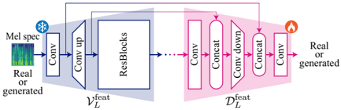

> [!abstract] Interspeech · 2025 · Conference
> **Kaneko et al.** (NTT) · [→ Paper](https://www.isca-archive.org/interspeech_2025/kaneko25b_interspeech.html) · Demo: ? · Code: ?
>
> Introduces the Vocoder-Projected Feature Discriminator (VPFD), which replaces full waveform upsampling in GAN discriminators with intermediate vocoder features, achieving voice conversion quality comparable to waveform discriminators at 9.6x lower training time and 11.4x lower memory consumption.

## Problem

In two-stage TTS and VC systems, acoustic feature generators (first stage) are commonly trained with GAN-based adversarial objectives in the waveform domain. This approach, exemplified by the vocoder waveform discriminator (VWD), is effective because it bypasses the need for the discriminator to learn a waveform-quality representation from scratch. However, converting mel spectrograms to waveforms requires upsampling by 256x, which makes VWD training prohibitively expensive in memory and time when resources are limited. Alternatives such as mel-spectrogram discriminators avoid this overhead but fail to capture waveform-quality characteristics and produce inferior output.

## Method

VPFD uses the intermediate features of a pretrained GAN vocoder (HiFi-GAN V1) as the discriminator's input representation, rather than the fully upsampled waveform. The vocoder feature extractor (V_feat) is truncated after a single upsampling step (8x instead of 256x), producing intermediate representations that capture periodic waveform structure while requiring far less compute. Inspired by Projected GAN, V_feat is pretrained and its parameters are frozen during discriminator training; only the discriminator head (D_feat) is optimized. D_feat uses a U-Net architecture that performs downsampling at the same rate as V_feat's upsampling, with residual blocks, leaky ReLU activations, and weight normalisation throughout. The training objective combines a least-squares GAN adversarial loss with a feature matching loss defined over D_feat's internal layers.

The paper validates VPFD by substituting it for VWD in FastVoiceGrad (FVG), a one-step diffusion-based VC model obtained by adversarial distillation of VoiceGrad (a DDPM nonparallel VC system). The total training objective combines the VPFD adversarial loss, feature matching loss, and a score distillation loss (with weights lambda_FM = 2 and lambda_distill = 45). Two ablation questions are answered: how many upsampling steps are necessary, and whether V_feat should be pretrained and frozen.

## Key Results

On VCTK (one-shot any-to-any VC, 110 English speakers), FVG + VPFD₁ achieves UTMOS 3.99, DNSMOS 3.79, CER 1.2%, and speaker similarity SECS 0.851, compared to FVG with full waveform discriminator at UTMOS 3.96, DNSMOS 3.77, CER 1.3%, SECS 0.847. Training time falls from 47 hours to 4.9 hours (9.6x reduction) and peak GPU memory from 66.3 GB to 5.8 GB (11.4x reduction) (Table 1). Ablation over upsampling depth shows that zero upsampling (single convolution) significantly hurts DNSMOS and SECS, while one or more upsampling steps perform comparably to full waveform discriminators (Table 1).

Subjective listening tests with over 1,000 responses from 11 participants across 90 speaker/sentence pairs confirm the objective findings: qMOS 3.63 ± 0.10 vs. 3.61 ± 0.09 and sMOS 2.69 ± 0.12 vs. 2.64 ± 0.12 for VPFD₁ vs. FVG, both within confidence intervals (Table 4). Alternative acceleration strategies all underperform: fewer training epochs degrades quality, ablating discriminator components increases time only marginally, and mel-spectrogram discriminators (even large ones) fail to match DNSMOS regardless of capacity (Table 3). Results on LibriTTS (1,100 speakers) confirm the same efficiency-quality trade-off (Table 5).

## Novelty Assessment

The core idea adapts Projected GAN (frozen pretrained feature networks as discriminator inputs) to the vocoder feature space, which is a direct application of an established technique from image synthesis to acoustic feature generation. What is new is the specific finding that intermediate vocoder features after a single upsampling step are sufficient for waveform-quality adversarial training, and the empirical quantification of the compute savings. The U-Net discriminator architecture is standard. The contribution is primarily architectural in a narrow sense (a new discriminator component design), with a focused empirical validation on one VC system. Applicability to TTS is claimed but undemonstrated.

## Field Significance

Moderate — VPFD provides a practical solution to the high compute cost of waveform-domain adversarial training in two-stage synthesis pipelines. The finding that a single vocoder upsampling step yields sufficient discriminative power for acoustic feature quality is a useful empirical result for practitioners building GAN-based training pipelines. The approach is narrow in scope (validated only on VC distillation) but the principle can serve as a lightweight discriminator design pattern wherever pretrained vocoders are available.

## Claims

- **supports:** Intermediate vocoder features after partial upsampling are sufficient for waveform-quality adversarial discrimination of acoustic feature generators.
  > *Evidence:* FVG + VPFD₁ (single upsampling step, 8x) matches full waveform discriminator performance on UTMOS, DNSMOS, CER, and SECS across both VCTK and LibriTTS; visualisation shows periodic waveform structures emerge after one upsampling step. *(§3.2, Tables 1 and 5, Figure 3)*

- **supports:** Freezing pretrained feature extractors in projected GAN discriminators is essential for acoustic synthesis quality.
  > *Evidence:* Ablation shows that both pretraining and freezing V_feat are independently necessary: omitting either degrades UTMOS, DNSMOS, and SECS, with no change in training time or memory. *(§3.2, Table 2)*

- **complicates:** Waveform-domain discriminators in two-stage TTS/VC training are effective but impose resource costs that make them impractical outside well-resourced settings.
  > *Evidence:* VWD (MPD + MRD applied to vocoder output) requires 47 hours and 66.3 GB GPU memory on VCTK; mel-spectrogram discriminators avoid this cost but fail to match waveform-domain quality on DNSMOS regardless of model size. *(§1, §3.3, Tables 1 and 3)*

- **refines:** For vocoder-based feature projection, a minimum of one upsampling step is necessary to produce the periodic structures required for effective adversarial discrimination.
  > *Evidence:* VPFD₀ (no upsampling) significantly degrades DNSMOS (3.66 vs. 3.79) and SECS (0.843 vs. 0.851) relative to VPFD₁; Figure 3 shows periodic structures absent in mel spectrograms and zero-upsampling features appear only after one step. *(§3.2, Table 1, Figure 3)*

## Limitations and Open Questions

VPFD is validated only on one VC system (FastVoiceGrad on VoiceGrad) and never on a TTS system, despite TTS being a stated target application. The subjective evaluation involves only 11 participants, which is small for a listening test. All experiments use 22.05 kHz audio with 80-dimensional log-mel spectrograms and HiFi-GAN V1 as the vocoder; performance with other vocoders, sample rates, or codec-based acoustic representations is unknown. The approach requires a high-quality pretrained vocoder whose intermediate features provide sufficient discriminative power, which may not hold for vocoders trained on limited or mismatched data.

## Wiki Connections

- [[voice-conversion|Voice Conversion]] — VPFD is validated on one-shot any-to-any VC (FastVoiceGrad on VCTK and LibriTTS), demonstrating quality-preserving compute reduction in adversarial VC training.
- [[gan-vocoder|GAN Vocoder]] — the paper exploits internal representations of a pretrained GAN vocoder (HiFi-GAN V1) as the discriminator feature space, directly leveraging the vocoder's learned waveform quality signal.
- [[diffusion-tts|Diffusion TTS]] — the base VC system (FastVoiceGrad) is a one-step diffusion model obtained by adversarial conditional diffusion distillation, and VPFD serves as its adversarial training discriminator.
- [[evaluation-metrics|Evaluation Metrics]] — objective evaluation uses UTMOS, DNSMOS, CER, and SECS to systematically compare discriminator variants across upsampling depths and training strategies.
- [[subjective-evaluation|Subjective Evaluation]] — a 90-pair listening test (qMOS and sMOS) with over 1,000 responses validates that VPFD matches waveform discriminator quality on speech naturalness and speaker similarity.
