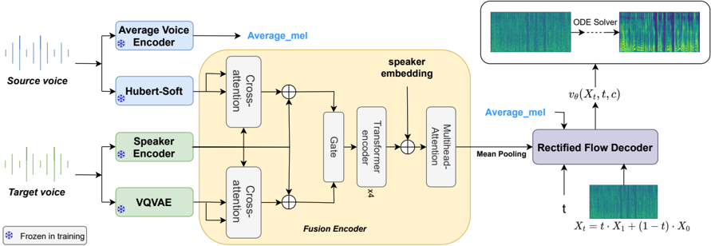

> [!abstract] Interspeech · 2025 · Conference
> **Ren et al.** (Xiamen University) · [→ Paper](https://www.isca-archive.org/interspeech_2025/ren25b_interspeech.html) · Demo: ✓ · Code: ?
>
> ReFlow-VC applies rectified flow as the generative backbone for zero-shot voice conversion, replacing diffusion's iterative denoising with a direct ODE transport from noise to mel spectrogram, and combines it with a cross-attention gated fusion module that refines speaker embeddings using content and pitch features.

## Problem

Diffusion-based voice conversion models such as Diff-VC achieve high sample quality but require hundreds or thousands of denoising steps, making inference slow and costly in practice. At the same time, autoencoder and GAN-based systems like AutoVC and Free-VC are faster but leave quality and speaker similarity gains on the table. The challenge is to close the quality gap of diffusion while recovering its impractical inference cost — particularly in zero-shot settings where the target speaker has no training data.

## Method

ReFlow-VC uses rectified flow (the same ODE formulation underlying flow-matching TTS) to model the mapping from a standard Gaussian prior to the ground-truth mel spectrogram distribution. Training minimises a least-squares regression between the predicted velocity field and the straight-line direction between noise and data samples: L = E[||(X1 − X0) − v_θ(Xt, t, c)||²]. Inference solves the learned ODE from a noise sample conditioned on speaker features, using either the Euler solver for one-step generation or the RK45 solver for higher quality. A second-order variant, 2-ReFlow-VC, is obtained by retraining with samples generated by the first model, straightening the flow trajectories further.

The encoder combines three parallel streams: an average voice encoder converts source audio to speaker-independent average mel, HuBERT-Soft (from Soft-VC) extracts continuous content features, and YAPPT plus a VQ-VAE produces speaker-independent quantised pitch representations. These streams feed a feature fusion module that uses two layers of cross-attention (256-dim), a gated fusion step, iterative self-attention, and an 8-head multi-head attention block to dynamically adjust the speaker embedding using content and pitch. The resulting speaker condition is broadcast-concatenated with the noisy mel in the decoder.

The decoder is a U-Net (as in GradTTS) with four times the original channel count, conditioned via 2D-convolution and MLP projections that produce a 128-dimensional speaker vector. Training runs for 200K iterations on a single NVIDIA 2080Ti using the LibriTTS subset (38 hours, 26,000 utterances), with HiFi-GAN as the vocoder.

## Key Results

On the 500-utterance LibriTTS test set, ReFlow-VC with the RK45 solver achieves NMOS 3.78 ± 0.05, SMOS 2.81 ± 0.05, CER 2.12%, WER 4.84%, and SECS 0.843 — the strongest results among all compared systems (Table 1). Compared to Diff-VC at 1000 steps (its best configuration), ReFlow-VC matches NMOS (3.78 vs. 3.75) and substantially outperforms it on speaker similarity (SECS 0.843 vs. 0.781) and content preservation (WER 4.84 vs. 13.92%). Against Free-VC, ReFlow-VC improves SECS from 0.745 to 0.843 and halves WER.

The one-step Euler performance is noteworthy: ReFlow-VC at a single step achieves SECS 0.830 and WER 4.54%, comparable to Diff-VC's 30-step output (SECS 0.766, WER 13.8%). Sampling time for one step is 0.10 seconds versus Diff-VC's 4.68 seconds at 30 steps. The ablation comparing NReFlow-VC (without feature fusion) to ReFlow-VC shows that the gated fusion module accounts for most of the speaker similarity gain (SECS 0.751 → 0.830 at one step) with minimal effect on NMOS.

The 2-ReFlow-VC variant modestly improves one-step performance (SECS 0.832 vs. 0.830) but shows no advantage at 30 steps or with the RK45 solver, suggesting diminishing returns from the second rectification.

## Novelty Assessment

The primary architectural contribution is the application of rectified flow — already applied by the same group to TTS in ReFlow-TTS (ICASSP 2024) — to the voice conversion task. This is a direct domain transfer rather than a new theoretical advance. The feature fusion module (cross-attention + gated fusion over content, pitch, and speaker embeddings) is the more original component; it addresses a known weakness in zero-shot VC where speaker embeddings fail to adapt to the prosodic context of the input utterance. The combination is technically sound but not paradigm-shifting. Evaluation is conducted on a relatively small, clean subset of LibriTTS; generalisation to noisy or expressive speech is untested. Comparisons are fair within the stated conditions (same training subset for Diff-VC), though the baselines are not frontier systems.

## Field Significance

Moderate — ReFlow-VC extends rectified flow from TTS to voice conversion, demonstrating that the fast ODE transport approach transfers well to the VC task and achieves meaningful gains over diffusion at matched or lower inference cost. The feature fusion design offers a concrete mechanism for incorporating prosodic context into speaker conditioning, which is a recurring challenge in zero-shot VC. The contribution is incremental relative to the TTS literature but represents a useful data point for the VC sub-field.

## Claims

- Rectified flow achieves comparable or better sample quality to diffusion for voice conversion at substantially fewer inference steps.
- Conditioning speaker embeddings on concurrent content and pitch features improves speaker similarity in zero-shot voice conversion.
- A single-step ODE solver can match the quality of dozens of diffusion steps when the flow trajectories are sufficiently linear.
- Recursive rectification (retraining on model-generated samples) yields only marginal improvements when the initial model is already well-trained.

## Limitations and Open Questions

> [!warning]
> The model is trained and evaluated on a 38-hour clean subset of LibriTTS with a single-GPU budget, and evaluated only on same-domain test utterances. Generalisation to out-of-domain or expressive speech is neither tested nor discussed.

Speaker similarity scores (SECS ~0.84) are competitive but still well below the vocoder upper bound (0.987), suggesting substantial headroom. WER and CER remain measurably above the ground truth pipeline (CER 2.12 vs. 0.52 for GT), indicating some content leakage. The pitch extraction step adds over 1 second of preprocessing latency for a ~9-second utterance, which limits real-time applicability. The paper does not report real-time factor (RTF) or measure latency end-to-end. It is also unclear how performance scales with reference speech duration — the evaluation uses a fixed 4.7-second target clip.

## Wiki Connections

This paper applies [[flow-matching]] principles — specifically rectified flow — to [[voice-conversion]] and demonstrates that efficient ODE transport generalises from TTS to VC. The use of HuBERT-Soft for content extraction connects to [[self-supervised-speech]] representations, and the explicit separation of content, pitch, and timbre streams relates to [[disentanglement]] approaches. For zero-shot generalisation, the work sits alongside other [[zero-shot-tts]] and VC methods that rely on reference speaker embeddings without fine-tuning.
