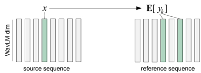
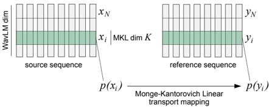

> [!abstract] Interspeech · 2025 · Conference
> **Lobashev et al.** · [→ Paper](https://www.isca-archive.org/interspeech_2025/lobashev25_interspeech.html) · Demo: ? · Code: ?
>
> MKL-VC replaces the kNN regression step in the kNN-VC pipeline with a factorized analytical optimal transport map derived from the Monge-Kantorovich Linear solution, achieving any-to-any cross-lingual voice conversion from utterances as short as 5–10 seconds — comparable in quality to FACodec without any model training.

## Problem

kNN-VC, the dominant training-free voice conversion pipeline, degrades sharply when reference audio is shorter than about one minute because the nearest-neighbour search fails to find sufficiently similar sounds to cover every frame of the source utterance. It also tends to introduce language-specific phonetics from the reference into cross-lingual conversions (e.g., replacing a French guttural /r/ with a German rolled /r/), making it unreliable for cross-lingual use cases.

Optimal transport had been proposed as an alternative mapping strategy (e.g., SinkVC using the Sinkhorn algorithm), but a naive application to the full 1024-dimensional WavLM embedding space is problematic: only the ~100 highest-variance dimensions dominate any pairwise distance metric, yet the remaining 900 dimensions carry reconstruction-relevant information that cannot simply be discarded. Applying a single global transport plan therefore either ignores that information or produces an ill-conditioned problem.

## Method

MKL-VC follows the standard encoder-converter-vocoder pipeline of kNN-VC, keeping WavLM-Large as the encoder and HiFi-GAN as the vocoder. The sole change is in the conversion step: instead of searching for nearest neighbours in the target speaker's embedding set, the algorithm computes an analytical optimal transport map between the source and target embedding distributions.

The transport map is derived from the Monge-Kantorovich Linear (MKL) solution — the closed-form optimal transport between multivariate Gaussians under squared Euclidean cost. To handle WavLM's non-uniform variance structure, the 1024-dimensional embedding space is first sorted by per-dimension standard deviation, then partitioned into blocks of size K. An independent MKL map is estimated and applied within each block, effectively approximating the full covariance as block-diagonal. The factorized map is the concatenation of these K-dimensional maps.

The factorization serves two purposes: it ensures that low-variance dimensions participate in the transport (not just the high-variance ones that dominate a single global plan), and it improves numerical stability by working with small, near-Gaussian sub-distributions rather than a high-dimensional one. The Gaussian assumption is validated empirically via Wasserstein-2 distance between WavLM embedding segments and fitted Gaussians; smaller K yields distributions closer to Gaussian. In practice K=2 achieves the best overall score.

At inference, the algorithm requires only a single reference utterance (5–10 seconds) — far shorter than the ~5 minutes required for kNN-VC to be reliable. There is no training, fine-tuning, or adaptation step; the transport statistics are estimated from the reference audio directly.

## Key Results

On LibriSpeech test-clean, with single-utterance (5–10 s) references, MKL-VC (K=2) achieves a composite total score of 0.105 versus 0.106 for FACodec and 0.375 for kNN-VC (Table 2). The breakdown is WER 8.1%, CER 3.8%, and speaker similarity 94.6% for MKL-VC (K=2), compared to WER 8.5%, CER 3.9%, and SIM 95.0% for FACodec — statistically near-identical on content preservation, with FACodec marginally ahead on speaker similarity.

On cross-lingual German-French pairs from FLEURS, MKL-VC (K=2) scores a total of 0.441 versus FACodec at 0.400, placing it second. kNN-VC completely fails this task (total score 1.156, WER 96.7%), confirming that the cross-lingual limitation is intrinsic to the nearest-neighbour approach rather than to the encoder or vocoder.

The human ranking experiment for cross-lingual naturalness (source languages Arabic, Bengali, Spanish, Kazakh, Italian, and Sakha; reference in Japanese) shows preferences split roughly 50/50 between FACodec (ranked 2) and MKL-VC (ranked 4) across six native-speaker evaluators. Notably, evaluators highlight that MKL-VC avoids the "robotic voice" artefact present in FACodec, while Diff-VC and kNN-VC are consistently ranked last.

The K hyperparameter governs a content-similarity trade-off: K=2 produces the lowest WER/CER but moderate SIM; K=64 raises SIM to 96.3% at the cost of WER climbing to 12.7%.

## Novelty Assessment

The technical contribution is a targeted algorithmic substitution: replacing the kNN regression step with an analytical Gaussian optimal transport map applied in factorized WavLM subspaces. Both the encoder (WavLM-Large) and the vocoder (HiFi-GAN) are unchanged. The Monge-Kantorovich Linear solution for Gaussian optimal transport is a classical result from colour transfer literature (Pitie and Kokaram, 2007); the novelty lies in the insight that WavLM embeddings approximately satisfy the Gaussian assumption in low-dimensional blocks, and that this structure can be exploited to build a stable, computationally cheap transport map.

The factorization idea is principled and substantiated by the ablation in Table 2 and the Gaussian-fit analysis in Figure 3. The improvement over kNN-VC is genuine and large. The comparison to FACodec is fair in the sense that both use the same short reference condition, though FACodec is a substantially more complex system trained on significantly more data. The SinkVC re-implementation performs poorly (total 0.55), attributed by the authors to entropy regularisation in the Sinkhorn algorithm distorting the low-variance dimensions — a plausible explanation consistent with the analysis.

This is an incremental-but-principled contribution: it solves a known and practically important limitation of kNN-VC (short reference audio) with a well-grounded modification. The method is not generalizable beyond WavLM without re-validating the Gaussian assumption, which limits its broader impact.

## Field Significance

Moderate — MKL-VC demonstrates that the short-reference limitation of kNN-VC can be addressed without training by exploiting the statistical structure of WavLM embeddings. The result places a training-free method on par with FACodec for monolingual and near-par for cross-lingual conversion, which is a useful practical finding. The approach is encoder-specific and does not generalise to arbitrary SSL representations without re-analysis, constraining its broader adoption.

## Claims

- Training-free voice conversion based on distribution matching in self-supervised embedding subspaces can achieve speaker similarity and content preservation comparable to trained codec-based systems when reference audio is limited to a few seconds. *(§4.4, Table 2)*
- The nearest-neighbour approach in kNN-style voice conversion degrades significantly in cross-lingual settings because phoneme-level proximity in the embedding space conflates content with language-specific pronunciation. *(§1, §4.4, Table 3)*
- Non-uniform variance structure in self-supervised speech representations makes global optimal transport maps suboptimal; factorizing the embedding space by variance before applying transport improves both content preservation and numerical stability. *(§3)*
- A content-speaker-similarity trade-off is inherent to WavLM-based voice conversion and can be navigated via the block-size hyperparameter of a factorized transport scheme. *(§4.4, Table 2)*

## Limitations and Open Questions

> [!warning]
> The Gaussian assumption underlying MKL-VC is specific to WavLM-Large embeddings, as demonstrated empirically. The authors explicitly note that for any new encoder the assumption must be verified from scratch, making the method non-portable without additional analysis effort.

The method is evaluated only against objective metrics (WER, CER, X-vector cosine similarity) on LibriSpeech and FLEURS, and a small subjective ranking with six experts. No MOS or MUSHRA scores are reported, and the subjective evaluation is a ranking rather than an absolute naturalness measure, making it difficult to position MKL-VC on the standard VC evaluation scale.

Diff-VC was evaluated on only 855 of 7800 samples due to compute constraints; its baseline number may therefore be unreliable for fair comparison. SinkVC is a re-implementation rather than the official release, introducing uncertainty about whether the reported gap to MKL-VC reflects the method or the reimplementation fidelity.

No code or demo is linked in the paper; reproducibility depends on the authors releasing code.

## Wiki Connections

- [[voice-conversion]] — MKL-VC is a training-free kNN-VC variant with factorized optimal transport replacing the nearest-neighbour step.
- [[self-supervised-speech]] — the method relies on and exploits statistical properties specific to WavLM-Large embeddings.
- [[multilingual-tts]] — the paper provides quantitative evidence of kNN-VC's cross-lingual failure mode and demonstrates that distribution-matching approaches partially address it.
- [[evaluation-metrics]] — introduces a composite total score combining WER, CER, and SPK-SIM as distance to ideal point (Eq. 3).
