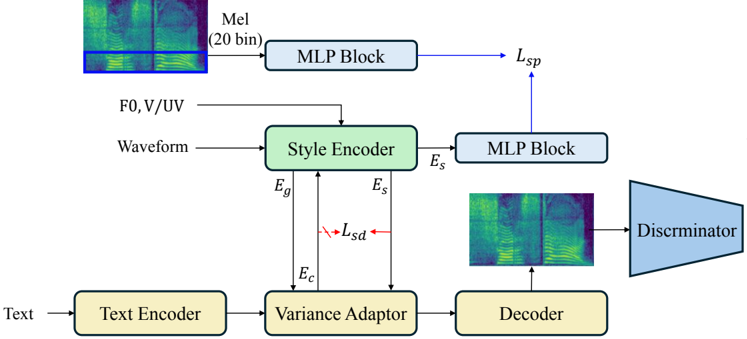

> [!abstract] Interspeech · 2025 · Conference
> **Kim et al.** (Korea University) · [→ Paper](https://www.isca-archive.org/interspeech_2025/kim25t_interspeech.html) · Demo: ✓ · Code: ?
>
> Spotlight-TTS improves expressive TTS style transfer by restricting residual vector quantization to voiced speech regions and introducing geometry-based losses that remove content information from the extracted style while preserving prosody.

## Problem

Style transfer TTS systems extract speaking style from a reference utterance and apply it to new text. Existing approaches apply style encoding uniformly across all speech frames, treating voiced and unvoiced regions as equally informative for style capture. This ignores a core property of speech acoustics: voiced regions carry rich harmonic structure generated by vocal fold vibration, and these harmonics are highly correlated with prosody and emotional expression, while unvoiced regions contain aperiodic noise-like signals with far less style-relevant information. A second problem is content leakage: style embeddings trained with only a vector quantization bottleneck as the disentanglement mechanism tend to retain linguistic information, causing pronunciation errors when reference and target texts diverge. Prior work lacked explicit geometric constraints to enforce independence between style and content representations.

## Method

Spotlight-TTS extends FastSpeech 2 with a two-level style encoder and two complementary training losses. The backbone (text encoder, variance adaptor, decoder) follows FastSpeech 2, with a multi-length discriminator providing adversarial mel-spectrogram training. BigVGAN converts mel-spectrograms to waveforms.

The voiced-aware style encoder operates on mel-spectrogram frames partitioned by pre-extracted voiced/unvoiced (V/UV) classification flags. Only voiced frames are fed into the residual vector quantization (RVQ) module. Within RVQ, the conventional straight-through estimator is replaced by the rotation trick: a Householder reflection matrix aligns each input feature to its nearest codebook vector during the forward pass, enabling gradients that capture the feature's relative position in the codebook rather than treating quantization as an identity function. This produces more precise style representations in the harmonic-rich voiced segments. An Unvoiced Filler (UF) module then inserts learned mask code embeddings at unvoiced positions and fills them via ConvNeXt blocks with biased self-attention. The biased attention uses a coefficient of 0.02 for mask positions and 1.0 for non-masked positions, allowing voiced embeddings to inform unvoiced positions while blocking the reverse flow. A parallel pre-trained global style encoder (following GenerSpeech) extracts a sentence-level style embedding. Both style streams are injected into the variance adaptor and decoder.

Style direction adjustment introduces two losses over the embedding space. The style disentanglement (SD) loss penalises the squared Frobenius norm of the inner product between style and stop-gradient content embeddings, pushing the style vector orthogonal to content. The style preserving (SP) loss maximises cosine similarity between the style embedding and a prosody embedding derived from the lower 20 mel bins through separate MLP blocks, preventing the SD loss from removing prosodic structure along with content.

## Key Results

On the Emotional Speech Dataset (ESD, 10 English speakers, 5 emotions), Spotlight-TTS achieves a naturalness MOS of 4.26 +/- 0.04, the highest among all TTS models and within margin of the BigVGAN vocoder ceiling (4.30). Style similarity MOS reaches 3.84 +/- 0.04, 0.47 points above the next best model GenerSpeech (3.37). WER of 12.64 is the lowest among TTS systems, comparable to BigVGAN reconstruction (12.40), and substantially below GenerSpeech (16.45), directly demonstrating the content disentanglement benefit.

Prosodic metrics further confirm the region-specific approach: pitch error (RMSE_F0) is 8.27 Hz for Spotlight-TTS versus 11.20 Hz for GenerSpeech and 10.39 Hz for FastSpeech2 with clustering style encoder. F1 voiced/unvoiced classification improves to 0.7053. AXY preference tests show Spotlight-TTS preferred over all baselines in both parallel (same-content reference) and non-parallel (different-content reference) settings.

Ablation quantifies each component's contribution (Table 4.3): removing voiced extraction raises pitch error from 8.27 to 11.48 Hz and WER from 12.64 to 14.06; removing both SP and SD losses degrades nMOS to 3.66 and WER to 15.38. The biased self-attention ablation (Table 4.4) shows that standard symmetric attention inflates pitch error to 16.38 Hz versus 8.27 Hz for the biased design.

## Novelty Assessment

The voiced/unvoiced region-specific approach to style quantization is a genuine departure from prior style transfer TTS work. GenerSpeech, TSP-TTS, and FastSpeech2-GST all apply style encoding uniformly or through sentence-level pooling; directing RVQ specifically at voiced frames is acoustically motivated and supported by thorough ablation. The rotation trick is borrowed from a concurrent ICLR 2025 paper (Fifty et al.) rather than introduced here; its application to speech style quantization is the new contribution. Orthogonality-based disentanglement has precedents in cross-speaker emotion work, but the SD and SP loss combination as a directional constraint in embedding space is a novel formulation.

The engineering integration is competent: FastSpeech 2 backbone, BigVGAN vocoder, GAN discriminator, and VQ-VAE style encoder are all established. The innovation lies squarely in how voiced/unvoiced structure informs quantization and how the embedding geometry is regularised.

## Field Significance

Moderate — Spotlight-TTS addresses a specific, well-defined gap in expressive TTS style extraction, and the ablation evidence for its voiced-aware quantization and geometric regularisation is convincing. The voiced-frame-selective RVQ design can serve as a reusable pattern for future expressive style encoders. The narrow evaluation scope (one dataset, FastSpeech 2-only baselines) limits how broadly the performance claims generalise.

## Claims

- **supports:** Restricting style quantization to acoustically informative (voiced) speech regions improves both style expressiveness and prosodic accuracy in reference-based TTS.
  > *Evidence:* On ESD, removing voiced extraction raises RMSE_F0 from 8.27 to 11.48 Hz and WER from 12.64 to 14.06; the full model achieves the best style similarity MOS (3.84) over all baselines. *(§4.4.1, Table 4.3)*

- **supports:** Pairing style disentanglement with a complementary prosody-preserving loss stabilises training and prevents prosody degradation from aggressive content removal.
  > *Evidence:* Removing only the SP loss raises pitch error to 9.74 Hz; removing both SD and SP degrades nMOS to 3.66 and WER to 15.38, with the SP-only-removed condition showing worse prosody than the case with no disentanglement losses at all. *(§4.4.2, Table 4.3)*

- **supports:** Asymmetric (biased) self-attention in unvoiced region filling, allowing information flow from voiced to unvoiced positions but not the reverse, outperforms symmetric or fully blocked alternatives for prosodic continuity.
  > *Evidence:* Standard self-attention in the UF module degrades pitch error to 16.38 Hz and F1 v/uv to 0.6668; binary masking partially recovers at 13.19 Hz versus 8.27 Hz for biased attention. *(§4.4.3, Table 4.4)*

- **complicates:** Style transfer quality gains from region-specific quantization have been established only within a controlled emotional corpus, leaving open the question of whether the approach generalises to broader speaking styles or modern generative architectures.
  > *Evidence:* All baselines are FastSpeech 2 variants evaluated solely on ESD (10 speakers, 5 discrete emotions); no comparison with flow-matching, diffusion, or large-scale systems is provided. *(§4.1, Table 4.1)*

## Limitations and Open Questions

> [!warning]
> All evaluations are conducted on a single English emotional speech corpus (ESD, 10 speakers, 5 emotions). Baselines are restricted to FastSpeech 2-based systems; no comparison with flow-matching or diffusion TTS is included, and there is no evidence of generalisation to multilingual or out-of-domain speech.

Model size is not reported. The voiced/unvoiced segmentation depends on pre-extracted V/UV flags, introducing a dependency on external pitch tracking that may degrade under noisy or spontaneous speech conditions. Non-parallel style transfer performance, while positive, consistently trails the parallel setting, indicating residual sensitivity to content mismatch even after disentanglement. The rotation trick hyperparameters and UF module depth are fixed without sensitivity analysis.

## Wiki Connections

- [[transformer-enc-dec-tts|Transformer Encoder-Decoder TTS]] — Spotlight-TTS is built on a FastSpeech 2 backbone, extending the standard transformer encoder-decoder TTS pipeline with a voiced-aware style encoding subsystem.
- [[disentanglement|Disentanglement]] — the paper introduces explicit geometric disentanglement via an orthogonality-based SD loss and a prosody-preserving SP loss, pushing style and content embeddings orthogonal while retaining prosodic structure.
- [[emotion-synthesis|Emotion Synthesis]] — the system is trained and evaluated on ESD (five emotion categories), with style transfer across emotional speaking styles as the primary objective.
- [[subjective-evaluation|Subjective Evaluation]] — naturalness (nMOS) and style similarity (sMOS) are measured with 20 human raters on 50 randomly selected samples; an AXY preference test additionally evaluates style transfer quality in parallel and non-parallel settings.
- [[gan-vocoder|GAN Vocoder]] — the model incorporates a multi-length discriminator for adversarial mel-spectrogram training and uses BigVGAN for waveform synthesis.
- [[2006.04558|FastSpeech 2]] — Spotlight-TTS uses FastSpeech 2 as its backbone architecture, inheriting the variance adaptor, duration predictor, and non-autoregressive generation pipeline while adding voiced-aware style encoding on top.
- [[2206.04658|BigVGAN]] — BigVGAN serves as the waveform vocoder for all models in the evaluation; its reconstruction quality (nMOS 4.30) provides the practical upper bound for TTS naturalness in this study.
